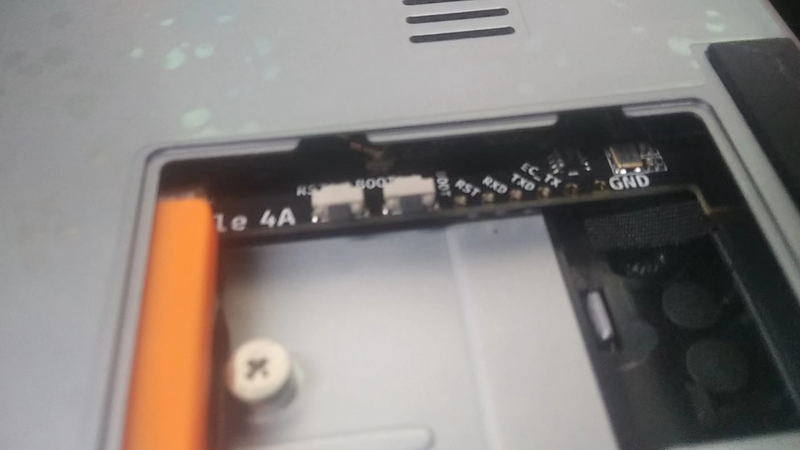

* # **Burning Image**

1. Remove the SSD back cover
2. Find the BOOT button and RST button

1. Hold down the BOOT button, then press the power button on the keyboard to start up, and then connect the typec port to another machine.

1. Download the image for burning on another machine: [Click here to download](https://wiki.sipeed.com/hardware/zh/lichee/th1520/lcon4a/3_images.html)
2. On another machine, execute `fastboot flash ram u-boot-with-spl-console.bin`
3. On another machine, execute `fastboot reboot`
4. On another machine, execute `fastboot flash uboot u-boot-with-spl-console.bin`
5. On another machine, execute `fastboot flash boot boot.ext4`
6. On another machine, execute `fastboot flash root root.ext4`
7. Press the RST button next to BOOT to restart the notebook.

