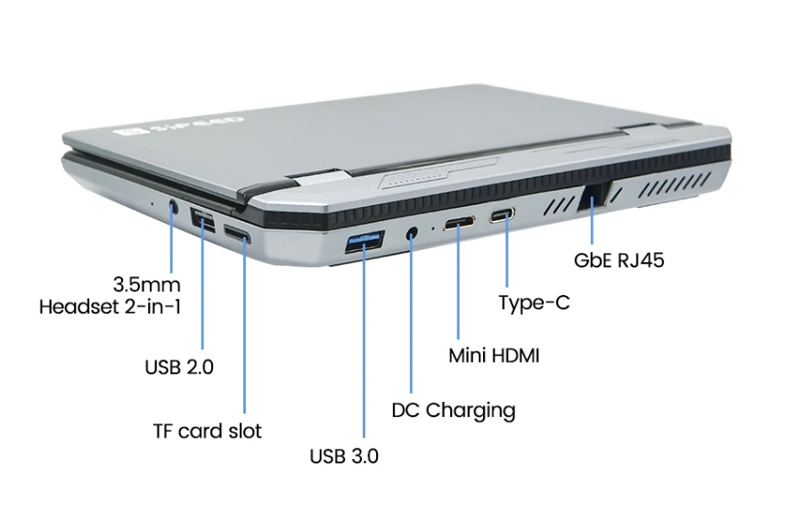

## 简介

Introduction

Lichee Console 4A (hereinafter referred to as Console) is a high-performance RISC-V portable terminal developed by SiliconSpeed Technology. It is designed to allow RISC-V developers to experience the application of RISC-V products in real life in advance.
Lichee Console 4A integrates a high-performance RISC-V TH1520 SOM (8+32/16+128 optional), a 7-inch 1280x800 capacitive touch screen, a 72-key keyboard, and USB-A and USB-C in a size smaller than an A5 notebook. , 2242 SSD card slot, TF card slot, miniHDMI, 3.5mm headphone jack, Ethernet port and other rich interfaces, truly putting the RISC-V development terminal into your pocket~
The software support of Lichee Console 4A has also been relatively completed. It is equipped with the Debian operating system by default and supports Chrome browser, VSCode IDE, KiCAD PCB drawing software, Office software, 4K player, and various game simulators, which basically meets the needs of daily work. Learn to use.
Lichee Console 4A uses a modular design. If you have purchased LicheePi4A before, you can reuse the SOM to the Console.

> Note: High-performance RISCV consumer electronics are still in a relatively early stage at present (2023). Lichee Console 4A is mainly for RISC-V developers to experience development and use. It requires at least skilled Linux operating experience. Ordinary consumers cannot get started directly. in use.
> If you are an ordinary user without Linux experience, please do not buy.


## Technical Specifications

<table>
<colgroup>
<col  class="org-left" />
<col  class="org-left" />
</colgroup>
<tr>
<td class="org-left">SOM</td>
<td class="org-left"> <a href="https://wiki.sipeed.com/lm4a">LM4A</a> </td>
</tr>
<tr>
<td class="org-left">CPU</td>
<td class="org-left"><strong>RISC-V RV64GCV C910@1.85GHz * 4</strong> </td>
</tr>
<tr>
<td class="org-left">GPU</td>
<td class="org-left">IMG™ B Series BXM-4-64 </td>
</tr>
<tr>
<td class="org-left">NPU</td>
<td class="org-left">4TOPS@INT8 </td>
</tr>
<tr>
<td class="org-left">Memory</td>
<td class="org-left"> 8GB or 16GB LPDDR4X </td>
</tr>
<tr>
<td class="org-left">Storage</td>
<td class="org-left"> 32GB or 128GB eMMC, NGFF 2242 SATA SSD </td>
</tr>
<tr>
<td class="org-left">Display</td>
<td class="org-left"> 7 inch 1280 x 800 LCD, miniHDMI </td>
</tr>
<tr>
<td class="org-left">Inoput</td>
<td class="org-left"> Capacitive Touch, RedPoint, 72-Keyboard </td>
</tr>
<tr>
<td class="org-left">Camera</td>
<td class="org-left"> 2MP Front Camera </td>
</tr>
<tr>
<td class="org-left">Audio</td>
<td class="org-left"> 3.5mm Headphone, MEMS MIC, StereoSpeaker </td>
</tr>
<tr>
<td class="org-left">Network</td>
<td class="org-left"> WiFi6 + BT5.4, RJ45 GbE </td>
</tr>
<tr>
<td class="org-left">Interface</td>
<td class="org-left"> USB3.0 Type-A, USB3.0 Type-C, 
USB2.0 Type-A, MicroSD Slot </td>
</tr>
<tr>
<td class="org-left"> Battery </td>
<td class="org-left"> 3000 mAh@7.6V </td>
</tr>
<tr>
<td class="org-left">Case</td>
<td class="org-left">Aluminum Alloy Case</td>
</tr>
<tr>
<td class="org-left">Size & Weight</td>
<td class="org-left">18.5 x 14 x 2 cm, 720g</td>
</tr>
<tr>
<td class="org-left">System</td>
<td class="org-left">Debian </td>
</tr>
</table>


## Getting Started Guide

### Unboxing
Open the box, the upper layer is the LicheeConsole4A host


After removing the upper host, the lower layer is the 12V3A power adapter and MiniHDMI cable.


Take out the host and get to know the interfaces on the side of the host:



(If you purchase a barebones package, you need to check the "SOM Installation Guide" later and install LM4A before proceeding with the following operations.)
Turn on the host, press and hold the power button in the upper right corner for 3 seconds to turn it on (release it when you see the screen backlight lights up)


If the backlight never lights up, the battery may be exhausted during transportation. You can try plugging in the power adapter and long pressing the power button to turn it on.

After the backlight turns on for about 10 seconds, the screen will display the Linux penguin icon and the boot log (early image versions are displayed vertically at this stage)
After the log is printed for about 20 seconds, the Debian desktop system starts to be entered.

After entering the desktop system, you can test whether the screen touch, pointing stick, and keyboard are working. If you find that they are not working, you can contact customer service.

The default system is Debian, which is pre-installed with Chrome, VSCode, Office, KiCAD, KODI, Parole and other application software, you can experience them one by one.
You can use sudo apt instal xxx to install the software. The default username and password are sipeed, licheepi
For other general software usage, please refer to the relevant documentation chapters of LicheePi4A.

### SSD Installation Guide
Console supports M.2 2242 SATA interface SSD, which can be installed after removing the SSD cover on the rear case.


### SOM Installation Guide
If you choose the barebone package, you need to install the SOM module.
You need to bring your own hexagonal screwdriver, remove the back cover, install the SOM module, install silicone grease above the CPU/DDR, place the heat pipe, place a long silicone grease sheet on the heat pipe, and reinstall the back cover.
For detailed installation, please see the pictures in the following chapters.


## system
The Console image is released together with the LicheePi4A image. The default is the Full image. It is recommended to use SOM with 8+32 and above configuration. If you use an 8+8 SOM, you need to tailor the file system yourself.
download link:  
Baidu Netdisk: [Click me](https://pan.baidu.com/s/1xH56ZlewB6UOMlke5BrKWQ)
Mega cloud disk: [Click me](https://mega.nz/folder/phoQlBTZ#cZeQ3qZ__pDvP94PT3_bGA)


Common application displays:


The Console system architecture is as follows. For details, please refer to the schematic diagram or device tree file.


## Power consumption 

### Power Supply
The maximum power consumption of the Console is about 11W, and about 7~8W when no load is used.
It can be powered by 12V DC 3.5mm interface or 5V USB-C port.

### Battery Life
For the sake of Console battery life and heat generation, the current upper limit of the CPU frequency of the default image is limited to 1.5GHz.
At this main frequency, the measured usage time is 2 to 3 hours. (stress-ng stress test lasts for 2 hours, with the screen on and no load for 3 hours).
The default screen brightness is 50%. If you need to extend the battery life, you can reduce the screen brightness:
```
sudo -i
cd /sys/class/backlight/pwm-backlight@0
echo xxx > brightness # xxx is brightness you want, 0~100
```

Power consumption composition (300MHz no-load bright screen, 50% brightness)


### Heat Dissipation
Console uses a 3cm turbo fan + 10cm heat pipe to dissipate heat from the CPU. One end of the heat pipe is attached to the CPU, and the other end is dissipated by a turbo fan. The top surface uses thermal conductive silicone grease to contact the bottom case for heat dissipation.


Under continuous high-load work (such as browser video soft decoding), the CPU temperature can eventually reach 60 to 65 degrees, and the bottom case temperature can reach a maximum of about 50 degrees.


If you have better cooling suggestions, you can send an email to support@sipeed.com
> At present (2023.11), the browser hardware decoding has not yet been adapted, so it will occupy a lot of CPU when watching browser videos. It is expected that the browser hardware decoding function will be incorporated in December.

### Standby
The hardware circuit design of the Console takes the standby situation into consideration and adds power control to each relevant peripheral. However, currently (2023.11) the low-power consumption function of TH1520 has not been added to the SDK, so the standby function still needs to be updated.


### Shutdown
The current shutdown power consumption of the Console is about 1.3mA, which can support the shutdown time for about 3 months.


## Download
[Sipeed Download Station](https://dl.sipeed.com/shareURL/LICHEE/LicheeConsole4A)


## Other links
[Taobao]
[Aliexpress](https://www.aliexpress.us/item/3256805987954160.html)

QQ group: 559614960 [Click me to automatically join the group](http://qm.qq.com/cgi-bin/qm/qr?k=5YkapIhdtWHp8AEfM5_bFFYQIX3CUQN6)
Telegram: https://t.me/linux4rv

Forum: Maixhub.com/discussion
Contact email: support@sipeed.com
