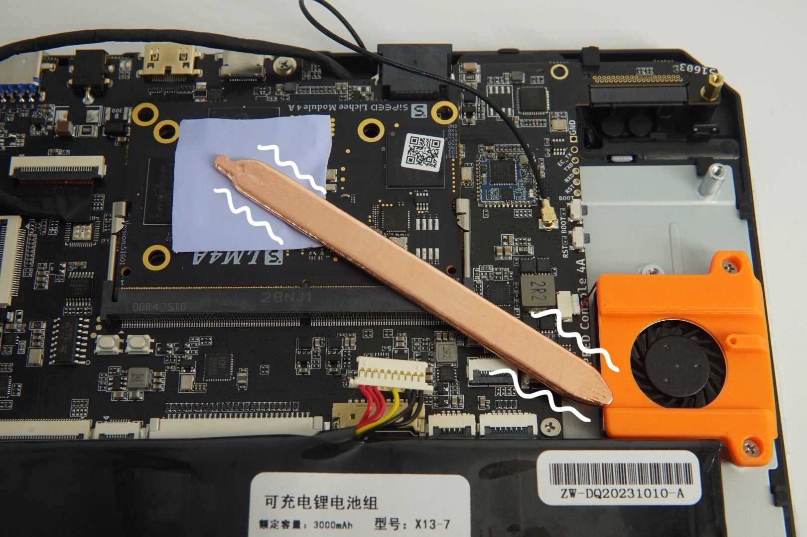
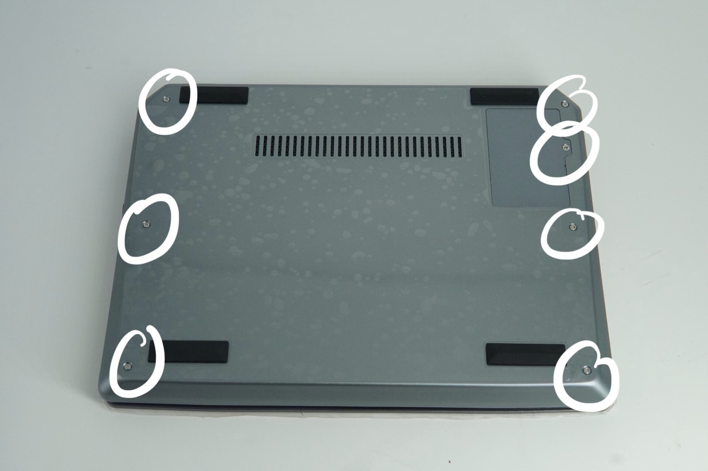
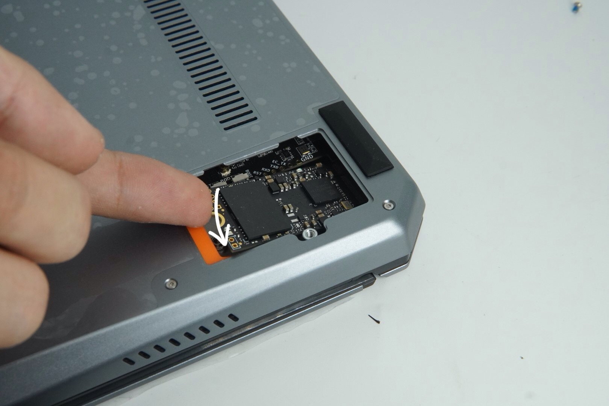
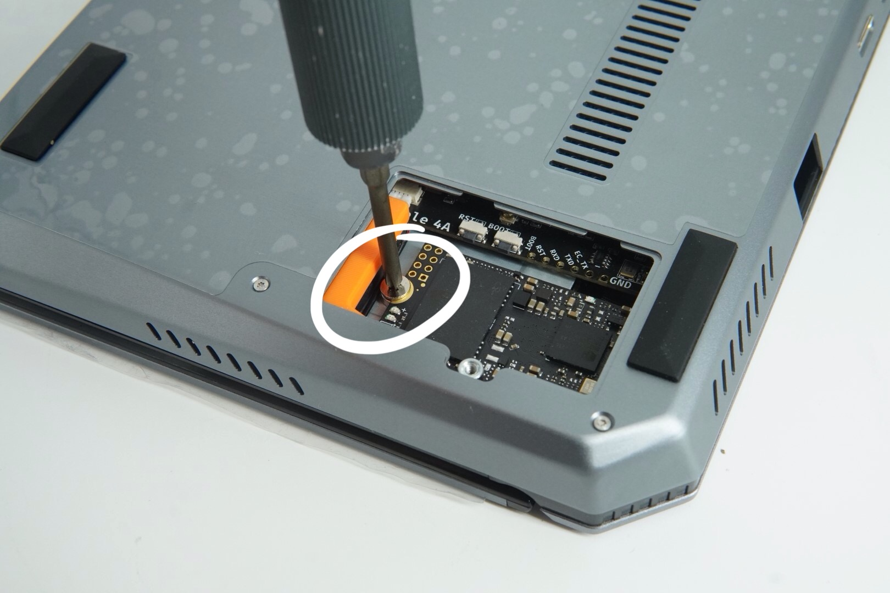
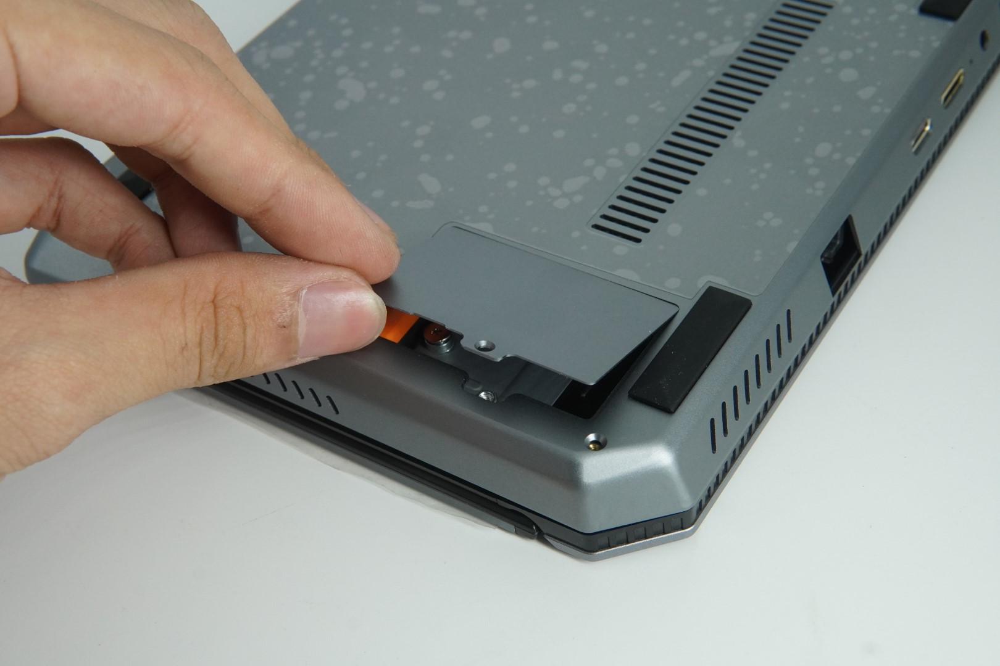
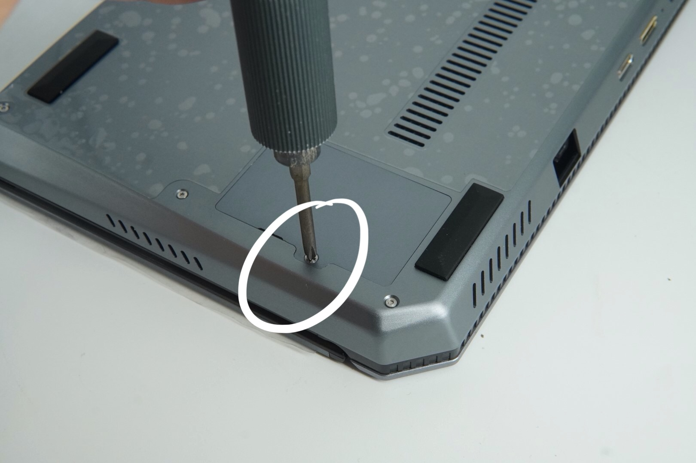

For customers who purchased Package A, the following accessories are included. Please check whether all the product accessories have been received:

- Back case x1
- SSD cover x1
- SSD cover screw x1
- Screwdriver x1
- Thermal pad x2
- Heat pipe x1
- Back cover screws x6

Please prepare the cross-head screwdriver as shown in the picture on your own.

## Assembly Steps

1. Insert the core board into the motherboard.
   Place one of the thermal pads at the core position of TH1520 as shown in the picture below.

   

2. Peel off the release film from the thermal pad.

   

3. Cut another thermal pad in half for later use.

4. Place the heat pipe between the core board and the fan **(as close to the fan as possible to ensure the cooling effect)** as shown in the picture below.

   

5. Place the two cut thermal pads on the heat pipe to conduct the heat to the outer shell, as shown in the picture.

   

   To ensure that the heat pipe is securely fixed, it is recommended to use tape to fix the middle part of the heat pipe.

6. Insert the battery connection ribbon **(pay attention to the direction of the battery ribbon)**.

   

7. Cover the back case, it is recommended to align the back first and then press it for convenience.

   

   
   
   **When buckling the other side, using a disassembly piece to assist can save more effort.**

8. After buckling the back case, take out the 6 back cover screws and the screwdriver that come with the package, tighten the back cover fixing screws. It is recommended to press the back cover at the same time when tightening the screws to ensure that the buckle will not pop open.

   
   
   **Please note that the screws for fixing the SSD cover and the back cover are of different sizes.**
   At this point, the assembly is complete, and you can start using it.

## SSD Installation

1. Use a cross screwdriver to remove the SSD cover.

   

2. Prepare the NGFF interface 2242 size SSD.

   

3. Unscrew the SSD fixing screw.

   

4. Insert the SSD, **due to the small space, it is suggested to first put the SSD into the machine body, and then insert the SSD forcefully perpendicular to the interface**.

   

   

5. After it is in place, screw on the SSD fixing screw, cover the SSD cover, and screw on the cover fixing screw.

   

   

   