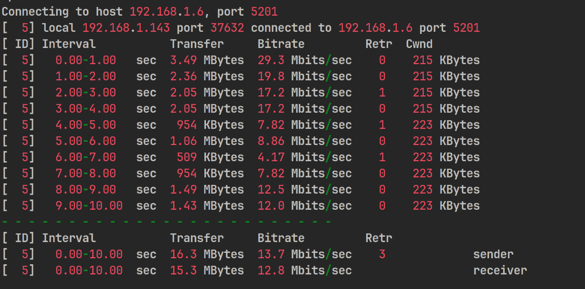
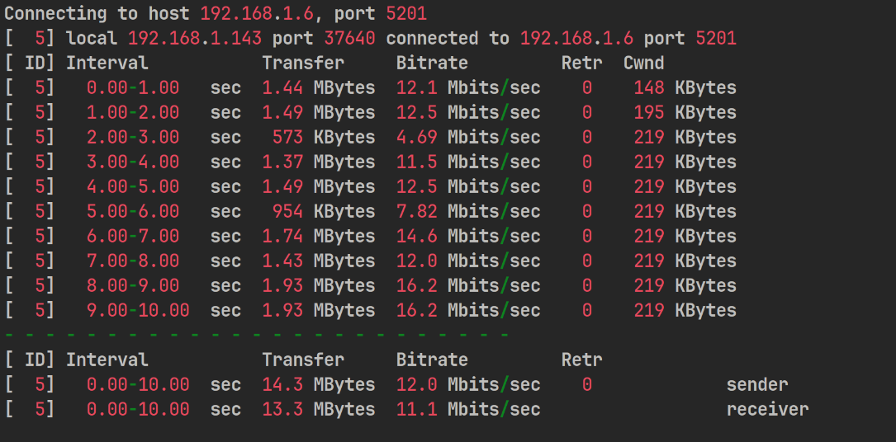
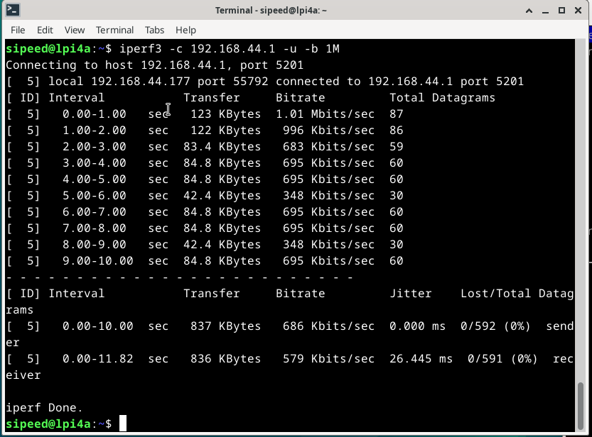

## Power Consumption Test

### Static Power Consumption

| Scene (Static) | Voltage | Current | Power Consumption | Note |
| -------------- | ----- | ----- | ----- | ------------------------------------ |
| Standby | 5.11V | 0.46A | 2.35W | Fan on, fan not turned off in all subsequent tests |
| Single port to network cable | 5.06V | 0.52A | 2.63W | |
| Dual port to network cable | 5.08V | 0.53A | 2.69W | |
| Connecting an HDMI Display | 5.04V | 0.53A | 2.67W | |

### Dynamic Power Consumption

| Scene (Dynamic)                 | Voltage  | Current  | Power Consumption  | Note                                |
| -------------------------- | ----- | ----- | ----- | ----------------------------------- |
| Standby                       | 5.04V | 0.71A | 3.58W | Connecting a monitor, keyboard, and mouse Using a network port |
| STRESS-NG Pressure testing <br>(CPU matrix operations) | 4.95V | 1.22A | 6.04W | CPU frequency limit 1.845GHz, voltage 1V      |
| Play video in browser             | 4.96V | 1.06A | 5.26W | Using GPU, no hardware decoding, firefox browser  |

## eMMC

```bash
#4k write
dd if=/dev/zero of=test bs=4k count=100000 oflag=direct
#4k read
dd if=test of=/dev/null bs=4k count=100000 iflag=direct
#Deleting test files
rm test
#Continuous Write(4MB)
dd if=/dev/zero of=test bs=4096k count=100 oflag=direct
#Continuous Read(4MB)
dd if=test of=/dev/null bs=4096k count=100 iflag=direct
#Deleting test files
rm test
#Continuous Write(64MB)
dd if=/dev/zero of=test bs=65536k count=10 oflag=direct
#Continuous Read(64MB)
dd if=test of=/dev/null bs=65536k count=10 iflag=direct
#Deleting test files
rm test
```

**8GB eMMC**

| Test Item | Result    |
| --------- | --------- |
| 4KB W     | 22.4 MB/s |
| 4KB R     | 22.4 MB/s |
| 4MB W     | 53.9 MB/s |
| 4MB R     | 296 MB/s  |
| 64MB W    | 229 MB/s  |
| 64MB R    | 298 MB/s  |


**32/128GB eMMC**

| Test Item | Result    |
| --------- | --------- |
| 4KB W     | 24.0 MB/s |
| 4KB R     | 40.3 MB/s |
| 4MB W     | 209 MB/s  |
| 4MB R     | 296 MB/s  |
| 64MB W    | 229 MB/s  |
| 64MB R    | 298 MB/s  |


## LPDDR4X

 

## GbE

`iperf3  -c 192.168.3.18 -t 15`

 

## WiFi

Test Environment: Long open corridor
Test method: using iperf3, laptop as server, LPi4A as client
Test equipment: newifi D2 router, Acer Predator Tomahawk 300 laptop.

The test results at different distances between the router and LPi4A are as follows:

5m


10m


15m


20m


25m


30m


## Bluetooth

Test environment: indoor proximity
Test Method: Mobile phone open bluetooth sharing network, pair with development board and connect bluetooth, use iperf3 test
Test Equipment: Xiaomi 13, LPi4A




## Temperature

Heat Sink: Fan + Aluminum Heat Sink(25*25*5)
Silicon pad: Laird 500
Standby Status:
 

End of pressure test:
 

## Browser Testing

Fishbowl test in Chromium with results as shown:


## Other

Contributions are welcome~ You can get ￥5~150 ($1~20) coupon if your contribution is accepted!