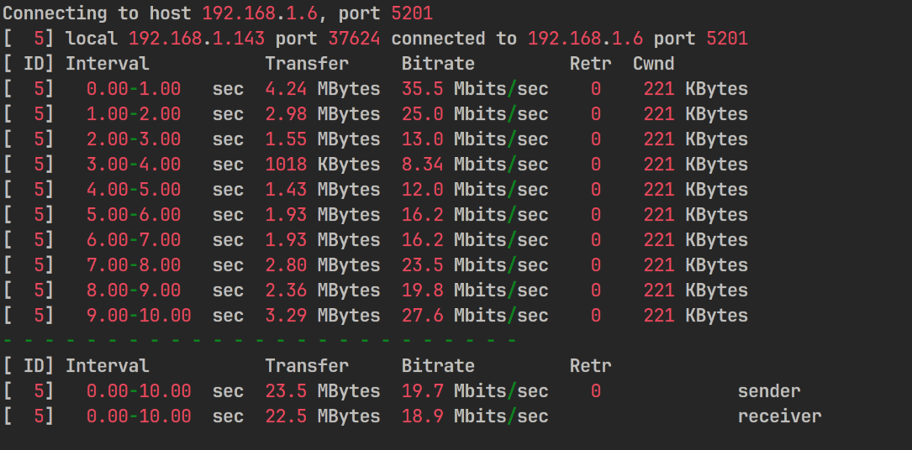
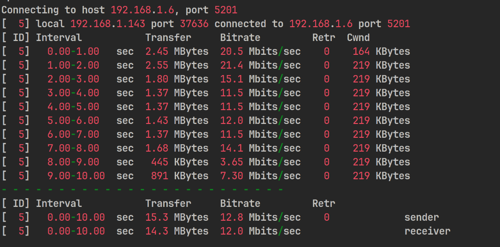

## Power Consumption Test

### Static Power Consumption

| Scene (Static) | Voltage | Current | Power Consumption | Note |
| -------------- | ----- | ----- | ----- | ------------------------------------ |
| Standby | 12V | 0.3A | 3.6W | No peripheral connected |
| Standby | 12V | 0.32A | 3.84W | Fan on, fan not turned off in all subsequent tests |
| Single port to network cable | 12V | 0.36A | 4.32W | |
| Dual port to network cable | 12V | 0.39A | 4.68W | |
| Connecting an HDMI Display | 12V | 0.33A | 3.96W | |

### Dynamic Power Consumption

| Scene (Dynamic)                 | Voltage  | Current  | Power Consumption  | Note                                |
| -------------------------- | ----- | ----- | ----- | ----------------------------------- |
| NPU Calculate                 | 12V | 0.39A | 4.68W | Connecting serial port, fan, NPU frequency upper limit 0.792GHz |
| Standby                       | 12V | 0.43A | 5.16W | Connecting a monitor, keyboard, and mouse Using a network port |
| STRESS-NG Pressure testing <br>(CPU matrix operations) | 12V | 0.65A | 7.8W | CPU frequency limit 1.845GHz, voltage 1V |
| Play video in browser             | 12V | 0.6A | 7.2W | Using GPU, no hardware decoding, chromium browser |

## eMMC

```bash
#4k write
dd if=/dev/zero of=test bs=4k count=100000 oflag=direct
#4k read
dd if=test of=/dev/null bs=4k count=100000 iflag=direct
#Deleting test files
rm test
#Continuous Write(4MB)
dd if=/dev/zero of=test bs=4096k count=100 oflag=direct
#Continuous Read(4MB)
dd if=test of=/dev/null bs=4096k count=100 iflag=direct
#Deleting test files
rm test
#Continuous Write(64MB)
dd if=/dev/zero of=test bs=65536k count=10 oflag=direct
#Continuous Read(64MB)
dd if=test of=/dev/null bs=65536k count=10 iflag=direct
#Deleting test files
rm test
```

**8GB eMMC**

| Test Item | Result    |
| --------- | --------- |
| 4KB W     | 22.4 MB/s |
| 4KB R     | 22.4 MB/s |
| 4MB W     | 53.9 MB/s |
| 4MB R     | 296 MB/s  |
| 64MB W    | 229 MB/s  |
| 64MB R    | 298 MB/s  |


**32/128GB eMMC**

| Test Item | Result    |
| --------- | --------- |
| 4KB W     | 24.0 MB/s |
| 4KB R     | 40.3 MB/s |
| 4MB W     | 209 MB/s  |
| 4MB R     | 296 MB/s  |
| 64MB W    | 229 MB/s  |
| 64MB R    | 298 MB/s  |


## LPDDR4X

 

## GbE

`iperf3  -c 192.168.3.18 -t 15`

 

## WiFi

Test Environment: Long open corridor
Test method: using iperf3, laptop as server, LPi4A as client
Test equipment: newifi D2 router, Acer Predator Tomahawk 300 laptop.

The test results at different distances between the router and LPi4A are as follows:

5m


10m


15m


20m


25m


30m


## Bluetooth

Test environment: indoor proximity
Test Method: Mobile phone open bluetooth sharing network, pair with development board and connect bluetooth, use iperf3 test
Test Equipment: Xiaomi 13, LPi4A


## Temperature

Heat Sink: Fan + Aluminum Heat Sink(25*25*5)
Silicon pad: Laird 500
Standby Status:
 

End of pressure test:
 

## Browser Testing

Fishbowl test in Chromium with results as shown:


## GPU

The test results using `glmark2` are as follows:
```shell
root@lpi4a:~# glmark2-es2
==================================================== =====
     glmark2 2021.12
==================================================== =====
     OpenGL Information
     GL_VENDOR: Imagination Technologies
     GL_RENDERER: PowerVR B-Series BXM-4-64
     GL_VERSION: OpenGL ES 3.2 build 1.16@6099580
     Surface Config: buf=32 r=8 g=8 b=8 a=8 depth=24 stencil=8
     Surface Size: 800x600 windowed
==================================================== =====
[build] use-vbo=false: FPS: 460 FrameTime: 2.174 ms
[build] use-vbo=true: FPS: 434 FrameTime: 2.304 ms
[texture] texture-filter=nearest: FPS: 489 FrameTime: 2.045 ms
[texture] texture-filter=linear: FPS: 493 FrameTime: 2.028 ms
[texture] texture-filter=mipmap: FPS: 776 FrameTime: 1.289 ms
[shading] shading=gouraud: FPS: 1055 FrameTime: 0.948 ms
[shading] shading=blinn-phong-inf: FPS: 1049 FrameTime: 0.953 ms
[shading] shading=phong: FPS: 832 FrameTime: 1.202 ms
[shading] shading=cel: FPS: 781 FrameTime: 1.280 ms
[bump] bump-render=high-poly: FPS: 481 FrameTime: 2.079 ms
[bump] bump-render=normals: FPS: 1056 FrameTime: 0.947 ms
[bump] bump-render=height: FPS: 730 FrameTime: 1.370 ms
[effect2d] kernel=0,1,0;1,-4,1;0,1,0;:1 FPS: 456 FrameTime: 2.193 ms
[effect2d] kernel=1,1,1,1,1;1,1,1,1,1;1,1,1,1,1;:2 FPS: 184 FrameTime: 5.435 ms
[pulsar] light=false:quads=5:texture=false: FPS: 585 FrameTime: 1.709 ms
[desktop] blur-radius=5:effect=blur:passes=1:separable=true:windows=4: FPS: 177 FrameTime: 5.650 ms
[desktop] effect=shadow:windows=4: FPS: 405 FrameTime: 2.469 ms
[buffer] columns=200:interleave=false:update-dispersion=0.9:update-fraction=0.5:update-method=map: FPS: 135 FrameTime: 7.407 ms
[buffer] columns=200:interleave=false:update-dispersion=0.9:update-fraction=0.5:update-method=subdata: FPS: 160 FrameTime: 6.250 ms
[buffer] columns=200:interleave=true:update-dispersion=0.9:update-fraction=0.5:update-method=map: FPS: 197 FrameTime: 5.076 ms
[ideas] speed=duration: FPS: 442 FrameTime: 2.262 ms
[jellyfish] <default>: FPS: 433 FrameTime: 2.309 ms
[terrain] <default>: FPS: 31 FrameTime: 32.258 ms
[shadow] <default>: FPS: 275 FrameTime: 3.636 ms
[refract] <default>: FPS: 45 FrameTime: 22.222 ms
[conditionals] fragment-steps=0:vertex-steps=0: FPS: 775 FrameTime: 1.290 ms
[conditionals] fragment-steps=5:vertex-steps=0: FPS: 484 FrameTime: 2.066 ms
[conditionals] fragment-steps=0:vertex-steps=5: FPS: 819 FrameTime: 1.221 ms
[function] fragment-complexity=low:fragment-steps=5: FPS: 1048 FrameTime: 0.954 ms
[function] fragment-complexity=medium:fragment-steps=5: FPS: 694 FrameTime: 1.441 ms
[loop] fragment-loop=false:fragment-steps=5:vertex-steps=5: FPS: 1093 FrameTime: 0.915 ms
[loop] fragment-steps=5:fragment-uniform=false:vertex-steps=5: FPS: 678 FrameTime: 1.475 ms
[loop] fragment-steps=5:fragment-uniform=true:vertex-steps=5: FPS: 438 FrameTime: 2.283 ms
=========================================================
                                   glmark2 Score: 551
=========================================================
```


Running `glxgears` results in the following:
```shell
es2gears_x11
```


## Other

Contributions are welcome~ You can get ￥5~150 ($1~20) coupon if your contribution is accepted!