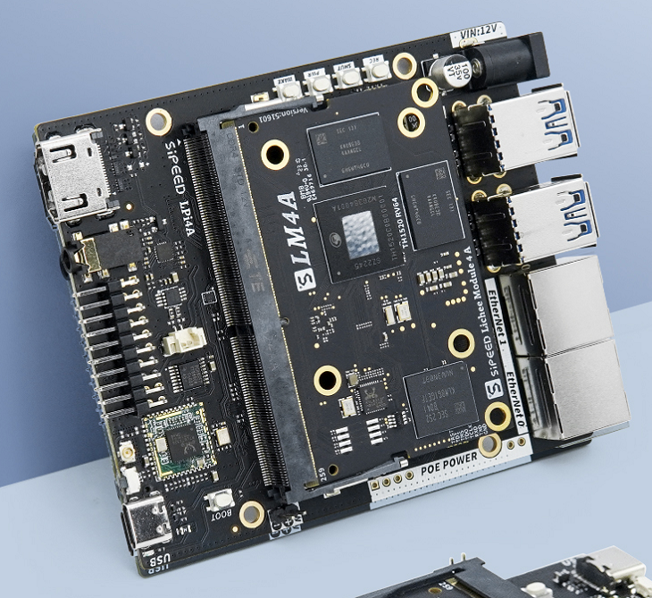
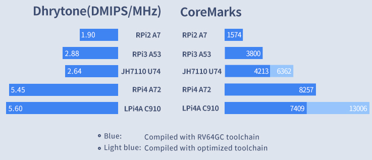

## Introduction

LicheePi 4A is the high performance RISC-V linux development board using [Lichee Module 4A](http://wiki.sipeed.com/hardware/en/lichee/th1520/lm4a.html), based on [TH1520](https://www.t-head.cn/product/yeying) SOC (4xC910@1.85G, RV64GCV, 4TOPS@int8 NPU,  50GFLOP GPU), LicheePi 4A contains maximum 16GB 64bit LPDDR4X, 128GB eMMC, supports HDMI+MIPI dual 4K display, supports 4K camera input, dual Gigabit Ethernet interfaces (one of these supports POE) amd 4 USB3.0 interfaces, supports kinds of audio processing by C906 core.

The LicheePi 4A is the most powerful RISC-V SBC as of now (Q2 2023). Its performance is about 2 times that of the previous generation RISC-V SBC [VisionFive2](https://www.starfivetech.com/en/site/boards). Without enabled custom instruction set acceleration, its performance is close to the Raspberry Pi 4 based on ARM A72. With acceleration enabled, it can match the Raspberry Pi 4. It also has a maximum 16GB ultra-large memory, twice that of the Raspberry Pi 4's max 8GB! 

 
The LicheePi 4A can be used as a typical RISC-V verification platform. Its powerful performance allows faster native compilation without the need for QEMU emulation. 

We will soon (Q2 2023) release the LicheeCluster 4A based on the LM4A for cluster computing, supporting up to 7xLM4A for cluster build and compilation, ideal for distribution build farms. Stay tuned!

While maintaining high performance, we have also done our best to design for cost. The 8GB RAM version is priced at ¥749 - 899 ($100 - $130), while the 16GB version is ¥1100-1300 ($155-$185). This is a better price/performance ratio than the Raspberry Pi 4 8GB (~$150)!

Whether you are a RISC-V enthusiast or not, the LicheePi 4A is a game-changing high-performance RISC-V SBC worth getting!

## Contributions Welcome

This is an online document hosted on GitHub. You can click the `Edit this page` link in the top right to edit it.
For quality contributions to the docs, we offer discount coupons from ¥5 to ¥150 ($1 to $20) based on the content.

## Parameters

<table>
<thead>
<tr>
  <th colspan=2>Main Chip</th>
</tr>
</thead>
<tbody>
<tr>
  <td>Name</td>
  <td>TH1520</td>
</tr>
<tr>
  <td>CPU</td>
  <td>RISC-V 64GCV C910*4@1.85GHz  · Each core contains 64KB I cache amd 64KB D Cache  · 1MB of Shared L2 Cache  · Support TEE and REE, configured during core booting · Support multi-core debugging framework of custom and RISC-V compatible interface · Independent power domain, supports DVFS</td>
</tr>
<tr>
  <td>GPU</td>
  <td>· OpenCL 1.1/1.2/2.0 · OpenGL ES 3.0/3.1/3.2 · Vulkan 1.1/1.2 · Android NN HAL</td>
</tr>
<tr>
  <td>NPU</td>
  <td>Support 4TOPS@INT8, up to 1GHz  · Support TensorFlow、ONNX、Caffe  · Support CNN、RNN、DNN </td>
</tr>
<tr>
  <td>Decode</td>
  <td>Real-time decoder, support H.265/H.264/VP9/8/7/6/AVS/AVS+/AVS2.0/VC1/MPEG4  · Supports H.264 BP/MP/HP@level 5.1 decoding, up to 4K resolution · Supports H.265/HEVC Main Profile@level 5.1 decoding, up to 4K resolution · Supports VP9 Profile-2 decoding, up to 4K resolution · Supports AVS2.0 decoding, up to 4K resolution · Supports VP6/7/8/AVS/AVS+/VC1/MPEG4 decoding, up to 1920x1080 resolution · Decoding at 4K@75fps maximum</td>
</tr>
<tr>
  <td>Encode</td>
  <td>· Supports H.264 BP/MP/HP@level4.2 encoding, up to 4K resolution · Supports H.265/HEVC Main Profile encoding, up to 4K resolution · Only supports I-frames and P-frames · Encoding at 4K@40fps maximum</td>
</tr>
<tr>
  <th colspan=2>Hardware features</th>
</tr>
<tr>
  <td>RAM</td>
  <td>· 8GB 64bits LPDDR4 · 16GB 64bits LPDDR4 </td>
</tr>
<tr>
  <td>Storage</td>
  <td>· eMMC(Optional): None, 8G, 32G, 128G · Support TF card</td>
</tr>
<tr>
  <td>Ethernet</td>
  <td>· 2 x Gigabit Ethernet interfaces, Optional POE</td>
</tr>
<tr>
  <td>USB</td>
  <td>· USB3.0 x 4 · USB2.0 x 1 (For power supply or flashing OS)</td>
</tr>
<tr>
  <td>Audio</td>
  <td>· 1 x 3.5mm stereo interface · One audio interface · Two onboard microphones </td>
</tr>
<tr>
  <td>Display</td>
  <td>· 1 x HDMI2.0 · 1 x 4-lane MIPI DSI</td>
</tr>
<tr>
  <td>Camera</td>
  <td>· 2 x 2-lane MIPI CSI · 1 x 4-lane MIPI CSI</td>
</tr>
<tr>
  <td>GPIO</td>
  <td>· UART · IIC · SPI</td>
</tr>
</tbody>
</table>

### Hardware information

[Specification / Datasheet](https://dl.sipeed.com/shareURL/LICHEE/licheepi4a/01_Specification)
[Schematic](https://dl.sipeed.com/shareURL/LICHEE/licheepi4a/02_Schematic)
[BOM](https://dl.sipeed.com/shareURL/LICHEE/licheepi4a/03_Bit_number_map)
[Dimensional Drawing](https://dl.sipeed.com/shareURL/LICHEE/licheepi4a/04_Dimensional_drawing)
[3D Model](https://dl.sipeed.com/shareURL/LICHEE/licheepi4a/05_3D_model)

## Other Site

Online store: [Aliexpress](https://www.aliexpress.com/item/1005005532736080.html)

[Github](https://github.com/sipeed/LicheePi4A)
[Sipeed Site](https://dl.sipeed.com/shareURL/LICHEE/licheepi4a)

Telegram: https://t.me/linux4rv

Contact email：support@sipeed.com