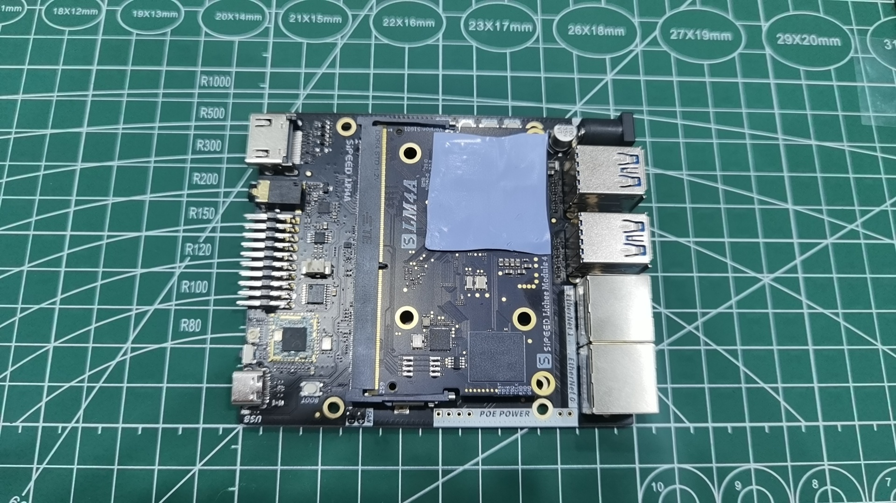
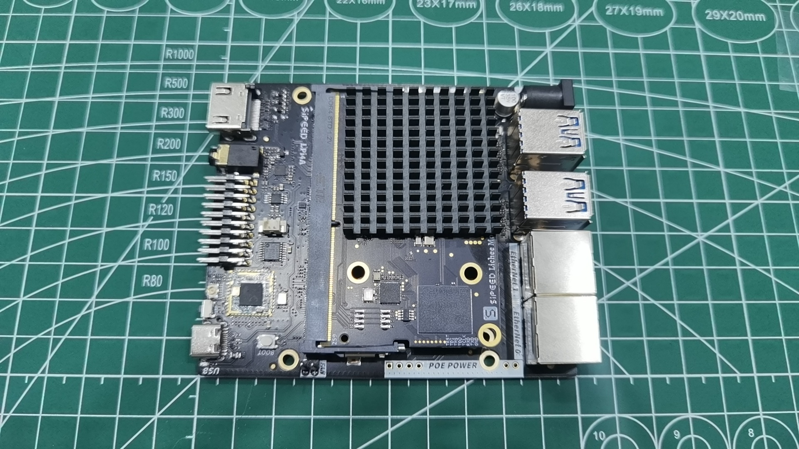
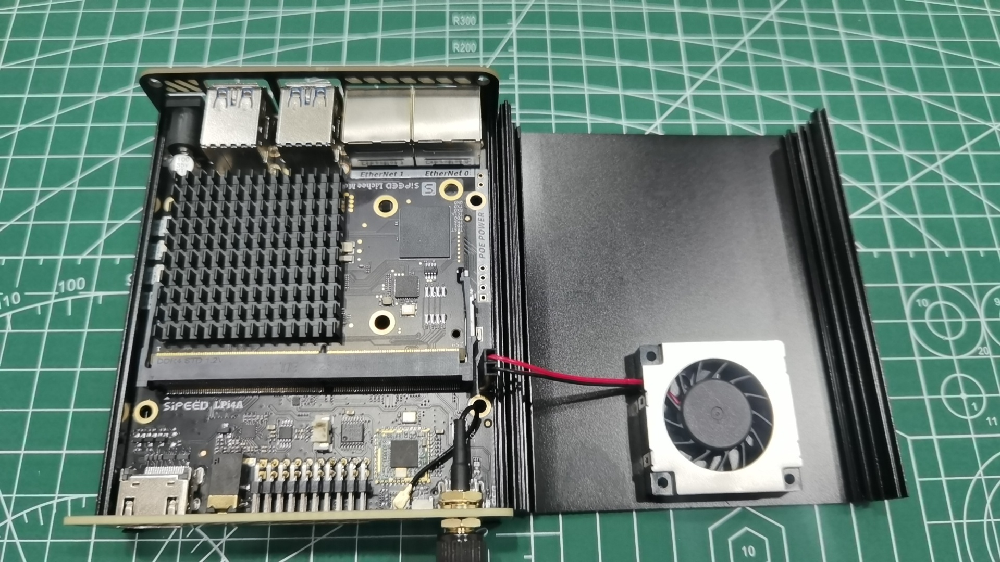

## Unboxing / Box contents

There are two versions of the LicheePi 4A board, the beta version and the official version.
The beta version was released in May 2023. There is only one version of the board with 8+8 (DDR+eMMC).
The official version is expected to release in July 2023, comes up with 8+32 (DDR+eMMC) and 16+128 (DDR+eMMC) version, with some minor adjustments and fixes based on the feedback from the beta version users. The functionality and images will stay the same as the beta version.

### Beta Version

If you received the board as part of the beta program, you will receive the following package:

The opened box will look like this：
 

The main body of LicheePi 4A is wrapped in black foam, and the other labeled parts are:
1. 30x30mm thermal grease pad, used to attach the heatsink to the CPU.
2. 30mm 5V cooling fan. The connector should be plugged into the 5V fan header on the board. Note: The red wire is the positive wire and should be connected to the + pole. The fan will not work if you reverse the polarity.
3. 2.4G WiFi Antenna, already connected to the IPEX socket. If it comes loose please re-attach it yourself.
4. USB-C cable, used for power supply and image flashing.

If you miss any part during unpacking, please contact customer service for help.

### Offical Version

如果你购买了正式版 LicheePi 4A，你收到的包裹内将是如下包装：
 

在包装侧面可以看到当前硬件的 内存/eMMC 版本，如果发现与你购买的版本不符，请与客服联系：

移除蓝色封盖，是白色纸盒包装：

打开白色纸盒，就可以看到LicheePi 4A板卡：

可以看到板卡上贴了两个二维码，在底板USB上贴的二维码为底板生产信息，代表了底板型号版本，生产日期，如：  
`LPI4A0-23070702067`   
在SOM上贴的二维码为SOM生产信息，代表了 SOM型号版本，内存eMMC，MAC地址（第二个网口地址为此地址+1），生产日期，如：
`LM4A0-16128-48DA3560003E-23071100318`   

拿出开发板后，纸盒底部装着默认配件，USB线，散热器，散热硅脂：   

如果开箱后发现缺少相关部件，请联系客服咨询。

### Optional Accessories

LicheePi 4A还有丰富的配件可供选择，如下图所示：

选购说明：

|配件名|选购说明|
|---|---|
|铝合金外壳|适合作为小主机，软路由的外壳|
|10.1寸触摸屏|1280x800 4lane MIPI，适合作为车机，安卓 调试使用|
|OV5693 摄像头 |5MP摄像头，适合作为移动设备，如安卓的原生摄像头调试|
|USB摄像头|5MP USB摄像头，板载麦克风，适合作为openCV的摄像头使用|
|PoE电源模块|5V2.4A PoE电源模块，网关类应用使用网线PoE供电|
|12V电源|12V2A电源适配器，板卡外接很多耗电外设时选购|
|RV Debugger Plus|UART+JTAG调试小板，连接系统串口终端调试用|

## Assembling the board

### SOM installation

By default, the LM4A SOM has been installed on the motherboard. If you need to upgrade/replace the SOM, you can follow the instructions below to remove and install the SOM

1. Removing the SOM:
   <table>
    <tr>
      <td colspan=2>Unlock the board by pushing the retainer tabs outwards and lift up the SOM</td>
    </tr>
    <tr>
      <td></td>
      <td></td>
    </tr>
   </table>

2. Installing the SOM:
   <table>
    <tr>
      <td colspan=2>First insert the SOM into the connector, ensure that it´s pushed all the way in and push down on both sides till the retainer clips automatically hold the board.</td>
    </tr>
    <tr>
      <td></td>
      <td></td>
    </tr>
   </table>

### Cooler Installation 

LicheePi 4A is a high performance SBC，you need to install an active cooler to dissipate the heat. Otherwise it might automatically throttle the frequency due to overheating and is unable to deliver the full performance.
1. Installing the thermal pad,
    take the thermal pad and remove the protective film from both sides, then place the thermal pad in the location shown below, the thermal pad can be re-arragnet if needed. Please ensure that you cover the main CPU as well as both memory chips fully.
    

2. Installing the fan / heatsink
    Allign the 30x30mm heatsink and fan with the thermal pad and press down lightly.
    

3. Connecting the cooling fan
    By default the cooling fan should already be plugged in when you received the board. If the fan power cables was unplugged, please re-plug it as shown in the image below.
    Pay attention to the polarity of the fan, in case the fan is plugged-in backwards it will not work.
    Note: The fan is controlled by a linux kernel driver which needs to be configured correctly to work. (fan does not spin per default)
    If you are unsure if the fan works, you can test it by plugging it into a +5V and GND pin on the 20-pin GPIO header.
    

### WiFi Antenna Installation 

The WiFi antenna is already connected when you receive the board. If it got unplugged, here is how to install it:

### POE module installation

The POE module can be purchased seperatly. It´s a 5V POE power module with a length of 35.6mm, which can be soldered to the POE POWER holes on the development board.

The PoE module should be installed like this：

   <table>
    <tr>
      <td></td>
      <td></td>
    </tr>
   </table>

### Assembly completed

This is what the fully assembled board looks like:

## Booting the board

LicheePi 4A is pre-loaded with a basic system image, so you can try it out directly!

Note: The pre-loaded system image might be very old. After you booted the system for the first time, please have a look at the next section on how to flash / update the image.

Use an HDMI cable (not included) to connect a display (not included) to the HDMI port of LicheePi 4A. Use the supplied USB-C cable to connect the board to a USB power supply (not included) with at least 5V and 2A output.
The LicheePi 4A will automatically boot into the default image and the login screen should appear within 30 seconds, or automaticly login via sipeed username.

The default image has two types of account and password configurations, you can try both:
1. User：`root`，`debian`，`sipeed`； the password for all accounts is `licheepi`
2. User: `debian`，password: `debian`； user: `sipeed`，password: `licheepi`

If you followed the above procedure, but your display fails to show any image, please check the following:
1. Check whether the USB-Power supply is connected correctly, works and whether the power LED is lit on the board.
2. Check that the heatsink is installed correctly and that the fan is spinning.
3. Check that the HDMI connection is correct and that the display is turned on and the correct input is selected.
4. It might be the case that there is no pre-loaded image from the factory, in this case check the next section on how to flash an image.
5. If none of the above works, please contact us for support.

## 铝合金外壳安装说明 {#install_shell}
### 外壳配件概览
外壳配件应包含如下内容，如有缺失，请联系客服。    
  
从左到右分别是：
1. 3507涡轮风扇
2. 40x40x5mm 铝散热片
3. 小号十字螺丝刀
4. M3x5 平头螺丝 8颗
5. 外壳挡板x2
6. IPEX转SMA转接线 + SMA棒状天线
7. 30x30mm 导热硅脂片
8. 铝合金外壳x2

### 安装散热片
1. 准备开发板
  
2. 粘贴导热硅脂
  
3. 按方向安装散热片
 

### 安装盖板
1. 滑入开发板
 
2. 安装天线到盖板
 
3. 安装天线到PCB
 
4. 安装前盖板（2颗螺丝）
 
5. 撕开后盖板泡棉胶
 
6. 安装后盖板（2颗螺丝）
 

### 安装风扇
1. 插如风扇电源线到板卡插针（上正下负），粘贴风扇到顶壳（注意风扇靠近外壳边缘粘贴，拉直连接线，否则会卡住外壳）
 
2. 从右侧小心向左侧盖住顶壳（务必注意方向，否则风扇插针会卡住）
 

### 安装剩余螺丝
 
 

### 最终效果
 

## POE模块安装说明
POE模块需要用户手工焊接安装，请按下图焊接：  
 
  
> 注意 POE模块焊接后无法装入铝合金外壳。

## Board hardware overview

After booting up the board for the first time, let´s take a look at the hardware of LicheePi 4A, so you can get familiar with it and maybe do some maintenance work in the future.
 

### Overclocking

The nominal operating frequency of the TH1520 is 1.85GHz, and we only guarantee that the board you receive can work stably at 1.85GHz.
If you are an enthusiast you can try to overclock the board to 2GHz, but we don´t guarantee that the board will work stable at this frequency.
After some testing, about 80% of the boards can boot into the system when overclocked to 2GHz and about 50% of the boards sucessfully pass the stress test at 2GHz.

### USB Power Limitation

The maximum input power of the board is 12V at 2A which is 24W. After it is converted to 5V on the board, there is about 20W of effective power available.

In order to provide maximum power to the SOM (the SOM can pull up to 12W when overclocked), the output of the USB-Hub is limited to 1.5A. This is for the pre-production version of the board, the final version will have a higher current limit based on feedback from the community.
When you connect a large number of USB-Devices, you might exceed this current limit, in this case we recommend to use an external power supply for the USB devices.
If you need to disable the current limit, please do the following: TODO

### 正式版相对内测版差异说明

1. 新增USB-C口输入处的高压保护，防止某些快充适配器输入高压烧毁SOM
2. 系统串口IO新增电平转换IC到3.3V，可以使用普通串口模块连接
3. 修复耳机，扬声器 自动切换电路 （内测版扬声器电路切换不到位而不稳定）
4. 耳机座中新增一路mic输入
5. 新增启动介质拨码开关（SOM底部），可选TF/eMMC启动
6. 其他细节丝印，元件微调  

### Board info download links

[Specification / Datasheet](https://dl.sipeed.com/shareURL/LICHEE/licheepi4a/01_Specification)
[Schematic](https://dl.sipeed.com/shareURL/LICHEE/licheepi4a/02_Schematic)
[BOM](https://dl.sipeed.com/shareURL/LICHEE/licheepi4a/03_Bit_number_map)
[Dimensional Drawing](https://dl.sipeed.com/shareURL/LICHEE/licheepi4a/04_Dimensional_drawing)
[3D Model](https://dl.sipeed.com/shareURL/LICHEE/licheepi4a/05_3D_model)

## Other links

Online store: [Aliexpress](https://www.aliexpress.com/item/1005005532736080.html)

[Github](https://github.com/sipeed/LicheePi4A)
[Sipeed Site](https://dl.sipeed.com/shareURL/LICHEE/licheepi4a)

Telegram: https://t.me/linux4rv

Contact email: support@sipeed.com