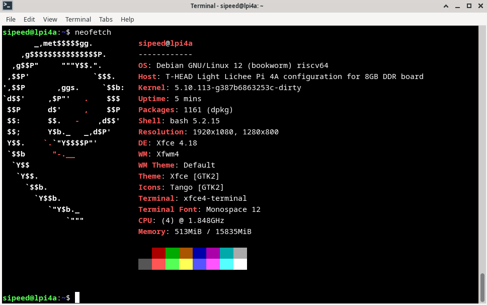

## Supported kernels

Currently T-Heads SDK uses Linux Kernel 5.10: https://gitee.com/thead-yocto
Support is currently added to Linux 6.x, the main contributor of this is `Jisheng Zhang `

## Official Sipeed image

The image for the LicheePi 4A is updated irregularly. The initial image may not be stable, or it may not be able to fully utilize the performance of the TH1520. Please follow the steps below to get the latest image.
The official Sipeed image is based on an adapted Debian.

The default image has two types of account and password configurations, you can try both:
1. User：`root`，`debian`，`sipeed`； the password for all accounts is `licheepi`
2. User: `debian`，password: `debian`； user: `sipeed`，password: `licheepi`

Download Links:

Mega Cloud Storage：[click me](https://mega.nz/folder/phoQlBTZ#cZeQ3qZ__pDvP94PT3_bGA)
ISCAS mirror: [click me](https://mirror.iscas.ac.cn/revyos/extra/images/lpi4a/)

### Debian

1. LPI4A_20230714.zip

   - Release date：: July 14, 2023
   - Linux Kernel version：5.10
   - rootfs：ext4, 4.3GB
   - Pre-Installed packages:
      - Development utilities
      - Office suite
   - Fixed issues：
      - HDMI Display and HDMI audio detectation
      - Fix bluebooth, bluetooth audio is OK
      - Enable auto login, run sudo command without password.
      - Fix shortcut issue, click to run chromium is OK.
   - Known issues：
      - HDMI audio bug in chromium
      - Kernel panic when using USB camera for a long time
   - Addition：
      - HDMI Display only, not support mipi ext-screen, pay attention to the image name.
      - 8gddr/16gddr footfs means it suits board with 8g/16g ddr memory. 
      - Wrong image will not boot device.

2. LPI4A_20230714_mipi.zip

   - Release date：: July 14, 2023
   - Linux Kernel version：5.10
   - rootfs：ext4, 4.3GB
   - Pre-Installed packages:
      - Development utilities
      - Office suite
   - Fixed issues：
      - HDMI Display and HDMI audio detectation
      - Fix bluebooth, bluetooth audio is OK
      - Enable auto login, run sudo command without password.
      - Fix shortcut issue, click to run chromium is OK.
   - Known issues：
      - Dual display mode, mipi screen is at low resolution display, font is not clear.
      - Not connect the MIPI screen, system still recognize the device. Disable the MIPI screen display Manually
         - Run `echo off > /sys/class/drm/card0-DSI-1/status` with root permission
      - The brightness of MIPI screen can only adjusted MIPI Manually
         - Run`echo Brightness(0 to 7) > /sys/class/backlight/pwm-backlight@0/brightness` with root permission
      - HDMI audio bug in chromium
      - Kernel panic when using USB camera for a long time
   - Addition：
      - MIPI Display supported, pay attention to the image name.
         - 8gddr/16gddr footfs means it suits board with 8g/16g ddr memory.
         - mipi_720p/mipi_1080p fits the mipi DSI screen of 800x1280(With touching panel)/1200x1920 resolution
      - Wrong image will not boot device.

<!-- 1. LPi4A_Test_0425
   1. Release date: April 25, 2023
   2. Linux Kernel version: 5.10
   3. rootfs: ext4, 4.3GB
   4. Pre-Installed packages:
      1. Development utilities
      2. Office suite
   5. Fixed issues:
   6. Known problems：
      1. GPU sometimes turns off
      2. After installing the ibus input method, the GPU will be turned on, and the problem of GPU double-buffering (terminal + graphical interface) will be reproduced.
2. LPI4A-tempfix0428
   1. Release date: April 28, 2023
   2. Linux Kernel version: 5.10
   3. rootfs: ext4, 4.3GB
   4. Pre-Installed packages: TODO
   5. Fixed issues:
      1. Temporarily fix the problem of terminal display lag in version 0425, but it will increase CPU usage and halve GPU efficiency
   6. Known issues:
      1. After installing the ibus input method, the GPU will be turned on, and the problem of GPU double-buffering (graphical interface) will be reproduced. -->

### OpenWRT

TODO

### Android

Readme and image download link: [Click me](https://gitee.com/thead-android/thead-android)

## Third-party images

The images provided by third parties are listed here for informational purposes only. Sipeed does not guarantee the availability and stability of these images.

### openEuler

Download: [Click me](https://mirror.iscas.ac.cn/openeuler-sig-riscv/openEuler-RISC-V/preview/openEuler-23.03-V1-riscv64/lpi4a/)   
Twitter: https://twitter.com/openEuler   

### DeepinOS

 

Readme and image download address: [Link](https://github.com/aiminickwong/licheepi4a-images)

### openKylin

 

Readme and image download link: [Click me](https://github.com/aiminickwong/licheepi4a-images)

### armbian

     
Project address: [Click me](https://github.com/chainsx/armbian-riscv-build)  

### Fedora

Project address: [Click me](https://github.com/chainsx/fedora-riscv-builder)  

### Ubuntu

### NixOS

### Gentoo

Project address: [Click me](https://wiki.gentoo.org/wiki/Project:RISC-V)

The link below shows how to create a Gentoo Linux system from stage3

Deplay Gentoo Linux [Click me](https://wiki.gentoo.org/wiki/User:Dlan/RISC-V/TH1520)

### slarm64

  
Project address: [Click me](https://gitlab.com/sndwvs/images_build_kit)  
Download: [Click me](https://dl.slarm64.org/slackware/images/lichee_pi_4a/)  