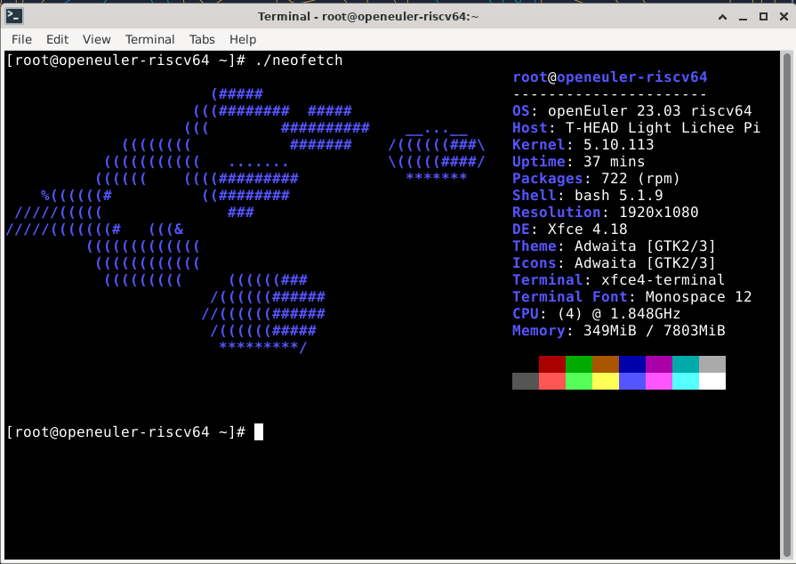

## Supported kernels

Currently T-Heads SDK uses Linux Kernel 5.10: https://gitee.com/thead-yocto
Support is currently added to Linux 6.x, the main contributor of this is `Jisheng Zhang `

## Official Sipeed image

The image for the LicheePi 4A is updated irregularly. The initial image may not be stable, or it may not be able to fully utilize the performance of the TH1520. Please follow the steps below to get the latest image.
The official Sipeed image is based on an adapted Debian.

There may be problems with the memory identification of some 16G memory core boards, which may cause the system to crash when the memory usage is high.

The default image's account and password configurations is:
User: `debian`，password: `debian`;
User: `sipeed`，password: `licheepi`;
root has no password by default.

### Memory Problem Repair Instructions
IMPORTANT：16GB memory board sendout before 2023.8.1 have a buggy images that can't correctly recognize 16GB memory (occupy errors running big applications), please follow the next instructions to fix this error.

Please use the following command to burn a new u-boot to the board. The u-boot used by 16G memory is in the [Mega Cloud Storage link]( https://mega.nz/folder/phoQlBTZ#cZeQ3qZ__pDvP94PT3_bGA), and can also be downloaded from [this link](https://dl.sipeed.com/shareURL/LICHEE/licheepi4a/07_Tools)
The relevant files are in the `20230803_tempfix.zip` compressed package.
(images of 0721 and later versions can be used normally, no need to replace it with the file here)

```shell
sudo ./fastboot flash ram ./images/u-boot-with-spl-lpi4a-16g.bin
sudo ./fastboot reboot
sleep 1
sudo ./fastboot flash ram ./images/u-boot-with-spl-lpi4a-16g.bin
# If there is no device tree corresponding to 16G ddr in the boot.ext4 you use, you need to burn the boot.ext4 corresponding to 16G ddr
sudo ./fastboot flash boot ./images/boot.ext4
```

### Debian


Download Links:

Mega Cloud Storage：[click me](https://mega.nz/folder/phoQlBTZ#cZeQ3qZ__pDvP94PT3_bGA)
ISCAS mirror: [click me](https://mirror.iscas.ac.cn/revyos/extra/images/lpi4a/)

1. LPI4A_20230920.zip

    - Release date: September 20, 2023
    - Kernel: 5.10
    - Root file system: ext4, 4.3GB
    - Main pre-installed packages:
       - Development
       - Office
       - Media player Parole that supports playing 4K videos
    - Fixed issues:
       - Fixed HDMI display device and HDMI audio device identification issues
       - Fixed Bluetooth issues, Bluetooth devices now work properly, Bluetooth headphones can also play audio normally
       - Fixed the issue where browser shortcuts in the bottom launch bar on the desktop were not working, now you can click here to launch Chromium
       - Fixed the kernel panic issue that occurred after connecting a USB camera for a long time
       - Fixed the 16GB memory recognition issue, to fully recognize 16GB memory please update this image
       - Fixed the audio quality issue when playing HDMI audio in Chromium
    - Instructions for use:
       - This image has auto login enabled, the default login user is sipeed
       - This image has passwordless sudo enabled
       - This image will automatically load NPU related drivers, no need for manual initialization
       - This zip file only supports HDMI display, when burning, please note that the suffix in the file name corresponds to the relevant parameters of the device.
         - u-boot with 16g suffix is u-boot that supports 16g memory, without suffix is u-boot that supports 8g memory.

2. LPI4A_20230920_MIPI.zip

    - Release date: September 20, 2023
    - Kernel: 5.10
    - Root file system: ext4, 4.3GB
    - Main pre-installed packages:
       - Development
       - Office
       - Media player Parole that supports playing 4K videos
    - Fixed issues:
       - Fixed HDMI display device and HDMI audio device identification issues
       - Fixed Bluetooth issues, Bluetooth devices now work properly, Bluetooth headphones can also play audio normally
       - Fixed the issue where browser shortcuts in the bottom launch bar on the desktop were not working, now you can click here to enter Chromium
       - Fixed the kernel panic issue that might occur after connecting a USB camera for a long time
       - Fixed the 16GB memory recognition issue, to fully recognize 16GB memory please update this image
       - Fixed the audio quality issue when playing HDMI audio in Chromium
       - Fixed the issue of missing font pixels when using dual different displays
    - Known issues:
       - When the MIPI screen is not connected, the system will still recognize it as connected, temporarily need to manually turn off the output of the MIPI screen in the settings
          - Switch to root user, execute `echo off > /sys/class/drm/card0-DSI-1/status`
       - For the time being, the brightness of the MIPI screen can only be adjusted by manually writing a value
          - Switch to root user, execute `echo brightness value (integer value from 0-7) > /sys/class/backlight/pwm-backlight@0/brightness`
       - There is a problem with the sound quality of HDMI audio playing under chromium
    - Instructions for use:
      - This image has auto login enabled, the default login user is sipeed
      - This image has passwordless sudo enabled
      - This image will automatically load NPU related drivers, no need for manual initialization
      - This zip file is the image of the MIPI screen, please note that the suffix in the file name corresponds to the relevant parameters of the device when burning.
         - u-boot with 16g suffix is u-boot that supports 16g memory, without suffix is u-boot that supports 8g memory.

<!-- 1. LPi4A_Test_0425
   1. Release date: April 25, 2023
   2. Linux Kernel version: 5.10
   3. rootfs: ext4, 4.3GB
   4. Pre-Installed packages:
      1. Development utilities
      2. Office suite
   5. Fixed issues:
   6. Known problems：
      1. GPU sometimes turns off
      2. After installing the ibus input method, the GPU will be turned on, and the problem of GPU double-buffering (terminal + graphical interface) will be reproduced.
2. LPI4A-tempfix0428
   1. Release date: April 28, 2023
   2. Linux Kernel version: 5.10
   3. rootfs: ext4, 4.3GB
   4. Pre-Installed packages: TODO
   5. Fixed issues:
      1. Temporarily fix the problem of terminal display lag in version 0425, but it will increase CPU usage and halve GPU efficiency
   6. Known issues:
      1. After installing the ibus input method, the GPU will be turned on, and the problem of GPU double-buffering (graphical interface) will be reproduced. -->

### OpenWRT


[Click me](https://github.com/ruyisdk/openwrt)

### Android


Readme and image download link: [Click me](https://gitee.com/thead-android/thead-android)

Prebuild Image Download Links:

Mega Cloud Storage：[click me](https://mega.nz/folder/phoQlBTZ#cZeQ3qZ__pDvP94PT3_bGA)

> The Android 13 SDK is still in its infancy, and the problems will be gradually fixed

The precompiled image file of Android 13 is provided in the network disk download link of Sipeed official image, and the burning method after downloading is as follows. Please use the version downloaded from here for the fastboot tool:
https://developer.android.com/tools/releases/platform-tools

There are also fastboot files in the network disk.

```shell
#Burn uboot and initialize boot environment variables
fastboot flash ram u-boot-with-spl.bin
fastboot reboot
fastboot flash uboot u-boot-with-spl.bin

#Burn all partitions
#In the non-boot burning mode, you can enter the command fastboot usb 0 in the uboot command line to burn the partition separately
fastboot flash bootpart bootpart.ext4
fastboot flash boot boot.img
fastboot flash vendor_boot vendor_boot.img
fastboot flash super super.img
fastboot flash userdata userdata.img
fastboot flash vbmeta vbmeta.img
fastboot flash vbmeta_system vbmeta_system.img

#Initialize metadata and misc partition
fastboot erase metadata
fastboot erase misc
```

## Third-party images

The images provided by third parties are listed here for informational purposes only. Sipeed does not guarantee the availability and stability of these images.

### openEuler



Download: [Click me](https://mirror.iscas.ac.cn/openeuler-sig-riscv/openEuler-RISC-V/preview/openEuler-23.03-V1-riscv64/lpi4a/)   
Twitter: https://twitter.com/openEuler   

### DeepinOS

 


Readme and image download address: [Link](https://github.com/aiminickwong/licheepi4a-images)

### openKylin


 

Readme link: [Click me](https://github.com/aiminickwong/licheepi4a-images)
[openKylin V1.0 Download address](https://www.openkylin.top/downloads/index-cn.html)

### armbian

     
Project address: [Click me](https://github.com/chainsx/armbian-riscv-build)  

### Fedora


Project address: [Click me](https://github.com/chainsx/fedora-riscv-builder)  

### Ubuntu


### NixOS (unofficial)


Project address: [Click me](https://github.com/ryan4yin/nixos-licheepi4a)

### Gentoo

Project address: [Click me](https://wiki.gentoo.org/wiki/Project:RISC-V)

The link below shows how to create a Gentoo Linux system from stage3

Deplay Gentoo Linux [Click me](https://wiki.gentoo.org/wiki/User:Dlan/RISC-V/TH1520)


### slarm64

  
Project address: [Click me](https://gitlab.com/sndwvs/images_build_kit)  
Download: [Click me](https://dl.slarm64.org/slackware/images/lichee_pi_4a/)  
