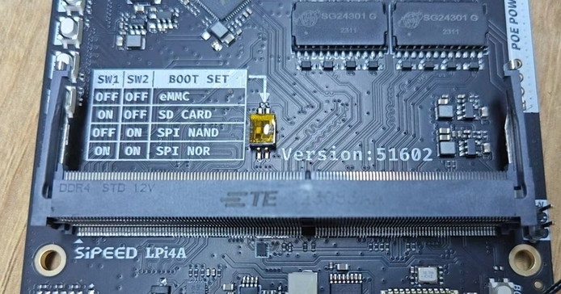
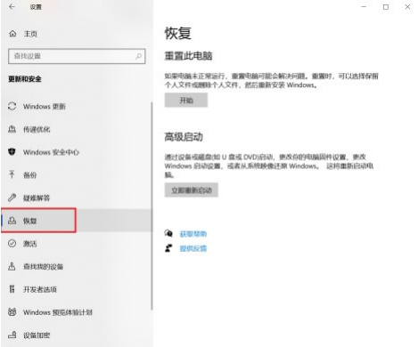
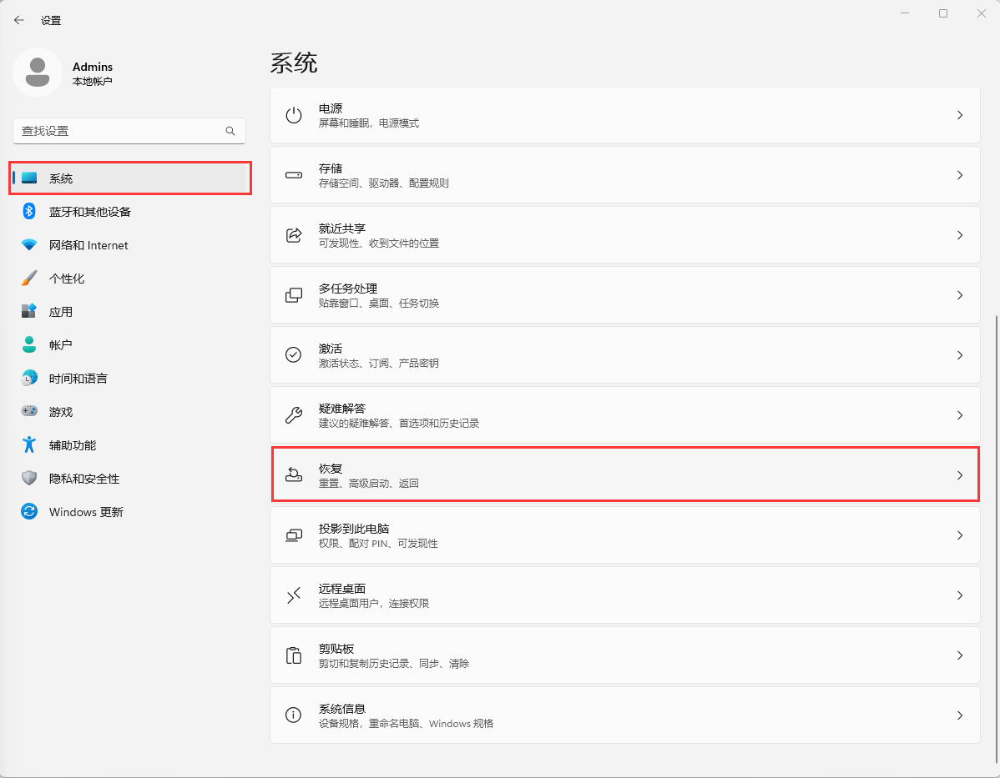
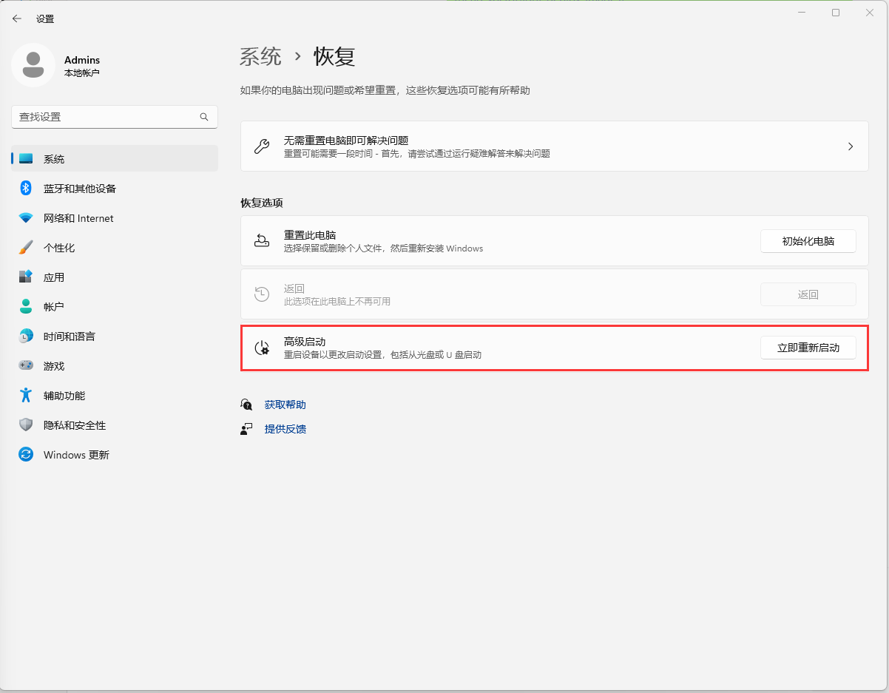

## Preparation

### Download an image

Refer to the previous chapter "Images" to find the desired image.
The following burning method takes Debian single-screen image `LPI4A_20230721.zip`, 16+128 core board as an example.

### Get the burning tool
The burning tool can be obtained from the Mega cloud disk and is found in the `burn_tool.zip` file.
After decompresseion the fastboot binary is found in the win/linux/mac subfolders.

## How to enter burning mode

Note that different versions of hardware have slightly different ways to enter the burning mode, see the following chapters.

### Beta Hardware

Press and hold the BOOT button on the board while plugging in the USB-C cable to power on the board
(the other side of the USB-C cable should be connected to your PC)
This will enter USB burning mode.


Windows: The board should show up in the Device Manager as “USB download gadget”.
Linux: Use `lsusb`, the board should show up in burning mode as `ID 2345:7654 T-HEAD USB download gadget`

### Official Hardware / Release Hardware

Pay attention to check whether the DIP switch on the bottom board is in EMMC startup mode:



After confirming that it is correct, it can be burned, and the next burning steps are the same as the internal test version.

### Windows Driver installation

The driver needs to be installed manually the first time you use the device.

Note that the driver is not digitally signed, and you need to disable the driver signature checks.

To disable digital signatures follow the steps below:

**Win10**
1. Find the settings of WIN10, click "Settings":


2. Click the last "Update and Security", then click "Recovery":



3. After clicking "Recovery", click "Restart" under Advanced Startup on the right, and the computer will restart at this time. If there are other important programs running, please be careful:


**Win11**
1. Find "System Menu" in Settings and tap "Restore".

2. Click "Restart" under Advanced Startup on the right, and the computer will restart at this time. If there are other important programs running, please be careful.


**Same Part**
1. After restarting, several options will appear, click on the option "Troubleshooting", then click on "Advanced", start the settings, and restart.


2. After this will restart, a list will pop up, including options such as safe mode, including the "prohibit mandatory driver signature" we care about here, select "disable mandatory driver signature", press the corresponding number, and then The computer will restart.


3. After restarting, the driver can be installed successfully. If prompted, click to continue the installation. The specific steps of fastboot driver installation are as follows:
a. The development board is connected to the computer via usb.
b. Open the device manager and the "USB download gadget" device will appear.

Refer to [Disable Driver signature verification](https://answers.microsoft.com/en-us/windows/forum/all/permanent-disable-driver-signature-verification/009c3498-bef8-4564-bb52-1d05812506e0#:~:text=Start%20your%20computer%20and%20then%20keep%20pressing%20the,your%20keyboard%20to%20select%20Disable%20driver%20signature%20enforcement.)


## Burn the image

### Windows

Edit the `burn_lpi4a.bat` decompressed from burn_tool.zip, replace the example image path into your real image path. Then run this `burn_lpi4a.bat` to burn image into LPi4A.

And `fastboot.exe` path also needs verifying, otherwise it reports file not found.


### Linux

After putting the board into burning mode, you can use fastboot from `burn_tool.zip` to burn the image.
Let´s take linux as an example:
Note that you need to mark the fastboot binary as executable first via `chmod +x fastboot`

`u-boot-with-spl-ddr8g.bin` and `u-boot-with-spl-ddr16g.bin` are u-boot firmware, please refer to the image description for specific differences.
```bash
sudo ./fastboot flash ram ./images/u-boot-with-spl-ddr16g.bin
sudo ./fastboot reboot
sleep 10
sudo ./fastboot flash uboot ./images/u-boot-with-spl-ddr16g.bin
sudo ./fastboot flash boot ./images/boot_16gddr.ext4
sudo ./fastboot flash root ./images/rootfs-thead-image-linux_sing.ext4.ext4
```

The first three lines will check and create the partitions on the flash. If you skip this step,
burning the rootfs will be very slow later on.

`boot_8gddr.ext4`, `boot_8gddr_mipi_720p.ext4`, `boot_8gddr_mipi_1080p.ext4`, `boot_16gddr.ext4`, `boot_16gddr_mipi_720p.ext4` and `boot_16gddr_mipi_1080p.ext4` for boot For specific differences, please refer to the image description. They mainly include the following:
```bash
fw_dynamic.bin        #opensbi
Image                 #kernel image
kernel-release        #commit id of kernel
light_aon_fpga.bin    #fw for E902 aon
light_c906_audio.bin  #fw for C906 audio
light-lpi4a.dtb       # ddr8G dtb
light-lpi4a-ddr16g.dtb # ddr16G dtb
```

`rootfs-thead-image-linux_sing.ext4` and `rootfs-thead-image-linux_mipi.ext4` are the root file system, and the default is Debian system. For the specific differences between the two, please refer to the image description.

Log output you typically see while burning an image:


<!--  
```bash
(base) pc@n5105:~/work/$ sudo ./fastboot flash ram u-boot-with-spl.bin
Sending 'ram' (935 KB)                             OKAY [  0.248s]
Writing 'ram'                                      OKAY [  0.002s]
Finished. Total time: 0.255s
(base) pc@n5105:~/work/$ sudo ./fastboot reboot
Rebooting                                          OKAY [  0.001s]
Finished. Total time: 0.202s
(base) pc@n5105:~/work/$ sudo ./fastboot flash uboot u-boot-with-spl.bin
Sending 'uboot' (935 KB)                           OKAY [  0.054s]
Writing 'uboot'                                    OKAY [  0.030s]
Finished. Total time: 0.107s
(base) pc@n5105:~/work/$ sudo ./fastboot flash boot boot_20230420.ext4 
Sending 'boot' (40000 KB)                          OKAY [  1.705s]
Writing 'boot'                                     OKAY [  0.877s]
Finished. Total time: 2.770s
(base) pc@n5105:~/work/$ sudo ./fastboot flash root rootfs-20230425-001635-nogpu.ext4 
Invalid sparse file format at header magic
Sending sparse 'root' 1/37 (114572 KB)             OKAY [  4.793s]
Writing 'root'                                     OKAY [  3.087s]
Sending sparse 'root' 2/37 (105264 KB)             OKAY [  4.465s]
Writing 'root'                                     OKAY [  2.330s]
Sending sparse 'root' 3/37 (111970 KB)             OKAY [  4.814s]
Writing 'root'                                     OKAY [  2.861s]
Sending sparse 'root' 4/37 (114684 KB)             OKAY [  4.902s]
Writing 'root'                                     OKAY [  2.658s]
Sending sparse 'root' 5/37 (101490 KB)             OKAY [  4.305s]
Writing 'root'                                     OKAY [  2.652s]
Sending sparse 'root' 6/37 (114684 KB)             OKAY [  4.648s]
Writing 'root'                                     OKAY [  2.657s]
Sending sparse 'root' 7/37 (113862 KB)             OKAY [  4.755s]
Writing 'root'                                     OKAY [  2.826s]
Sending sparse 'root' 8/37 (111189 KB)             OKAY [  4.741s]
Writing 'root'                                     OKAY [  2.695s]
Sending sparse 'root' 9/37 (114625 KB)             OKAY [  4.865s]
Writing 'root'                                     OKAY [  2.660s]
Sending sparse 'root' 10/37 (104030 KB)            OKAY [  4.506s]
Writing 'root'                                     OKAY [  4.108s]
Sending sparse 'root' 11/37 (111701 KB)            OKAY [  4.744s]
Writing 'root'                                     OKAY [  2.717s]
Sending sparse 'root' 12/37 (107317 KB)            OKAY [  4.568s]
Writing 'root'                                     OKAY [  2.583s]
Sending sparse 'root' 13/37 (114629 KB)            OKAY [  4.830s]
Writing 'root'                                     OKAY [  2.753s]
Sending sparse 'root' 14/37 (109798 KB)            OKAY [  4.711s]
Writing 'root'                                     OKAY [  2.778s]
Sending sparse 'root' 15/37 (112203 KB)            OKAY [  4.795s]
Writing 'root'                                     OKAY [  2.982s]
Sending sparse 'root' 16/37 (112502 KB)            OKAY [  4.827s]
Writing 'root'                                     OKAY [  2.991s]
Sending sparse 'root' 17/37 (114110 KB)            OKAY [  4.849s]
Writing 'root'                                     OKAY [  2.853s]
Sending sparse 'root' 18/37 (114681 KB)            OKAY [  4.888s]
Writing 'root'                                     OKAY [  2.802s]
Sending sparse 'root' 19/37 (112042 KB)            OKAY [  4.799s]
Writing 'root'                                     OKAY [  3.674s]
Sending sparse 'root' 20/37 (109101 KB)            OKAY [  4.631s]
Writing 'root'                                     OKAY [  2.582s]
Sending sparse 'root' 21/37 (114225 KB)            OKAY [  4.623s]
Writing 'root'                                     OKAY [  2.782s]
Sending sparse 'root' 22/37 (114365 KB)            OKAY [  4.703s]
Writing 'root'                                     OKAY [  2.667s]
Sending sparse 'root' 23/37 (103529 KB)            OKAY [  4.133s]
Writing 'root'                                     OKAY [  2.442s]
Sending sparse 'root' 24/37 (114664 KB)            OKAY [  4.631s]
Writing 'root'                                     OKAY [  2.581s]
Sending sparse 'root' 25/37 (114550 KB)            OKAY [  4.749s]
Writing 'root'                                     OKAY [  2.878s]
Sending sparse 'root' 26/37 (114686 KB)            OKAY [  4.796s]
Writing 'root'                                     OKAY [  2.853s]
Sending sparse 'root' 27/37 (114466 KB)            OKAY [  4.800s]
Writing 'root'                                     OKAY [  2.894s]
Sending sparse 'root' 28/37 (110689 KB)            OKAY [  4.711s]
Writing 'root'                                     OKAY [  2.616s]
Sending sparse 'root' 29/37 (114687 KB)            OKAY [  4.880s]
Writing 'root'                                     OKAY [  2.992s]
Sending sparse 'root' 30/37 (110984 KB)            OKAY [  4.710s]
Writing 'root'                                     OKAY [  2.451s]
Sending sparse 'root' 31/37 (114685 KB)            OKAY [  4.920s]
Writing 'root'                                     OKAY [  2.749s]
Sending sparse 'root' 32/37 (114684 KB)            OKAY [  4.825s]
Writing 'root'                                     OKAY [  2.503s]
Sending sparse 'root' 33/37 (114684 KB)            OKAY [  4.816s]
Writing 'root'                                     OKAY [  3.262s]
Sending sparse 'root' 34/37 (114686 KB)            OKAY [  4.745s]
Writing 'root'                                     OKAY [  2.825s]
Sending sparse 'root' 35/37 (114684 KB)            OKAY [  4.913s]
Writing 'root'                                     OKAY [  2.630s]
Sending sparse 'root' 36/37 (114684 KB)            OKAY [  4.838s]
Writing 'root'                                     OKAY [  2.593s]
Sending sparse 'root' 37/37 (21324 KB)             OKAY [  0.926s]
Writing 'root'                                     OKAY [  0.487s]
Finished. Total time: 281.671s
```
-->

## Board Boot Process

brom -> U-Boot SPL -> U-Boot -> OpenSBI -> Kernel

Here is a brief overview of each stage and sample console output.
The board now has a level shifter for the serial port to 3.3V logic, so a regular USB serial adapter can be used.

### brom

Typical output: 
```shell
brom_ver 8
[APP][E] protocol_connect failed, exit. 
```

The brom stage loads initial code from the SoC's ROM and looks for the next stage bootloader.

### U-Boot SPL

Typical output:  
```shell
U-Boot SPL 2020.01-gd6c9182f (Jul 07 2023 - 12:31:51 +0200)
FM[1] lpddr4x dualrank freq=3733 64bit dbi_off=n sdram init
ddr initialized, jump to uboot
image has no header
```

U-Boot SPL stands for Secondary Program Loader. It initializes RAM, loads the main U-Boot into RAM and jumps to it.

### U-Boot

Typical output:
```shell
U-Boot 2020.01-gd6c9182f (Jul 07 2023 - 12:31:51 +0200)

CPU:   rv64imafdcvsu
Model: T-HEAD c910 light
DRAM:  8 GiB
C910 CPU FREQ: 750MHz
AHB2_CPUSYS_HCLK FREQ: 250MHz
AHB3_CPUSYS_PCLK FREQ: 125MHz
PERISYS_AHB_HCLK FREQ: 250MHz
PERISYS_APB_PCLK FREQ: 62MHz
GMAC PLL POSTDIV FREQ: 1000MHZ
DPU0 PLL POSTDIV FREQ: 1188MHZ
DPU1 PLL POSTDIV FREQ: 1188MHZ
MMC:   sdhci@ffe7080000: 0, sd@ffe7090000: 1
Loading Environment from MMC... OK
Error reading output register
Warning: cannot get lcd-en GPIO
LCD panel cannot be found : -121
splash screen startup cost 15 ms
In:    serial
Out:   serial
Err:   serial
Net:   ethernet@ffe7070000 (eth0) using MAC address - ae:be:2a:50:5e:89
eth0: ethernet@ffe7070000ethernet@ffe7070000:0 is connected to ethernet@ffe7070000.
ethernet@ffe7060000 (eth1) using MAC address - ae:be:2a:50:5e:8a
, eth1: ethernet@ffe7060000
Hit any key to stop autoboot:  0
```

Press enter within 2 seconds of seeing `Hit any key to stop autoboot:` to enter the U-Boot console.

Typical environment variable configuration:

Set MAC addresses: 
```shell
setenv ethaddr ae:be:2a:50:5e:89
setenv eth1addr ae:be:2a:50:5e:8a
saveenv
```
Just replace the MAC address in the above command with your own MAC address. Note that the value of `eth1addr` is the value of `ethaddr` plus 1.

Set kernel device tree: 
```shell
setenv fdt_file light-lpi4a.dtb
saveenv
```
Replace `light-lpi4a.dtb` in the above command with the file name of the desired device tree stored in `boot.ext4`.
After the setting is complete, you can also use the `printenv` command to check whether it is correct, and then enter the `boot` command to enter the kernel.

In addition, you can also set startup parameters here to choose a startup method, such as using an SD card to start.
After burning the image to the SD card, insert the SD card into the development board and enter U-Boot:
```shell
env set -f set_bootargs 'setenv bootargs console=ttyS0,115200 root=/dev/mmcblk1 rootfstype=ext4 rootwait rw earlycon clk_ignore_unused loglevel=7 eth=ethaddr rootrwoptions=rw,noatime rootrwreset={factory_reset} init=/lib/systemd/systemd'
env save
```
After the above steps are completed, enter the `reset` command to restart the development board, and the system can be booted from the SD card.

For the official version of the development board, you can use the DIP switch on the bottom board to select the startup mode:  


### OpenSBI
Some initialization prints in OpenSBI's sbi_init.c file will not be displayed in the startup log, but you can see some information about OpenSBI being printed out when the Kernel starts:
```shell
[    0.000000] SBI specification v0.3 detected
[    0.000000] SBI implementation ID=0x1 Version=0x9
[    0.000000] SBI v0.2 TIME extension detected
[    0.000000] SBI v0.2 IPI extension detected
[    0.000000] SBI v0.2 RFENCE extension detected
[    0.000000] SBI v0.2 HSM extension detected
```
OpenSBI has three kinds of firmware, the one used here is FW_DYNAMIC, which will load the next stage according to the information passed in the previous stage. The fw_dynamic.bin firmware of OpenSBI is stored in boot.ext4, which will boot the kernel at this stage.

### Kernel
A typical log of this stage is as follows (because it is too long, only part of it is intercepted):
```shell
[    0.000000] Linux version 5.10.113-g387b6863253c-dirty
[    0.000000] OF: fdt: Ignoring memory range 0x0 - 0x200000
[    0.000000] earlycon: uart0 at MMIO32 0x000000ffe7014000 (options '115200n8')
[    0.000000] printk: bootconsole [uart0] enabled
[    0.000000] efi: UEFI not found.
[    0.000000] Reserved memory: created CMA memory pool at 0x00000003e4000000, size 320 MiB
[    0.000000] OF: reserved mem: initialized node linux,cma, compatible id shared-dma-pool 
[    0.000000] Zone ranges:                       
[    0.000000]   DMA32    [mem 0x0000000000200000-0x00000000ffffffff]
[    0.000000]   Normal   [mem 0x0000000100000000-0x00000003ffffffff]
[    0.000000] Movable zone start for each node   
[    0.000000] Early memory node ranges
[    0.000000]   node   0: [mem 0x0000000000200000-0x000000000fffffff]
[    0.000000]   node   0: [mem 0x0000000010000000-0x00000000166fffff]
[    0.000000]   node   0: [mem 0x0000000016700000-0x0000000016ffffff]
[    0.000000]   node   0: [mem 0x0000000017000000-0x0000000018ffffff]
[    0.000000]   node   0: [mem 0x0000000019000000-0x000000001bffffff]
[    0.000000]   node   0: [mem 0x000000001c000000-0x000000001dffffff]
[    0.000000]   node   0: [mem 0x000000001e000000-0x000000001fffffff]
[    0.000000]   node   0: [mem 0x0000000020000000-0x00000000207fffff]
[    0.000000]   node   0: [mem 0x0000000020800000-0x00000003ffffffff]
[    0.000000] Initmem setup node 0 [mem 0x0000000000200000-0x00000003ffffffff]
[    0.000000] software IO TLB: mapped [mem 0x00000000fbfff000-0x00000000fffff000] (64MB)
[    0.000000] SBI specification v0.3 detected
[    0.000000] SBI implementation ID=0x1 Version=0x9
[    0.000000] SBI v0.2 TIME extension detected
[    0.000000] SBI v0.2 IPI extension detected
[    0.000000] SBI v0.2 RFENCE extension detected
[    0.000000] SBI v0.2 HSM extension detected
[    0.000000] riscv: ISA extensions acdfimsuv
[    0.000000] riscv: ELF capabilities acdfimv
[    0.000000] percpu: Embedded 27 pages/cpu s73496 r8192 d28904 u110592
[    0.000000] Built 1 zonelists, mobility grouping on.  Total pages: 4128264
[    0.000000] Kernel command line: console=ttyS0,115200 root=PARTUUID=80a5a8e9-c744-491a-d
[    0.000000] Dentry cache hash table entries: 2097152 (order: 12, 16777216 bytes, linear)
[    0.000000] Inode-cache hash table entries: 1048576 (order: 11, 8388608 bytes, linear) 
[    0.000000] Sorting __ex_table...
[    0.000000] mem auto-init: stack:off, heap alloc:off, heap free:off
[    0.000000] Memory: 15887448K/16775168K available (12390K kernel code, 5982K rwdata, 61)
[    0.000000] SLUB: HWalign=64, Order=0-3, MinObjects=0, CPUs=4, Nodes=1
[    0.000000] rcu: Preemptible hierarchical RCU implementation.
[    0.000000] rcu:     RCU restricting CPUs from NR_CPUS=8 to nr_cpu_ids=4.
[    0.000000]  Trampoline variant of Tasks RCU enabled.
[    0.000000]  Tracing variant of Tasks RCU enabled.
[    0.000000] rcu: RCU calculated value of scheduler-enlistment delay is 25 jiffies.
[    0.000000] rcu: Adjusting geometry for rcu_fanout_leaf=16, nr_cpu_ids=4
[    0.000000] NR_IRQS: 64, nr_irqs: 64, preallocated irqs: 0
[    0.000000] riscv-intc: 64 local interrupts mapped
[    0.000000] plic: interrupt-controller@ffd8000000: mapped 64 interrupts with 4 handlers.
[    0.000000] random: get_random_bytes called from start_kernel+0x372/0x4d4 with crng_ini0
[    0.000000] riscv_timer_init_dt: Registering clocksource cpuid [0] hartid [0]
[    0.000000] clocksource: riscv_clocksource: mask: 0xffffffffffffffff max_cycles: 0x1623s
[    0.000008] sched_clock: 64 bits at 3000kHz, resolution 333ns, wraps every 439804651109s
[    0.008693] Console: colour dummy device 80x25
```

After starting the kernel, you can replace the device tree DTB file, OpenSBI firmware, kernel image file Image and other files, which are located in the `/boot/` directory:
```shell
sipeed@lpi4a:~$ ls /boot/
Image                                    light-lpi4a.dtb
System.map-5.10.113-g387b6863253c-dirty  light_aon_fpga.bin
config-5.10.113-g387b6863253c-dirty      light_c906_audio.bin
fw_dynamic.bin                           vmlinuz-5.10.113-g387b6863253c-dirty
kernel-commitid
```

## Batch programming / flashing

If you have commercial needs and need to burn firmware in batches, you can use the ARM/RV version of fastboot provided by sipeed to make an offline batch burner.
If you need to burn a large number, you can also contact support@sipeed.com directly , we provide pre-burning image service.