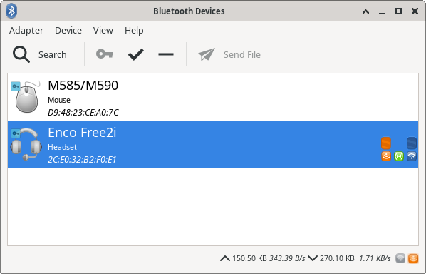
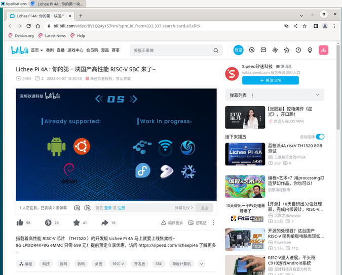

## Log in to the System

This document provides an introduction to basic system usage using the default Debian desktop system as an example.

Once LicheePi 4A is connected to a monitor, you will see the graphical user interface.

At the login screen, enter the username sipeed and the password licheepi to log in to the system.

> There are three users: root, debian, and sipeed, all with the initial password licheepi.
> For some versions, the password for the debian user is sipeed.

**Starting from version 0714, the image enables automatic login with the user sipeed.**


## Open the Command Line

In the Debian graphical system on LicheePi 4A, you can directly open the command line terminal using the shortcut `Ctrl` + `Alt` + `T` for quick and convenient system operations.
**Starting from version 0714, the image enables passwordless `sudo`**


## Connect to the Network

### Connect to Wired Network

LicheePi 4A has two gigabit network interfaces. To connect to a wired network, simply plug in the Ethernet cable into the network interface of LicheePi 4A.

<table>
    <tr>
        <td>Before connecting the cable</td>
        <td>After connecting the cable</td>
    </tr>
    <tr>
        <td></td>
        <td></td>
    </tr>
    <tr>
        <td colspan=2> By comparing the two images above, you can see that before connecting the cable, it shows <code>Ethernet Network</code> under <code>disconnected</code>, and after connecting the cable, it shows<code>Wired connection </code></td>
    </tr>
</table>

### Connect to Wireless Network

LicheePi 4A has an onboard wireless module that supports Bluetooth and Wi-Fi.

From the Available networks in the status bar, select the desired wireless network and enter the password to connect automatically.

<table>
    <tr>
        <td colspan=2></td>
    </tr>
    <tr>
        <td></td>
        <td></td>
    </tr>
</table>

In the password input dialog, make sure to select `wlan0` under `Wi-Fi adapter` to connect to the network.

## Connect to Bluetooth Devices

Find the Bluetooth icon in the top right corner of the desktop. Make sure that the Bluetooth function is enabled. If it's not enabled, right-click on the Bluetooth icon to turn it on:


Once enabled, left-click on the Bluetooth icon to access the Bluetooth device scanning interface.

Click on the "Search" button in the top left corner of this interface to start searching for Bluetooth devices. Make sure the Bluetooth keyboard, mouse, or headphones are in pairing mode so they can be detected.

Right-click on the desired device and select "Connect" to establish the connection. Once connected successfully, you can also right-click on the device and click "Trust" to enable automatic connection the next time it's detected.



If you experience the error `br-connection-profile-unavailable` while trying to connect your Bluetooth audio device after pairing the following commands might help. Make sure to execute them under your user and not root:

```shell
systemctl --user enable pulseaudio
systemctl --user start pulseaudio
sudo apt install bluetooth rfkill blueman bluez bluez-tools pulseaudio-module-bluetooth
```

If the Bluetooth graphic interface fails to detect devices, you can also run `bluetoothctl` in the command-line interface to pair devices. Follow these steps:

```shell
bluetoothctl
scan on
# Find the mac address of the desired device
pair "The mac address of the target device"
connect "The mac address of the target device"
```

The above steps can also be performed in the Bluetooth graphic interface. However, the graphic interface may have limitations in showing all detected Bluetooth devices. In such cases, you can use the `bluetoothctl` tool first to search and pair the devices. Once the pairing is successful, the device will appear in the graphic interface, and you can switch to the graphic interface for further operations.

## Software Installation

After completing the network connection, you can update the software package and install it.

### Software Source

On Debian systems, you can use apt (Advanced Packaging Tool) to install software.

When installing software, it will search for and download the target software from the system's designated repositories. If the repositories are difficult to access (e.g. the server is too far away or the server network is poor), you can manually edit the repositories to the nearest repository to minimize the download time.

By default, the sources are listed in the `/etc/apt/sources.list` file, but you can change it if you need to. You can change this if you need to. However, please note that you need to use sources that support the Risc-V architecture.


### Upgrading the Software

Use `sudo apt update` to update the software list, which is usually needed after changing sources.

Before using this command, check the time with the `date` command. If the time is not correct or the time is not updated automatically after connecting to the network, you can update it manually to make sure that the packages in the repository are the latest versions:
```shell
sudo date -s "20230717 12:00:00"
```

Then use `sudo apt upgrade package_name` to update the software with the name `package_name`.

For example, the following is an example of using `sudo apt upgrade vim` to update the program `vim`.


If you use the `sudo apt update` command, you encounter a message similar to the following:  
```shell
Ign:1 https://mirror.iscas.ac.cn/deepin-riscv/deepin-stage1 beige InRelease
Ign:2 https://community-packages.deepin.com/driver driver InRelease
Ign:3 https://mirror.iscas.ac.cn/deepin-riscv/deepin-addons beige InRelease
Ign:2 https://community-packages.deepin.com/driver driver InRelease
Ign:1 https://mirror.iscas.ac.cn/deepin-riscv/deepin-stage1 beige InRelease
Ign:3 https://mirror.iscas.ac.cn/deepin-riscv/deepin-addons beige InRelease
Ign:1 https://mirror.iscas.ac.cn/deepin-riscv/deepin-stage1 beige InRelease
Ign:2 https://community-packages.deepin.com/driver driver InRelease
Ign:3 https://mirror.iscas.ac.cn/deepin-riscv/deepin-addons beige InRelease
Err:2 https://community-packages.deepin.com/driver driver InRelease
  Could not resolve 'community-packages.deepin.com'
Err:1 https://mirror.iscas.ac.cn/deepin-riscv/deepin-stage1 beige InRelease
  Could not resolve 'mirror.iscas.ac.cn'
Err:3 https://mirror.iscas.ac.cn/deepin-riscv/deepin-addons beige InRelease
  Could not resolve 'mirror.iscas.ac.cn'
Reading package lists... Done
W: Failed to fetch https://mirror.iscas.ac.cn/deepin-riscv/deepin-stage1/dists/beige/InRelease  Could not resolve 'mirror.iscas.ac'
W: Failed to fetch https://mirror.iscas.ac.cn/deepin-riscv/deepin-addons/dists/beige/InRelease  Could not resolve 'mirror.iscas.ac'
W: Failed to fetch https://community-packages.deepin.com/driver/dists/driver/InRelease  Could not resolve 'community-packages.deep'
W: Some index files failed to download. They have been ignored, or old ones used instead.
```

You can try the following command to fix it:  
```shell
sudo apt-get update --fix-missing
```

### Installing Programs

Software can be installed with the aid of the apt command; for example, `sudo apt install package_name` is used to install `package_name`, and the following is an example of using apt to install `net-tools`.


After installing `net-tools`, you can use the `ifconfig` command.


The arrow points to what is often referred to as the IP address.

If you encounter a message similar to the one below while downloading the software: 
```shell
W: GPG error: http://archive.ubuntu.com trusty-updates Release: The following signatures couldn't be verified because the public key is not available: NO_PUBKEY 40976EAF437D05B5 NO_PUBKEY 3B4FE6ACC0B21F32
```

You can try the following command to fix it:   
```shell
sudo apt-key adv --keyserver keyserver.ubuntu.com --recv-keys 'Replace the key value after NO_PUBKEY in the error message here'
# or
gpg --keyserver keyserver.ubuntu.com --recv-keys 'Replace the key value after NO_PUBKEY in the error message here'
```

## SSH

If you don't have the ssh or sshd command in your image, you can install it first with the following command:

```bash
sudo apt install ssh openssh-server
```

Once installed, you can use ssh to log in remotely to other machines, or use ssh to log in to LicheePi 4A on other machines.
You can also use scp to transfer files:

```bash
scp demo.zip sipeed@192.168.1.9:~/
``

## Input Methods

If you need to input non-ascii characters, you need to install an input method, here is an example of Chinese input method, for other languages, please look for tutorials.

First install ibus-libpinyin:

```bash
sudo apt install -y ibus-libpinyin
```

> Note that this will consume about 200MB of disk space.

After installation, reboot the card and you will see the `IBus Preference` option under Applications, click on it to enter the settings.  


In the interface that appears, click `Input Method`, click `Add`, select `Chinese`, select `Intelligent Pinyin`, and click `Add` to add Chinese Pinyin input method.  

 

Click on the Input Method icon in the upper right corner to see the following options, select `Chinese - Intelligent Pinyin`.  


Now you can enter Chinese into your system without any problem:    
  

> Note: In the 0425 version of the image, there may be a GPU support issue that causes the GUI to stutter and lag after the input method is installed.

## Office Software

Some of the mirrors have the basic Office office software (LibreOffice) built in:

  

LibreOffice Calc is the XLS function:

 

LibreOffice Impress is the PPT function:

 

LibreOffice Writer is the WORD function:

 

## Web Browser

The Chromium browser is built-in and is available by clicking the browser icon at the bottom of the desktop: 


> If the launch bar icon at the bottom of the desktop is displayed abnormally, you can try to use the following commands to fix it:
```shell
cp /etc/xdg/xfce4/panel/default.xml /home/sipeed/.config/xfce4/xfconf/xfce-perchannel-xml/xfce4-panel.xml
chown sipeed:sipeed /home/sipeed/.config/xfce4/xfconf/xfce-perchannel-xml/xfce4-panel.xml
```

Use a search engine:  


Watch online videos:  



WebGL support test:


> Note: In the current 0714 mirror, when playing video or audio under Chromium, there will be noise if it is HDMI audio output, you can switch to Firefox browser to play it temporarily.

Use the following commands to install the Firefox browser and related dependencies:
```shell
sudo apt install firefox ffmpeg
```

## Media Player

There are some open source players built into the system, and we recommend using VLC Player as the video player:


The effect of using VLC Player to view videos in MP4 format is as follows:


## Programming 

### Python

The python3 environment is built-in and can be run directly from the terminal:

  

If you need to install Python packages, use: `sudo apt install python3-XXX`.
For example, to install the pyserial package: `sudo apt install python3-serial`.

### C

The `build-essential` package is required and takes up about 800MB of disk space.

```bash
sudo apt install build-essential
```

Then you can compile it with gcc:  
  

## Extended Storage

The onboard eMMC capacity of the beta version is small, leaving only 2~3GB of space for the user. If you need to carry out mass storage, you need to expand the storage space, and you can choose to use USB storage or TF storage.

### Mounting a USB Flash Drive

After inserting a USB flash drive into the USB port of the LicheePi 4A, you can use `dmesg` in the command terminal window to view the hardware change information of the board.

The following is the latest information seen in the command line terminal using `dmesg` after connecting the USB flash drive (screenshot).


The message above shows the peripheral change information for the board; from this you can see that there is a mass USB storage device connected to the LicheePi 4A.

Use the command `cat /proc/partitions | grep "sd*"` to see the number of partitions within the USB.


Take the above result as an example, where `sda` refers to the whole USB flash drive, and `sda1` and `sda2` represent the two partitions inside the USB flash drive.

First create a folder on the desktop system, and then use the `mount` command to mount a partition of the USB flash disk under the folder.

```bash
mkdir ~/Desktop/udisk # Create a folder on your desktop called udisk
mount /dev/sda2 ~/Desktop/udisk # Mount the sda2 partition of the USB flash drive to the udisk folder
```

<table>
    <tr>
        <td> Before running the command </td>
        <td> After running the command </td>
    </tr>
    <tr>
        <td style="white-space:nowrap"></td>
        <td style="white-space:nowrap"></td>
    </tr>
    <tr>
        <td colspan=2> After running the command, a new folder named udisk has been added to the desktop, double-click the mouse to open the udisk folder and you can see that the contents of the folder are the same as the actual contents of the USB flash drive. </td>
    </tr>
</table>

### Mount TF Card

Insert the TF card into the TF slot on the back of the LicheePi 4A and you will see the device `/dev/mmcblk1` under the system (/dev/mmcblk0 is eMMC on the SOM).

If the TF card has not been partitioned or formatted, you can use the `sudo fdisk /dev/mmcblk1` command to partition the card.
Then use `sudo mkfs.ext4 /dev/mmcblk1p1` or `sudo mkfs.vfat /dev/mmcblk1p1` to format the newly created partition.
If you want to use it as an extended partition, it is recommended to use ext4; if you want to use it as a TF card for exchanging data with Windows, it is recommended to use vfat.

After formatting, you can mount the partition as in the previous section to make sure it is mounted properly.

### Setting up power-on mounting

After verifying the success of manual mounting, you can further set up boot mounting.

You only need to add the device information that needs to be mounted automatically in /etc/fstab file, the following is an example of adding TF card to be mounted automatically in the last line.

```bash
sipeed@lpi4a:~$ cat /etc/fstab
# UNCONFIGURED FSTAB FOR BASE SYSTEM
/dev/mmcblk0p3 /       auto    defaults    1 1
/dev/mmcblk0p2 /boot   auto    defaults    0 0
/dev/mmcblk1p1 /mnt    auto    defaults    0 2
```

- The first number: 0 means that the disk is not checked at boot, 1 means that the disk is checked at boot;
- The second number: 0 for the swap partition, 1 for the boot partition (Linux), and 2 for the normal partition.

/dev/mmcblk1p1 can also use the disk UUID, which is written as UUID=xxxx-xxx, and can be viewed using `sudo blkid`:
`/dev/mmcblk1p1: UUID="033173ff-b3ab-494c-ab14-4dcd656a9214" BLOCK_SIZE="4096" TYPE="ext4" PARTUUID="8e4e28df-01"`


## VNC Remote Desktop

Install the required packages and remote desktop using the lightweight Xfce desktop environment.
```shell
sudo apt install xfce4 xfce4-goodies xorg dbus-x11 x11-xserver-utils
sudo apt install tigervnc-standalone-server tigervnc-common
```

After installation, run the `vncserver` command to configure the relevant password. The system will prompt you to configure the password, set it according to your own needs, and the second password is used for view-only user login:
```shell
sipeed@lpi4a:~$ vncserver

You will require a password to access your desktops.

Password:
Verify:
Would you like to enter a view-only password (y/n)? n
A view-only password is not used
```
The associated password is created and stored in a file `~/.vnc`.

After the password is set, the following message is displayed
```shell
New Xtigervnc server 'lpi4a:1 (sipeed)' on port 5901 for display :1.
Use xtigervncviewer -SecurityTypes VncAuth -passwd /tmp/tigervnc.I5Af7X/passwd :1 to connect to the VNC server.
```
Note that the hostname in the above output is followed by a `:1`, which indicates the display port number of the VNC server. The VNC server will be listening on port `5901`, i.e. 5900+1. Similarly, running the vncserver command to create a second instance will use the next display port `:2`, for which the listening port will be `5902`.

Next, kill the VNC instance you just created and do some configuration first.
```shell
vncserver -kill :1
```


The xstartup file is a script that runs when the TigerVNC server starts up. Create and edit the file `~/.vnc/xstartup` and write the following:
```shell
#!/bin/sh
unset SESSION_MANAGER
unset DBUS_SESSION_BUS_ADDRESS
exec startxfce4 
```

and give permission
```shell
chmod +x ~/.vnc/xstartup
```

Next, add the startup parameters for the VNC server. Create and edit the `~/.vnc/config` file and add the required startup parameters. For example, if you want to set the resolution and dpi at startup, you can write the following:
```shell
geometry=your_prefer_resolution
dpi=your_prefer_dpi
```

If you cannot connect to VNC because of a firewall, you can use ufw to add allowed ports, for example, using the VNC server's display port 5901:
```shell
sudo ufw allow 5901
```

Finally, it's time to run the vnc server:
```shell
vncserver -localhost no
```

Next, in order to access the remote host (LPi4A), we need to download and install [vncviewer](https://www.realvnc.com/en/connect/download/viewer/) on the local host (the computer you're using), and once it's installed, start VNCviewer, and on the window At the top, enter the IP address and port number of the remote host (in the format `Your IP address:VNC server's display port number):


By default, the image quality of remote desktop will be set according to the network conditions, low image quality may cause the remote desktop screen color abnormality, at this time, you can manually specify the high image quality.

After the first successful connection, right-click on the newly appeared session window and select properties:


Modify the Picture quality in the Options option to High:

  

The effect displayed is as follows:


## btop

Btop is an aesthetically pleasing resource that displays processor, memory, disk, network, and process usage and statistics.

It can be installed using the following command:
```shell
sudo apt install btop
```

Then run the `btop` command on the command line to use it, the effect is as follows:


## More
Contributions are welcome~ You can get ￥5~150 ($1~20) coupon after your submission is accepted!