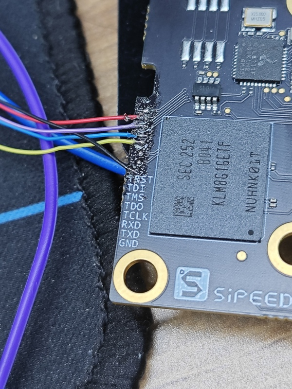

## SoC-related
 
### CPU frequency

`sudo cat /sys/devices/system/cpu/cpu*/cpufreq/cpuinfo_cur_freq `
The unit is KHz.   
Note that the system comes with a temperature control policy that will downclock the system when it is too idle or too hot. Please maintain good heat dissipation to keep the CPU below 60 degrees for optimal performance.   

### Chip temperature

`cat /sys/class/thermal/thermal_zone0/temp`   

Unit is 0.001 degrees Celsius.  

### CPU overclocking

The TH1520 runs at 1.85GHz by default, but preliminary tests show that about 80% of the chips can run at 2GHz, and about 50% of the chips can pass the stress test at 2GHz.   
Here is a simple overclocking procedure for reference only, no guarantee for stability and safety.  

Check the files under `/boot`:

```bash
fw_dynamic.bin #opensbi
Image #kernel image
kernel-release #commit id of kernel
light_aon_fpga.bin #fw for E902 aon
light_c906_audio.bin #fw for C906 audio
light-lpi4a.dtb #1.85GHz dtb
light-lpi4a_2Ghz.dtb #2GHz overclock dtb
light-lpi4a-ddr2G.dtb #history dtb
```

Copy `light-lpi4a_2Ghz.dtb` and overwrite it with `light-lpi4a.dtb`, reboot, and then you can change the maximum frequency after booting.   
Note that there is a chance that it will not boot after this modification, and then you need to re-burn the firmware to recover.

If it boots successfully, then you can check the following values to confirm that it has been successfully overclocked:     
`sudo cat /sys/devices/system/cpu/cpu0/cpufreq/cpuinfo_max_freq`

## PWM

Take PWM1 which is connected to the cooling fan as an example, you can enable the fan with the following code:

``bash
echo 1 > /sys/class/pwm/pwmchip0/export
echo 1000000 > /sys/class/pwm/pwmchip0/pwm1/period
echo 1000000 > /sys/class/pwm/pwmchip0/pwm1/duty_cycle
echo 1 > /sys/class/pwm/pwmchip0/pwm1/enable
```

## GPIOs

The LicheePi 4A has 2x10pin pins on board with 16 native IOs, including 6 normal IOs, 3 pairs of serial ports, and one SPI.
> Note: All native IOs of the SOC are at 1.8V level, please pay attention to the level shift. 
> The serial input side on the pins has been processed with 1/2 voltage divider and can be connected to a 3.3V serial port. 

The TH1520 SOC has 4 GPIO banks, each with a maximum of 32 IOs:

|Bank      |Address      | kernel io num|
|---       |---          |---           |
|GPIO0     |0xffec005000 | 456-487 |
|GPIO1     |0xffec006000 | 424-455 |
|GPIO2     |0xffe7f34000 | 392-423 |
|GPIO3     |0xffe7f38000 | 360-391 |
|AO_GPIO   |0xfffff41000 | 328-359 |
|AO_GPIO4  |0xfffff52000 | 296-327 |
|AUDIO_GPIO|0xffcb013000 | - |

Where the 4Byte (32bit) at offset 0x0 is the GPIO data register and the 4Byte (32bit) at offset 0x4 is the GPIO direction register.


The GPIO correspondences of the pins on the LicheePi 4A are: 
  

> Subject to the labeling of the document, the silkscreen labeling of the internal test version may be incorrect 

GPIO operation:  
> Note that pinmux may need to be set in advance.

```bash
num=xxx
echo ${num} > /sys/class/gpio/export  
echo out > /sys/class/gpio/gpio${num}/direction 
echo 1 > /sys/class/gpio/gpio${num}/value  
echo 0 > /sys/class/gpio/gpio${num}/value
```

The mapping of GPIO is shown in the following figure：

[gpio_num](./../../../../zh/lichee/th1520/lpi4a/assets/peripheral/gpio_num.png)

For example, if you want to operate the 4 GPIOs on the pin, the correspondence is as follows, change the num in the above code to the number corresponding to the GPIO pin you want to operate. 

|num|IO Number|
|---|---|
|427|IO 1_3|
|428|IO 1_4|
|429|IO 1_5|
|430|IO 1_6|

It is also possible to manipulate registers directly:

> devmem can be downloaded and compiled from here: https://github.com/VCTLabs/devmem2/blob/master/devmem2.c

```bash
./devmem 0xffe7f38000 w
```

In-system GPIO information view:

```bash
sipeed@lpi4a:~$ sudo cat /sys/kernel/debug/gpio
```

Here are the sample results:


<!--
```bash
sipeed@lpi4a:~$ sudo cat /sys/kernel/debug/gpio
gpiochip8: GPIOs 296-327, parent: platform/fffff52000.gpio, fffff52000.gpio:    AO_GPIO4

gpiochip7: GPIOs 328-359, parent: platform/fffff41000.gpio, fffff41000.gpio:    AO_GPIO
 gpio-332 (                    |hubswitch           ) out hi 

gpiochip6: GPIOs 360-391, parent: platform/ffe7f38000.gpio, ffe7f38000.gpio:    GPIO3

gpiochip5: GPIOs 392-423, parent: platform/ffe7f34000.gpio, ffe7f34000.gpio:    GPIO2
 gpio-395 (                    |cs                  ) out hi ACTIVE LOW
 gpio-406 (                    |aon:soc_vdd5v_se_en ) out lo 
 gpio-407 (                    |spi0 CS0            ) out hi ACTIVE LOW
 gpio-417 (                    |Volume Up Key       ) in  lo IRQ ACTIVE LOW
 gpio-421 (                    |aon:soc_wcn33_en    ) out lo 

gpiochip4: GPIOs 424-455, parent: platform/ffec006000.gpio, ffec006000.gpio:    GPIO1
 gpio-443 (                    |Volume Down Key     ) in  hi IRQ ACTIVE LOW
 gpio-446 (                    |aon:soc_vbus_en     ) out hi 

gpiochip3: GPIOs 456-487, parent: platform/ffec005000.gpio, ffec005000.gpio:    GPIO0
 gpio-457 (                    |spi2 CS0            ) out hi ACTIVE LOW
 gpio-486 (                    |aon:soc_vdd_3v3_en  ) out hi 

gpiochip2: GPIOs 488-495, parent: i2c/3-0018, 3-0018, can sleep:    IO expend 3
 gpio-490 (                    |regulator-hub-vdd12-) out hi 
 gpio-491 (                    |regulator-hub-vcc5v-) out hi 
 gpio-492 (                    |regulator-pwr-en    ) out hi 
 gpio-493 (                    |aon:soc_lcd0_vdd33_e) out hi 
 gpio-494 (                    |aon:soc_lcd0_vdd18_e) out hi 
 gpio-495 (                    |reset               ) out hi ACTIVE LOW

gpiochip1: GPIOs 496-503, parent: i2c/1-0018, 1-0018, can sleep:    IO expend 2
 gpio-496 (                    |aon:soc_cam2_dvdd12_) out lo 
 gpio-501 (                    |wlan_default_wlan_po) out hi 
 gpio-502 (                    |bt_default_poweron  ) out lo 

gpiochip0: GPIOs 504-511, parent: i2c/0-0018, 0-0018, can sleep:    IO expend 1
 gpio-504 (                    |aon:soc_dvdd12_rgb  ) out lo 
 gpio-505 (                    |aon:soc_avdd28_rgb  ) out lo 
 gpio-506 (                    |aon:soc_dovdd18_rgb ) out lo 
 gpio-507 (                    |aon:soc_dovdd18_ir  ) out lo 
 gpio-508 (                    |aon:soc_dvdd12_ir   ) out lo 
 gpio-509 (                    |aon:soc_avdd25_ir   ) out lo 
 gpio-510 (                    |aon:soc_cam2_dovdd18) out lo 
 gpio-511 (                    |aon:soc_cam2_avdd25_) out lo
```  

### Use of gpiod library

The GPiod library is a library that can call GPIO in the same user space, making it convenient for users to operate GPIO in applications.
Firstly, install and deploy the GPIO library:

```shell
sudo apt install wget
wget https://git.kernel.org/pub/scm/libs/libgpiod/libgpiod.git/snapshot/libgpiod-2.0.tar.gz

tar zxvf libgpiod-2.0.tar.gz

cd libgpiod-2.0
sudo apt-get install build-essential pkg-config m4 automake autoconf libtool autoconf-archive
sudo apt install gcc g++

export CC=gcc
export CXX=g++

#Deploy the relevant files of the library to the project folder: -- The path after prefix should be changed to the path where the project is located for future operations
./autogen.sh --enable-tools=yes --prefix=/home/sipeed/mylib_local
make
sudo make install
```

如果执行：./autogen.sh --enable-tools=yes --prefix=/home/sipeed/mylib_local 出现以下错误：

```shell
aclocal: warning: couldn't open directory 'm4': No such file or directory
#You can execute the following commands
mkdir m4
./autogen.sh --enable-tools=yes --prefix=/home/sipeed/mylib_local
make 
make install
```

Start operating GPIO:

```shell
sudo vim gpio.c

#The content of gpio. c is as follows:

#include<stdio.h>
#include<unistd.h>
#include<gpiod.h>

#define PIN_IO1_3   3
#define PIN_IO1_4   4
#define PIN_IO1_5   5

int main() {
  struct gpiod_chip *gchip;
  struct gpiod_line_info *glinein, *glineout;
  struct gpiod_line_settings *gline_settings_in, *gline_settings_out;
  struct gpiod_line_config   *gline_config_in, *gline_config_out;
  struct gpiod_request_config *gline_request_config_in, *gline_request_config_out;
  struct gpiod_line_request   *gline_request_in, *gline_request_out;
  int offset_in[1] = {PIN_IO1_5};
  int offset_out[2] = {PIN_IO1_3, PIN_IO1_4};
  int value;

  if ((gchip=gpiod_chip_open("/dev/gpiochip4")) == NULL) {
    perror("gpiod_chip_open");
    return 1;
  }

  
  gline_settings_in = gpiod_line_settings_new();
  if ((value=gpiod_line_settings_set_direction(gline_settings_in, GPIOD_LINE_DIRECTION_INPUT)) != 0)  {
    perror("gpiod_line_settings_set_direction");
  }

  gline_config_in = gpiod_line_config_new();
  value=gpiod_line_config_add_line_settings(gline_config_in, offset_in, 1, gline_settings_in);
  gline_request_config_in = gpiod_request_config_new();
  gline_request_in = gpiod_chip_request_lines(gchip, gline_request_config_in, gline_config_in);


  value=gpiod_line_request_get_value(gline_request_in, PIN_IO1_5);
  printf("IO1-5 = %d\n", value);


  gline_settings_out = gpiod_line_settings_new();
  if (gpiod_line_settings_set_direction(gline_settings_out, GPIOD_LINE_DIRECTION_OUTPUT) != 0) {
    perror("gpiod_line_settings_set_direction");
  }
  gline_config_out = gpiod_line_config_new();

  gpiod_line_config_add_line_settings(gline_config_out, offset_out, 2, gline_settings_out);
  gline_request_config_out = gpiod_request_config_new();
  gline_request_out = gpiod_chip_request_lines(gchip, gline_request_config_out, gline_config_out);


  value=gpiod_line_request_set_value(gline_request_out, PIN_IO1_3, 1);

  value=gpiod_line_request_set_value(gline_request_out, PIN_IO1_4, 0);

  printf("IO1-3 = 1, IO1-4 = 0\n");
  sleep(1);


  for (int i = 0; i < 10; i++) {


      value=gpiod_line_request_get_value(gline_request_in, PIN_IO1_5);
      printf("IO1-5 = %d\n", value);

      
      value=gpiod_line_request_set_value(gline_request_out, PIN_IO1_3, 0);
      value=gpiod_line_request_set_value(gline_request_out, PIN_IO1_4, 1);
   
      printf("IO1-3 = 0, IO1-4 = 1\n");
      sleep(1);


      value=gpiod_line_request_get_value(gline_request_in, PIN_IO1_5);
      printf("IO1-5 = %d\n", value);


      value=gpiod_line_request_set_value(gline_request_out, PIN_IO1_3, 1);
      value=gpiod_line_request_set_value(gline_request_out, PIN_IO1_4, 0);

      printf("IO1-3 = 1, IO1-4 = 0\n");
      sleep(1);

  }

  gpiod_chip_close(gchip);
  return 0;
}

```

Save and compile

```shell
gcc  -I/home/sipeed/mylib_local/include -L/home/sipeed/mylib_local/lib -o gpio gpio.c -lgpiod

```
Some device permissions need to be granted before execution

```shell
export LD_LIBRARY_PATH=/home/sipeed/mylib_local/lib:$LD_LIBRARY_PATH
export PATH=/home/sipeed/mylib_local/bin:$PATH
sudo chmod o+rw /dev/gpiochip4
sudo chmod o+rw /dev/spidev2.0

#It can be directly executed in an. sh file

```

Run program:

```shell

./gpio

```


The console output is as follows:

```shell

sipeed@lpi4a:~/gpio$ ./gpio 
IO1-5 = 1
IO1-3 = 1, IO1-4 = 0
IO1-5 = 1
IO1-3 = 0, IO1-4 = 1
IO1-5 = 1
IO1-3 = 1, IO1-4 = 0
IO1-5 = 1
IO1-3 = 0, IO1-4 = 1
IO1-5 = 1
IO1-3 = 1, IO1-4 = 0
IO1-5 = 1
IO1-3 = 0, IO1-4 = 1
IO1-5 = 1
IO1-3 = 1, IO1-4 = 0
IO1-5 = 1
IO1-3 = 0, IO1-4 = 1
IO1-5 = 1
IO1-3 = 1, IO1-4 = 0
IO1-5 = 1
IO1-3 = 0, IO1-4 = 1

``` -->


## UART 

### System Serial Port

The system serial port of the LicheePi 4A is UART0, which is shown on the side pins.  
You can use a USB to serial module to connect to this serial port, i.e. `U0-RX` and `U0-TX`, taking care of the cross-connections and the GND connection.

  

After the connection is completed, you can use serial tools to communicate, we recommend `XShell` and `mobaterm` for Windows and `minicom` for Linux.   
Set the serial port baud rate to `115200`, then you can log in the serial terminal and do the command operation:  
> Note: Just after connecting, you can hit several carriage returns to see if there is any response, if there is no response, then check the wiring or serial port configuration.

  

### General serial port

The LicheePi 4A also has UART1/2/3 on the side pins, which can also be operated.  
Only UART1 is enabled in the default image, other ports may need to reconfigure the device tree for operation.

> Note: The SOC serial port level is 1.8V, which is just around the high level threshold of 3.3V, some serial modules may not be able to input/output correctly, we suggest to use our matching serial modules, or fine-tune the 3.3V voltage of other serial modules to 2.8V. 

#### View Serial Devices

```bash
ls /dev/ttyS*
```

#### View serial port baud rate and other information

```bash
stty -F /dev/ttyS1 -a 
```

#### Set serial port baud rate, data mode

```bash
stty -F /dev/ttyS1 ispeed 115200 ospeed 115200 cs8
```

#### Viewing serial port data

```bash
cat /dev/ttyS1
```

#### Send serial port data

```bash
echo "12345" > /dev/ttyS1
```

#### Other methods

You can also use ``minicom``, or pyserial library for serial port operation, please find the relevant information for users to use.  

## I2C

There are several I2C devices (I2C0/1/2/3) on the LicheePi 4A, where 0/1/3 is used to connect to the I2C IO expansion chip, and I2C2 is reserved on the external pin.  

Here we use i2c-tools for i2c authentication, which are pre-installed in the image.

```bash
sipeed@lpi4a:/usr$ ls /sbin/i2c*
/sbin/i2c-stub-from-dump /sbin/i2cdetect /sbin/i2cdump /sbin/i2cget /sbin/i2cset /sbin/i2ctransfer
```

List all I2C buses:
```bash
sipeed@lpi4a:~$ /sbin/i2cdetect -l
i2c-0   unknown         Synopsys DesignWare I2C adapter         N/A
i2c-1   unknown         Synopsys DesignWare I2C adapter         N/A
i2c-2   unknown         Synopsys DesignWare I2C adapter         N/A
i2c-3   unknown         Synopsys DesignWare I2C adapter         N/A
i2c-4   unknown         Synopsys DesignWare I2C adapter         N/A
i2c-5   unknown         Synopsys DesignWare I2C adapter         N/A
i2c-6   unknown         Synopsys DesignWare I2C adapter         N/A
i2c-7   unknown         DesignWare HDMI                         N/A
```

Detecting the device on the I2C bus, we can see that the I2C address of PCA9557PW is 0x18, which is consistent with the schematic:

```bash
sipeed@lpi4a:~$ sudo /sbin/i2cdetect -r -y 0
     0  1  2  3  4  5  6  7  8  9  a  b  c  d  e  f
00:                         -- -- -- -- -- -- -- -- 
10: -- -- -- -- -- -- -- -- UU -- -- -- -- -- -- -- 
20: -- -- -- -- -- -- -- -- -- -- -- -- -- -- -- -- 
30: -- -- -- -- -- -- -- -- -- -- -- -- -- -- -- -- 
40: -- -- -- -- -- -- -- -- -- -- -- -- -- -- -- -- 
50: -- -- -- -- -- -- -- -- -- -- -- -- -- -- -- -- 
60: -- -- -- -- -- -- -- -- -- -- -- -- -- -- -- -- 
70: -- -- -- -- -- -- -- --  
``` 

  

It is also possible to use `i2cdump` to dump all registers at the specified i2c address, `i2cget` to read the specified register value at the specified i2c address, and `i2cset` to write the specified register value at the specified i2c address.   
However, since the IO extension chip is already used by the kernel, it is not possible to verify these commands directly. Users can verify it by connecting peripheral devices to I2C2 by themselves.

## SPI   

There are two SPIs reserved on the LicheePi4A, one on the SPI Flash pads that are blanked out on the back, and one on the pins.

```bash
sipeed@lpi4a:~$ ls /dev/spidev2.0 
/dev/spidev2.0
```

<!-- ### Start

Pay attention to the IO drive capability. Licheepi4A requires an external level conversion chip and uses TXS10108E for its own use

All programs of this routine are compiled on the board. If cross coding is necessary, the tool chain can be replaced during compilation.

The GPIO operation of the following routine is based on the GPIOD library above.

#### 1.Download the source code

```shell
git clone https://github.com/fffdee/ST7735_for_Licheepi4A.git
```
#### 2.Building the GPIOD library

Dependencies required for installation:

```shell
sudo apt-get install build-essential pkg-config m4 automake autoconf libtool autoconf-archive
sudo apt install gcc g++ gpiod cmake
```

Install the GPIOD library (the source file is already installed, and the library path needs to be changed. Please refer to the following steps):

```shell
tar zxvf libgpiod-2.0.tar.gz
cd libgpiod-2.0

export CC=gcc
export CXX=g++


#Deploy the relevant files of the library to the project folder: -- The path after prefix should be changed to the path where the project is located for future operations
./autogen.sh --enable-tools=yes --prefix=/home/sipeed/TFT_demo/
make
sudo make install
#Installation completed
```

#### 3.Compile and Run

```shell

cd TFT_demo
cmake .
make -j4

#授予设备权限，每次开机执行一次即可
. exec.sh
./tft_demo
``` -->

Common ioctl commands for SPI:

- SPI_IOC_MESSAGE: sends and receives SPI messages. It can be used to read and write data and control devices
- SPI_IOC_WR_MODE: Set the working mode of the SPI device, such as CPOL and CPHA
- SPI_IOC_RD_MODE: Reads the working mode of the SPI device
- SPI_IOC_WR_LSB_FIRST: Sets the byte order of the SPI device, that is, whether the highest bit is transmitted first or the lowest bit is transmitted first
- SPI_IOC_RD_LSB_FIRST: reads the byte order of the SPI device
- SPI_IOC_WR_BITS_PER_WORD: sets the data bit width of the SPI device
- SPI_IOC_RD_BITS_PER_WORD: Used to read the bit width of the SPI device
- SPI_IOC_WR_MAX_SPEED_HZ: specifies the maximum clock frequency of an SPI device
- SPI_IOC_RD_MAX_SPEED_HZ: Reads the maximum clock frequency of an SPI device
- SPI_IOC_WR_MODE32: Sets the 32-bit mode of the SPI device, such as CPOL and CPHA
- SPI_IOC_RD_MODE32: indicates the 32-bit mode used to read the SPI device

The above are some common SPI device ioctl commands, which can be used to configure and control various parameters of the SPI device.

Turn on/off SPI device:
```c
int open(const char *pathname, int flags);
int close(int fd);
```
Header files needed:
```c
#include<fcntl.h>
#include<unistd.h>
```

Example code:
```c
#include <stdint.h>
#include <unistd.h> // C 语言标准头文件，定义了 POSIX API 的一部分，如文件操作、进程管理等
#include <stdio.h>
#include <stdlib.h>
#include <string.h>
#include <getopt.h>
#include <fcntl.h>  // C 语言头文件，定义了文件控制相关的宏和函数
#include <sys/ioctl.h>  // C 语言头文件，定义了 ioctl 函数和相关宏
#include <linux/types.h>  // Linux 内核头文件，定义了内核中使用的一些基本数据类型
#include <linux/spi/spidev.h> // Linux SPI 子系统头文件，定义了 SPI 设备驱动程序使用的数据结构和 ioctl 命令

#define DATA_NUM 2  // 自定义数据长度
#define CHECK(ret, str) if (ret < 0) {printf("%s\r\n", str); return ret;}
static uint8_t bits = 8;
static uint32_t speed = 1000000; // 1M Hz
static int mode = 0;

int main(int argc, char *argv[]) {
    int ret, fd;
    fd = open("/dev/spidev2.0", O_RDWR);
    CHECK(fd, "can't open device"); // 打开具体 spi 设备
    mode = SPI_MODE_0 | SPI_CS_HIGH;
    ret = ioctl(fd, SPI_IOC_WR_MODE32, &mode); //设置 SPI 模式
    CHECK(ret, "can't set spi mode");
    ret = ioctl(fd, SPI_IOC_RD_MODE32, &mode); //获取 SPI 模式设置
    CHECK(ret, "can't get spi mode");

    ret = ioctl(fd, SPI_IOC_WR_BITS_PER_WORD, &bits); //设置 SPI 的 bit/word
    CHECK(ret, "can't set bits per word");
    ret = ioctl(fd, SPI_IOC_RD_BITS_PER_WORD, &bits); //获取 SPI 的 bit/word 设置
    CHECK(ret, "can't get bits per word");

    ret = ioctl(fd, SPI_IOC_WR_MAX_SPEED_HZ, &speed); //设置 SPI 的最大传输速度
    CHECK(ret, "can't set max speed hz");

    ret = ioctl(fd, SPI_IOC_RD_MAX_SPEED_HZ, &speed); //获取 SPI 的最大传输速度设置
    CHECK(ret, "can't get max speed hz");

    printf("spi mode: %d\n", mode);
    printf("bits per word: %d\n", bits);
    printf("max speed: %d Hz (%d KHz)\n", speed, speed/1000);
    //数据传输
    uint8_t tx[] = {0x11, 0x22};
    uint8_t rx[DATA_NUM] = {0};

    struct spi_ioc_transfer tr = {
        .tx_buf = (unsigned long)tx,  //定义发送缓冲区指针
        .rx_buf = (unsigned long)rx,  //定义接收缓冲区指针
        .len = DATA_NUM,
        .delay_usecs = 0,
        .speed_hz = speed,
        .bits_per_word = bits
    };

    ret = ioctl(fd, SPI_IOC_MESSAGE(1), &tr); //执行 spidev.c 中 ioctl 的 default 进行数据传输
    CHECK(ret, "can't send spi message");

    printf("tx: %.2X %.2X\r\n", tx[0], tx[1]);
    printf("rx: %.2X %.2X\r\n", rx[0], rx[1]);

    close(fd);

    return ret;
}
```

#### Renderings


## USB 

Connect the USB SSD: 

  

The corresponding device can be seen in the system:  

  

### USB network card

Connect the USB network card:
  
右上角的网络图标会变为已连接有线网的状态：  
   
终端中使用`sudo ifconfig`命令，也可以看到相应设备的信息：  
  

### USB Camera

Connect the USB camera:

  

After installing guvcview, use the appropriate commands to see the image stream from the USB camera:
```shell
sudo apt-get install guvcview
guvcview
```
  

You can end the image stream by pressing Ctrl+C or by clicking the quit button on the guvcview window.

You can also use fswebcam to dump the USB camera image directly from the command line.
```shell
sudo apt-get install fswebcam
fswebcam /dev/video0 image.jpg
```

To allow the USB camera to automatically save images, a reference script is given below. The script uses the uvccapture tool, which makes it easy to adjust capture parameters as needed.

Install this tool first
```shell
sudo apt install uvccapture
```

This tool supports various parameters, use `-x -y` to adjust the shooting resolution, `-B` to adjust the brightness, `-C` to adjust the contrast, `-S` to adjust the saturation, and `-o` to specify the shooting image storage Path, for specific use, refer to the following script code:
```shell
#!/bin/bash

# Check if the interval time parameter is passed in
if [ -z "$1" ]; then
   echo -e "The interval time parameter is not specified, and the default interval is 1 second"
   interval=1
else
   interval=$1
the fi

# Check if the output file path parameter is passed in
if [ -z "$2" ]; then
   echo -e "The output file path parameter is not specified, the default output is to the current directory"
   output_file="$PWD"
else
   output_file=$2
the fi

# Check whether the number of shots parameter is passed in
if [ -z "$3" ]; then
   echo -e "The number of shots is not specified, the default is 10 shots"
   num_executions=10
else
   num_executions=$3
the fi

echo -e "script started, press q to stop"

for ((i = 1; i <= num_executions; i++)); do
     echo -e "capture img $i"
     uvccapture -x640 -y480 -m -o$output_file/$image$i.jpg
# Take pictures at specified time intervals
sleep $interval
# Press the q key to exit
read -t 1 -n 1 key
if [[ $key = "q" ]]; then
break
the fi
done

echo -e "Script execution ended"
```
The above script can also be operated with fswebcam, just make corresponding changes.

### USB Sound Card

TODO

## ETH

The LicheePi4A has dual Gigabit Ethernet ports, of which Eth0 is also PoE capable. 

TODO

### PoE

The Ethernet 0 interface of LicheePi 4A has PoE function and can be powered by PoE.

The PoE power supply module needs to be purchased on its own, and can be found by searching for the keyword "5V PoE pin" in the 5V voltage, 35.6mm length specification.

When the visual direction is facing the "POE POWER" logo, the four pins on the left side of the pin are defined from left to right as: VA1, VA2, VB1, VB2, and on the right side as: GND, 5VIN.


## Audio

There are two analog silicon mics on the LicheePi 4A, using the ES7210 CODEC, as well as having on-board speakers all the way, and stereo headphones, using the ES8156 CODEC.

> Note: The on-board speakers and stereo headphones use a mutually exclusive design; when headphones are plugged in, the audio output automatically switches to the headphones and the on-board speakers are deactivated.

Simple recording and playback tests can be performed using aplay and arecord, note that the onboard speakers are right channel.

```bash
#!/bin/bash

echo "Play Test Audio" 
aplay /usr/share/sounds/alsa/Side_Right.wav

# Record Audio
echo "Start record auido, auto replay after 3 seconds"
arecord -Dhw:0,1 -d 3 -r 48000 -f S16_LE -t wav test.wav & > /dev/null &
sleep 4

# Play Audio
aplay test.wav
echo "Start Play"
```

You can also use alsa-related tools, such as `alsamixer`, to do things like volume adjustments.

## HDMI Audio

> Note: HDMI audio does not work for earlier mirrors, please upgrade to a newer version to enable HDMI audio function.

Tap the speaker icon at the top right corner of the screen to enter Audio mixer, you can see the interface below:  

  

The name of the device is **Built-in Audio**, i.e. HDMI audio, and you can switch between audio devices by clicking on its corresponding green checkmark icon in this interface, or you can switch between devices by clicking on the small speaker icon directly.
If you confirm that the connection is correct and the HDMI monitor you are using supports HDMI audio, but you do not see the corresponding device in the device list, you can try to run the following command:

```shell
systemctl --user restart pulseaudio.service
```
## MIPI CSI

LicheePi 4A has three camera interfaces, CAM0/CAM1/CAM2, CAM0 is up to 4 lanes, CAM1/2 is 2 lanes, and the default is to use the CSI0 interface to connect to the OV5693 camera.

Connections are made as shown below, using the CSI0 connector with the camera's gold finger facing down:


Currently, we need to burn a dedicated mirror for testing for the time being, download /image/latest_20230714/LPI4A_YOCTO_CAM.zip from [Baidu.com](https://pan.baidu.com/e/1xH56ZlewB6UOMlke5BrKWQ) in the Documentation Mirror Collection page. image file.
After burning, go to the /usr/share/csi_hal/ directory and run the following command:

```shell
./cam_demo_simple 2 0 1 0 640 480 1 30
```

After the completion of the run, you can see in the current directory dump down to the shooting photos, typically named demo_save_img_OV5693_ch0_0_*, resolution of 640\*480 (currently only supports 640 * 480 resolution), the format is YUV420SP (NV12), the format of the UV component of the interleaving of the storage, bit depth The format is YUV420SP(NV12), under this format, the UV components are interleaved, and the bit depth is 8bit.
Under Linux, you can use YUView to set the relevant parameters to view the image; in addition, you can also use python to process the relevant parameters to view the image, the reference code is as follows:

```python
import numpy as np
import cv2

class nv12_to_jpg:
def __init__(self):
return

def to_jpg(self, yuv_path, resolution):
width, height = resolution
with open(yuv_path, 'rb') as f:
yuvdata = np.fromfile(f, dtype=np.uint8)
self.input_file=yuv_path
cv_format = cv2.COLOR_YUV2RGB_NV21
bgr_img = cv2.cvtColor(yuvdata.reshape((height*3//2, width)), cv_format)
return bgr_img

def save(self, img_data, output_path):
cv2.imwrite(output_path, img_data)

if __name__ == "__main__":
# Example: Convert an image in 10bit raw format to jpg format
file_name = input("Please enter the filename of the raw image:")
input_str = input("width and hight, separated by spaces:")
width, height = map(int, input_str.split())

img = nv12_to_jpg()
jpg_data = img.to_jpg(file_name, (width, height))
img.save(jpg_data, file_name+'nv12tojpg.jpg')
```

## MIPI DSI

LicheePi 4A has MIPI DSI0 interface, supports 4K video output, and can be equipped with 10.1 inch 1280x800 or 1920x1200 screen.  

Connection method is shown below, both fpc cables are downward connected (the side of the metal contact at the end of the cable is facing downward), in which the adapter plate of the touch screen needs to pay attention to the direction when connecting, make sure that the end of ToLPi4A is connected to the touch soft cable of LPi4A, and the end of ToLcdTP is connected to the screen:

FPC Schematic:
  

Note that before connecting, first dial up the black flap on the interface used to fix the wires, and then dial down after confirming the connection.
Touch panel FPC connection: 
   

   

MIPI screen FPC connection: 
  

After confirming the connection is correct, use the firmware that supports MIPI screen, and power on the device to see the MIPI screen display.

If you only use the MIPI screen, you can turn off the HDMI display and set the MIPI screen as the main screen in the system settings, or you can use the following command:  

```shell
xrandr --output HDMI-1 --off
xrandr --output DSI-1 --rotate normal --primary
```
In the above command, the `rotate` parameter is the rotation direction of the screen, `normal` means no rotation, i.e. vertical display, if you want to continue to display horizontal screen, you can change it to `left` or `right`. 

If you use both MIPI screen and HDMI screen, you can also set the relationship between the main screen and the two screens according to the above commands. For example, the following command sets the HDMI screen as the main screen, and sets the MIPI screen as the extended screen below the main screen, and displays the screen in landscape:

```shell
xrandr --output HDMI-1 --auto --primary
xrandr --output DSI-1 --rotate left ---below HDMI-1
```
The above screen identifiers and available resolutions can be viewed directly by entering the `xrandr` command.  

If you find that the coordinates of the touch screen are not correct after modifying the settings, you can follow the steps below to correct them:  

Check the corresponding ID of the touch screen device 

```shell
xinput
```
  
Here you can see that it is a touch screen device Goodix 7, then enter the following command to map the touch device to the correct screen:  
```shell
xinput map-to-output 7 DSI-1
```
Similarly, depending on the ID, the following command can be used to turn off the appropriate touch device:  
```shell
xinput disable 7
```

If you are using only the HDMI screen, first power down and unplug both the MIPI screen and the touchpad's flexible cable before powering up. Then run the following commands (you need to switch to root user to execute, direct sudo may encounter the problem of insufficient privileges): 

```shell
echo off > /sys/class/drm/card0-DSI-1/status
```

## JTAG

The JTAG interface is reserved on the core board, but you need to lead out the GND, TDI, TDO, TMS, TCK flying wires yourself. The schematic diagram of the wires that need to be led out is as follows:



Before connecting the debugger, make sure the debugger is in CKLink mode. Next, take [SLogic Combo 8](https://en.wiki.sipeed.com/hardware/zh/logic_analyzer/combo8/index.html) and RV-Debugger Plus as examples.
For SLogic Combo 8, please refer to the [corresponding document](https://en.wiki.sipeed.com/hardware/en/logic_analyzer/combo8/use_cklink_function.html) to switch to CKLink mode.
For RV-Debugger Plus, please refer to [this repository](https://github.com/bouffalolab/bouffalo_sdk/tree/master/tools/cklink_firmware) to flash the CKLink dedicated firmware.

After completing the above steps, connect to the debugger using dupont wires through the pin headers.


After connecting to the JTAG debugger, use the memtool in the serial port to set up pinmux(This step runs on the LPI4A board, the memtool is also installed on the LPI4A board):
```shell
sudo apt install memtool
sudo memtool mw 0xfffff4a404 0
```

This pinmux setting will not work after shutdown. Because the JTAG pin is used as the USB route selection function, it is enough to set pinmux every time you debug.

Next, download and install the debug server from [Pingtouge official website](https://xuantie.t-head.cn/community/download?id=4209675990638596096).
After the download is complete, refer to [Pingtouge Official Document](https://occ-oss-prod.oss-cn-hangzhou.aliyuncs.com/resource//1682234034575/T-Head+Debugger+Server+User+Guide+%28ZH-CN%29.pdf) installation.

After confirming that the device is connected and pinmux is set correctly, take Linux as an example, use the command `DebugServerConsole` to open DebugServerConsole:


You can see a successful connection:


## GPU

Use the following command to view the status of the GPU in real time:
```shell
sudo watch cat /sys/kernel/debug/pvr/status
```

Under the xfce desktop, the status of the GPU is as follows:


When playing video with Chromium browser, the state of GPU is as follows:


## NPU

> **Note**: To use the NPU driver, you need to upgrade to the [20230920](https://mega.nz/folder/phoQlBTZ#cZeQ3qZ__pDvP94PT3_bGA) or newer version image, this image will automatically load NPU related drivers on boot.

LicheePi4A contains a 1GHz NPU supporting 4TOPS@INT8 general purpose NNA computing power. The Wiki contains examples of NPU support as follows:
 
|Example Name|Example Functionality|Usage Model|Interface|HHB Version| 
|---|---|---|---|---|
|Mobilenetv2 do image classification|image classification|mobilenetv2|c/c++|2.4 and above|
|YOLOv5 do object detection|object detection|YOLOv5|python|2.4 and above|
|RTMPose do pose estimation|pose estimation|RTMPose|python|2.6 and above|

In order to cross-compile the models in the above examples into executables on LicheePi4A, we first need to set up the HHB development environment on our own computer.
> Recommended environment: Ubuntu 20.04 system, Docker version 20.10.21.It is recommended to use the Docker image to set up the environment.

### Installation

**LPi4A setup**

#### SHL Library Installation

To install the SHL library, you can use pip:

```shell
pip3 install shl-python
```

After the installation, you can use the `--whereis` option to check the installation location. For example:

```shell
python3 -m shl --whereis th1520
# Replace with 
# python3 -m shl --whereis c920
# if using CPU inference only
```

Based on the printed location, copy the dynamic library files from that directory to the `/usr/lib` directory. For example, if the printed location is:

```shell
/home/sipeed/ort/lib/python3.11/site-packages/shl/install_nn2/th1520
```

You can use the following copy command:

```shell
sudo cp /home/sipeed/ort/lib/python3.11/site-packages/shl/install_nn2/th1520/lib/* /usr/lib/
```

#### Python Virtual Environment

Before installing the Python package, you need to set up a Python virtual environment. Use the following commands to install the `venv` package for creating a Python virtual environment (here, creating a Python virtual environment in the root directory):

```shell
sudo -i
apt install python3.11-venv
cd /root
python3 -m venv ort
source /root/ort/bin/activate
```

#### HHB-onnxruntime Installation

HHB-onnxruntime is a ported backend (execution providers) for SHL, enabling onnxruntime to reuse the high-performance optimization code for XuanTie CPUs.

For CPU version:
```shell
wget https://github.com/zhangwm-pt/onnxruntime/releases/download/riscv_whl_v2.6.0/hhb_onnxruntime_c920-2.6.0-cp311-cp311-linux_riscv64.whl
pip install hhb_onnxruntime_c920-2.6.0-cp311-cp311-linux_riscv64.whl
```

For NPU version:
```shell
wget https://github.com/zhangwm-pt/onnxruntime/releases/download/riscv_whl_v2.6.0/hhb_onnxruntime_th1520-2.6.0-cp311-cp311-linux_riscv64.whl
pip install hhb_onnxruntime_th1520-2.6.0-cp311-cp311-linux_riscv64.whl
```

**x86 Hosts setup**

First, we need to install Docker on our own computer. Uninstall any existing Docker version: 
```shell
sudo apt-get remove docker docker-engine docker.io containerd runc
```

Install the basic software Docker depends on: 
```shell
sudo apt-get update
sudo apt-get install apt-transport-https ca-certificates curl gnupg-agent software-properties-common
Add the official source: ```shell
curl -fsSL https://download.docker.com/linux/ubuntu/gpg | sudo apt-key add -
sudo add-apt-repository "deb [arch=amd64] https://download.docker.com/linux/ubuntu $(lsb_release -cs) stable"
```

Install Docker:
```shell
sudo apt-get update
sudo apt-get install docker-ce docker-ce-cli containerd.io
```
After installation, get the Docker image of the HHB environment:
```shell
docker pull hhb4tools/hhb:2.4.5
```

Once the image is pulled, enter the Docker image using the following command:
```shell
docker run -itd --name=your.hhb2.4 -p 22 "hhb4tools/hhb:2.4.5"
docker exec -it your.hhb2.4 /bin/bash
```

Once you are inside the Docker image, you can use the following command to verify the HHB version: 
```shell
hhb --version
```

Once you are in the Docker image, you need to configure the cross-compile environment. Note that you must use the toolchain here, otherwise the compiled binaries will not run on LicheePi4A. 
```shell
export PATH=/tools/Xuantie-900-gcc-linux-5.10.4-glibc-x86_64-V2.6.1-light.1/bin/:$PATH
```

clone NPU example code：
```shell
git clone https://github.com/zhangwm-pt/lpi4a-example.git
```

At this point, the HHB environment is preliminarily built. You can try the following NPU examples:
[Mobilenetv2 for image classification](https://wiki.sipeed.com/hardware/eh/lichee/th1520/lpi4a/8_application.html#MobilenertV2)
[YOLOv5 for object detection](https://wiki.sipeed.com/hardware/eh/lichee/th1520/lpi4a/8_application.html#Yolov5n)

For further infomation please check [hhb-tools doc](https://www.yuque.com/za4k4z).

## Other
Contributions are welcome~ You can get ￥5~150 ($1~20) coupon if your contribution is accepted!