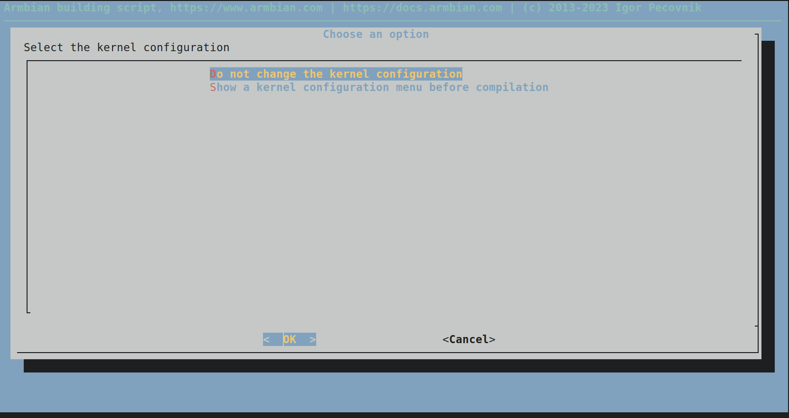

## Armbian (WIP)

[Armbian - Sipeed Liche Pi 4A](https://github.com/armbian/build/blob/main/config/boards/licheepi-4a.wip)

Work in progress compatibility for building apt-based images through the armbian framework

### Get started

To begin you will need a system to build this image that is capable of cross-compilation for the riscv64 platform with your preferred operating system, currently it takes around 55 minutes to build on system with 8 threads @ 3.8GHz for the first build, the second takes less than 5 min which will get much better as armbian implements non-wip support to pre-cache the building steps.

#### GNU (Linux, FreeBSD, Redox, Hurd)

On GNU you will need Bourne-Again SHell ("bash") with GNU Coreutils or their compatible alternative, refer to the documentation and support channel of your Operating System ("OS") for details.

Note that non-bash shell is not sufficient as the framework has a hard dependency on bash.

#### Darwin (MacOS)

You will need to install Bource-Again SHell ("bash") through macports, refer to https://ports.macports.org/port/bash for instructions.

#### Windows

Follow your OS's documentation to enable the Windows Subsystem for Linux or Install [Cygwin](https://www.cygwin.com).

### Building the image

Start by cloning the armbian-build repository in your designed directory for source code, on File Hierarchy Standard 3.0 ("FHS3.0") you may use `/src` or `/home/USER/src` which we will be using in our example:

```console
~$ mkdir ~/src # Make 'src' directory in your home directory
~$ cd ~/src # Change Directory in it
~/src $ git clone https://github.com/armbian/build.git armbian-build # Clone armbian-build repository in 'armbian-build' directory
```

Next if you are on officially supported Operating System ("OS") such as debian or ubuntu then the framework will attempt to download all dependencies needed to build the image, if not then make sure that you have [Docker](https://www.docker.com) installed and set up work working meaning that your **non-elevated user** (regular user without administrator permissions) has access to the docker socket often located in `/var/run/docker.sock` with ownership of the `docker` group if not then refer to the documentation of your distribution or seek help in the armbian support channel below.

If you are using docker then make sure that docker greets you when you run `$ docker run hello-world`, if not refer to your OS documentation or support channel.

Proceed to build the image, since this support is in Work-In-Progress state then you will need to use the `EXPERT=yes` configuration to reveal the hidden configuration for the board

```console
~/src/armbian-build $ ./combile.sh EXPERT=yes # Launch Armbian-build framework
```

If everything goes as designed then you will find yourself in the interactive Terminal User Interface ("TUI") of the Armbian framework:



You can now configure the system build to your liking follow the instructions of the TUI, if you encountered a problem with the TUI then seek help in the Armbian support channel below as you've likely found a bug that needs to be corrected.

If you don't want to use the TUI or have issues building the image then the following configuration has been tested to work with the commit [02051676b0526b2226f82c4f1a87c81be846617e](https://github.com/armbian/build/commit/02051676b0526b2226f82c4f1a87c81be846617e).

```console
~/src/armbian-build $ ./compile.sh EXPERT=yes BOARD=licheepi-4a BRANCH=legacy BUILD_DESKTOP=no BUILD_MINIMAL=no EXPERT=yes KERNEL_CONFIGURE=no RELEASE=sid
```

If this configuration doesn't build for you or you encounter issues then please file a new bug in https://github.com/armbian/build/issues/new/choose and mention `@kreyren` and `@chainsx` so that it can be addressed.

### Flash the image on the board

The framework generates an "image" file which should get recognized by many desktop environments to open a Graphical User Interface that is user-friendly to flash the image on your preferred storage device such as the sdcard.

On Windows you might also use [rufus](https://rufus.ie).

If you don't have access to such solutions then use `dd` such as:

```console
# dd if=IMAGE of=DEVICE conv=sync status=progress # flash IMAGE to DEVICE
# sync # Make sure that filesystems are in sync to remove the media without data loss
```

By default the image will be saved in `/home/USER/src/armbian-build/output/images/Armbian_23.08.0-trunk_licheepi-4a_sid_legacy_5.10.113_minimal.img` or file alike, to find your **DEVICE** use `# blkid`, if you are unsure then seek help in the support channel.

### Where to seek help

Refer to https://www.armbian.com/contact for support with armbian.

### Common Problems

Due to the migration issues on debian's side you might need to apply the following hotfix to build the image: https://github.com/armbian/build/pull/5585#issuecomment-1678923966