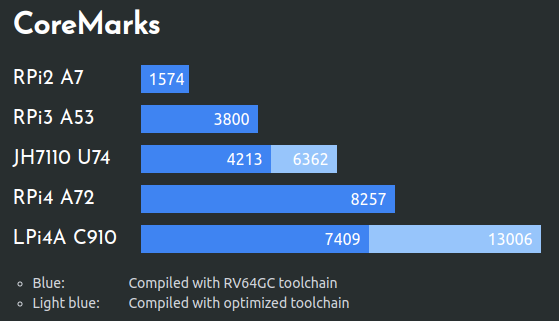
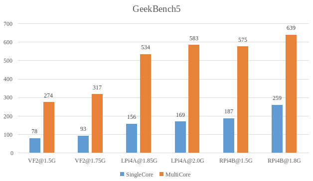

## Dhrystone

The official data from Flathead, C910 is around 5.6 out of 10.

  

## CoreMarks 

Test parameter configuration: 

`-funroll-all-loops -finline-limit=500 -fgcse-sm -fno-schedule-insns  -msignedness-cmpiv -fno-code-hoisting -mno-thread-jumps1 -mno-iv-adjust-addr-cost -mno-expand-split-imm`

Test results (1.85GHz) using the public toolchain, GCC version `13.1.0`:

```txt
2K performance run parameters for coremark.
CoreMark Size    : 666
Total ticks      : 11989
Total time (secs): 11.989000
Iterations/Sec   : 9175.077154
Iterations       : 110000
Compiler version : GCC13.1.0
Compiler flags   : -O2 -DPERFORMANCE_RUN=1  -lrt -funroll-all-loops -finline-limit=500 -fgcse-sm -fno-schedule-insns -msignedness-cmpiv -fno-code-hoisting -mno-thread-jumps1 -mno-iv-adjust-addr-cost -mno-expand-split-im
Memory location  : Please put data memory location here
                        (e.g. code in flash, data on heap etc)
seedcrc          : 0xe9f5
[0]crclist       : 0xe714
[0]crcmatrix     : 0x1fd7
[0]crcstate      : 0x8e3a
[0]crcfinal      : 0x33ff
Correct operation validated. See README.md for run and reporting rules.
CoreMark 1.0 : 9175.077154 / GCC13.1.0 -O2 -DPERFORMANCE_RUN=1 -lrt -funroll-all-loops -finline-limit=500 -fgcse-sm -fno-schedule-insns -msignedness-cmpiv -fno-code-hoisting -mno-thread-jumps1 -mno-iv-adjust-addr-cost -mno-expand-split-im / Heap
```

Test results (1.85GHz) using the public toolchain, GCC version `10.4.0`:

```txt
2K performance run parameters for coremark.
CoreMark Size    : 666
Total ticks      : 15129
Total time (secs): 15.129000
Iterations/Sec   : 13219.644392
Iterations       : 200000
Compiler version : GCC10.4.0
Compiler flags   : -O2 -march=rv64gv0p7_zfh_xtheadc -O3 -funroll-all-loops -finline-limit=500 -fgcse-sm -fno-schedule-insns  -msignedness-cmpiv -fno-code-hoisting -mno-thread-jumps1 -mno-iv-adjust-addr-cost -mno-expand-split-imm -DPERFORMANCE_RUN=1  -lrt
Memory location  : Please put data memory location here
                        (e.g. code in flash, data on heap etc)
seedcrc          : 0xe9f5
[0]crclist       : 0xe714
[0]crcmatrix     : 0x1fd7
[0]crcstate      : 0x8e3a
[0]crcfinal      : 0x4983
Correct operation validated. See README.md for run and reporting rules.
CoreMark 1.0 : 13219.644392 / GCC10.4.0 -O2 -march=rv64gv0p7_zfh_xtheadc -O3 -funroll-all-loops -finline-limit=500 -fgcse-sm -fno-schedule-insns  -msignedness-cmpiv -fno-code-hoisting -mno-thread-jumps1 -mno-iv-adjust-addr-cost -mno-expand-split-imm -DPERFORMANCE_RUN=1  -lrt / Heap
```

 

## Geekbench5

> Note: The tests here use the public version of the toolchain, if you use the special toolchain of thead, the performance is expected to be improved by more than 50%.

 

https://browser.geekbench.com/v5/cpu/compare/21100603?baseline=21092115

## 7-Zip LZMA 

[7-Zip LZMA Benchmark](https://7-cpu.com/)
 

## OpenSSL

```bash
openssl speed -evp aes-256-cbc
openssl speed -evp aes-256-gcm
openssl speed -evp sha1
openssl speed -evp sha256
```

| type                                          | 16bytes   | 64bytes   | 256bytes  | 1024bytes  | 8192bytes  | 16384bytes |
| --------------------------------------------- | --------- | --------- | --------- | ---------- | ---------- | ---------- |
| <p style="white-space:nowrap">AES-256-CBC</p> | 29206.05k | 36957.73k | 39648.85k | 40407.72k  | 40624.13k  | 40768.21k  |
| <p style="white-space:nowrap">AES-256-GCM</p> | 24610.57k | 28191.29k | 29459.29k | 29727.06k  | 29911.72k  | 29949.95k  |
| <p style="white-space:nowrap">sha1</p>        | 9428.03k  | 30591.02k | 72920.06k | 113164.63k | 135271.77k | 137052.16k |
| <p style="white-space:nowrap">sha256</p>      | 6206.94k  | 17151.38k | 34806.19k | 47151.10k  | 52559.87k  | 53163.07k  |

## LLVM 

The scripts are compiled using `buildbot-benchmark.bash` from the [scriptlets](https://github.com/AOSC-Dev/scriptlets/tree/master/buildbot-benchmark) repository, with a CPU frequency of 1.843 Ghz and 16G of RAM.

Compilation time:
```text
real    265m50.172s
user    980m15.164s
sys     60m51.329s
```

## 其它

欢迎投稿～ 投稿接受后可得￥5～150（$1~20）优惠券！