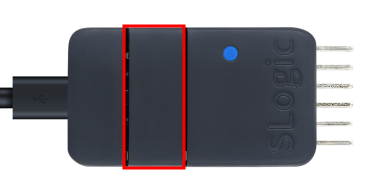

The SLogic combo8 has four functions (SLogic, CKLink Debugger, DAP-Link Debugger, USB2UART). This document is intended to guide you on how to select the functions.

## Button Functions

After power on, **press the button** to switch functions, and you can see the **indicator light change** when the switching is successful.

（Up：The red box indicates the position of the function switch button）

> Note: When switching functions, do not press the button more frequently than every 100ms; otherwise, it may cause the module to enter boot mode, and you will see that the indicator light will no longer change. If you encounter this situation, try to restart the power supply.

## Indicator Light Color and Functions

Each function corresponds to a specific color, and you can determine the currently enabled function based on the indicator light color.

| Function   | Slogic | DAPLink | USB2UART | CKLink |
| ---------- | ------ | ------- | -------- | ------ |
| Indicator Light Color | Blue   | Green   | Red      | Yellow |

（Up：Table of Indicator Light Color and Functions）

## Panel Information

You can check the current function and corresponding wire sequence through the panel information:

- The left side shows the wire sequence for **CKLink (Yellow)** and **DAPLink (Green)** together, as their wire sequences are similar.

- The middle section shows the wire sequence for **UART (Red)**.

- The right side shows the wire sequence for **SLogic (Blue)**.

（Above：Color/Function/Wire Sequence Correspondence Diagram）

Here's an example:

1. If you want to use the SLogic function, press the button to switch the indicator light to blue. This will enable the SLogic function, and you can find the pin wire sequence for SLogic under the blue font on the panel.

2. If you want to use the UART function, press the button to switch the indicator light to red. This will enable the UART function, and you can find the pin wire sequence for UART under the red font on the panel.

Alright, now you can switch to the function you need and proceed to the next step!

