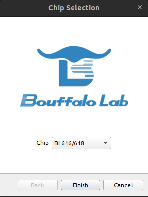
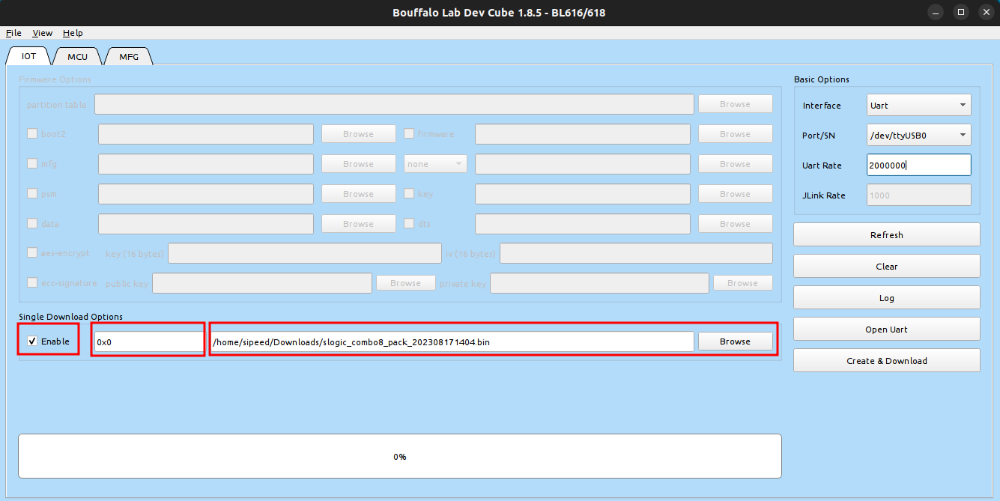
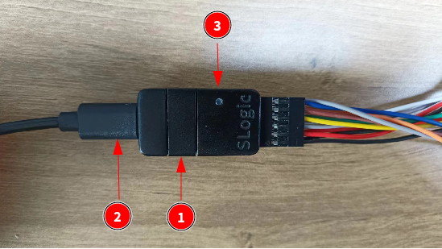
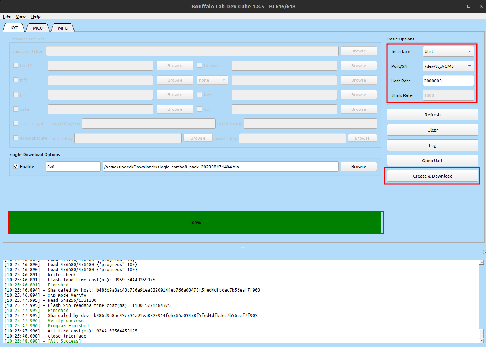

The following are the steps to update the firmware of SLogic Combo 8

## Download Tool and Firmware

Tool: [Click to download](https://dl.sipeed.com/shareURL/SLogic/SLogic_combo_8/4_application/Tools)

Firmware: [Click to download](https://dl.sipeed.com/shareURL/SLogic/SLogic_combo_8/4_application/Firmware)

Use the latest flashing tool. Select `slogic_combo8_pack_202608121500.bin` or a newer firmware release, then extract the downloaded files.

> Note:When the firmware is named `slogic_combo8_pack_202308171404.bin`, the date is 17/08/2023. The date naming rules are similar for other firmware.

`slogic_combo8_pack_202608121500.bin` includes these fixes:

- LA: fixes the dirty waveform on a floating CH7.
- DAPLink: fixes serial instability and improves sustained high-speed transfers, serial-setting changes, and recovery after USB reconnection.

## Configure Tool

1. Start the tool

    After decompression, the execution files of different system environments are provided in the root directory of the tool.

    For Windows users：Double-click`BLDevCube.exe`to start

    For Linux users：Double-click`BLDevCube-ubuntu`to start。Note that the Linux environment needs to add executable permissions `sudo chmod +x BLDevCube-ubuntu`

2. Select chip

    After startup, select BL616/618 and click Finish

    

3. Enable `Single Download Options` and add the downloaded firmware

    

## Configure device

Put SLogic Combo 8 into burning mode

Steps:

1. Long press the button
2. Power on again
3. Observe that the LED light is off, the operation is successful

## Burn firmware

Configure the serial port and baud rate, and click `Create & Download` to download

When the progress bar turns green, power-cycle the device and check the update:

1. Switch to blue logic-analyzer mode and confirm that the system detects `SLogic8 U2`.
2. Switch to green DAPLink mode and confirm that the system detects `RV CMSIS-DAP`.
3. If the update was intended to resolve DAPLink serial or debug stability, repeat the original test with the same wiring and baud rate.
