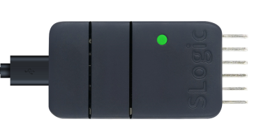

SLogic Combo 8 features high-speed DAP-Link functionality, suitable for various common chips, especially for debugging STM32 chips using IDE on Windows.

## Enable DAPLink Functionality

Press the toggle button to switch the indicator light to green.

> To verify if DAPLink functionality is enabled:
> Open the device manager in Windows environment, and use the lsusb command in Linux environment to find the "RV CMSIS-DAP" device

## Getting Started

Here's a step-by-step guide on using the STM32F103C8T6 chip with Windows MDK IDE as an example:

### Pin sequence

> CKLink and DAPLink have similar pin connections, so they are shown together in one diagram. Please ignore the 'CK' label.

In DAPLink mode, it can simultaneously support one DAPLink interface and one UART interface.

The pins on the left side of the diagram (TXD, RXD, DTR, RTS) can be used as a UART interface.

The pins on the right side of the diagram (TCK, TDI, TDO, TMS) are used for DAPLink debugging.

### Connecting DAPLink using MDK
- Set the Reset Options to SYSRESETREQ.
- In CMSIS-DAP, locate and select the RV CMSIS-DAP device.

### Download the firmware using MDK:

### Debug the firmware using MDK:

Thank you for the document contribution from 'dragonforward'.

