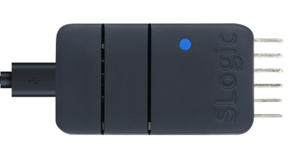
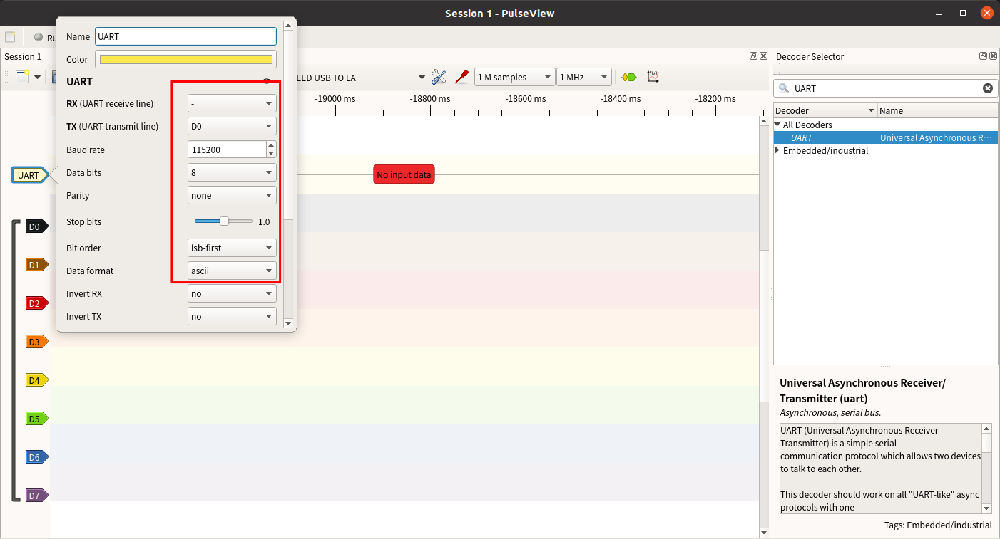
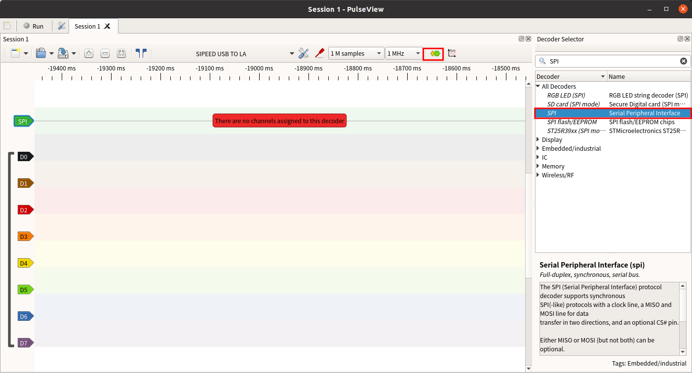
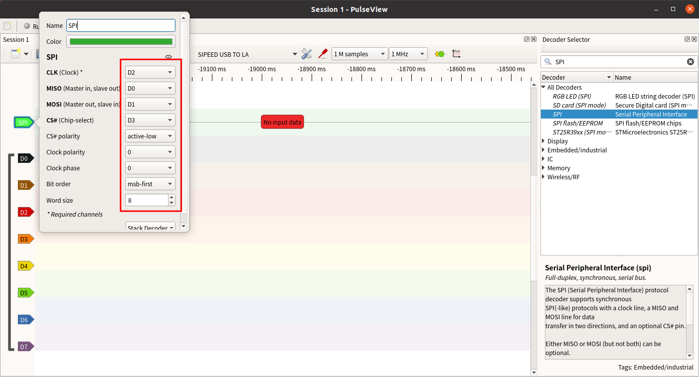
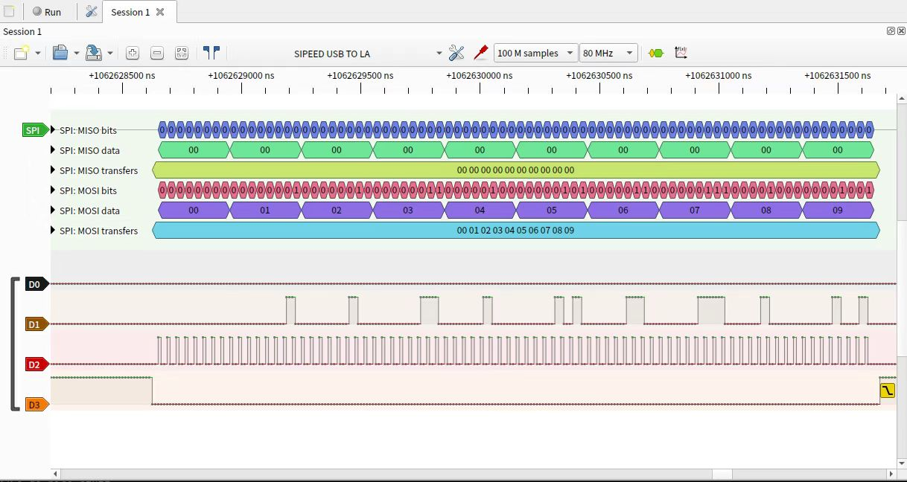

## Enabling the Logic Analyzer Function

Press the button to switch the indicator light to blue. As shown below:



> To verify if Slogic functionality is enabled:
> Open the device manager in Windows environment, and use the lsusb command in Linux environment to find the "USB TO LA" device

## Getting Started

> Notice:
> 1. The maximum transmission bandwidth of SLogic Combo 8 in Linux environment is 320Mb/s, and the typical configuration is 80M@4CH 40M@8CH.
> 2. The maximum transmission bandwidth of SLogic Combo 8 in Windows environment is 160Mb/s, and the typical configuration is 80M@2CH 40M@4CH.
> 3. If there is a disconnection during the startup process of the host software, please rescan and reconnect the device before performing other operations, otherwise it may lead to software crashes.

### Quick Start

#### Pin Connections


The above diagram shows the pinout for the 8 channels of SLogic. Connect the target device's test signal points to any available CH port on SLogic, and ensure that the ground of the target device is connected to the ground of SLogic.

> Note: The GND line of the SLogic needs to be as close as possible to the location of the point to be measured, even 1cm closer may increase the quality of the sample.

#### Downloading and Running the Host Computer

[Download PulseView](https://dl.sipeed.com/shareURL/SLogic/SLogic_combo_8/4_application/PulseView)

PulseView is used for observing digital signals and decoding. Windows users should download files with the .exe extension, while Linux users should download files with the .AppImage extension. It is recommended to download the latest version with the most recent date.

> Note:When the software is named `PulseView-xxxx-230811-xxx.AppImage`, the date is 11/08/2023. The date naming rules are similar for other software.

Linux Environment:

1. After downloading, navigate to the directory where the software is located. Open the terminal using the shortcut CTRL+ALT+T. Then, use the following command to give the software execution permissions and run it with administrator privileges:

```bash
chmod +x PulseView-x86_64-032323-1101.AppImage
sudo ./PulseView-x86_64-032323-1101.AppImage
```

Windows Environment:

1. After downloading, click on the .exe file to begin the installation. Follow the installation prompts and click "Next" consistently to complete the installation.
2. After the installation is complete, you can find the host computer software icon in the shortcut menu. Double-click to run it.

> Note: In the Linux environment, the maximum supported sampling rate is 80M for 4 channels and 40M for 8 channels. Due to limitations in USB transmission stability on Windows, the maximum supported sampling rate is 80M for 2 channels and 20M for 8 channels.


#### Scan SLogic and Connect

The connection will be made automatically on first startup, or you can choose to connect SLogic manually.

**Steps for manual connection**

1. Click on "Scan for devices xxx" to scan for devices.

2. 选择"SIPEED USB TO LA xxx" and click OK to connect the device.

    

#### Ready to Sample

1. Set the sampling parameters

   The following figure sets the number of channels to **8**, the number of samples to **1M samples**, and the sampling rate to **10Mhz**. At this time the **sampling time** is 1M / 10Mhz = 0.1s

   

#### Start Sampling

1. Click on the "run" button to start sampling.

    

> Note:If the D7 channel is not used during the sampling process, a level inversion of the channel may be observed, but this is normal and does not affect normal use.

#### Analyze the Sampling Result

1. Open the protocol analysis function

    

2. Select the target protocol

    

3. Configure the protocol parameters

    

4. Observe the analysis results

    

Based on the results of the analysis, let's start debugging.

### Detailed Configuration

#### Sampling Parameters

Sampling parameters include the sample count, sampling frequency, and sampling time.

1. Sample Count: Choose an appropriate value for the sample count based on your requirements.
2. Sampling Frequency: Select a value greater than 10 times the frequency of the signal under test (**recommended** to adhere to Nyquist theorem).
3. Sampling Time: Calculate the sampling time based on the **sample count** and **sampling frequency** using the formula:</br>**Time (seconds) = Sample Count / Sampling Rate**</br>For example, with 1M samples and 1MHz sampling rate, the sampling time would be 1 second.

   

> After setting the sample count and sampling frequency, placing the mouse cursor over the sample count selection box will display the calculated sampling time for the current parameters.

#### Channel Parameters

Click on a channel's label to set its parameters. Channel parameters include label name, label color, channel waveform display window width, and signal triggering mode.

1. Label Name: Set based on the meaning of the sampled signal to facilitate distinguishing between multiple signals.
2. Label Color: Set according to personal preference to differentiate between different signals during multi-signal sampling.
3. Channel Waveform Display Window Width: Adjust based on the signal amplitude. This value is in pixels. When the signal amplitude changes significantly, increasing this parameter can help observe amplitude changes more clearly.
4. **Signal Triggering Mode**: Choose from **Direct Sample**, **High Level Trigger**, **Low Level Trigger**, **Falling Edge Trigger**, **Rising Edge Trigger**, and **Edge Trigger**.
   (Prior to signal collection, there might be many irrelevant signals. Setting the triggering mode based on the signal pattern can effectively filter out irrelevant signals, thereby improving sampling efficiency and accuracy.)


### Debugging Waveforms

#### View Operations

Through view operations, you can observe waveforms in more detail.


**Waveform Zoom**: Use the mouse scroll wheel (middle button) to zoom in and out of the waveform.
**Drag Waveform**: Hold down the left mouse button to drag the waveform display area horizontally and vertically.
**Region Zoom**: Double-click on a specific region to zoom in on that area of the waveform.
**Channel Scroll**: In the waveform display area, use Ctrl + mouse scroll wheel (middle button) to quickly scroll the channels up and down.
**Time Measurement**: You can create marker points by right-clicking the desired position and selecting "Create Marker Here." The software will automatically calculate and display the time length between two marker points on the time axis.
**Adjust Channel Order**: Drag and drop a channel's label to rearrange the order of channels as needed.

#### Protocol Decoding

After capturing the required data, protocol decoding can be used to analyze the data more effectively. Below are the decoding processes for some common protocols.

##### UART Protocol Data Decoding

1. Connect the TX pin of the UART to the D0 channel.

2. Click on the **Yellow and Blue waveform icon** in the top toolbar, search for "UART," and double-click to select the UART option.

   

3. Click on the **protocol label** of the newly added UART channel in the waveform display window.
   Set the TX corresponding channel, data format, signal baud rate, and byte order.

   

4. Capture the data and the decoded result will be displayed:

   Example: UART's TX pin sends data "Hello SLogic!" (ASCII data format, baud rate 115200, little-endian byte order)

   

##### I2C Protocol Data Decoding

1. Connect the SCL pin of the I2C to the D0 channel and the SDA pin to the D1 channel.

2. Click on the **Yellow and Blue waveform icon** in the top toolbar, search for "I2C," and double-click to select the first option.

    

3. Click on the **protocol label** of the newly added I2C channel in the waveform display window.
   Click on the added I2C **protocol label** and set the SCL and SDA channels.

   

4. Capture the data and the decoded result will be displayed:

   Example: I2C sends 0x68

   

##### SPI Protocol Data Decoding

1. Connect the MISO, MOSI, CLK, and CS pins of the SPI to the D0, D1, D2, and D3 channels respectively.

2. Click on the **Yellow and Blue waveform icon** in the top toolbar, search for "SPI," and double-click to select the SPI option.

   

3. Click on the **protocol label** of the newly added SPI channel in the waveform display window.
   Set the CLK, MISO, MOSI, and CS corresponding channels, and specify the active level of the chip select signal.

   

4. Capture the data and the decoded result will be displayed:

   Example: SPI sends 0x00~0x09 (clock 10MHz, low-active chip select)

   

   Example: SPI sends 0x00~0x09 (clock 26MHz, low-active chip select)

   

### Precautions

When connecting the logic analyzer to the system under test, please note the following precautions:

1. The logic analyzer shares a common ground with the computer. If the system under test is a high-voltage system, be sure to use a "USB isolator" for isolation. Otherwise, there is a risk of damaging the logic analyzer or computer.
2. The GND channel must be reliably connected to the ground of the system under test and kept as short as possible.
3. The signal channels must be securely connected to the test points of the system under test. Avoid haphazard "tapping" that could introduce interference.
4. Improper wiring may introduce glitches that could prevent proper data analysis in the software.
