# ngscopeclient × Sipeed SLogic User Guide

> Getting Started with Sipeed SLogic Analyzers on **ngscopeclient**: From Download to First Waveform
---

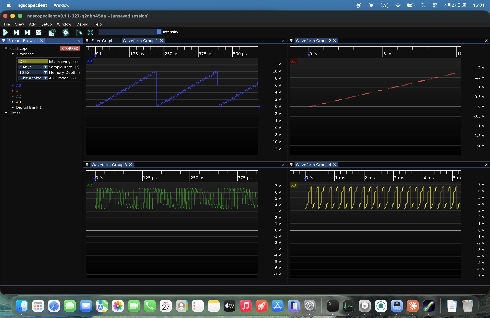


## What is Sipeed SLogic

Sipeed SLogic is a series of high-performance, cost-effective USB logic analyzer hardware. This project integrates them with [ngscopeclient](https://www.ngscopeclient.org/) — an open-source, cross-platform, GPU-accelerated GUI for oscilloscopes and analyzers—allowing you to leverage its powerful waveform visualization, protocol decoding, and automated testing capabilities to control SLogic hardware.


The solution consists of two components:
- **GUI Frontend**: `ngscopeclient` — The graphical interface for waveform visualization, trigger configuration, and protocol decoding.
- **Bridge Backend**: `sigrok-bridge` — A lightweight local daemon that interfaces with the hardware and bridges it to the client.

The two components communicate over TCP, enabling you to connect the hardware to a different machine (such as a remote Linux server or a Raspberry Pi) and operate it remotely.

| **Key Information** | **Description / Details** |
|--- |--- |
| **Supported Hardware** | [**SLogic Combo 8**](https://wiki.sipeed.com/slogic_combo_8)<br>[**SLogic 16U3**](https://wiki.sipeed.com/slogic16u3) (Current Mainstream)<br>[*SLogic 32U3*](https://wiki.sipeed.com/slogic32u3) (Coming Soon; Primary Focus of this Project)<br>*Other third-party models are not yet included in the distribution.* |
| **OS Compatibility** | Windows 10/11 x64<br> Linux x86_64<br> macOS support coming soon |
| **Prerequisites** | A ZIP / AppImage + a standalone `sigrok-bridge` executable — **Zero system-level installation; pure portable versions and plug-and-play use.** |
| **Unique Features** | Beyond standard logic analysis, use `--adc-mode analog` to **upload pin samples as 8-bit analog signals**. One SLogic device serves as both an LA and a sampling oscilloscope (*requires ADC kit*). |


> 📷 **Product Gallery**

<div class="three-row" style="display:flex;gap:8px;align-items:stretch;">
  <div class="slide" style="flex:1 1 0;height:220px;overflow:hidden;">
    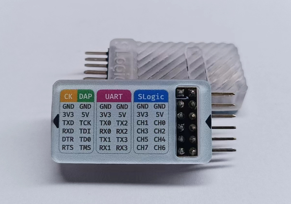
  </div>
  <div class="slide" style="flex:1 1 0;height:220px;overflow:hidden;">
    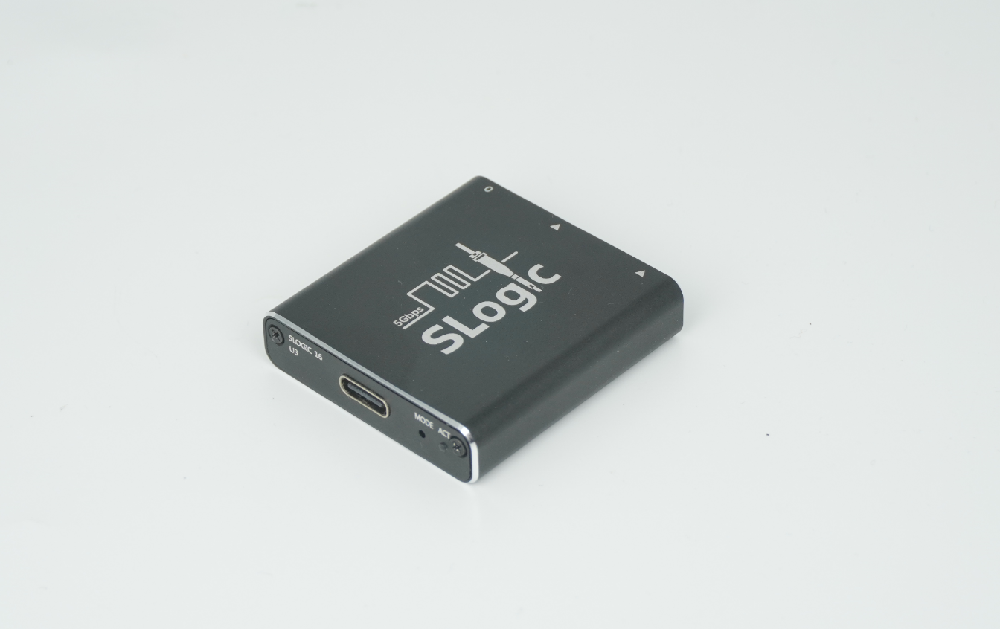
  </div>
  <div class="slide" style="flex:1 1 0;height:220px;overflow:hidden;">
    
  </div>
</div>

---

## Download

Release Url：**<https://dl.sipeed.com/shareURL/SLogic/ngscopeclient>**

| Platform | Download Items |
|---|---|
| Windows x64 | `ngscopeclient-<version>-win64.zip` + `sigrok-bridge.exe` |
| Linux x86_64 | `ngscopeclient-<version>-x86_64.AppImage` + `sigrok-bridge`（Standalone ELF binary） |
| macOS | Coming Soon |

<details>
<summary>Prerequisites</summary>

> `sigrok-bridge` is a **standalone executable with zero dependencies**. It requires no installation and can be run from any directory.

</details>

---

## Getting Started

### Windows

**Step 1**: Extract `ngscopeclient-*-win64.zip` to any directory (maintaining the folder structure), and place `sigrok-bridge.exe` into the same folder (or any other location you prefer).

**Step 2**: Plug in your SLogic hardware — **no driver installation required**. SLogic is a native WinUSB device and is strictly plug-and-play on Windows.

**Step 3**: Open a PowerShell or CMD window and run `sigrok-bridge.exe` first:

```powershell
.\sigrok-bridge.exe
```

It will display a startup log and wait for a client connection — **do not close this window**. Then, double-click `ngscopeclient.exe` to launch the GUI.


📷 Windows Usage Illustration: sigrok-bridge.exe startup log ("Sigrok bridge server starting: driver=sipeed-slogic-analyzer, port=10101..."), while the main ngscopeclient interface is open at the bottom.

<details>
<summary>📷 Windows Usage Illustration</summary>

> 📷 **Windows Usage Illustration**：The bottom-left command-line window shows the `sigrok-bridge.exe` startup log （"Sigrok bridge server starting: driver=sipeed-slogic-analyzer, port=10101..."）,while the main ngscopeclient interface is open at the bottom.

>
> 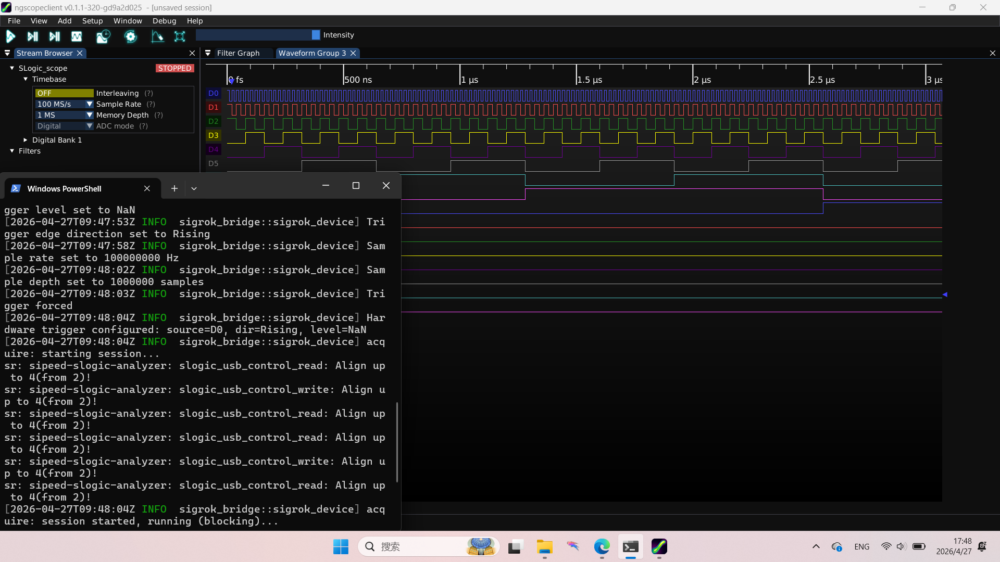
> 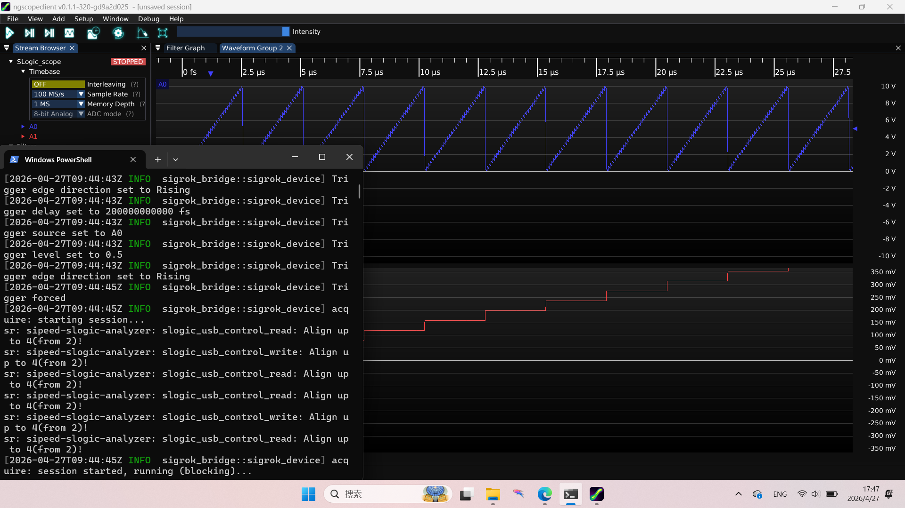
</details>


> System Requirements：Windows 10 1903 or later (includes built-in UCRT). No Visual C++ Redistributable installation is required.


### Linux

**Step 1**: Grant execution permissions to both files:

```bash
chmod +x ngscopeclient-*-x86_64.AppImage sigrok-bridge
```

**Step 2**: Install **udev rules** to allow non-root users to access SLogic (required only once):

```bash
sudo cp 60-sigrok-slogic.rules /etc/udev/rules.d/
sudo udevadm control --reload && sudo udevadm trigger
```

<details>
<summary>View rule file contents.</summary>

> After installation, **re-plug** the SLogic hardware for the rules to take effect.
```
SUBSYSTEM!="usb|usb_device", GOTO="sipeed_rules_end"
ACTION!="add", GOTO="sipeed_rules_end"
ATTRS{idVendor}=="359f", MODE="0666", GROUP="uucp", TAG+="uaccess"
ENV{ID_MM_DEVICE_IGNORE}="1"
LABEL="sipeed_rules_end"
```
</details>

**Step 3**: Run the components in two separate terminals:

```bash
# Terminal 1: Start the bridge
./sigrok-bridge

# Terminal 2: Launch the GUI
./ngscopeclient-*-x86_64.AppImage
```


<details>
<summary>📷 Linux Usage Illustration</summary>

> 📷 **Linux Usage Illustration**：Two side-by-side terminal windows; the bottom one displays the sigrok-bridge startup logs, while the top one shows the ngscopeclient AppImage launch process.
>
> 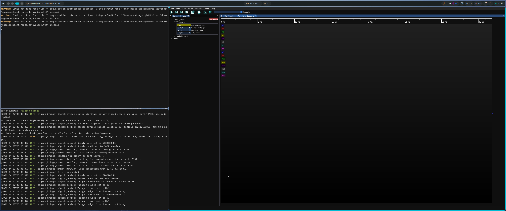
> 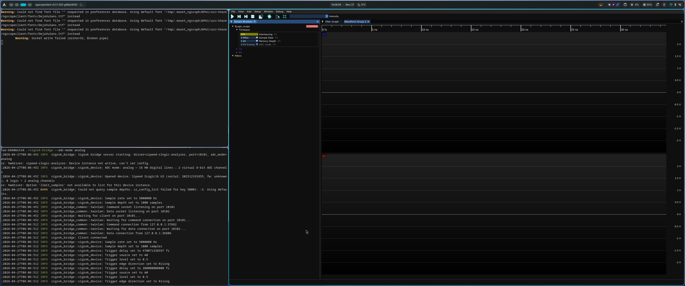
</details>

### macOS

**Coming Soon**. Please stay tuned for updates in the download directory, or inquire about the latest progress via the email channel in Section 7 (§7).

---

## Connecting in ngscopeclient

Once in the main ngscopeclient interface, go to **File → Add → Oscilloscope** to open the *Add Instrument dialog* . Enter the following:

| Field | Value |
|---|---|
| Driver | `sigrok` |
| Transport | `twinlan` |
| Path | `localhost:10101`（for local use）<br>or `<Remote_IP>:10101`(if hardware is on another machine)|

Click *Connect*. If everything is working correctly, the corresponding number of channels will appear in the channel panel (16 channels for SLogic Combo; 32 channels for SLogic32U3).

<details>
<summary>📷 Connection Steps Illustration</summary>

> 📷 **Connection Steps**：The *Add Instrument* dialog in **ngscopeclient** with the three fields correctly filled. This screenshot demonstrates **Analog Mode**.
>
> 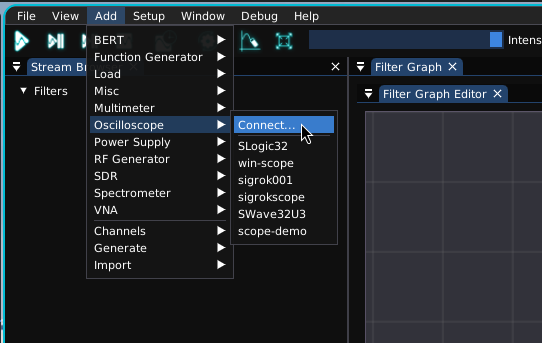
> 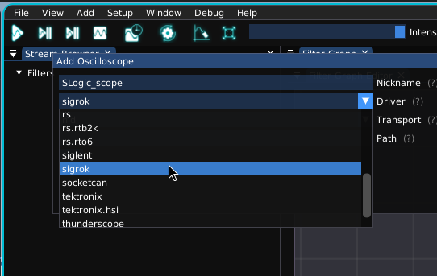
> 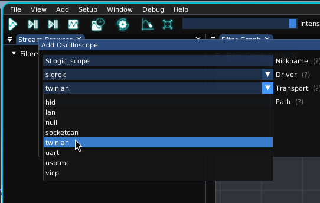
> 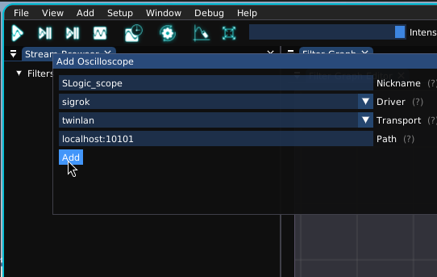
> 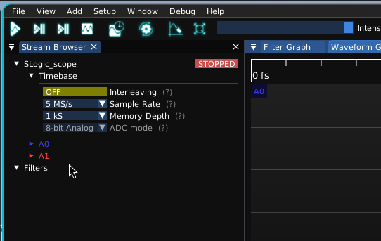
</details>

> **Remote Usage**：the bridge listens on all network interfaces (`0.0.0.0`).You can plug the hardware into a Raspberry Pi or a dedicated capture machine running the bridge, then connect from your development workstation using `<Remote_IP>:10101`. Ensure that your firewall allows traffic through both ports **10101** (Command) and **10102** (Data).

---

## Usage

### Digital Logic Analysis (Default Mode)

Each channel represents an independent digital level (High/Low). This is the most common operating mode. Simply run `./sigrok-bridge` to start—it defaults to digital mode.

**Basic Workflow**:

1.  **Select Channels**: Check the channels you wish to capture in the channel panel.
2.  **Set Sample Rate**: Choose from the dropdown menu (e.g., 200 MS/s).
3.  **Set Sample Depth**: Define how many points to store per capture. Generally, 1 MS (1 million samples) is sufficient.
4.  **Configure Trigger**: In the Trigger panel, select the trigger source channel and the edge type (Rising / Falling / Any edge).
5.  **Execution**:
    * **Run**: Continuous acquisition with real-time display updates.
    * **Single**: Captures a single frame and stops for detailed analysis.
    * **Force**: Forces a single-frame capture without waiting for a trigger condition.

> 📷 **Digital Waveform**: Compare with [Analog Waveform](#Using-hardware-as-a-sampling-oscilloscope-(analog-mode-/-<code>--adc-mode-analog</code>)).
>
> *Triggered on falling edge of D9*
> 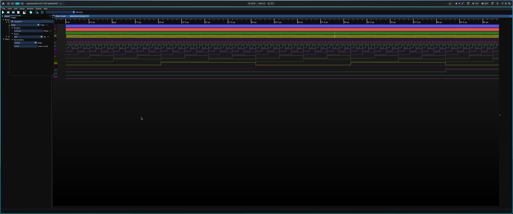

**Going Further: Protocol Decoding**

Drag and drop the digital waveforms into the [Protocol Analyzer](https://www.ngscopeclient.org/protocol-analysis) to decode protocols such as UART, I²C, SPI, CAN, and more. This is where ngscopeclient truly shines compared to traditional sigrok-based GUIs.

> 📷 **SPI Decoding Reference**: Digital waveforms shown alongside their protocol decoding results.

>
> 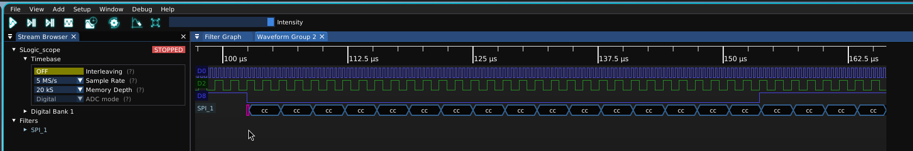

### Using hardware as a sampling-oscilloscope (analog-mode / <code>--adc-mode-analog</code>)

This is one of the project's unique capabilities: treating SLogic's parallel digital samples as an ADC data stream. This allows a single SLogic device to function as both a Logic Analyzer and an 8-bit Sampling Oscilloscope.

Start the bridge with the `--adc-mode analog` flag:

```bash
# Linux
./sigrok-bridge --adc-mode analog

# Windows
.\sigrok-bridge.exe --adc-mode analog
```

The Result: The original digital channels (D0–D7 / D8–D15) are merged into two 8-bit analog channels (A0, A1). If additional channels like D16–D23 / D24–D31 are available, they will be combined into a total of four 8-bit analog channels (A0, A1, A2, A3). You can then view waveforms in ngscopeclient just like a traditional analog oscilloscope—features such as scale, axes, automated measurements, and FFT are all natively available.

> ⚠️ Note: ADC mode can **currently only be specified via the `--adc-mode` flag when starting the bridge**. You cannot switch modes dynamically within the ngscopeclient interface once connected. To change modes, please stop the bridge, restart it with the desired parameters, and then reconnect.

> 📷 **Analog Waveform**: Compare with [Digital Waveform](#Digital-Logic-Analysis-(Default-Mode))
>
> 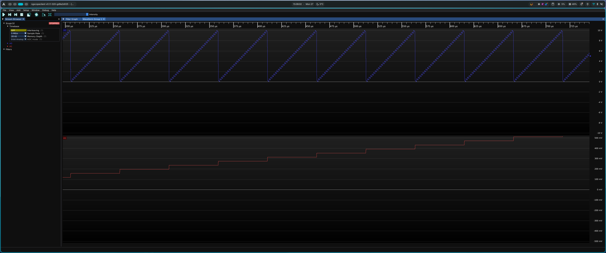

<details>
<summary>Prerequisites</summary>

> ⚠️ Analog mode requires hardware support via an external ADC module (compatible with SLogic16U3 / SLogic32U3). Currently, trigger levels and voltage scales remain at default values and are still under active refinement.

</details>

---

## FAQ


#### **"Permission denied" or "LIBUSB_ERROR_ACCESS" on Linux**
Your USB permissions are not configured correctly. Refer back to **Step 2 in §2.2** to install the **udev rules**, then **re-plug** the device.

#### **Connected in ngscopeclient, but the channel list is empty**
There are two likely causes:
1. **The bridge failed to find the device**: If the `sigrok-bridge` logs show *"No devices found"*, SLogic was not recognized. Ensure the hardware is securely connected and check if it appears in **Device Manager** (Windows) or via `lsusb` (Linux).
2. Firewall is blocking the **Data Port** (10102): If the command port is open but the data port is blocked, the connection will appear "successful," but no waveform data will be received. Ensure your firewall allows traffic on **both 10101 and 10102**.

#### **`sigrok-bridge.exe` window flashes and closes immediately on Windows**
This is a standard command-line utility. If it fails when launched via a double-click in File Explorer, the window closes before you can read the error. Instead, run it via **PowerShell** or **CMD**:

```powershell
.\sigrok-bridge.exe
```

This allows you to see the error message. A common issue is that port 10101 is already in use; you can specify a different port using: `--port 20101`.

#### **No options available in Sample Rate / Sample Depth dropdowns**
The capability handshake between the bridge and the device failed. `sigrok-bridge` utilizes the Rust ecosystem's standard `env_logger`. The distributed binaries support adjusting the log level via the `RUST_LOG` environment variable (defaults to `info`; set to `debug` for more detail):

```bash
# Linux
RUST_LOG=debug ./sigrok-bridge
```

The syntax for setting environment variables on Windows depends on the shell you are using:

```powershell
# PowerShell（Recommended）
$env:RUST_LOG="debug"; .\sigrok-bridge.exe
```

```bat
:: cmd.exe
set RUST_LOG=debug
.\sigrok-bridge.exe
```

Send the logs to us via the email channel in Section 7 (§7). This usually allows us to locate and resolve the issue quickly.

#### Can I use logic analyzers from other manufacturers or models?

The current distributed version is specifically optimized and adapted for the Sipeed SLogic series. Support for other models has not been added yet, but it may be considered in future updates.

---

## Feedback 

If you encounter bugs, have feature requests, or need assistance with setup, please email us at **<support@sipeed.com>**.

When sending your inquiry, please include the following:

- **Complete logs** from running the bridge with `RUST_LOG=debug`.
- **ngscopeclient version** (Found under **Help → About**).
- **Hardware model** and **firmware version**.
- **Operating system** details (Windows version or Linux distribution).

---

> 📷 **Product Family Showcase**： A "Three-in-One" setup featuring the SLogic hardware, the ngscopeclient GUI, and the bridge terminal logs all on one screen.
>
> 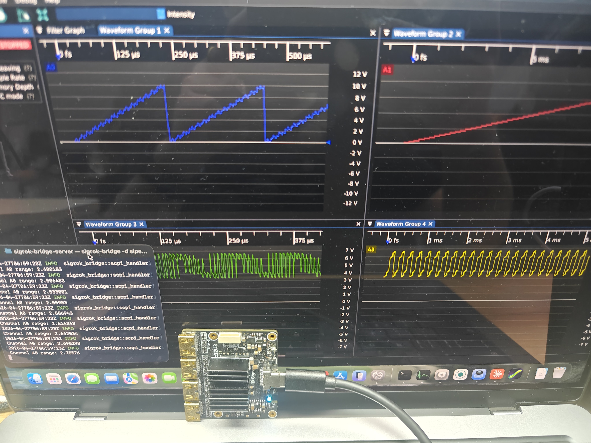
