# ngscopeclient × Sipeed SLogic User Guide

> Getting Started with Sipeed SLogic Analyzers on **ngscopeclient**: From Download to First Waveform

---

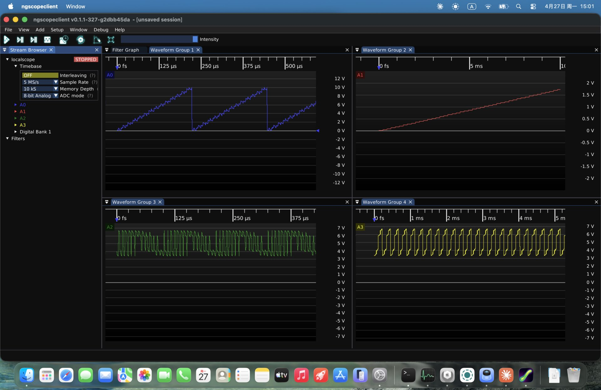


## What is Sipeed SLogic

Sipeed SLogic is a series of high-performance, cost-effective USB logic analyzer hardware. This project integrates them with [ngscopeclient](https://www.ngscopeclient.org/) — an open-source, cross-platform, GPU-accelerated GUI for oscilloscopes and analyzers — letting you use its powerful waveform visualization, protocol decoding, and automated testing capabilities to drive SLogic hardware.

ngscopeclient is now a **single executable**: download and run, with the connection, capture mode, and parameters all configured in the UI — no separate background program or command-line arguments needed.

| Key Information | Description / Details |
|---|---|
| Supported Hardware | [**SLogic Combo 8**](https://wiki.sipeed.com/slogic_combo_8)</br>[**SLogic 16U3**](https://wiki.sipeed.com/slogic16u3) (current mainstream)</br>[*SLogic 32U3*](https://wiki.sipeed.com/slogic32u3) (coming soon; the primary focus of this project)</br>Other third-party models are not yet included in the distribution. |
| OS Compatibility | Windows 10/11 x64, Linux x86_64, macOS — all three support download-and-run |
| What You Need | A single portable executable — **no system-level installation, download and run** |
| Unique Features | Beyond standard digital logic analysis, you can enable analog mode in the UI to observe the sampled pins **as 8-bit analog signals** — one SLogic serves as both an LA and a sampling oscilloscope (*requires the ADC kit*) |

> 📷 **Product Gallery**

<div class="three-row" style="display:flex;gap:8px;align-items:stretch;">
  <div class="slide" style="flex:1 1 0;height:220px;overflow:hidden;">
    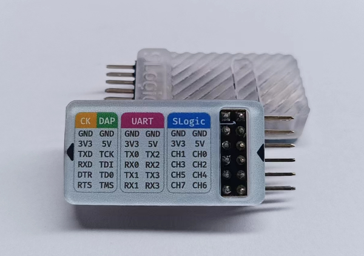
  </div>
  <div class="slide" style="flex:1 1 0;height:220px;overflow:hidden;">
    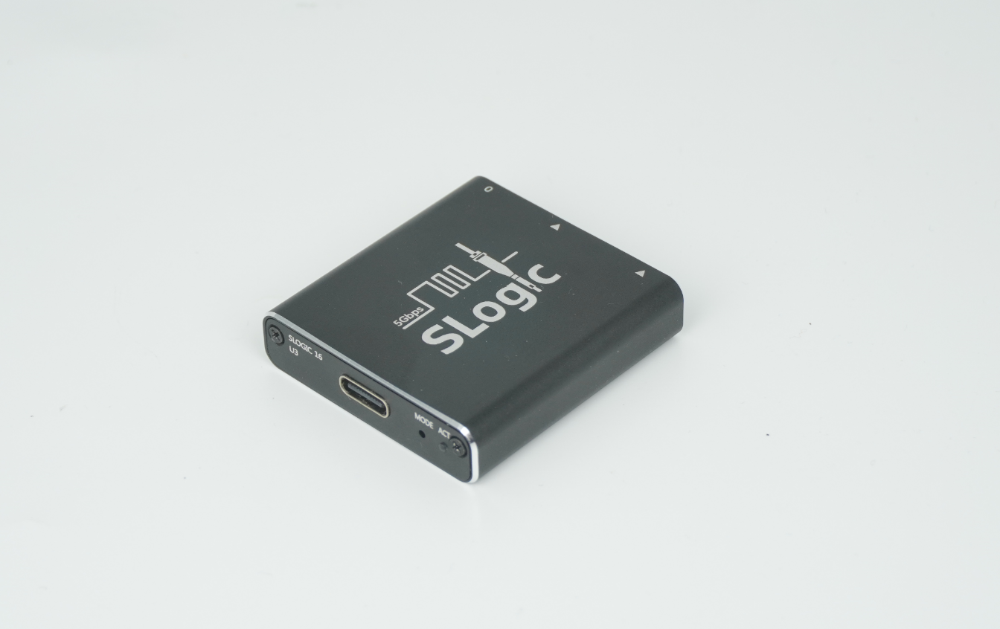
  </div>
  <div class="slide" style="flex:1 1 0;height:220px;overflow:hidden;">
    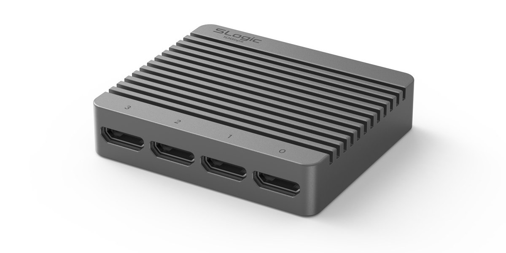
  </div>
</div>

---

## Download

Get the latest multi-platform host software from the **GitHub Release**; the download site is a backup mirror:

- **GitHub Release (recommended, latest)**: <https://github.com/sipeed/SLogic/releases/latest>
- Download site (backup mirror): <https://dl.sipeed.com/shareURL/SLogic/ngscopeclient>

| Platform | Download Items |
|---|---|
| Windows x64 | `ngscopeclient-<version>-win64.zip` (extract and run) |
| Linux x86_64 | `ngscopeclient-<version>-x86_64.AppImage` (make executable and run) |
| macOS | ngscopeclient macOS build (open and run)<!-- TODO: add macOS package name --> |

> A single portable executable — zero dependencies, no installation, drop it in any directory.

---

## Getting Started

### Windows

**Step 1**: Extract `ngscopeclient-*-win64.zip` to any directory (keep the folder structure).

**Step 2**: Plug in your SLogic hardware — **no driver installation required**. SLogic is a WinUSB device by default and is plug-and-play on Windows.

**Step 3**: Double-click `ngscopeclient.exe` to launch.

<details>
<summary>📷 Windows Usage Illustration</summary>

> 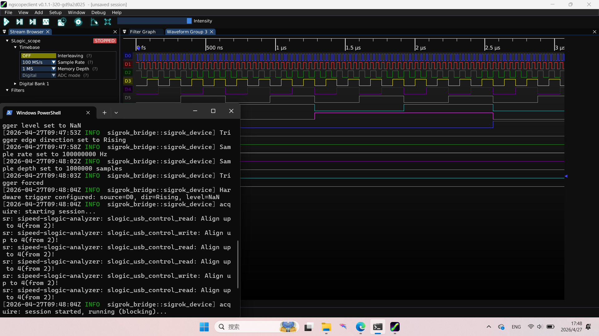
> 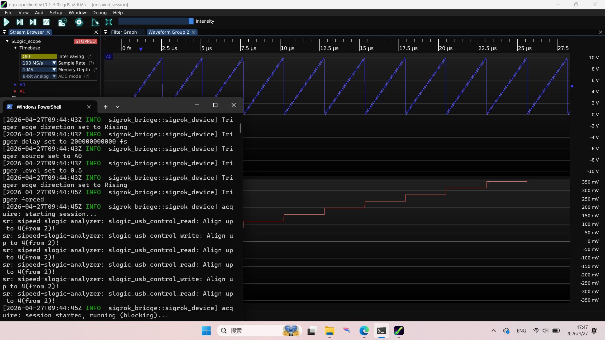
</details>


> System requirements: Windows 10 1903 or later (includes the built-in UCRT runtime). You do **not** need to install the Visual C++ Redistributable.

### Linux

**Step 1**: Grant execute permission to the AppImage

```bash
chmod +x ngscopeclient-*-x86_64.AppImage
```

**Step 2**: Install the udev rule so a normal user can access SLogic (only needed once)

```bash
sudo cp 60-sigrok-slogic.rules /etc/udev/rules.d/
sudo udevadm control --reload && sudo udevadm trigger
```

<details>
<summary>Rule file contents.</summary>

> After installing, **re-plug** the SLogic once for the rule to take effect.
```
SUBSYSTEM!="usb|usb_device", GOTO="sipeed_rules_end"
ACTION!="add", GOTO="sipeed_rules_end"
ATTRS{idVendor}=="359f", MODE="0666", GROUP="uucp", TAG+="uaccess", ENV{ID_MM_DEVICE_IGNORE}="1"
LABEL="sipeed_rules_end"
```
</details>

**Step 3**: Run

```bash
./ngscopeclient-*-x86_64.AppImage
```

<details>
<summary>📷 Linux Usage Illustration</summary>

> 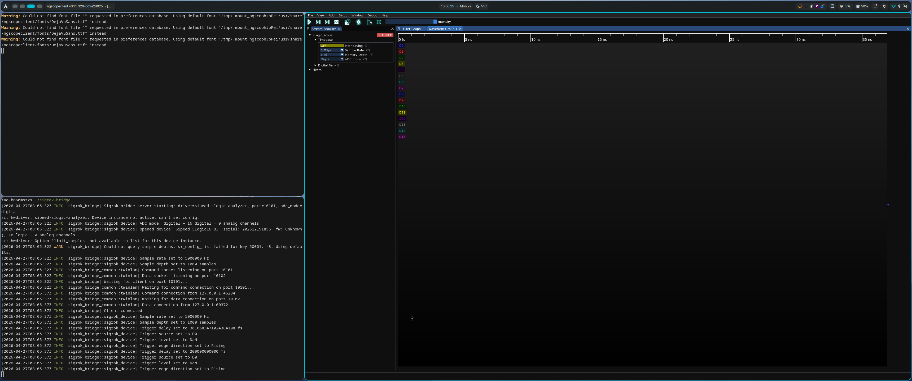
> 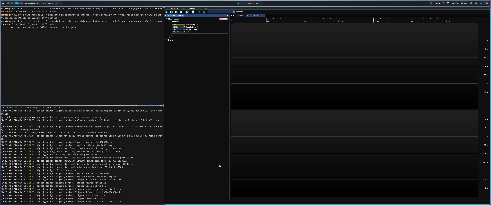
</details>

### macOS

Download the macOS build and open it to run; if it is blocked on first launch, allow it under System Settings → Privacy & Security.

---

## Connecting in ngscopeclient

Once in the main ngscopeclient interface, open the Add Instrument dialog via the menu **File → Add → Oscilloscope**, choose the following from each dropdown, and click Connect:

| Field | Value |
|---|---|
| Driver | `SLogic` |
| Transport | `slogic` |
| Path | `null` |

Once connected, the corresponding number of channels appears in the channel panel (e.g., 16 channels for SLogic16U3, 32 for SLogic32U3).

> 🚧 **TODO (image)**: The connection screenshots need updating — the ones below show the old `sigrok : twinlan : localhost:10101` parameters and must be re-captured with the new `SLogic : slogic : null` (replace `add-SLogic-*.png` in place).

<details>
<summary>📷 Connection Steps (old, to be updated)</summary>

> 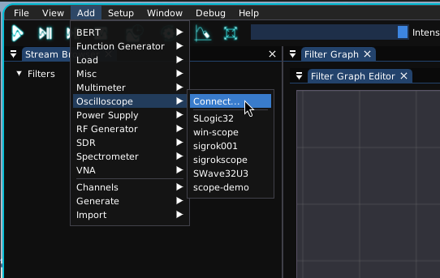
> 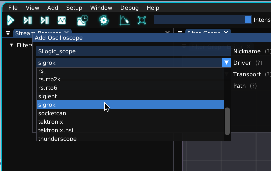
> 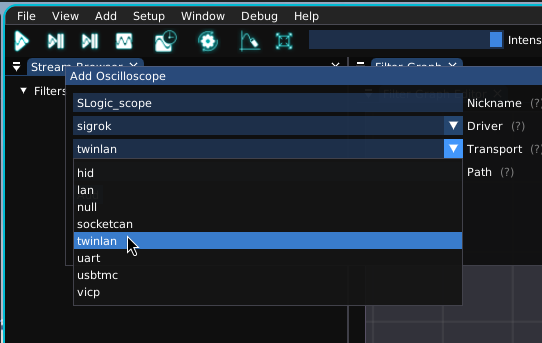
> 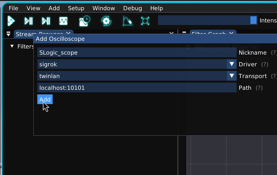
> 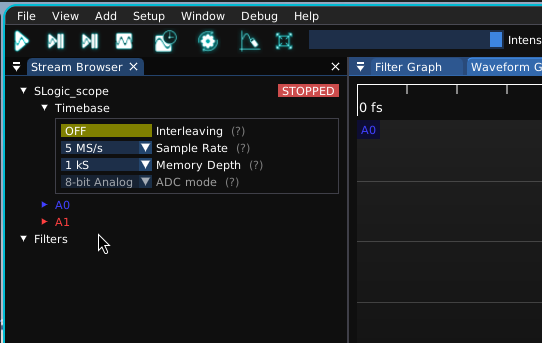
</details>

---

## Usage

### Digital Logic Analysis (Default Mode)

Each channel is an independent digital level (High/Low). This is the most common operating mode, and the default when you open the program.

**Basic Workflow**:

1. **Select channels**: Check the channels you want to capture in the channel panel.
2. **Set the sample rate**: Choose from the dropdown, e.g. 200 MS/s.
3. **Set the sample depth**: How many points to store per capture. 1 MS (1 million points) is usually enough.
4. **Configure the trigger**: In the Trigger panel, pick the trigger source channel and Rising / Falling / Any edge.
5. **Run**:
   - **Run** — continuous acquisition with live display refresh
   - **Single** — capture one frame and stop for a closer look
   - **Force** — capture one frame without waiting for a trigger

> 📷 **Digital Waveform**: compare with [Analog Waveform](#using-hardware-as-a-sampling-oscilloscope-analog-mode)
>
> *Triggered on the falling edge of D9*
> 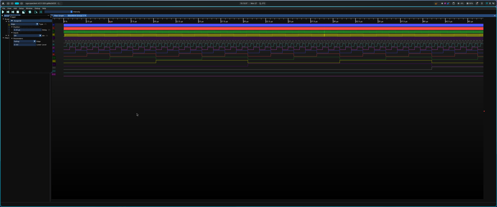

**Going Further: Protocol Decoding**

Drag the digital waveforms into the [Protocol Analyzer](https://www.ngscopeclient.org/protocol-analysis) to decode UART, I²C, SPI, CAN and other protocols — this is where ngscopeclient outshines traditional sigrok GUIs.

> 📷 **SPI Decoding Reference**: digital waveform with protocol decoding results.
>
> 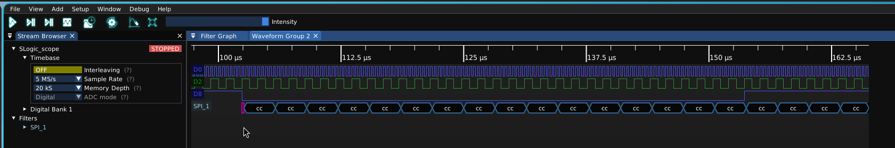

### Using Hardware as a Sampling Oscilloscope (Analog Mode)

This is one of the project's unique capabilities: treating SLogic's parallel digital samples as an ADC data stream, so a single SLogic serves as both a **logic analyzer and an 8-bit sampling oscilloscope**. Just enable analog mode in the ngscopeclient UI.

The result: the original D0–D7 / D8–D15 are merged into two 8-bit analog channels (A0, A1); if D16–D23 / D24–D31 are also present, they are merged into four 8-bit analog channels in total (A0, A1, A2, A3). You can then view the waveforms in ngscopeclient just like an analog oscilloscope — scale, axes, automatic measurements, FFT, and other analog-scope features are all available automatically.

> 🚧 The exact steps to enable analog mode in the UI follow the current version.

> 📷 **Analog Waveform**: compare with [Digital Waveform](#digital-logic-analysis-default-mode)
>
> 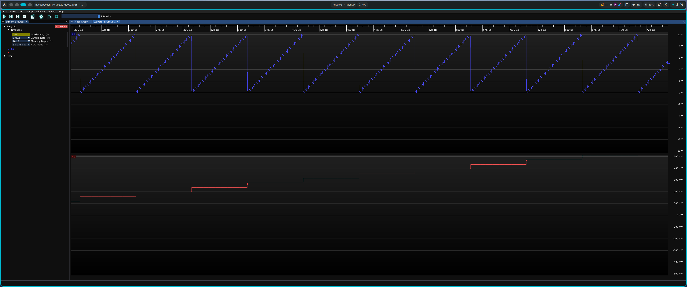

<details>
<summary>Note</summary>

> ⚠️ Analog mode requires hardware with an external ADC module (SLogic16U3 / SLogic32U3); some features are still being refined.
</details>

---

## FAQ

#### "Permission denied" or "LIBUSB_ERROR_ACCESS" on Linux

USB permissions aren't set up. Go back to the Linux section above to install the udev rule, then **re-plug** the device.

#### ngscopeclient connects but the channel list is empty

The device wasn't recognized. Check that the hardware is plugged in and that it shows up in Device Manager (Windows) / `lsusb` (Linux); on Linux, confirm the udev rule is installed and that you've re-plugged the device.

#### Can I use a logic analyzer from another vendor or model?

The current distribution is adapted only for the Sipeed SLogic series; other models aren't added yet, but may be considered later.

---

## Feedback

If you run into a bug, want a feature, or have any usage questions, email us at **<support@sipeed.com>**.

When emailing, please include:

- ngscopeclient version (menu *Help → About*)
- Hardware model + firmware version
- OS version (Windows / Linux / macOS)

---

> 📷 **Product Family Showcase**: the SLogic hardware, the ngscopeclient screen, and a terminal log — all on one screen.
>
> 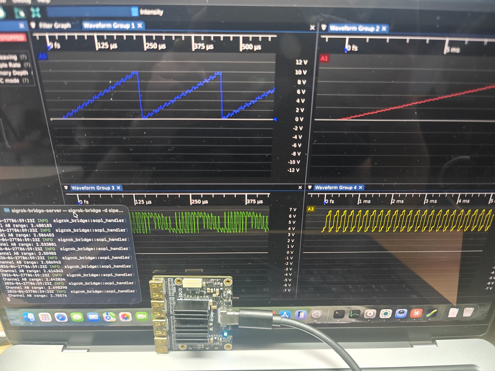
