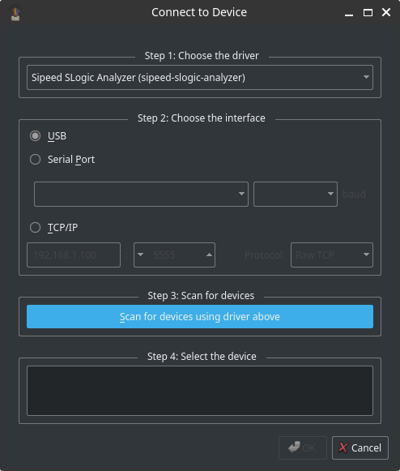

# FAQ

## Why can't I find the SLogic16U3 device?


The most common reason is that PulseView was started before the SLogic16U3 was connected. If the software can't see a device at startup it may not probe for it again automatically.

Solutions:
1. For automatic detection, connect the SLogic16U3 first, then launch PulseView. The software should auto-detect the device on startup.
2. If you started the software before connecting the SLogic, manually open the "Connect to Device" (or "Device Settings") dialog after plugging the SLogic in:
   - Open "Connect to Device".
   - Choose the correct driver/back-end for the SLogic16U3.
   - Click "Scan" to discover attached devices.
   - Select the SLogic device from the list and click "OK".
   - The UI will return to the normal capture/home page and the device will be available.
   - 

Additionally, on Linux a normal user cannot access USB devices by default due to permission restrictions. 
Choose one of the two methods below:

- Run PulseView with root privileges (quick test):
```bash
sudo ./Pulseview.appimage
```
- Set up a udev rule so normal users can access the device (recommended). See [How do I set up udev rules for Linux?](#How-do-I-set-up-udev-rules-for-Linux%3F) below for the udev rule and installation steps.

## How do I set up udev rules for Linux?

Create a new udev rules file:

```bash
sudo tee /etc/udev/rules.d/60-sipeed.rules <<EOF
SUBSYSTEM!="usb|usb_device", GOTO="sipeed_rules_end"
ACTION!="add", GOTO="sipeed_rules_end"
ATTRS{idVendor}=="359f", MODE="0666", GROUP="plugdev", TAG+="uaccess"
ENV{ID_MM_DEVICE_IGNORE}="1"
LABEL="sipeed_rules_end"
EOF
```

ArchOS users use `GROUP="uucp"` instead.

Reload udev rules and trigger:

```bash
sudo udevadm control --reload
sudo udevadm trigger
```

Unplug and reconnect the device.  
You can now run Pulseview as a normal user.

## Why can't I use higher sample rates? Only 200M shows.

The maximum sample rate depends on the number of active channels and USB bandwidth.  
Slogic16U3's USB 3.0 provides up to ~400MB/s.  
To use higher rates (400M/800M), disable unused channels.


## The device is locked in DFU mode and cannot switch back to SLogic mode.  
This usually means the SLogic firmware is corrupted, often due to a failed OTA update.  
**Solution:** Re-flash the correct firmware via OTA.


## Cannot switch to DFU mode, error shows "unknown USB device".  
This indicates USB enumeration failure, often caused by poor-quality or overly long USB cables.  
**Solution:** Try again with a shorter, higher-quality USB cable.
