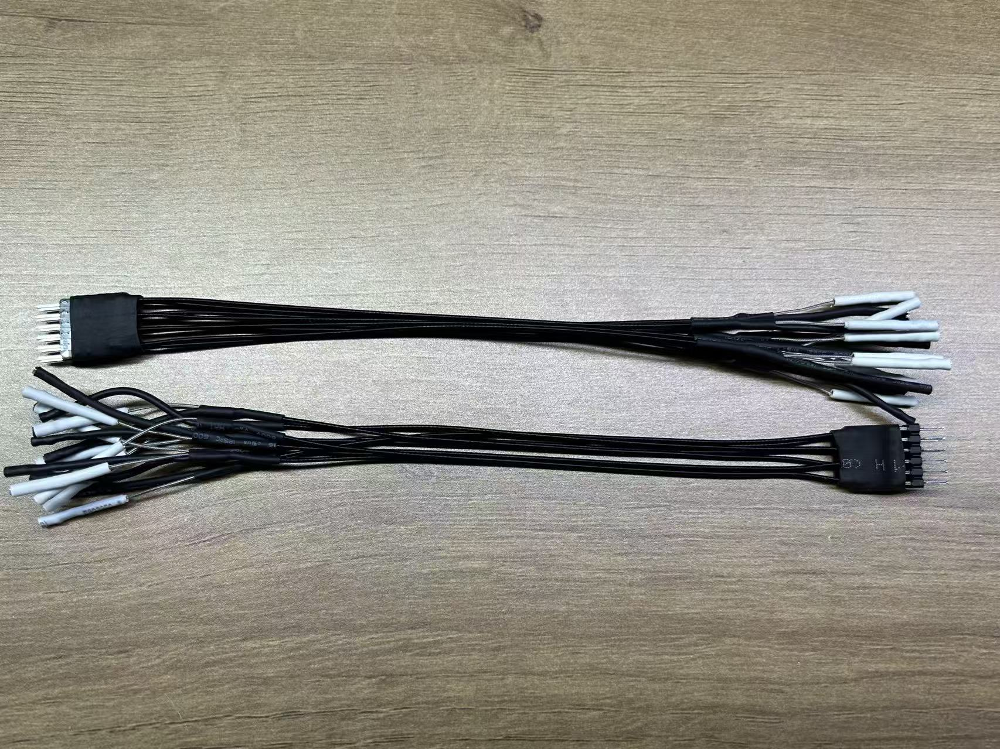
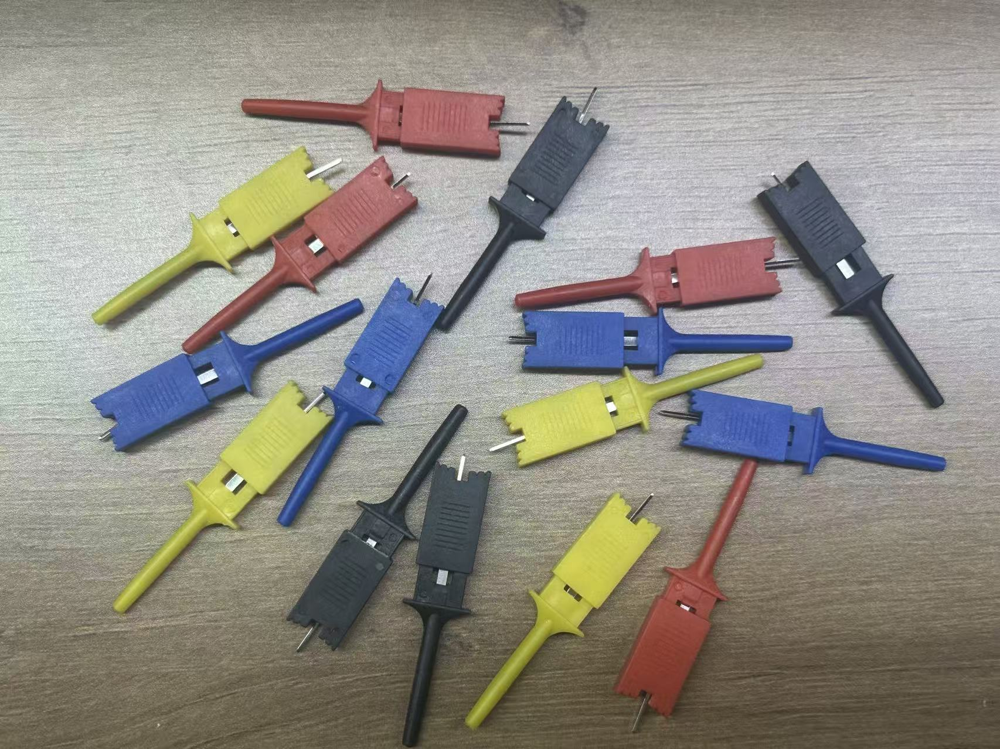
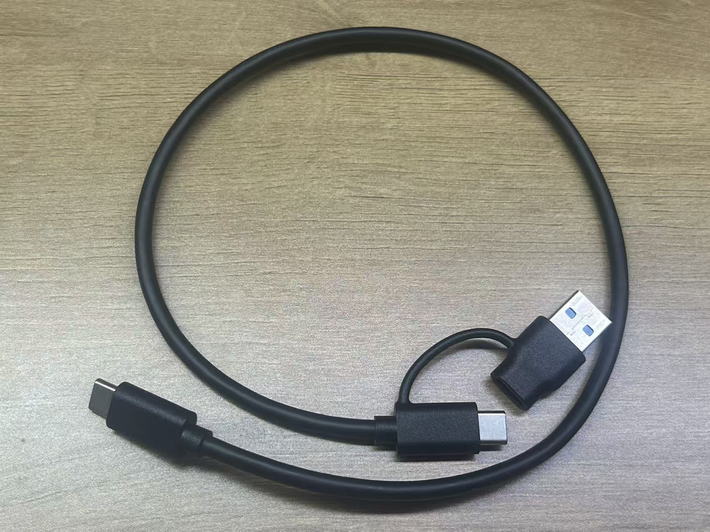
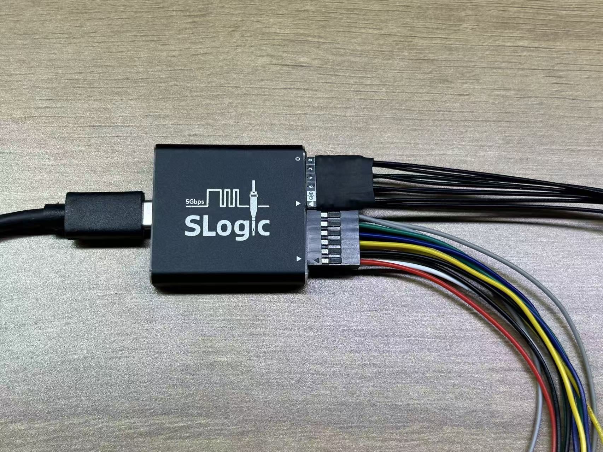
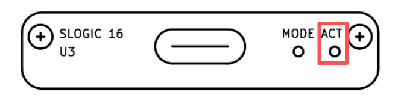
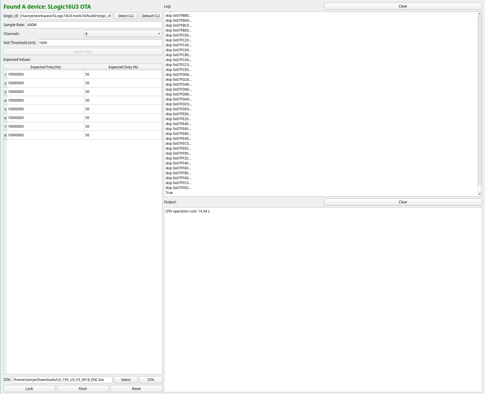

This section introduces the usage and operation related to **SLogic16 U3** hardware.

## Hardware Overview

### Accessories List

A complete hardware set includes the **SLoigc16 U3 main unit** and **accessories inside the package**, as shown below:
- <!DOCTYPE html>
  <html lang="en">
  <head>
    <meta charset="UTF-8">
    <title>CSS Indentation</title>
    
  </head>
  <body>
    

      
<b>SLoigc16 U3 Main Unit</b> x1
  

      
    

  </body>
  </html>
- **Accessories inside the package:** (Note: Ribbon cable and coaxial cable module are mutually exclusive) 
    - <!DOCTYPE html>
      <html lang="en">
      <head>
        <meta charset="UTF-8">
        <title>CSS Indentation</title>
        
      </head>
      <body>
        

          
<b>2x6P Male-to-Female Ribbon Cable</b> x2
      

          
        

      </body>
      </html>
    - <!DOCTYPE html>
      <html lang="en">
      <head>
        <meta charset="UTF-8">
        <title>CSS Indentation</title>
        
      </head>
      <body>
        

          
<b>2x4P Coaxial Cable Module</b> x2
      

          
        

      </body>
      </html>
    - <!DOCTYPE html>
      <html lang="en">
      <head>
        <meta charset="UTF-8">
        <title>CSS Indentation</title>
        
      </head>
      <body>
        

          
<b>Logic Analyzer Test Clips</b> x16
      

          
        

      </body>
      </html>
    - <!DOCTYPE html>
      <html lang="en">
      <head>
        <meta charset="UTF-8">
        <title>CSS Indentation</title>
        
      </head>
      <body>
        

          
<b>0.5m A+C to C USB3 Data Cable</b> x1
      

          
        

      </body>
      </html>
    - <!DOCTYPE html>
      <html lang="en">
      <head>
        <meta charset="UTF-8">
        <title>CSS Indentation</title>
        
      </head>
      <body>
        

          
<b>Stainless Steel SIM Pin</b> x1
      

          
        

      </body>
      </html>
    - <!DOCTYPE html>
      <html lang="en">
      <head>
        <meta charset="UTF-8">
        <title>CSS Indentation</title>
        
      </head>
      <body>
        

          
<b>Instruction Card</b> x1
      

          
        

      </body>
      </html>
    - <!DOCTYPE html>
      <html lang="en">
      <head>
        <meta charset="UTF-8">
        <title>CSS Indentation</title>
        
      </head>
      <body>
        

          
<b>Zipper Storage Bag</b> x1
      

          
        

      </body>
      </html>

> The appearance of accessories may vary slightly between batches. Please refer to the actual product.

### Connection Method

<!DOCTYPE html>
<html lang="en">
<head>
  <meta charset="UTF-8">
  <title>CSS Indentation</title>
  
</head>
<body>
  

    
Click here to view the hardware connection diagram of SLoigc16 U3

    
  

   
</body>
</html>

**Coaxial Cable Module**/**Ribbon cable set** are directional. The insertion direction is shown above: the triangle mark **▴** on the cable should align with the triangle mark **▾** on the case.

The far end of the **coaxial cable** has **2** terminals. The white terminal connects to the signal source, and the black terminal connects to GND.

Each group of **Ribbon cables** has only **2** separate GNDs. When the triangle mark **▴** on the cable aligns with the case, the black wire bundle is GND, and the red is VCC.

#### Rear of Logic Analyzer

The rear of the logic analyzer is a **2x12P** female header with a 2.54mm pitch. The pin definition is shown above (rear view of the logic analyzer).

The digital numbers **0-15** are the sampling channel numbers, corresponding to the channel numbers in the host software, totaling 16 channels.

**G** stands for **GND**. Please connect the GND of the device under test and the logic analyzer, totaling 4 channels.

**VCC** stands for power output, with an output capacity of **3.3V @500mA**, totaling 2 channels (2 channels share the current output capacity).

**CK** stands for reserved sampling clock input/trigger output channels. This function is not yet implemented, totaling 2 channels.

#### Front of Logic Analyzer

The above is the front view of the logic analyzer, from left to right:

**USB-C** interface standard is 3.2 Gen1 (5Gbps). To use the logic analyzer function, a cable with corresponding capability (USB3.0) must be used.

**MODE** small hole contains a hidden button. It can be pressed by inserting a SIM pin. Its function is described in the [MODE Button](#MODE-Button) section.

**ACT** is the **status indicator light**. Specific states are described in the [ACT Indicator](#ACT-Indicator) section.

---

### Getting Started

First, connect **PC USB3** → **USB-A/C to USB-C** → **SLogic** → **Ribbon cable**/**Coaxial Cable Module**

<!DOCTYPE html>
<html lang="en">
<head>
  <meta charset="UTF-8">
  <title>CSS Indentation</title>
  
</head>
<body>
  

    
Click here to view the hardware connection of SLoigc16 U3

    
  

   
</body>
</html>

> Currently, SLogic16 only supports **USB3** mode. The included **USB-A/C to USB-C** cable is compatible.

Connect the signal points of the target device under test to any free CH digital port of **SLogic** via **Ribbon cable**/**Coaxial cable**, and ensure the GND of the device under test is connected to the GND of SLogic.

> Note: When the Nyquist frequency of the signal source is greater than or equal to 50 MHz, it is recommended to use coaxial cables for sampling to achieve better stability.

You may optionally use **logic analyzer test clips** to connect to the signal points.

> To improve sampling stability, the GND wire of SLogic should be as close as possible to the test point. Even shortening by **1 mm** may help. When using coaxial cables, it is recommended to connect the corresponding **GND** along with each sampled signal **CH**.

Finally, launch [**plusview**](./Software_User_Guide) to start acquisition.

For software installation and related operations, refer to [here](./Introduction#Software-installation).

---

## ACT Indicator

The **ACT indicator** is located on the front of the logic analyzer, near the outer side.

### Colors & Functions

The indicator is a 3-color RGB LED. Each color represents a function, and combinations indicate device status.

| **Color**   | Blue | Green | Red |
| ----------- | ------------------------------------ | -------------------------------------- | ---------------------------------- |
| **Function**| Power                                | USB LINK indicator                     | Running status indicator           |

---

Normal operating states:

| **Status**       | **Color**                                                                 | **Notes**                                                                 |
| ---------------- | ------------------------------------------------------------------------- | ------------------------------------------------------------------------- |
| **Normal Link**  | Cyan                                      | Blue + Green |
| **Data Transfer**| Cyan + Red fast blink | Blue + Green + Red fast blink |
| **DFU Mode**     | Cyan + Red slow blink | Blue + Green + Red slow blink |

---

Abnormal states:

| **Status**          | **Color**                         | **Notes**                              |
| ------------------- | --------------------------------- | -------------------------------------- |
| **USB Link Fail**   | Blue | Only blue light on                     |
| **Flash Load Error**| Red | Only red light on                      |

- Other states (e.g., only green on / all three on) are undefined.
- If undefined states occur, try re-plugging USB. If unresolved, suspect hardware damage.

> ⚠ Note: If the green light goes off at any time, it means USB connection failed. Reconnect to resolve. The red light status is irrelevant in this case.

---

### Troubleshooting

- **Checklist: <b>Only blue light</b>**
  - USB cable does not support **USB3** (common with phone charging cables)
  - PC USB port does not support **USB3**
  - Connected to front panel USB of desktop PC
  - Connected to incompatible **USB hub** (always connect SLogic directly to PC USB)
  - Connected to insufficient power USB port
  - Cable too long (use ≤1 m cable)

- **Checklist: <b>Only red light</b>**
  - Poor quality USB cable, excessive voltage drop
  - PC USB port fault: fuse aging, insufficient power
  - SLogic hardware damage → keep device powered off and contact support

---

## MODE Button

The **MODE button** is on the front of the logic analyzer, between the **USB-C connector** and **ACT indicator**. It is hidden and requires a SIM pin to press.

When powered on, the default function is **Logic Analyzer**. Normally, the [ACT indicator](#ACT-Indicator) shows cyan.  
A new **USB3** device appears: **SLogic16 U3** (logic analyzer).

**Pressing the MODE button** switches function. After switching, the indicator changes: red slow blink.  
A new **USB2** device appears: **SLogic DFU** (upgrade mode).

> **SLogic** mode uses **USB3**, while **DFU** mode uses **USB2**.

Pressing **MODE** again switches back to **SLogic16 U3**. Repeatedly pressing **MODE** cycles between **SLogic DFU** and **SLogic16 U3**.

> In Windows, open Device Manager or use *USB treeview*.  
> In Linux/macOS, use the *lsusb* command.  
> You will find the device listed as "*SLogic16 U3*" or "*SLogic DFU*".

---

## Firmware Update

First, [enter DFU MODE](#MODE-Button): after powering on, press the **MODE button** and wait until the red light blinks slowly.

Confirm that the "*SLogic DFU*" device appears, then use the **DFU Tool** to perform the update.

> In Windows, open Device Manager or use *USB treeview*.  
> In Linux/macOS, use *lsusb*.  
> You should see "*SLogic DFU*" listed.

Detailed instructions for the DFU tool are provided below.

> In principle, OTA operations only update the SLogic firmware and do not affect the **DFU** function.  
> Even if OTA fails, the device will remain locked in **DFU** mode until the SLogic firmware is successfully updated.

Firmware updates are provided via a Python/PyQt GUI tool.

- [Firmware update tool repository](https://github.com/sipeed/slogic16u3-tools)

### **Update steps:**
1. Run the GUI tool:
2. Press the **mode** button on the device. The GUI should display "SLogic16U3 OTA".
3. Select the firmware file in the GUI.
4. Click **OTA** to start the update.
5. Wait for completion and follow on-screen instructions.

> **Note:** A binary version of the update tool will be released soon.

---

## Safety & Precautions

- **SLogic** ***VCC*** is a **power output**. The two ***VCC*** ports share the same power rail.  
  Output capability: ***3.3V @ 500 mA MAX***
- **Never** short ***VCC*** directly to ***GND***, to avoid overcurrent or short circuit.
- **SLogic** has built-in overcurrent protection. However, for safety, avoid short circuits, as the host PC’s USB port overcurrent protection may vary.
- When **SLogic** is used with a computer powered by mains electricity, its ground is connected to the computer’s ground.  
  To protect both the device and the host, connect probe grounds only to equipotential ground points.  
  **Never** connect to hot ground or mismatched potential points.
