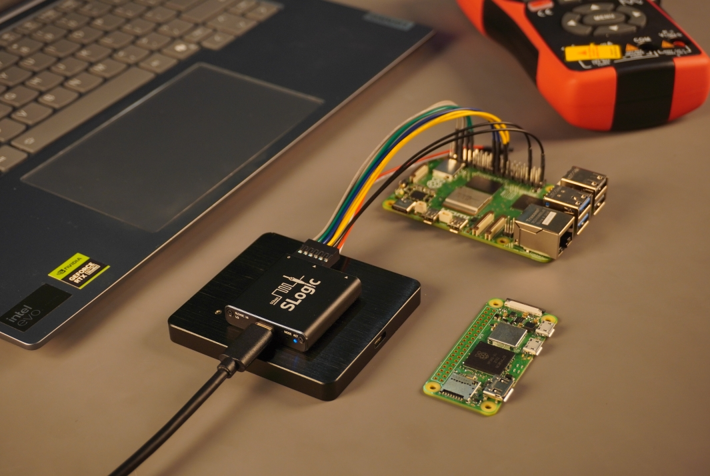

# Introduction

---

## Introduction
The SLogic16U3 is a next‑generation USB3 logic analyzer. In a compact 40×40×10 mm housing it delivers high sample rates over a 5 Gbps USB3 interface: 800M@4CH, 400M@8CH, 200M@16CH. It supports 0–10V signal input, configurable voltage trigger thresholds from 0–6V, and software triggering — starting at only $69.


---

## Features & Specifications
| Attribute | SLogic Combo8 | SLogic16U3 | SLogic32U3 |
| - | - | - | - |
| Model | SLogic Combo8 | SLogic16U3 | SLogic32U3 |
| USB Type | USB2.0 | USB3.0 | USB3.2 Gen2 |
| Max Sample Rate | 80M | 800M | 1500M |
| Max Channels | 8 | 16 | 32 |
| Max Bandwidth | 0.3Gbps | 3.2Gbps | 6.4Gbps |
| Typical Comb. (stream, unlimited) | 80M@4CH, 40M@8CH | 800M@4CH, 400M@8CH, 200M@16CH | 1500M@4CH, 800M@8CH, 400M@16CH, 200M@32CH |
| Sigrok Compatible | Y | Y | Y |
| Adjustable Threshold | N | Y | Y |
| Case | Plastic | Aluminum | Aluminum |
| Extra Feature | DAP-Link, CK-Link, 4-UART |  | Extend ADC -> Oscilloscope |
| Size | 20x40x10mm | 40x40x10mm | 50x50x10mm |
| Price | $15 | $69 | $149 |

---

## Product Images

- size: 40x40x10mm
- view: top/front/rear
<div style="display: flex; flex-wrap: wrap; gap: 10px; width: 100%;">
  
  
  
  
  
  
</div>

---

## Software installation

### Supported OS

- Windows 10/11 (x86_64)
  - The native .exe program is limited by Windows USB driver issues and currently only reaches just over 390 MB/s, so it cannot achieve the target 400 MB/s bandwidth and must be throttled to 400M@4CH, 200M@8CH, 100M@16CH.
  - If you’re using a Windows PC and want to achieve the full 400 MB/s bandwidth, you can install a Linux virtual machine to perform full‑speed captures.
  <details class="indent">
    <summary><b>另 Linux 虚拟机可满速运行</b></summary>
    
  </details>
- Linux (x86_64)
  - **Necessary preparation:** [How do I set up udev rules for Linux?](./FAQ.html#How-do-I-set-up-udev-rules-for-Linux%3F)
- macOS (Apple Silicon M4)

### Downloads
- Binary downloads: https://dl.sipeed.com/shareURL/SLogic
- Source code (slogic-dev branch): https://github.com/sipeed/libsigrok/tree/slogic-dev

#### Windows

- Extract the portable archive and double-click `pulseview.exe` to launch.
- To enable debug mode, run in terminal:
```cmd
pulseview-debug.exe -l5
```


#### Linux

```bash
chmod +x Pulseview.appimage
./Pulseview.appimage
# ./Pulseview.appimage -l5   # enable debug mode
```


#### macOS

- Download and open `Pulseview.dmg` to run directly.


---

## Related links
- Buy (Taobao): https://item.taobao.com/item.htm?id=994512536278
- Buy (AliExpress): https://www.aliexpress.com/item/1005010321792670.html
- MaixHub: [maixhub.com](https://maixhub.com/discussion/slogic)
- Support email: support@sipeed.com
- GitHub (libsigrok slogic-dev): https://github.com/sipeed/libsigrok/tree/slogic-dev
- Sipeed GitHub: https://github.com/sipeed
- GitHub (SLogic16U3 Tools): https://github.com/sipeed/slogic16u3-tools
- Community (Discord): https://discord.com/channels/1359800784375644291/1359802057569206323
