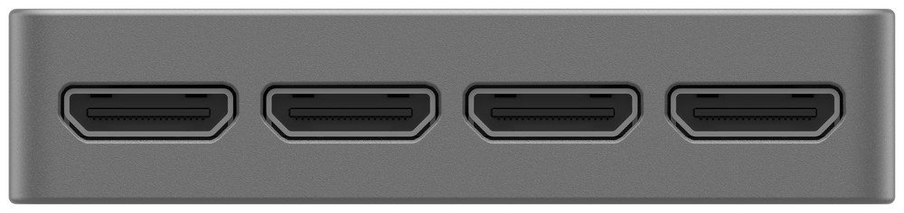
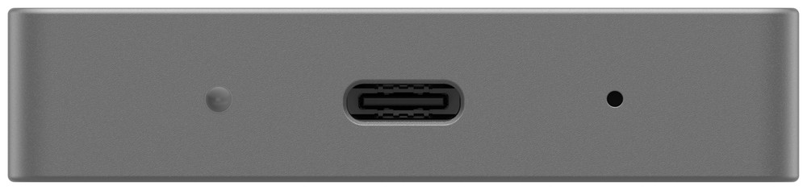
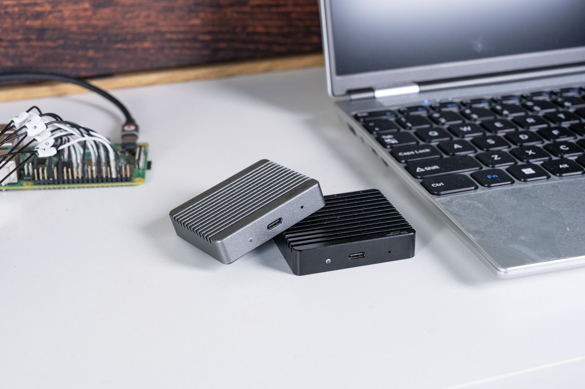
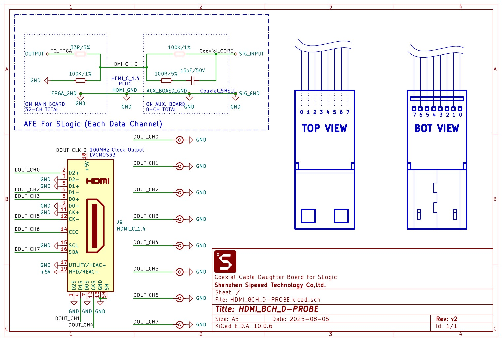
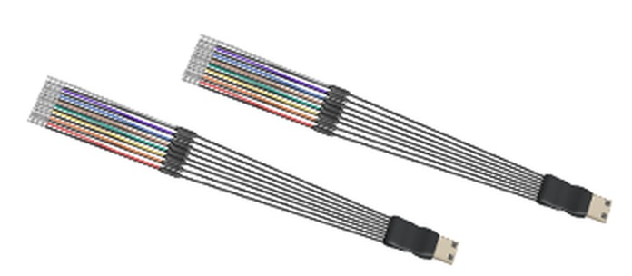
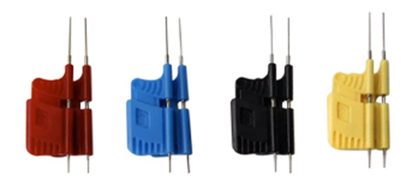
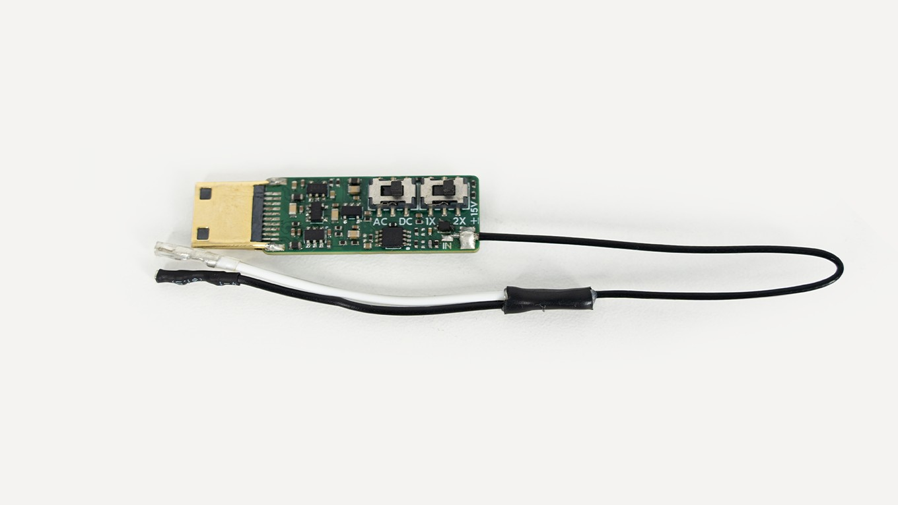

# Hardware Guide

This page covers the SLogic32U3 hardware interfaces, accessories, indicators, firmware update and probing essentials. For software use see the [Software Guide](./Software_User_Guide.md); to get started see the [Quick Start](./Quick_Start.md).

---

## Hardware Overview


The SLogic32U3 is a one-piece CNC aluminum enclosure, 59 × 51 × 13 mm, with surface fins for both cooling and grip. All connectors are at the two ends of the body:

- **Front**: 4 × Mini-HDMI channel-group ports, labeled 0–3
- **Rear**: USB-C connector, ACT indicator, MODE pinhole button

### Port overview

**Front: four Mini-HDMI channel ports**



The 32 channels are split into 4 groups of 8, routed out through coaxial shielded probe cables. Port-to-channel mapping:

| Port | Channels |
| - | - |
| 0 | CH0 – CH7 |
| 1 | CH8 – CH15 |
| 2 | CH16 – CH23 |
| 3 | CH24 – CH31 |

Each Mini-HDMI (HDMI Type-C 1.4) port carries 8 data lines + GND + VCC(+5V) + CK. **The GND / VCC / CK of the four groups are shared from one source**, not independent per group.

**Rear: USB-C, indicator and MODE button**



- **USB-C**: USB3.2 Gen2. A 10 Gbps USB3 port is required for the rated rate, and **USB2.0 capture is not supported**. Prefer a direct USB-C connection; the bundled C-to-A adapter adds insertion loss.
- **ACT indicator**: see [ACT Indicator](#act-indicator) below.
- **MODE button**: a recessed pinhole button, see [MODE Button](#mode-button) below.
- **CK**: a 100 MHz LVCMOS33 **fixed clock output**, not adjustable, output only.

### How to connect

1. Connect the device **directly** to a **10 Gbps USB-C port** (usually marked `SS10` or `10`) with the bundled cable. The port spec directly sets the capture rate; see [Quick Start · Connect the device](./Quick_Start.md#connect-the-device).
2. A **cyan** indicator means powered and a healthy USB3 link.
3. Plug the Mini-HDMI probe cables into the channel groups you need.
4. Clip the test clips onto the signals and ground.



### Getting started

Once connected, launch any of SLogicView / ngscopeclient / sigrok-cli to capture. On first use, complete the [driver and permission setup](#drivers-and-permissions) first.

---

## Channels and Probe Cables

- The 32 channels are split into 4 groups of 8, each merged into **one Mini-HDMI** connector.
- **Probe cable structure**: a coaxial-cable daughter board at the front (8 channels per board, one Mini-HDMI). Each signal runs on a 15 cm coaxial line — core = signal (digital input impedance ~100 kΩ), shield = signal ground — ending in a PTFE jumper wire.
- Coaxial shielding cuts crosstalk and improves high-speed signal integrity markedly over plain jumper wires — one of the reasons the SLogic32U3 reaches 350 MHz digital bandwidth.
- **Mini-HDMI is keyed**, goes in one way only and cannot be reversed.
- **VCC**: Mini-HDMI provides a +5 V output (shared across the four groups) to power small DUTs, **never short it to GND**.

### Channel colors

Each group of 8 leads is distinguished by 8 different colors, arranged in channel order, so you can **determine the channel number just by counting from the first lead**. The typical order is:

<table>
  <tr><th>In-group index</th><th>1</th><th>2</th><th>3</th><th>4</th><th>5</th><th>6</th><th>7</th><th>8</th></tr>
  <tr>
    <th>Typical color</th>
    <td style="background:#e03131;color:#fff;text-align:center">Red</td>
    <td style="background:#f76707;color:#fff;text-align:center">Orange</td>
    <td style="background:#f2d024;color:#333;text-align:center">Yellow</td>
    <td style="background:#2f9e44;color:#fff;text-align:center">Green</td>
    <td style="background:#8a5a2b;color:#fff;text-align:center">Brown</td>
    <td style="background:#1c7ed6;color:#fff;text-align:center">Blue</td>
    <td style="background:#ffffff;color:#333;text-align:center;border:1px solid #ccc">White</td>
    <td style="background:#adb5bd;color:#fff;text-align:center">Gray</td>
  </tr>
</table>

> Each group always has 8 colors, but which colors and in what order may vary slightly between production batches. The table above is the typical order; go by the actual cable in hand.

The four groups share the same color scheme, so tell groups apart by the Mini-HDMI port label, or use the included numbered heat-shrink tubes for a lasting mark.

---

## Mini-HDMI Pinout and AFE

Each group of 8 channels is merged through a coaxial-cable daughter board into one Mini-HDMI (HDMI Type-C 1.4) connector.

### The pin rule

The rule is simple: **odd pins are all GND, even pins are all signal.**

This matches the physical shape of a Mini-HDMI plug: **the long side of the trapezoid is all odd pins, the short side all even pins.** So once you spot which way the trapezoid faces, you know which side is ground and which is signal.

The nine even pins 2–18 are, in order, the 8 channels plus one clock output:

| Pin | Function | | Pin | Function |
| :-: | - | - | :-: | - |
| **2** | CH0 | | **12** | CH5 |
| **4** | CH1 | | **14** | CH6 |
| **6** | CH2 | | **16** | CH7 |
| **8** | CH3 | | **18** | CLK output (100 MHz LVCMOS33, fixed, output only) |
| **10** | CH4 | | odd pins | GND |

> Channel numbers are in-group. Ports 0–3 map to CH0–7 / CH8–15 / CH16–23 / CH24–31, so pin 2 on port 2 is actually CH16 of the whole unit.
>
> **The GND / VCC(+5V) / CK of the four groups are shared from one source**, not independent per group.

### Daughter-board schematic



The front-end network per signal on the daughter board: the coaxial core goes through **100 kΩ** in series with **100 Ω + 15 pF** to ground; on the main-board side it then goes through **33 Ω** in series into the FPGA with a **100 kΩ** pull-down.

### Putting a Mini-HDMI on your own board?

> [!WARNING]
> **Be sure to include the AFE circuit.**
>
> The Mini-HDMI connector is just a connector; the SLogic32U3 input characteristics (100 kΩ input impedance, bandwidth, overshoot suppression) come from the AFE network on the probe daughter board. If your board solders signals straight to the Mini-HDMI pins and omits the AFE, you get:
>
> - input impedance off spec, loading the DUT more;
> - overshoot and ringing on fast edges, distorted waveforms, decode errors;
> - possible damage to the device input in extreme cases.
>
> Replicate the network inside the `AFE For SLogic (Each Data Channel)` dashed box in the schematic above, on **every data channel**.

---

## Accessories

### Included in the box

| Item | Qty | Notes |
| - | - | - |
| Mini-HDMI coaxial probe cable | × 4 | 15 cm coaxial shielded + PTFE jumper, 8 channels each |
| Logic analyzer test clips | × 32 | general clips for standard headers and component leads |
| USB-C data cable | × 1 | with a C-to-A adapter |
| Labeled heat-shrink tubes | × 32 | numbered, slip them onto the cables yourself |



### Optional: fine hook clips



The included clips suit standard headers and larger leads. For fine-pitch packages, the optional **Fine-Pitch Micro Hook Clips** help:

- grip **0.65 mm pitch TSSOP pins**, and also SOP, SSOP and other fine-pitch packages.
- finer, springier hooks that grab a pin directly without slipping off or catching an adjacent pin.
- multiple colors, easy to match channel numbers.

> For dense-chip debugging (fine-pitch SOP/TSSOP, QFP edge pins) a set is well worth having — far more reliable than reaching for a pin with the standard clips.

---

### Optional: ADC oscilloscope module

The SLogic32U3 can take an optional 4-channel ADC module that uploads the sampled pins **as 8-bit analog signals**, turning the same device into a sampling oscilloscope.

| Item | Specification |
| - | - |
| Channels | 4 |
| Resolution | 8-bit |
| Sample rate | 100 MSa/s |
| Analog bandwidth | 10 MHz |
| Safe input voltage | ±15 V |
| Input impedance | set by the probe |



To enable it: configure in the ngscopeclient UI. Once on, the 32U3 merges D0–7 / D8–15 / D16–23 / D24–31 into 4 analog channels A0–A3 (8-bit). See [ngscopeclient](../ngscopeclient/ngscopeclient.md).

---

## ACT Indicator

The indicator is a 3-color RGB: **blue = power, green = USB LINK, red = run state**, mixing into different colors.

### Colors and meaning

| State | Color | Notes |
| - | - | - |
| Normal connection | Cyan (blue+green) | powered and USB3 link established |
| Data transfer | Cyan + fast red blink | capturing |
| DFU mode | Cyan + slow red blink | firmware-update mode |

### Fault states

| Symptom | Likely cause | Action |
| - | - | - |
| Blue only | USB3 link not established | change the USB3 cable / port; avoid poor extension cables and USB2 hubs |
| Red only | Flash load error | excessive cable drop or a hardware issue; if it persists after a cable swap, contact support |
| Nothing lit | Not powered | check the cable and port are powering the device |

---

## MODE Button

**MODE is a recessed pinhole button** on the rear, pressed with a SIM-eject or similar pin. It toggles between APP (logic analyzer) and DFU (firmware update) modes.

- On power-up it enters **APP mode**, the normal logic-analyzer operating mode.
- Pressing MODE switches to **DFU mode**; the indicator starts a slow blink and you can flash firmware.

---

## Firmware Update

The SLogic32U3 supports Easy OTA; firmware can be updated online.

### Update steps

1. Press MODE to enter DFU mode and wait for the slow blink.
2. Confirm an "SLogic DFU" device appears on the PC.
3. Run the flashing tool, pick the firmware file as prompted, and flash it.
4. Replug the device after flashing; it returns to APP mode.

> **The SLogic32U3 firmware has not been released yet**; it will be provided on the [download site](https://dl.sipeed.com/shareURL/SLogic) after release.
>
> The flashing tool is shared with the SLogic16U3: [slogic16u3-tools](https://github.com/sipeed/slogic16u3-tools/releases/latest).

---

## Probing and Signal Integrity

For a high-speed logic analyzer, most of the measurement quality comes down to how you wire it.

### Grounding is key

- At low frequency and few channels, a single shared ground is fine.
- As frequency and channel count rise, ground-lead inductance drops voltage across the ground and degrades the measurement.
- **At high speed, run one ground per signal, close by** — the single most effective way to improve waveform quality.
- **Never tie a ground lead to a signal line** — it may damage the device.

### Threshold voltage

Set the threshold to the DUT's logic level. Common values:

| Logic level | Suggested threshold |
| - | - |
| 1.2 V | 0.6 V |
| 1.8 V | 0.9 V |
| 2.5 V | 1.25 V |
| 3.3 V | 1.6 V |
| 5 V | 2.5 V |

If unsure of the level, measure with a multimeter or scope first.

### Other notes

- **Input range 0 – 10 V**; always confirm the hardware limit before exceeding it.
- Mini-HDMI coaxial shielded cable suits high-speed signals better than jumpers; prefer coax at high speed.
- Keep probe leads short and avoid coiling them.

---

## Safety Notes

- **VCC**: Mini-HDMI provides a +5 V output (shared across the four groups); **never short it to GND**.
- When used with a mains-powered PC, the probe ground ties to the PC ground. Connect only to equipotential ground points and **never to a hot ground**, or you may damage the device or create a hazard.
- Do not repeatedly plug/unplug probe cables while powered.
- Because of the large 10 Gbps data volume, the enclosure gets fairly warm under continuous use, possibly near 50 °C — this is normal.

---

## Drivers and Permissions

### Windows: driver-free (WinUSB)

The SLogic32U3 is a WinUSB device by default; Windows 10/11 is plug and play, **no Zadig, no manual driver install**. Just run SLogicView or ngscopeclient after plugging in.

> The native Windows host apps have **no software-side bandwidth or sample-rate cap**; the achievable rate depends only on the physical machine. Unlike the SLogic16U3's early native Windows exe with its rate limit, the 32U3 does not need a Linux VM on Windows to reach full bandwidth.

### Linux: udev rules

A normal user has no USB access by default; install the udev rule once (device VID is `359f`):

```bash
sudo tee /etc/udev/rules.d/60-sipeed.rules <<'EOF'
SUBSYSTEM!="usb|usb_device", GOTO="sipeed_rules_end"
ACTION!="add", GOTO="sipeed_rules_end"
ATTRS{idVendor}=="359f", MODE="0666", GROUP="plugdev", TAG+="uaccess", ENV{ID_MM_DEVICE_IGNORE}="1"
LABEL="sipeed_rules_end"
EOF
sudo udevadm control --reload && sudo udevadm trigger
```

> On Arch, change `GROUP="plugdev"` to `GROUP="uucp"`. Replug the device once for the rule to take effect.

### macOS

SLogicView, ngscopeclient and sigrok-cli all provide a macOS build. If the first launch is blocked, allow it under System Settings → Privacy & Security.
