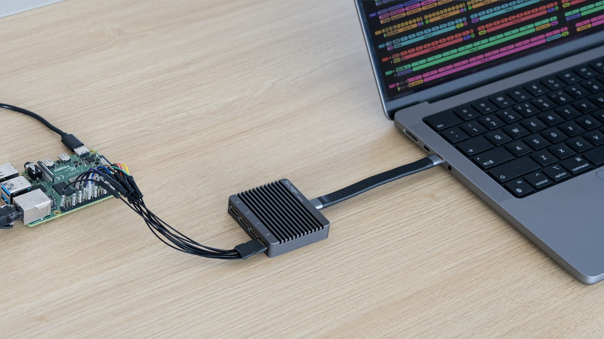
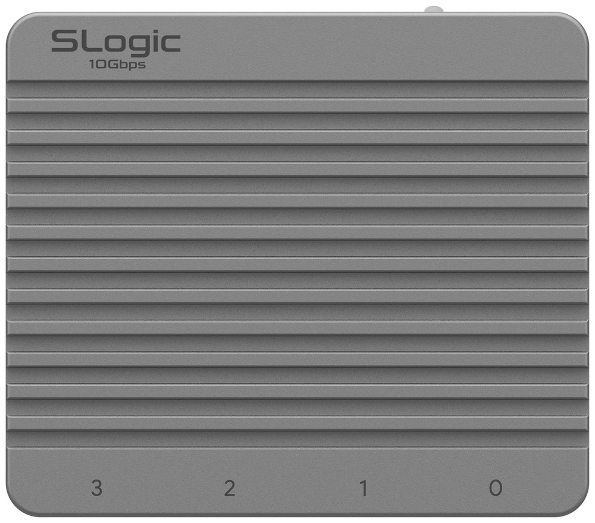
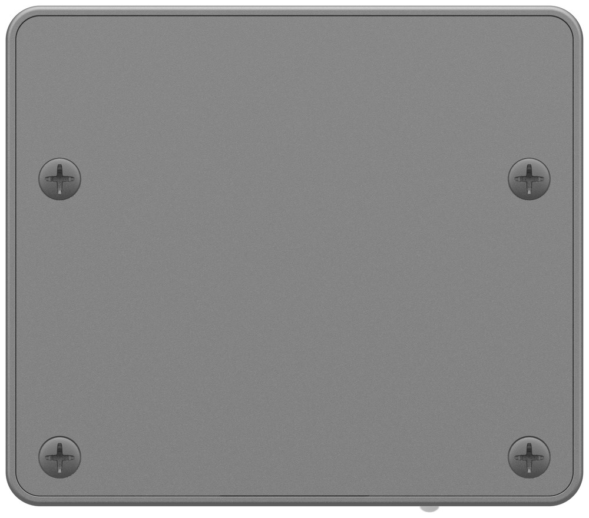
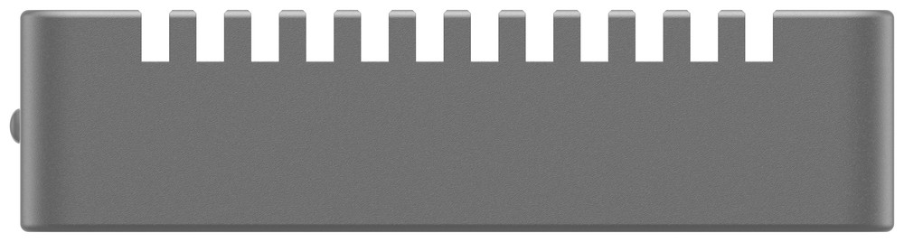
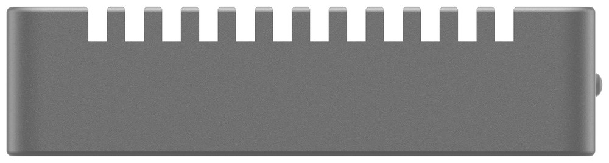
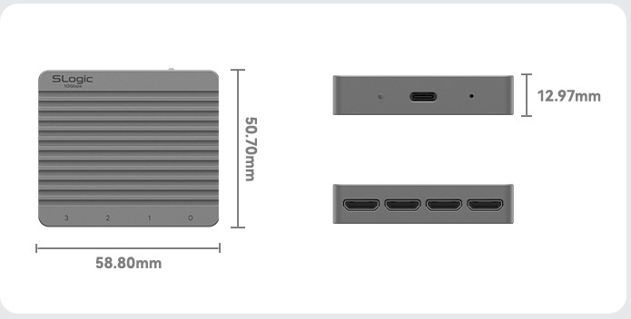
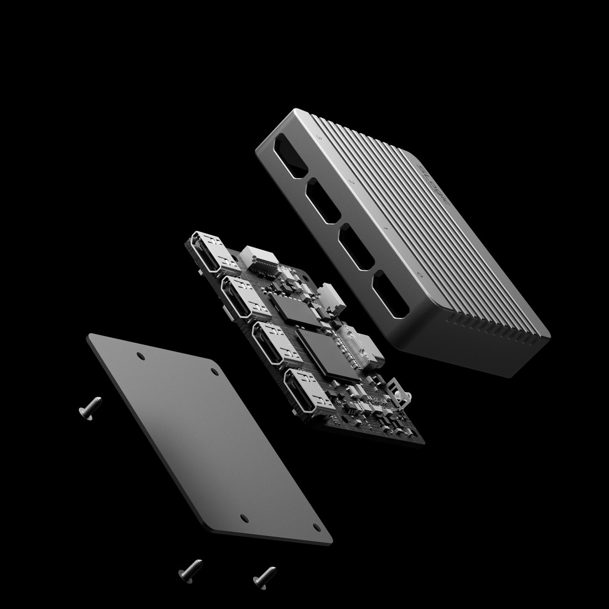

# Introduction

---

## Overview

The SLogic32U3 is the flagship logic analyzer of the Sipeed SLogic series, and the world's first logic analyzer with a USB3.2 Gen2 interface. In a 59×51×13 mm CNC aluminum enclosure it delivers 32-channel high-speed Stream capture: 1400M@4CH, 800M@8CH, 400M@16CH, 200M@32CH, with a **digital signal bandwidth up to 350 MHz**.

Backed by the USB3.2 Gen2 interface and an onboard 2 Gbit DDR3 elastic buffer, it sustains 800 MB/s (6.4 Gbps) in practice, streaming waveforms straight into your PC's memory or even disk, no longer bound by device-side buffer depth. Digital inputs accept a 0–10 V range with a 0–6 V adjustable threshold, and an optional 4-channel ADC module gives the same device sampling-oscilloscope capability.

On the host side, Sipeed officially provides SLogicView, ngscopeclient and sigrok-cli, plus the install-free web app **SLogicWeb** ([slogic.sipeed.com](https://slogic.sipeed.com)) — you can capture right in a browser, even on an Android phone.

> New to the device? Start with the [Quick Start](./Quick_Start.md).

---

## Features and Specifications

### Key features

1. **USB3.2 Gen2 high-speed interface**: The world's first USB3.2 Gen2 logic analyzer. Interface line rate 10 Gbps, and with the onboard 2 Gbit DDR3 elastic buffer it **sustains 800 MB/s (6.4 Gbps) in practice**, keeping high sample rates even at high channel counts.
2. **32 channels / up to 1400 MSa/s**: 1400M@4CH, 800M@8CH, 400M@16CH, 200M@32CH, covering everything from single-bus debugging to multi-lane parallel bus analysis.
3. **350 MHz digital signal bandwidth**: Enough for SD UHS-I, eMMC HS200, Octal-SPI and other high-speed buses.
4. **Adjustable threshold + wide input range**: 0–10 V digital input, 0–6 V adjustable logic threshold (0.1 V steps), matching 1.2V / 1.8V / 2.5V / 3.3V / 5V and other logic levels.
5. **Mini-HDMI coaxial shielded probes**: The 32 channels are split into 4 groups of 8, each group merged into one Mini-HDMI connector; the 15 cm coaxial shielded cable markedly improves high-speed signal integrity over plain jumper wires.
6. **Optional ADC → oscilloscope**: An optional 4-channel ADC module (8-bit, 100 MSa/s, 10 MHz analog bandwidth, ±15 V safe input) turns the same device into a sampling oscilloscope for mixed-signal observation.
7. **Multiple host apps + install-free web app**: Choose SLogicView (default), ngscopeclient or sigrok-cli as needed; the web app **SLogicWeb** needs no install and runs on Android too.
8. **Easy OTA**: Firmware can be updated online.

### Technical specifications

| Item | Specification |
| :--- | :--- |
| Digital channels | 32 |
| Max sample rate | 1400 MSa/s (4CH) |
| Rate–channel tiers | 1400M@4CH · 800M@8CH · 400M@16CH · 200M@32CH |
| Digital signal bandwidth | 350 MHz |
| USB interface | USB3.2 Gen2 x1 / Gen1 x1 / 2.0 HS (10 Gbps line rate) |
| Actual stream rate | 800 MB/s (6.4 Gbps) |
| Stream FIFO buffer | 2 Gbit DDR3 |
| Capture mode | Stream (real-time readback); depth limited by PC memory/disk |
| Input voltage range | 0 – 10 V |
| Adjustable threshold (Vth) | 0 – 6 V, 0.1 V steps (below Vth = 0, above = 1) |
| Input impedance | 100 kΩ (digital input) |
| Trigger | Multi-channel / multi-edge combinations (SLogicView, sigrok-cli) |
| Optional ADC module | 4 channels, 8-bit, 100 MSa/s, 10 MHz analog bandwidth, ±15 V safe input |
| Connectors | 4 × Mini-HDMI (HDMI Type-C 1.4, 8 channels each, coaxial shielded) + USB-C |
| Probe cable | 15 cm coaxial shielded cable + PTFE jumper wire |
| Power | USB powered, rated 5 V @ 65 mA |
| Enclosure / size | CNC aluminum, 59 × 51 × 13 mm |
| Compatible software | SLogicView, ngscopeclient, sigrok-cli, web app SLogicWeb; plus the community app ALL LOGIC |
| Supported OS | Windows 10/11 x64, Linux x86_64, macOS (Apple Silicon), Android (browser) |
| Easy OTA | Yes |

### Ecosystem at a glance

The host apps ship together in the [SLogic release package](https://github.com/sipeed/SLogic/releases/latest):

| Host app | Position | Best for |
| - | - | - |
| **SLogicView** | Sipeed's own, maintained GUI, **the default** | Most people |
| **ngscopeclient** | GPU-accelerated, Filter Graph, mixed signal | Advanced analysis; ADC oscilloscope mode |
| **sigrok-cli** | Command line | Automation / CI / headless capture / AI Agent |
| **SLogicWeb (web)** | Runs in a browser, **no install** | Quick debugging, **Android phones**, no software |
| ALL LOGIC | A fine community app, built on DSView | Users familiar with DSView / DSLogic |

See the [Software Guide](./Software_User_Guide.md) for detailed usage and how to choose.

### SLogic series comparison

| Attribute | SLogic Combo8 | SLogic16U3 | SLogic32U3 |
| - | - | - | - |
| USB version | USB2.0 HS | USB3.2 Gen1 x1 | USB3.2 Gen2 x1 |
| Digital channels | 8 | 16 | 32 |
| Max sample rate | 80M | 800M | 1400M |
| Typical (stream) | 80M@4CH, 40M@8CH | 800M@4CH, 400M@8CH, 200M@16CH | 1400M@4CH, 800M@8CH, 400M@16CH, 200M@32CH |
| Actual stream rate | 320 Mbps | 4 Gbps | 6.4 Gbps (800 MB/s) |
| Stream FIFO buffer | 48 Kibit SRAM | 128 Kibit BSRAM | 2 Gbit DDR3 |
| Digital bandwidth | 40 MHz | 200 MHz | 350 MHz |
| Probe cable | Jumper wire | Coaxial + jumper | 15 cm coaxial + PTFE jumper |
| sigrok compatible | Y | Y | Y |
| Adjustable threshold | N | Y | Y |
| Easy OTA | N | N | Y |
| Enclosure | Plastic | Aluminum | Aluminum |
| Extras | DAP-Link, CK-Link, 4× UART | — | Expandable ADC → oscilloscope |
| Size | 20x40x10mm | 40x40x10mm | 59x51x13mm |

---

## Product Views

- Size: 59 × 51 × 13 mm
- Enclosure: CNC aluminum with surface heat-dissipation fins

**Top / Bottom**

  
  

**Front: four Mini-HDMI channel-group ports (labeled 0–3)**

**Rear: USB-C connector, ACT indicator, MODE pinhole button**

**Left / Right**

  
  

### Dimensions

### Exploded view

---

## Links

- Buy (crowdfunding): https://www.kickstarter.com/projects/zepan/slogic32u3-the-worlds-first-10gbps-usb32-logic-analyzer/
- Web app: https://slogic.sipeed.com
- Support email: support@sipeed.com
- QQ group: **932085922**
- Community (Discord): [discord.gg/V4sAZ9XWpN](https://discord.gg/V4sAZ9XWpN)
- X / Twitter: [@SipeedLab](https://x.com/SipeedLab)
- GitHub (SLogic host apps): https://github.com/sipeed/SLogic
- GitHub (web app SLogicWeb): https://github.com/sipeed/SLogicWeb
- GitHub (libsigrok slogic-dev branch): https://github.com/sipeed/libsigrok/tree/slogic-dev
- Sipeed GitHub: https://github.com/sipeed
