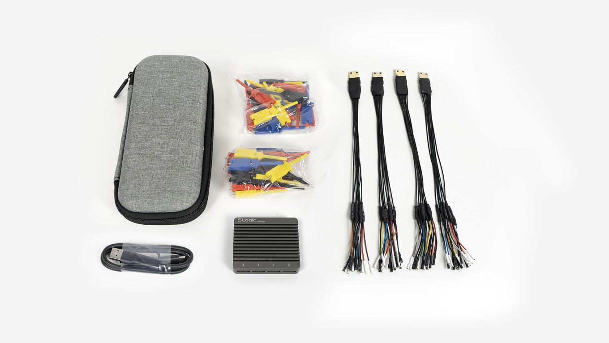
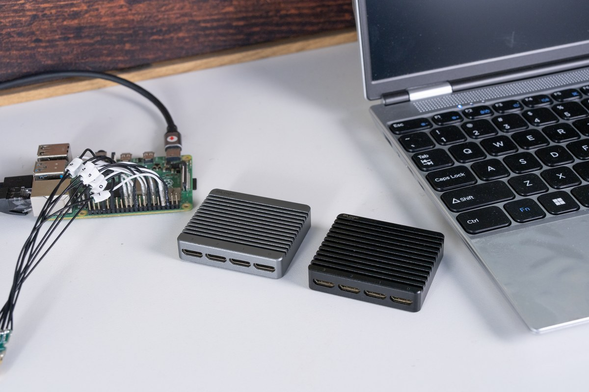
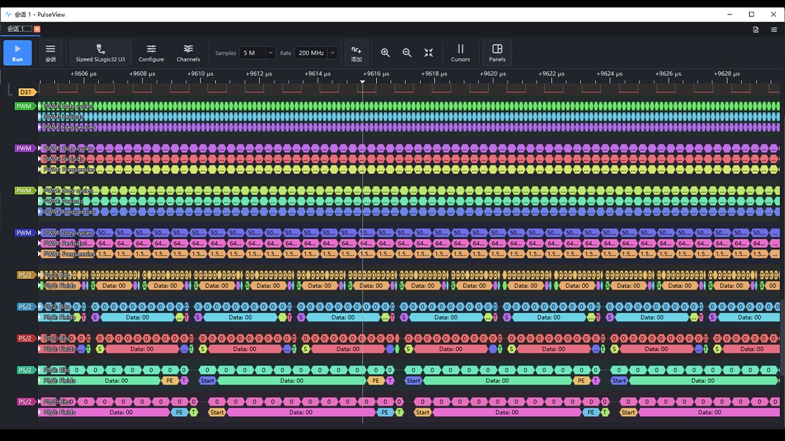

# Quick Start

This page takes the shortest path to your first capture. For hardware details see the [Hardware Guide](./Hardware_Specification.md), for the full feature set of each host app see the [Software Guide](./Software_User_Guide.md), and for problems see the [FAQ](./FAQ.md).

---

## 1. Unboxing

The box contains:

| Item | Qty | Notes |
| - | - | - |
| SLogic32U3 unit | × 1 | CNC aluminum enclosure |
| Mini-HDMI coaxial probe cable | × 4 | 15 cm coaxial shielded, 8 channels each, 32 channels in total |
| Logic analyzer test clips | × 32 | one per channel |
| USB-C data cable | × 1 | with a C-to-A adapter |
| Carry case | × 1 | for transport and organizing accessories |
| Labeled heat-shrink tubes | × 32 | numbered, slip them onto the cables yourself to mark channels |

For optional accessories see [Hardware Guide · Accessories](./Hardware_Specification.md#accessories).

---

## 2. Install the software

Several host apps are available for the SLogic32U3. **Use SLogicView by default** — it is Sipeed's own, maintained GUI and the baseline for this documentation.

Download the package for your platform from the [GitHub Release](https://github.com/sipeed/SLogic/releases/latest):

| Platform | File suffix | How to run |
| - | - | - |
| Windows 10/11 x64 | `SLogicView-SLogic-x.y.z-windows-x86_64.exe` | run the installer |
| Linux x86_64 | `SLogicView-SLogic-x.y.z-linux-x86_64.AppImage` | `chmod +x`, then run |
| macOS (Apple Silicon) | `SLogicView-SLogic-x.y.z-macos-arm64.dmg` | open the dmg, drag the app into Applications |

> **Don't want to install anything?** Just open **[slogic.sipeed.com](https://slogic.sipeed.com)** in a browser — no install, no driver, works even on an Android phone. See [Software Guide · SLogicWeb](./Software_User_Guide.md#slogicweb-web-app).

---

## 3. Drivers and permissions

| Platform | What to do |
| - | - |
| Windows | **Nothing.** The device is a WinUSB device, plug and play, no Zadig |
| Linux | **Required** once: install the udev rule, or a normal user cannot see the device. See the [Hardware Guide](./Hardware_Specification.md#linux-udev-rules) |
| macOS | Usually nothing; if first launch is blocked, allow it under System Settings → Privacy & Security |

---

## 4. Connect the device

> [!WARNING]
> **Use a 10 Gbps USB port.** The port spec directly determines the capture rate:
>
> - Only a **USB3.2 Gen2 (10 Gbps)** port can sustain 800 MB/s and reach the rated rate combinations.
> - A USB3.0 / 3.1 Gen1 (5 Gbps) port will be clearly below expectation.
> - **USB2.0 capture is not supported.** It will not work on a USB2.0 port.
>
> A 10 Gbps port is usually marked `SS10` or `10`. Blue alone is not reliable — many blue ports are only 5 Gbps. Check your motherboard or laptop spec.

> [!TIP]
> **Prefer a direct USB-C connection.** The bundled cable includes a C-to-A adapter for A ports, but the adapter adds insertion loss and lowers signal quality. On a weaker PC this can keep the rate from reaching full speed. Use the USB-C port directly when you can.

Steps:

1. Connect the SLogic32U3 **directly** to a 10 Gbps USB-C port with the bundled cable; avoid unpowered hubs and front-panel ports.
2. A **cyan** indicator (blue+green) means powered and a healthy USB3 link.
   - Blue only means the USB3 link is not established, usually a non-USB3 cable or port. See the [FAQ](./FAQ.md).
3. Plug the Mini-HDMI probe cables into the channel groups you need; ports 0–3 map to CH0–7 / CH8–15 / CH16–23 / CH24–31. Mini-HDMI is keyed and goes in one way only.

---

## 5. Wiring and grounding

- Each group of 8 probe leads is color-coded in channel order; just count from the first lead. See [Channel colors](./Hardware_Specification.md#channel-colors).
- Clip the test clips onto the signals, and **run one ground per signal, close by**.
- **Never tie a ground lead to a signal line** — it may damage the device.
- The higher the frequency and the more channels, the more grounding matters. See [Probing and signal integrity](./Hardware_Specification.md#probing-and-signal-integrity).

---

## 6. First capture

Capturing one UART line, for example:

1. Launch the host app and pick the **Sipeed SLogic Analyzer** device in the top-left.
2. Set the **sample rate**: 10–100× the signal frequency is recommended. For a 115200-baud UART, 10 MHz is plenty.
3. Set the **capture depth** (Samples): try 1 M first.
4. Set the **voltage threshold**: for 3.3 V logic, about 1.6 V.
5. Enable only the channels actually wired — fewer channels allow a higher sample rate.
6. Click **Run** to capture.

---

## 7. View and decode

> The figures here use PulseView screenshots from the same code base; SLogicView works the same way. They will be updated to SLogicView screenshots in a later revision.

1. After capture, zoom with the scroll wheel and pan by dragging with the left button.
2. Click **Add protocol decoder** on the toolbar and choose `UART`.
3. In the decoder settings, map `RX` to the wired channel and enter baud 115200, 8 data bits, no parity, 1 stop bit.
4. The decoded result is overlaid as annotations below the waveform.

---

## 8. Next steps

- Hardware interfaces, accessories, indicators, firmware update, signal integrity → [Hardware Guide](./Hardware_Specification.md)
- Differences between host apps and the web app, triggers, decoding, command line → [Software Guide](./Software_User_Guide.md)
- GPU acceleration and mixed-signal analysis → [ngscopeclient](../ngscopeclient/ngscopeclient.md)
- Let AI run capture and decoding for you → [SLogic with an AI Agent](../slogic_agent/readme.md)
- Troubleshooting → [FAQ](./FAQ.md)
