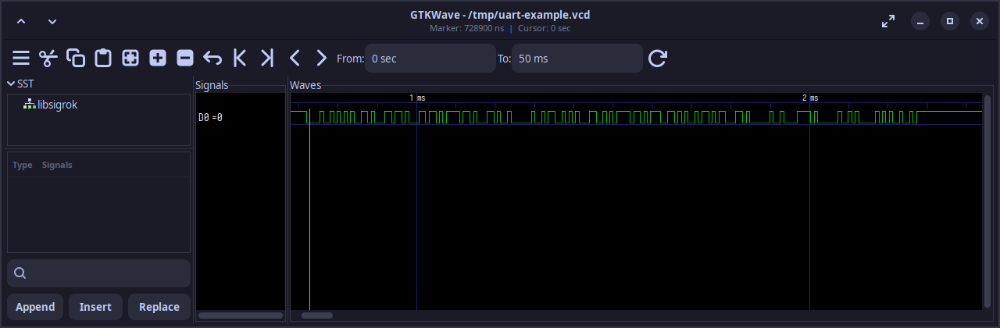
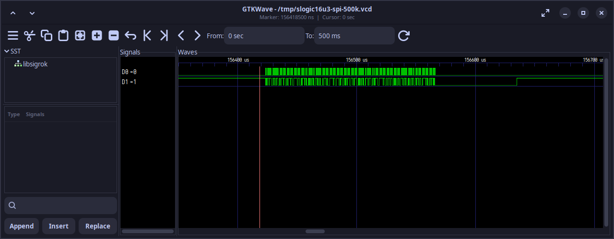

With `sigrok-cli-slogic-plugin` installed, you do not need to learn PulseView first. Connect the logic analyzer, then tell an Agent that supports Plugins or Skills which channels are connected, which protocol you expect, and what you want to find. The Agent can use `sigrok-cli` to scan the device, capture an `.sr` waveform, and decode it with libsigrokdecode. For example:

> SLogic D0 is connected to UART RX. The format is 115200 8N1. Scan the device first, capture 50 ms at 10 MHz, save the original waveform, and decode the received characters.

Before connecting anything, verify the signal voltage and electrical safety requirements described in [Before Connecting SLogic](#before-connecting-slogic).

## Supported Models

The current Sipeed SLogic Series includes:

| Product | Status |
|---|---|
| SLogicCombo8 | [Product page](../combo8/readme.md) |
| SLogic16U3 | [Product page](../slogic16u3/Introduction.md) |
| SLogic32U3 | In internal testing; not yet available |

Channel count, sample rates, input ranges, and configuration options vary by model. Ask the Agent to scan the connected device and read its capabilities before choosing capture parameters.

The captures in this guide were verified on Linux x86_64 with SLogicCombo8 and SLogic16U3. Release binaries, USB drivers, and hardware capture have not yet been verified on Windows or macOS.

## Workflow at a Glance

1. Install the Plugin by giving its link to the Agent.
2. Ask the Agent to download and verify the SLogic build of `sigrok-cli`.
3. Check the hardware mode, wiring safety, and USB permissions.
4. On the first connection, scan the device and inspect its capabilities without capturing.
5. Specify the channels, sample rate, and capture limit, then capture an `.sr` waveform.
6. Specify the decoder, pin mapping, and options, then verify the decoded result.

If you already have an `.sr` waveform, start at step 6. The logic analyzer does not need to be connected for offline decoding.

## What the Plugin Can Do

`sigrok-cli-slogic-plugin` is an OpenAI plugin that contains one Skill named `sigrok-cli-slogic`. Its capabilities correspond to these wrapper operations:

| Operation | Description |
|---|---|
| `scan` | Scan devices and list only matches whose names contain SLogic or DSLogic |
| `show` | Read the selected device's channels and configuration capabilities |
| `capture` | Perform a bounded capture by duration, sample count, or frame count and save it as `.sr` |
| `decoder-show` | Query a libsigrokdecode decoder's required and optional pins, options, and annotations |
| `decode` | Decode an existing `.sr` file with explicit decoder pin mappings and options |
| `decode --stack` | Add higher-level decoders in order, such as `eeprom24xx` on top of I²C |
| `capture -- ...` | Pass additional channel, sample-rate, trigger, and other capture arguments to `sigrok-cli` |
| `run --` | Pass operations not covered by the wrapper directly to `sigrok-cli` |

The Skill follows these rules:

- If no matching device is found, it stops before capture. If multiple devices are found, one must be selected first.
- After a capture, the Agent should report the absolute `.sr` path and the actual command.
- After decoding, the Agent should report the decoder, pin mapping, options, and whether annotations were produced.
- Decoding an existing `.sr` file does not require a connected analyzer. Only scanning, querying a device, and capturing require USB access.

The Plugin does not include an MCP server, network service, `sigrok-cli`, USB driver, or GTKWave. The Plugin itself also does not predict protocols. When the protocol or wiring is unknown, the AI model can use waveform characteristics, circuit information, and context to propose candidate protocols and signal mappings. After those candidates are confirmed, the Skill runs the specified decoder with explicit pin mappings. See [Unknown Protocol or Wiring](#unknown-protocol-or-wiring).

## Install the Plugin

The Plugin requires Python 3.10 or later. The Agent must be able to run local commands, read and write the working directory, and access USB devices.

You do not need to download, extract, or copy the Plugin manually. Give the Plugin URL directly to an Agent that supports Plugins:

> Install this SLogic plugin: `https://dl.sipeed.com/fileList/SLogic/sigrok-cli-slogic-plugin.zip`. When installation is complete, check whether `sigrok-cli-slogic` is loaded and tell me whether a restart is required. Do not access USB devices or start a capture yet.

If the Agent asks you to restart it, restart and then say:

> Check whether `sigrok-cli-slogic` is loaded. Explain which operations it supports, but do not access USB devices or start a capture yet.

The Skill is loaded if the Agent recognizes `$sigrok-cli-slogic` and can explain the purpose of scan, show, capture, and decode.

## Prepare the SLogic Build of sigrok-cli

SLogic will provide a platform-specific `sigrok-cli` package:

| System | Distribution file |
|---|---|
| Linux | `sigrok-cli-SLogic-xxxx.AppImage` |
| Windows | `sigrok-cli-SLogic-xxxx.exe` |
| macOS | `sigrok-cli-SLogic-xxxx.dmg` |

Give the [SLogic download site](https://dl.sipeed.com/shareURL/SLogic) to the Agent. Ask it to download the latest build for the current system and keep it in a permanent tools directory. Replace `<tools-directory>` with any location where you want the tool to remain available:

> Open the SLogic download site at https://dl.sipeed.com/shareURL/SLogic, identify the current operating system, and download the latest matching `sigrok-cli-SLogic` release to `<tools-directory>`. Do not overwrite an existing version. Complete any preparation required to run it, save the absolute executable path in the global configuration so that `sigrok-cli-slogic` can use it later, then run a version check and `decoder-show uart`. Report the configuration result. Do not scan devices or start a capture.

After verification, the Agent should retain the executable path in its global configuration. Later scans, captures, and decodes can use that configuration directly. Users do not need to remember the path or understand the package layout for each operating system.

## Before Connecting SLogic

### Check the Hardware Mode and Wiring Safety

- SLogicCombo8 supports several operating modes. For logic-analyzer mode, press the button until the indicator is blue. On Linux, `lsusb` can be used to check for `USB TO LA`.
- Connect the logic analyzer GND securely to the target GND. Keep the ground lead short and close to the signal test point.
- Verify that every measured signal is within the input range of the SLogic model. If the voltage is unknown, measure it with a multimeter or oscilloscope first.
- The VCC pin on SLogic16U3 is a 3.3 V power output, not a signal input.
- A USB-connected logic analyzer shares ground with the computer. Use a suitable USB isolator when measuring a high-voltage system or a device that must not share ground with the computer. Do not connect the analyzer if the safety conditions are uncertain.

Input ranges, thresholds, and pin definitions differ between models. Read the relevant product page before connecting signals. The UART example in this guide uses only D0 and GND.

### Configure Linux USB Permissions

If a regular user cannot scan the device, install this udev rule:

```bash
sudo tee /etc/udev/rules.d/60-sipeed.rules <<'EOF'
SUBSYSTEM!="usb|usb_device", GOTO="sipeed_rules_end"
ACTION!="add", GOTO="sipeed_rules_end"
ATTRS{idVendor}=="359f", MODE="0666", GROUP="plugdev", TAG+="uaccess"
ENV{ID_MM_DEVICE_IGNORE}="1"
LABEL="sipeed_rules_end"
EOF

sudo udevadm control --reload
sudo udevadm trigger
```

On Arch Linux, replace `GROUP="plugdev"` with `GROUP="uucp"`. Reconnect SLogic after applying the rule, then ask the Agent to scan again. Running the program with `sudo` is useful only for diagnosing a permission problem; it is not recommended for routine use.

## First Connection: Scan Only

After connecting SLogic, scan it and inspect its capabilities before capturing:

> Use `$sigrok-cli-slogic` with the configured SLogic build of `sigrok-cli`. Scan the connected SLogic and inspect the selected device. Do not capture. Report the device identifier, channels, supported sample rates, and configuration options.

The Agent should:

1. Confirm that the `sigrok-cli` path in the global configuration exists and is executable.
2. Scan for SLogic or DSLogic devices.
3. If exactly one device is found, inspect its capabilities.
4. If multiple devices are found, list their complete scan specs and wait for a selection.
5. If no device is found, stop without starting a capture.

Verify at least these fields:

| Item | Why it matters |
|---|---|
| Complete device identifier | Selects the correct target when multiple devices are connected |
| Channel names | Decoder pins must map to real waveform channels |
| Supported sample rates | The requested value must be supported by the device |
| Channel and bandwidth limits | Enabling more channels usually reduces the maximum available sample rate |
| Configuration options | Threshold and trigger support depends on the model |

Choose capture parameters from the current device's `show` output. Do not copy parameters from another SLogic model without checking them.

## How to Describe a Capture

Every capture must have a finite limit. Duration, sample count, and frame count are mutually exclusive. If none is specified, the Plugin defaults to 1000 ms, but an explicit limit is still recommended.

| Information | What to specify |
|---|---|
| Target device | Model or complete identifier from the scan result |
| Wiring | Which D channel is connected to each protocol signal |
| Expected protocol | UART, I²C, SPI, or another decoder ID |
| Protocol parameters | Baud rate, SPI mode, bit order, CS polarity, and similar settings |
| Capture limit | One of duration, sample count, or frame count |
| Sample rate | A supported value; ask the Agent for a recommendation if unknown |
| Output file | A filename such as `uart-test.sr` |
| Desired result | Characters, addresses, data, warnings, sample positions, or a waveform image |

Capture duration, sample count, and sample rate are related by:

```text
capture duration (seconds) = sample count / sample rate (Hz)
```

For example, 500000 samples at 10 MHz represent 50 ms. SLogic product documentation recommends a sample rate roughly ten times higher than the measured signal frequency. The actual choice also depends on signal quality, the protocol decoder, and device bandwidth. Unused channels consume USB bandwidth, so enable only the channels required for the capture.

If the sample rate is unknown, say:

> D0 is expected to carry 115200-baud UART, but I do not know which sample rate to use. Read the sample rates supported by the device, explain your recommendation, and wait for my confirmation before capturing.

If protocol parameters are also unknown, list known and unknown items separately. The Agent should obtain the required information instead of trying every protocol and parameter combination.

## Complete Example: Capture and Decode UART

This example uses SLogicCombo8 to capture the TX signal from a CH341. The signal is connected to D0 and uses UART 115200 8N1, LSB first.

### Wiring

```text
CH341 TX  -> SLogicCombo8 D0
CH341 GND -> SLogicCombo8 GND
```

The captured signal is transmitted by the CH341. From the decoder's point of view, it is data received by the analyzer, so it is mapped as `rx=D0`.

### Check the Device and Parameters

> Use `$sigrok-cli-slogic`. SLogicCombo8 is in blue-indicator logic-analyzer mode. D0 is connected to CH341 TX, and both grounds are connected. Scan the device and confirm that D0 and a 10 MHz sample rate are available. Check only; do not capture.

Review the scan and show results before capturing.

### Capture the Raw Waveform

> Use the SLogicCombo8 that was just verified. Enable only D0, capture 500000 samples at 10 MHz, and save the result as `capture-combo8-500k.sr`. Do not overwrite an existing file; stop and tell me if that filename already exists. Report the absolute path and actual command when complete.

The capture uses:

- Channel: D0
- Sample rate: 10 MHz
- Sample count: 500000
- Duration: 50 ms
- Output: `capture-combo8-500k.sr` in the current working directory

`--output` accepts only a filename in the current directory, not an absolute path or subdirectory. If no filename is specified, the Plugin generates a timestamped `.sr` filename.

### Decode UART

> Decode `capture-combo8-500k.sr`. First query the UART decoder's pins, options, and annotations. Map `rx` to D0 and use 115200 baud, 8 data bits, no parity, 1 stop bit, and LSB first. Output RX characters, warnings, and sample positions, and save the text as `decoded-uart.txt`.

The Agent should report:

- Decoder: UART
- Decoder pin mapping: `rx=D0`
- Baud rate, data bits, parity, stop bits, and bit order
- Whether decoding produced annotations
- Decoded text and warnings
- Absolute input and output paths
- Actual command

The test source transmitted `Hello, SLogic x AI` every 10 ms. The 50 ms waveform decoded five complete messages, 90 characters in total, with no warnings.

### Generate a Waveform Image Only When Needed

Decoder text is the authoritative source for protocol content, so an image is usually unnecessary. GTKWave is optional and is not a Plugin dependency. If GTKWave is installed, say:

> Convert D0 in `capture-combo8-500k.sr` to VCD, use GTKWave to frame the first complete UART message, and save it as PNG. Do not modify the original `.sr` file.

`sigrok-cli` exports `.sr` to VCD, while GTKWave displays digital levels. VCD does not contain the UART character annotations produced by libsigrokdecode; use `decoded-uart.txt` for the decoded text.



## Complete Example with a Trigger: Capture and Decode SPI

SPI decoding requires the clock, data signals, mode, and bit order. Map CS only when a valid CS signal was captured.

This example uses a CH341 to send SPI data and SLogic16U3 to capture it:

```text
CH341 CLK  -> SLogic16U3 D0
CH341 MOSI -> SLogic16U3 D1
CH341 CS   -> SLogic16U3 D3
CH341 GND  -> SLogic16U3 GND
```

The transmitter uses `/dev/spidev1.0`, SPI mode 0, 500 kHz, and 8-bit words. The test script, `spi_test.py`, sends 24 bytes:

```text
hello, SLogic from SPI.\n
```

Capture and transmission must run concurrently. The Agent starts the capture, waits for a D3 trigger, and then runs the transmitter:

> Use `$sigrok-cli-slogic` with the connected SLogic16U3. D0 is CLK, D1 is MOSI, D3 is CS, and both grounds are connected. Enable only D0, D1, and D3. Capture for 1000 ms at 10 MHz, configure a rising-edge trigger on D3 and wait for the trigger, and save the result as `slogic16u3-spi-500k.sr`. After the capture begins waiting, run `spi_test.py` to transmit once through `/dev/spidev1.0`. Report the waveform path, actual sample count, and actual command.

After capture, ask the Agent to decode it:

> Decode `slogic16u3-spi-500k.sr`. Map `clk` to D0, `mosi` to D1, and `cs` to D3. Use active-high CS, SPI mode 0, LSB first, and 8-bit words. Output MOSI data, warnings, and sample positions.

In the verified waveform, SPI clock activity begins after D3 rises, and D3 returns low when the transfer ends. The decoder therefore uses active-high CS. It decoded all 24 bytes with no warnings, exactly matching the UTF-8 bytes sent by the script:

```text
68 65 6C 6C 6F 2C 20 53 4C 6F 67 69
63 20 66 72 6F 6D 20 53 50 49 2E 0A
```

Keep these points in mind:

- Derive the trigger edge and CS polarity from the actual waveform. This example uses a rising-edge trigger on D3 and `cs_polarity=active-high`. Copying the common active-low setting produces no decoder output for this signal.
- This example requires `LSB first` to reproduce the transmitted bytes. If CPOL, CPHA, bit order, or CS polarity is unknown, check the device datasheet, schematic, or firmware configuration. An empty decode does not prove that no SPI traffic occurred.

The following image was generated by exporting the `.sr` capture to VCD and displaying a section of the 500 kHz CLK (D0) and MOSI (D1) signals in GTKWave:



## Analyze an Existing Waveform

An existing `.sr` file can be decoded without connecting SLogic or capturing again. For example:

> Use `$sigrok-cli-slogic` to analyze `capture.sr` in the current directory without accessing USB devices. D0 is UART RX; decode it as 115200 8N1. Query the UART decoder first, then report the pin mapping, options, characters, warnings, and sample positions.

The same `.sr` file can be analyzed repeatedly with different decoder parameters. Keep the original capture; changing a baud rate or pin mapping does not require another capture.

## Prompt Patterns for Other Protocols

These prompts illustrate what information to provide. Adjust channels, sample rate, duration, and protocol parameters for the connected device and measured signal.

### UART

Specify the data direction, channel, baud rate, data bits, parity, stop bits, and bit order. For one-way capture, map the signal to either `rx` or `tx`:

> D0 is connected to the target device TX, and both grounds are connected. Check the device capabilities, then capture 100 ms at 10 MHz. Query the UART decoder, map `rx` to D0, and decode characters, warnings, and sample positions as 115200 8N1, LSB first.

### I²C

At minimum, specify the channels for SCL and SDA:

> D0 is SCL and D1 is SDA. Confirm that the device supports both channels, capture 100 ms at 10 MHz, and save it as `i2c-test.sr`. Map `scl` to D0 and `sda` to D1, then decode addresses, read/write direction, ACK/NACK, data, and warnings.

For an EEPROM or another higher-level protocol, stack the corresponding decoder on top of I²C only after confirming that the base I²C decode is correct.

### SPI

Specify CLK, MOSI/MISO, optional CS, SPI mode, bit order, word size, and CS polarity. A known CS signal can also provide a trigger:

> D0 is CLK, D1 is MOSI, and D3 is CS. Determine the CS polarity from its idle and active levels, then capture 1000 ms at 10 MHz and wait for the edge that asserts CS. Map `clk`, `mosi`, and `cs` to the corresponding channels and decode MOSI data, warnings, and sample positions using SPI mode 0, LSB first, and 8-bit words.

### PWM

The PWM decoder requires one `data` channel and can use active-high or active-low polarity to report duty cycle, period, and frequency. Capture several complete cycles:

> D0 is connected to an active-high PWM signal, and both grounds are connected. Read the supported sample rates and select a bounded capture that covers at least 20 complete cycles. Query the PWM decoder, map `data` to D0, set `polarity` to `active-high`, and output duty cycle, period, frequency, and sample positions.

## Unknown Protocol or Wiring

If the wiring or protocol is unknown, ask the AI Agent to analyze the waveform first. The model can combine level changes, timing, channel relationships, circuit information, and context to propose candidate protocols and signal mappings. This is an Agent analysis capability, not protocol prediction provided by the Plugin. Confirm a candidate protocol, its parameters, and pin mappings before invoking a decoder. For example:

> The functions of D0 and D1 are unknown. Analyze level changes, timing, and the relationship between these channels. List possible protocols and the evidence for each. Do not run a decoder yet; also list the protocol parameters and pin mappings that must be confirmed first.

## Verify the Agent's Result

A complete task should report at least:

| Result | What to verify |
|---|---|
| Device | Complete scan spec, especially when multiple devices are connected |
| Capture | Channels, sample rate, and duration/sample count/frame count |
| Waveform | Absolute path to the `.sr` file |
| Decode | Decoder, pin mapping, and all options |
| Content | Whether annotations were produced and the requested characters or data |
| Errors | Warnings, error messages, and corresponding sample positions |
| Reproduction | Actual capture command; decoder, mappings, and options used for decoding |

Empty decoder output means only that the current decoder, pin mapping, and options produced no annotations. It does not prove that the waveform contains no communication. Check for waveform edges, channel mapping, sample rate, and protocol parameters in that order.

## Troubleshooting

### The Agent Does Not Recognize the Plugin

Send the Plugin URL to the Agent again and ask for complete errors from the download, installation, and loading stages. The package root must contain `.codex-plugin/plugin.json`; do not install only one file from the package. Restart the Agent if requested, then check `$sigrok-cli-slogic` again.

### sigrok-cli Cannot Be Found

Give the complete download or execution error to the Agent. Ask it to check that the file is complete, the saved location is correct, the current system can execute it, and the global configuration points to the actual executable. For example:

> `sigrok-cli-slogic` cannot find or run the configured `sigrok-cli-SLogic`. Check the download, saved path, execution permissions, actual executable location, and global configuration. After fixing it, run a version check and `decoder-show uart`. Do not scan devices or start a capture.

### The Version Command Works but Decoders Do Not Load

The distribution may be missing libsigrokdecode, decoder modules, or their Python environment. Ask the Agent to run `decoder-show uart` and preserve the complete error. A successful `--version` command alone does not verify decoder support.

### No Device Is Found

Check:

- Whether SLogicCombo8 is in blue-indicator logic-analyzer mode
- USB cable, port, and power
- Whether the operating system can see the USB device
- Whether `sigrok-cli` includes the SLogic driver
- Linux udev permissions or the Windows USB driver

You can say:

> Preserve the complete scan output and error. Determine whether the executable is missing, the SLogic driver is unavailable, USB permission is denied, or no device is present. Do not start a capture.

### The Sample Rate Is Rejected

Ask the Agent to run `show` again and check the enabled channel count and available sample rates. Disable unused channels and select a supported rate. Do not reuse another model's parameters without verification.

### Decoding Is Empty or Garbled

Check in this order:

1. Whether the raw waveform contains edges
2. Whether decoder pins map to the correct channels
3. Whether the sample rate is sufficient
4. UART baud rate, data bits, parity, stop bits, and bit order
5. SPI CPOL, CPHA, bit order, and CS polarity
6. Grounding, input threshold, and signal integrity

Keep the original `.sr` file and change only decoder parameters. Do not overwrite the only capture.

### Capture Completes but the Process Does Not Exit

SLogicCombo8 may occasionally remain running during endpoint cleanup. Confirm that the `.sr` file was written completely before terminating the process and reconnecting the device. Do not disconnect the device while the file is still being written.

## Safety and Operational Limits

- `capture` accesses a USB device and creates an `.sr` file. Confirm the device, wiring, capture limit, and filename before running it.
- Use only one of `--time-ms`, `--samples`, and `--frames`; its value must be greater than 0.
- `--output` accepts only a filename in the current working directory, not an absolute path or subdirectory.
- `decode --output` writes decoder text to the current directory. Check whether an existing file with the same name must be preserved.
- Do not capture if no device is found. Select a target first if multiple devices are found.
- Do not decode until the expected protocol and required decoder pin mappings are known.
- `run --` passes arguments directly to `sigrok-cli` without checking capture limits or output paths. Use it only for advanced operations not covered by the wrapper.
