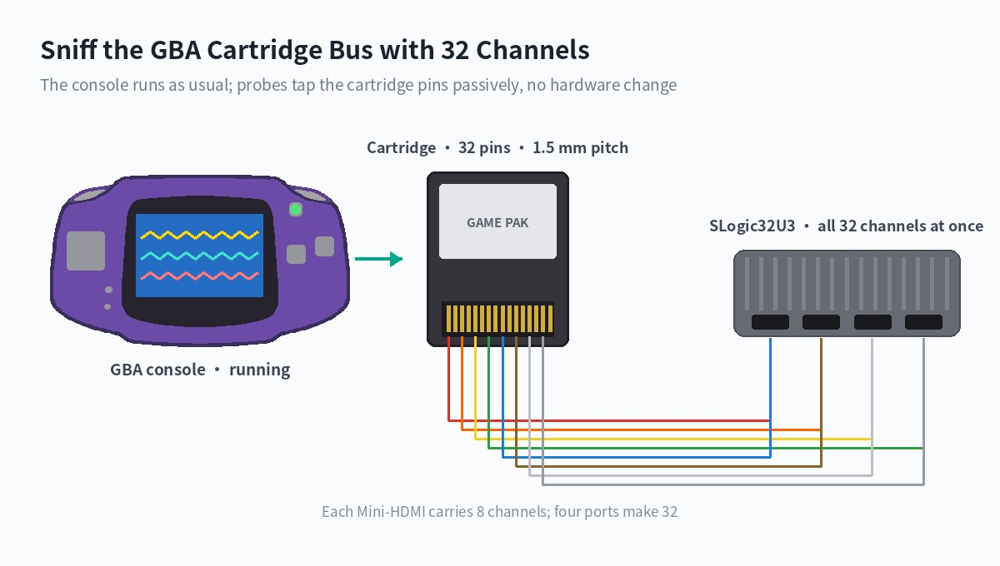
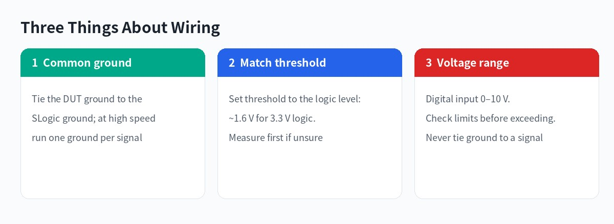
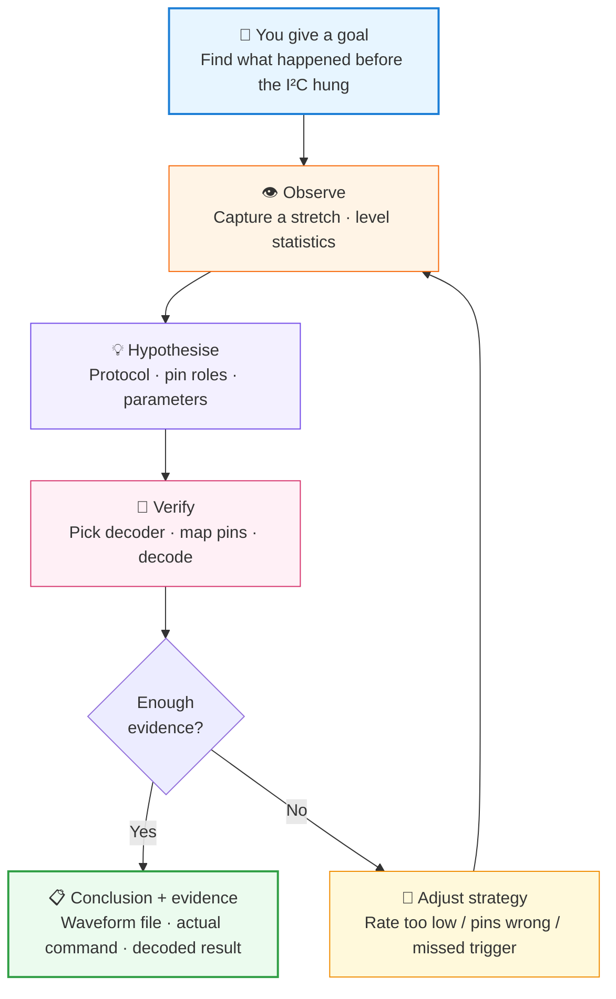
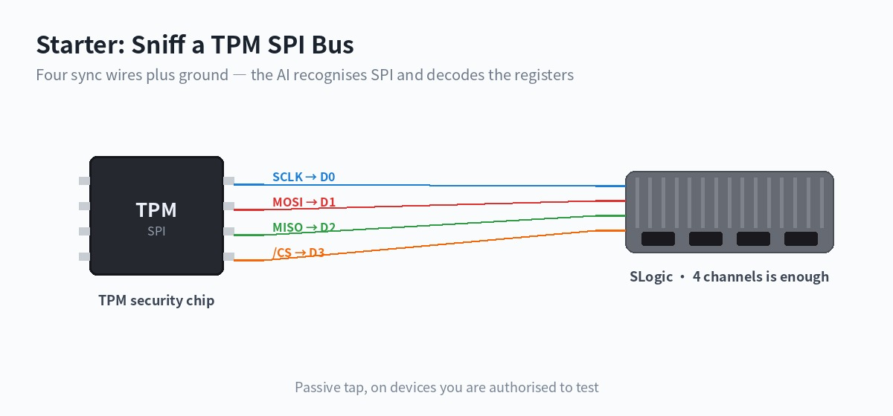
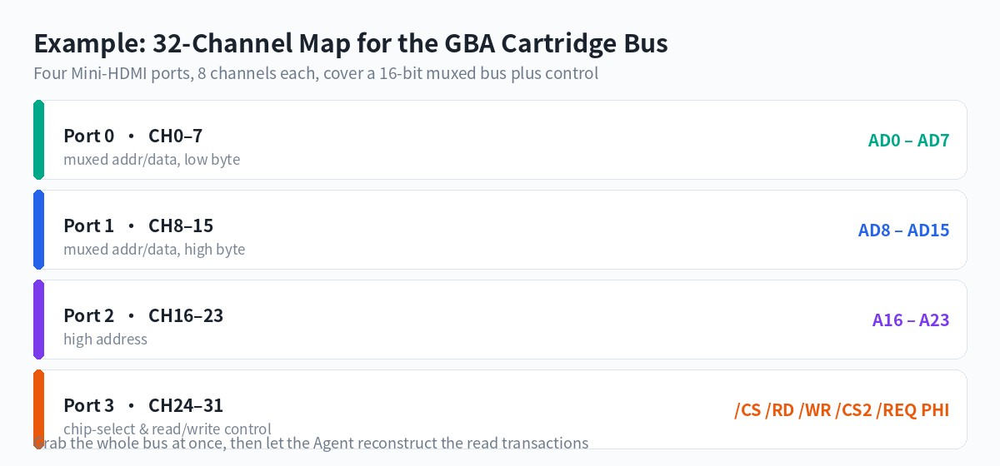

For thirty years the way we use a logic analyzer has barely changed: **you set the parameters, it draws the waveform, and then you read it yourself.**

Which sample rate, which channels, which trigger, how to map the decoder pins — every step needs you to already know the answer. The instrument only records levels faithfully; **making sense of the signal rests entirely on the engineer.**

SLogic takes a different route. Connect an AI Agent and what you hand to the instrument is no longer parameters but a **goal**:

> This board's I²C hangs now and then. Help me find what happened right before it hung.

> This is a bus I have never seen, 32 lines are toggling. Analyse its protocol structure.

> Read the program out of this cartridge, and verify the read is correct.

The rest is up to the Agent: decide what to capture and how fast, how to trigger, review the result, raise the sample rate and recapture if edges are too coarse, swap the pin mapping and re-decode if a guess was wrong — until it produces a conclusion that is **evidenced and reproducible**.

This is not translating natural language into button presses. It is handing the whole loop of **observe, hypothesise, verify, converge** to the machine. SLogic's role shifts from "recorder" to the Agent's **sensing front end**.



> Just want a quick look and would rather not install anything? Open **[slogic.sipeed.com](https://slogic.sipeed.com)** in a browser — no install, works even on an Android phone. This page is about the other route: handing the analysis itself over.

---

## What It Can Do For You

The four scenarios below are the ones that cost the most time the old "set params, read waveform" way, and gain the most once an Agent steps in.

### Reverse an unknown bus

You have a device with no documentation, just a row of lines that move.

The old way is probing each line by hand, guessing periods, trying decoders, round after round. The Agent instead captures a stretch across many channels, then reasons from **level statistics**: which line looks like a clock (stable period, fixed duty), which like a chip-select (mostly high, occasionally low and bracketing a burst), which lines toggle together during that window (data bus), which climb monotonically (address bus).

With that hypothesis it picks a decoder to verify, and revises and retries when verification fails. You only answer a few confirming questions.

### Hunt an intermittent fault

A bug that shows up once every few hours is the most draining kind.

In Stream mode the SLogic32U3 capture length is limited only by your disk, so the Agent can keep capturing for a long time, decoding as it goes, **filtering for the anomaly you described**: a checksum error, a missing ACK, an abnormal frame gap, a state machine stuck mid-state. When it catches one, it keeps the surrounding context, not just a bare "something went wrong".

### Protocol conformance and regression

After a firmware change you need to confirm the timing was not broken.

The Agent can capture, decode and compare with the same parameters again and again, and tell you "this build diverges from the last one starting at this frame", instead of two waveforms for you to eyeball.

### Offline waveform review



A `.sr` file captured in the field can be handed to the Agent afterwards, **with no device connected**. Captured by a colleague, months ago, even on a different model — as long as it is a sigrok format, it can be reviewed.

---

## How It Works

The Agent does not fill the parameters right in one shot. It **runs a loop**:


```mermaid
flowchart TD
    G["🎯 You give a goal<br/>Find what happened before the I²C hung"] --> O
    O["👁 Observe<br/>Capture a stretch · level statistics"] --> HY
    HY["💡 Hypothesise<br/>Protocol · pin roles · parameters"] --> V
    V["🔬 Verify<br/>Pick decoder · map pins · decode"] --> C{"Enough<br/>evidence?"}
    C -- Yes --> R["📋 Conclusion + evidence<br/>Waveform file · actual command · decoded result"]
    C -- "No" --> ADJ["🔧 Adjust strategy<br/>Rate too low / pins wrong / missed trigger"]
    ADJ --> O

    style G fill:#e7f5ff,stroke:#1c7ed6,stroke-width:2px
    style O fill:#fff4e6,stroke:#f76707
    style HY fill:#f3f0ff,stroke:#7048e8
    style V fill:#fff0f6,stroke:#d6336c
    style ADJ fill:#fff9db,stroke:#f08c00
    style R fill:#ebfbee,stroke:#2f9e44,stroke-width:2px
```

The word that matters is **loop**. In the old flow, "the sample rate was too low" is something you only discover after reading the waveform, then redo by hand; the Agent realises edges are too coarse after a failed decode and recaptures faster. This round-by-round convergence is exactly how a human engineer works.

It must also produce an **evidence chain**: which device, which parameters, the actual command run, where the `.sr` file is. The conclusion can be reproduced and challenged, not just "I think it is I²C".

> The reasoning comes from the model itself; the Plugin only faithfully runs scan, capture and decode. **The Plugin does not guess the protocol for you** — the model proposes, you confirm, the Plugin verifies.

Want to see it on a real circuit straight away? Jump to the [case studies](#case-studies): one SPI starter, one 32-channel GBA cartridge reverse.

---

## Two Integration Paths

The SLogic ecosystem offers two ways to bring AI into debugging; pick by need:

| Path | How it works | Good for |
|---|---|---|
| **sigrok-cli Plugin** (this page) | The Agent drives the command-line `sigrok-cli` to scan, capture and decode | Any Plugin/Skill-capable Agent; scriptable and reproducible |
| **ALL LOGIC built-in MCP** | The community GUI [ALL LOGIC](https://github.com/sipeed/ALL-LOGIC) exposes an MCP interface for an AI client to drive its capture and decode | You prefer a GUI and want AI to operate inside it |

The two do not conflict and can be installed together. This page covers only the first.

---

## Quick Start

Three steps, ten minutes.

### 1. Install the Plugin

Send the link to a Plugin/Skill-capable Agent and let it install:

> Please install this SLogic plugin: `https://dl.sipeed.com/fileList/SLogic/sigrok-cli-slogic-plugin.zip`. After installing, check whether `sigrok-cli-slogic` is loaded and tell me if a restart is needed. Do not access USB devices or start capturing yet.

### 2. Get sigrok-cli ready

> Open the SLogic Release page (https://github.com/sipeed/SLogic/releases/latest), identify the current OS, download the latest `sigrok-cli-SLogic` for it, and save it to `<tools dir>`. Finish the setup needed to run it, write the executable's absolute path to the global config, then run a version check and query the UART decoder to confirm the decoder loads. Report the result; do not scan devices or start capturing.

### 3. Handshake before work

The first time you connect a device, **scan only, do not capture**, so the Agent learns this device's capability envelope:

> Scan the connected SLogic and read the device capability. Do not capture. Report the device spec, channels, available sample rates and config options.

Once you have the capability list, you can start giving it real goals.

> Full install, permissions and platform differences are in [Appendix B](#appendix-b-setup).

---

## How to Ask for a Good Goal

The quality of what the Agent produces depends on whether you give it a **goal** or a **half-finished set of parameters**.

| Not great | Better |
| - | - |
| Capture 50 ms at 10 MHz | This UART is around 115200; confirm the baud rate and decode the content |
| Decode D0 as I²C | D0/D1 look like an I²C pair; the device occasionally does not ACK, find those frames |
| Capture 1 second | What happens between reset and the first transmission; focus on timing gaps |

These details save a lot of detours:

- **Wiring facts**: which line goes to which channel — the Agent cannot guess this
- **What you know**: voltage, rough rate, a protocol guess, even if unsure
- **What you want**: a conclusion, the data, or a reproducible script
- **Constraints**: how long a capture is acceptable, whether disk space is enough


If you do not even know the protocol, say so:

> The use of D0 and D1 is unknown for now. Analyse the level changes, periods and channel relationships in the waveform and list the likely protocols with your reasoning. Do not run a decoder yet; also list the protocol parameters and pin mapping still to be confirmed before decoding.

---

## Verify the Result

A complete task should report at least:

| Result | What to verify |
|---|---|
| Device | Complete scan spec, especially when multiple devices are connected |
| Capture | Channels, sample rate, and duration/sample count/frame count |
| Waveform | Absolute path to the `.sr` file |
| Decode | Decoder, pin mapping, and all options |
| Content | Whether annotations were produced and the requested characters or data |
| Errors | Warnings, error messages, and corresponding sample positions |
| Reproduction | Actual capture command; decoder, mappings, and options used for decoding |

Empty decoder output means only that the current decoder, pin mapping, and options produced no annotations. It does not prove that the waveform contains no communication. Check for waveform edges, channel mapping, sample rate, and protocol parameters in that order.

One principle: **the conclusion must be reproducible.** Given the `.sr` file and the actual command, you should be able to run it yourself and get the same result.

---

## Case Studies

Two cases, from starter to flagship. The starter SPI has only four wires — the "hello world" of protocol decoding; the flagship GBA muxed bus needs all 32 channels at once, something a low-channel analyzer simply cannot do.

### Starter: Decode a TPM SPI Bus

A TPM (Trusted Platform Module) is the security chip on a motherboard; it usually talks to the chipset over **SPI**. SPI is clean and regular — four wires plus a ground — which makes it ideal for seeing "how the AI decodes a bus from scratch".



> This is also a classic hardware-security demo: early on, several community authors used analyzers like the SLogic16U3 to capture TPM SPI traffic to illustrate that **an unencrypted TPM bus is a hardware-security risk**. That is exactly why TPM+PIN and bus encryption are now recommended. This case only demonstrates protocol decoding, for education; see the links at the end for the security research.

#### Wiring

SPI is a four-wire synchronous bus; with a ground that is five wires, within reach of any SLogic model:

```text
SCLK (clock)  -> D0
MOSI (DI)     -> D1
MISO (DO)     -> D2
/CS  (select) -> D3
GND           -> GND
```

#### The goal you give the Agent

Note that CPOL/CPHA, bit order and CS polarity are not told to it — let it work them out:

> D0–D3 carry an SPI bus — SCLK, MOSI, MISO, CS respectively — on a TPM chip. Capture some bus activity, first confirm it really is SPI, then auto-determine clock polarity, phase and bit order, and decode the byte streams on MOSI and MISO. If you can recognise the TPM register-access structure, tell me too.

#### What it should manage

- Frame transactions from CS going low and high, confirm a synchronous serial bus from the regular SCLK clock, and conclude it is **SPI**;
- Determine **CPOL / CPHA** from the SCLK idle level and sampling edge during CS;
- Decode the MOSI / MISO byte streams and recognise the TPM **TIS register addresses** (such as the fixed address prefixes of the status register and data FIFO), turning a byte string into "this is a read/write of a given register".

The SPI decoder already exists; the hard part is not decoding but **auto-determining the parameters** and **turning bytes into protocol meaning** — which is where the AI earns its place.

#### Choosing the sample rate

A TPM SPI clock is typically 10–66 MHz. At the rule-of-thumb 4x (10x preferred), cleanly capturing a 33 MHz bus calls for 200 MS/s or more. The SLogic32U3 reaches 800 MS/s on 8 channels, plenty of headroom. The Agent reads the device capability before fixing this value.

> Further reading (third-party security research, for background only): [Pulse Security: Extracting BitLocker keys from a TPM](https://pulsesecurity.co.nz/articles/TPM-sniffing), [WithSecure Labs: bitlocker-spi-toolkit](https://github.com/WithSecureLabs/bitlocker-spi-toolkit). Only do such research on devices you are **authorised to test**.

### Flagship: Reverse the GBA Cartridge Bus with 32 Channels

This is the example that best shows the value of 32 channels: **a 16-bit address/data muxed bus plus the full control signals, grabbed in one shot.**


#### Why it is hard

The Game Boy Advance cartridge port **multiplexes address and data on the same lines**: on the `/CS` falling edge, AD0–AD15 carry the low 16 bits of the address; then on each `/RD` pulse the same lines carry the 16 bits of read data, and the address auto-increments.

A low-channel analyzer can only capture it in several passes and stitch the timing by hand. 32 channels take the whole bus plus control lines at once, with the timing naturally aligned.

#### How the channels map



Exactly four Mini-HDMI ports, eight channels each, one to one.

#### The goal you give the Agent

Note that this gives a **goal and known conditions**, not capture parameters:

> The 32 channels of the SLogic32U3 are tapped onto the GBA cartridge pins: CH0–7 to AD0–7, CH8–15 to AD8–15, CH16–23 to A16–23, CH24–31 to /CS, /RD, /WR, /CS2, /REQ, PHI in order. The console is running a game. Capture a stretch of bus activity and analyse the read timing of this bus: when the address is valid, when the data is valid, and how the address increments. Give your reasoning.

The Agent scans the device for its capability, picks a sample rate fine enough to resolve the `/RD` pulses, then finds the pattern in the waveform.

#### What it should see

The GBA master clock is 16.78 MHz; under default wait states a sequential read is about every 179 ns, with `/RD` low for roughly half. **At 200 MS/s each read cycle has 35 sample points**, so the edges are very clear. The Agent should observe:

- a set of values on the AD lines at the `/CS` falling edge, then held;
- another set on the AD lines during each `/RD` low pulse, with **several `/RD` within one `/CS`**;
- after each `/RD` rising edge, treating AD as an address, a **monotonic +1**.

From this it derives the "address latch + sequential read + auto-increment" muxed-bus structure.

#### Going further: from bus to game

Once the timing is read and the data reconstructed, there is far more here than dumping a ROM. Because **what flows on the cartridge bus is exactly the instructions and data the CPU fetches each cycle**, decoding up the stack makes these possible:

- **Reconstruct the game screen live.** Track the CPU's reads of tiles, palette and OAM, and the DMA transfers, and you can **rebuild the picture on the GBA screen on your PC in real time** — without touching the display ribbon, from the cartridge bus alone.
- **Watch game variables live.** Lock onto a memory address (health, coins, a level counter), watch the reads and writes to it on the bus, and **read those key values in real time** while the game runs, even plot them.
- **Assist gameplay and debugging.** With a live picture and live variables you can build automated testing, external aids, speedrun timing, cheat research — all of it a **passive tap, without changing a single byte of the console or cartridge**.

This is the clearest form of an instrument moving from "recording waveforms" to "understanding a system": what you want is no longer "a `/RD` falling edge at sample 1792" but "how much health is left, which level is on screen".

> This case describes the method and reachable goals, not a measured report. Live reconstruction and variable monitoring need the Agent to have enough prior knowledge of or reasoning about the GBA memory layout; actual results depend on the cartridge, wiring quality and model capability.

---

## Appendix A: Plugin Capabilities and Limits

`sigrok-cli-slogic-plugin` is an OpenAI plugin that contains one Skill named `sigrok-cli-slogic`. The wrapper does exactly one thing: **locate the user-provided `sigrok-cli` binary across platforms and forward to it** — it finds the executable on Linux/macOS/Windows, fixes its dynamic-linker path, then passes every remaining argument straight to `sigrok-cli`. It encodes no options of its own; all capabilities come from the forwarded native `sigrok-cli` operations, and the binary itself is the source of truth for options (`-- --help`, `-- -L`, `-- --driver <driver> --show`).

| Capability | Forwarded native sigrok-cli operation |
|---|---|
| List drivers / decoders | `-- -L` |
| Scan devices | `-- --driver sipeed-slogic-analyzer --scan` |
| Read device capabilities | `-- --driver '<scan-spec>' --show` (channels, sample rates, config keys) |
| Query a decoder | `-- --protocol-decoders <id> --show` (required/optional pins, options, annotations) |
| Bounded capture | `-- --driver '<spec>' --samples N` (or `--time <ms>`) `-o <file>.sr -O srzip`; channels, sample rate, threshold, and triggers go through `--config` / `--channels` / `--triggers` |
| Decode an existing waveform | `-- -i <file>.sr -P <id>:pin=channel:opt=value -A <id>` |
| Stack higher-level decoders | `-- -i <file>.sr -P <base>:...,<stacked>` (e.g. `eeprom24xx` on top of I²C) |

The Skill follows these rules:

- If no matching device is found, it stops before capture. If multiple devices are found, one must be selected first (`conn`).
- Before capturing, confirm the device's supported sample rates and channels with `--show`; do not copy parameters from another model.
- After a capture, the Agent should report the absolute `.sr` path and the actual command.
- After decoding, the Agent should report the decoder, pin mapping, options, and whether annotations were produced.
- Decoding an existing `.sr` file does not require a connected analyzer. Only scanning, querying a device, and capturing require USB access.

**This Plugin** does not include an MCP server, network service, `sigrok-cli`, USB driver, or GTKWave (MCP integration in the SLogic ecosystem is provided by ALL LOGIC; see "Two Integration Paths" above). The Plugin itself also does not predict protocols. When the protocol or wiring is unknown, the AI model can use waveform characteristics, circuit information, and context to propose candidate protocols and signal mappings. After those candidates are confirmed, the Skill runs the specified decoder with explicit pin mappings. See [How to Ask for a Good Goal](#how-to-ask-for-a-good-goal).

### Operational limits

- A capture accesses a USB device and creates an `.sr` file. Confirm the device, wiring, capture limit, and filename before running it.
- A capture must be bounded: pass either `--samples N` or `--time <ms>`, otherwise `sigrok-cli` captures forever.
- SLogic capture parameters go through native `--config`: `logic_channels` (channel mode; it sets the max sample rate and enables D0..D(N-1), so put it before `samplerate`), `samplerate` (SI form like `10m`; a value above the current limit is clamped with a warning), `voltage_threshold` (a `LOW-HIGH` voltage pair; a single switching point is `1.7-1.7`; range 0–6 V), and `pattern`. Triggers use `--triggers Dn=COND` with COND one of `0 1 r f e`.
- Output paths use native `sigrok-cli` `-o` / `-O`; the wrapper does not restrict the directory, so make sure you do not overwrite an important file.
- Do not capture if no device is found. Select a target first if multiple devices are found.
- Do not decode until the expected protocol and required decoder pin mappings are known.
- The wrapper only forwards; it does not validate capture limits or output paths. The limit and safety are up to the arguments you write.

---

## Appendix B: Setup

The current Sipeed SLogic Series includes:

| Product | Status |
|---|---|
| SLogic Combo 8 | 8 | [Product page](../combo8/readme.md) |
| SLogic16U3 | 16 | [Product page](../slogic16u3/Introduction.md) |
| SLogic32U3 | 32 | [Product page](../slogic32u3/Introduction.md) |

Channel count, sample rates, input ranges, and configuration options vary by model. Ask the Agent to scan the connected device and read its capabilities before choosing capture parameters.

The captures in this guide were verified on Linux x86_64 with SLogic Combo 8, SLogic16U3 and SLogic32U3. Release binaries, USB drivers, and hardware capture have not yet been verified on Windows or macOS.

### Install the Plugin

The Plugin requires Python 3.10 or later. The Agent must be able to run local commands, read and write the working directory, and access USB devices.

You do not need to download, extract, or copy the Plugin manually. Give the Plugin URL directly to an Agent that supports Plugins:

> Install this SLogic plugin: `https://dl.sipeed.com/fileList/SLogic/sigrok-cli-slogic-plugin.zip`. When installation is complete, check whether `sigrok-cli-slogic` is loaded and tell me whether a restart is required. Do not access USB devices or start a capture yet.

If the Agent asks you to restart it, restart and then say:

> Check whether `sigrok-cli-slogic` is loaded. Explain which operations it supports, but do not access USB devices or start a capture yet.

The Skill is loaded if the Agent recognizes `$sigrok-cli-slogic` and can explain the purpose of scan, show, capture, and decode.

### Prepare the SLogic build of sigrok-cli

SLogic will provide a platform-specific `sigrok-cli` package:

| System | Distribution file |
|---|---|
| Linux | `sigrok-cli-SLogic-x.y.z-linux-x86_64.AppImage` |
| Windows | `sigrok-cli-SLogic-x.y.z-windows-x86_64.exe` |
| macOS | `sigrok-cli-SLogic-x.y.z-macos-arm64.zip` |

Give the [SLogic download site](https://dl.sipeed.com/shareURL/SLogic) to the Agent. Ask it to download the latest build for the current system and keep it in a permanent tools directory. Replace `<tools-directory>` with any location where you want the tool to remain available:

> Open the SLogic download site at https://dl.sipeed.com/shareURL/SLogic, identify the current operating system, and download the latest matching `sigrok-cli-SLogic` release to `<tools-directory>`. Do not overwrite an existing version. Complete any preparation required to run it, save the absolute executable path in the global configuration so that `sigrok-cli-slogic` can use it later, then run a version check and query the UART decoder. Report the configuration result. Do not scan devices or start a capture.

After verification, the Agent should retain the executable path in its global configuration. Later scans, captures, and decodes can use that configuration directly. Users do not need to remember the path or understand the package layout for each operating system.

### Check the Hardware Mode and Wiring Safety

- SLogicCombo8 supports several operating modes. For logic-analyzer mode, press the button until the indicator is blue. On Linux, `lsusb` can be used to check for `USB TO LA`.
- Connect the logic analyzer GND securely to the target GND. Keep the ground lead short and close to the signal test point.
- Verify that every measured signal is within the input range of the SLogic model. If the voltage is unknown, measure it with a multimeter or oscilloscope first.
- The VCC pin on SLogic16U3 is a 3.3 V power output, not a signal input.
- A USB-connected logic analyzer shares ground with the computer. Use a suitable USB isolator when measuring a high-voltage system or a device that must not share ground with the computer. Do not connect the analyzer if the safety conditions are uncertain.

Input ranges, thresholds, and pin definitions differ between models. Read the relevant product page before connecting signals. The UART example in this guide uses only D0 and GND.

### Configure Linux USB Permissions

If a regular user cannot scan the device, install this udev rule:

```bash
sudo tee /etc/udev/rules.d/60-sipeed.rules <<'EOF'
SUBSYSTEM!="usb|usb_device", GOTO="sipeed_rules_end"
ACTION!="add", GOTO="sipeed_rules_end"
ATTRS{idVendor}=="359f", MODE="0666", GROUP="plugdev", TAG+="uaccess"
ENV{ID_MM_DEVICE_IGNORE}="1"
LABEL="sipeed_rules_end"
EOF

sudo udevadm control --reload
sudo udevadm trigger
```

On Arch Linux, replace `GROUP="plugdev"` with `GROUP="uucp"`. Reconnect SLogic after applying the rule, then ask the Agent to scan again. Running the program with `sudo` is useful only for diagnosing a permission problem; it is not recommended for routine use.

After connecting SLogic, scan it and inspect its capabilities before capturing:

> Use `$sigrok-cli-slogic` with the configured SLogic build of `sigrok-cli`. Scan the connected SLogic and inspect the selected device. Do not capture. Report the device identifier, channels, supported sample rates, and configuration options.

The Agent should:

1. Confirm that the `sigrok-cli` path in the global configuration exists and is executable.
2. Scan for SLogic or DSLogic devices.
3. If exactly one device is found, inspect its capabilities.
4. If multiple devices are found, list their complete scan specs and wait for a selection.
5. If no device is found, stop without starting a capture.

Verify at least these fields:

| Item | Why it matters |
|---|---|
| Complete device identifier | Selects the correct target when multiple devices are connected |
| Channel names | Decoder pins must map to real waveform channels |
| Supported sample rates | The requested value must be supported by the device |
| Channel and bandwidth limits | Enabling more channels usually reduces the maximum available sample rate |
| Configuration options | Threshold and trigger support depends on the model |

Choose capture parameters from the current device's `show` output. Do not copy parameters from another SLogic model without checking them.

---

## Appendix C: Manual Parameter Control

In most cases you will not compute these yourself, but when you want precise control over the Agent's behaviour, these are the rules it follows.

Every capture must have a finite limit: pass `--samples N` (sample count) or `--time <ms>` (duration), otherwise `sigrok-cli` captures forever.

| Information | What to specify |
|---|---|
| Target device | Model or complete identifier from the scan result |
| Wiring | Which D channel is connected to each protocol signal |
| Expected protocol | UART, I²C, SPI, or another decoder ID |
| Protocol parameters | Baud rate, SPI mode, bit order, CS polarity, and similar settings |
| Capture limit | One of duration, sample count, or frame count |
| Sample rate | A supported value; ask the Agent for a recommendation if unknown |
| Output file | A filename such as `uart-test.sr` |
| Desired result | Characters, addresses, data, warnings, sample positions, or a waveform image |

Capture duration, sample count, and sample rate are related by:

```text
capture duration (seconds) = sample count / sample rate (Hz)
```

For example, 500000 samples at 10 MHz represent 50 ms. SLogic product documentation recommends a sample rate roughly ten times higher than the measured signal frequency. The actual choice also depends on signal quality, the protocol decoder, and device bandwidth. Unused channels consume USB bandwidth, so enable only the channels required for the capture.

If the sample rate is unknown, say:

> D0 is expected to carry 115200-baud UART, but I do not know which sample rate to use. Read the sample rates supported by the device, explain your recommendation, and wait for my confirmation before capturing.

If protocol parameters are also unknown, list known and unknown items separately. The Agent should obtain the required information instead of trying every protocol and parameter combination.

### Complete Example: Capture and Decode UART

This example uses SLogicCombo8 to capture the TX signal from a CH341. The signal is connected to D0 and uses UART 115200 8N1, LSB first.

#### Wiring

```text
CH341 TX  -> SLogicCombo8 D0
CH341 GND -> SLogicCombo8 GND
```

The captured signal is transmitted by the CH341. From the decoder's point of view, it is data received by the analyzer, so it is mapped as `rx=D0`.

#### Check the Device and Parameters

> Use `$sigrok-cli-slogic`. SLogicCombo8 is in blue-indicator logic-analyzer mode. D0 is connected to CH341 TX, and both grounds are connected. Scan the device and confirm that D0 and a 10 MHz sample rate are available. Check only; do not capture.

Review the scan and show results before capturing.

#### Capture the Raw Waveform

> Use the SLogicCombo8 that was just verified. Enable only D0, capture 500000 samples at 10 MHz, and save the result as `capture-combo8-500k.sr`. Do not overwrite an existing file; stop and tell me if that filename already exists. Report the absolute path and actual command when complete.

The capture uses:

- Channel: D0
- Sample rate: 10 MHz
- Sample count: 500000
- Duration: 50 ms
- Output: `capture-combo8-500k.sr` in the current working directory

Specify the output file with native `sigrok-cli` `-o <file>` (use `-O srzip` for the `.sr` format; an absolute path or subdirectory is allowed); the wrapper does not restrict the directory, so make sure you do not overwrite an existing file.

#### Decode UART

> Decode `capture-combo8-500k.sr`. First query the UART decoder's pins, options, and annotations. Map `rx` to D0 and use 115200 baud, 8 data bits, no parity, 1 stop bit, and LSB first. Output RX characters, warnings, and sample positions, and save the text as `decoded-uart.txt`.

The Agent should report:

- Decoder: UART
- Decoder pin mapping: `rx=D0`
- Baud rate, data bits, parity, stop bits, and bit order
- Whether decoding produced annotations
- Decoded text and warnings
- Absolute input and output paths
- Actual command

The test source transmitted `Hello, SLogic x AI` every 10 ms. The 50 ms waveform decoded five complete messages, 90 characters in total, with no warnings.

#### Generate a Waveform Image Only When Needed

Decoder text is the authoritative source for protocol content, so an image is usually unnecessary. GTKWave is optional and is not a Plugin dependency. If GTKWave is installed, say:

> Convert D0 in `capture-combo8-500k.sr` to VCD, use GTKWave to frame the first complete UART message, and save it as PNG. Do not modify the original `.sr` file.

`sigrok-cli` exports `.sr` to VCD, while GTKWave displays digital levels. VCD does not contain the UART character annotations produced by libsigrokdecode; use `decoded-uart.txt` for the decoded text.


### Complete Example with a Trigger: Capture and Decode SPI

SPI decoding requires the clock, data signals, mode, and bit order. Map CS only when a valid CS signal was captured.

This example uses a CH341 to send SPI data and SLogic16U3 to capture it:

```text
CH341 CLK  -> SLogic16U3 D0
CH341 MOSI -> SLogic16U3 D1
CH341 CS   -> SLogic16U3 D3
CH341 GND  -> SLogic16U3 GND
```

The transmitter uses `/dev/spidev1.0`, SPI mode 0, 500 kHz, and 8-bit words. The test script, `spi_test.py`, sends 24 bytes:

```text
hello, SLogic from SPI.\n
```

Capture and transmission must run concurrently. The Agent starts the capture, waits for a D3 trigger, and then runs the transmitter:

> Use `$sigrok-cli-slogic` with the connected SLogic16U3. D0 is CLK, D1 is MOSI, D3 is CS, and both grounds are connected. Enable only D0, D1, and D3. Capture for 1000 ms at 10 MHz, configure a rising-edge trigger on D3 and wait for the trigger, and save the result as `slogic16u3-spi-500k.sr`. After the capture begins waiting, run `spi_test.py` to transmit once through `/dev/spidev1.0`. Report the waveform path, actual sample count, and actual command.

After capture, ask the Agent to decode it:

> Decode `slogic16u3-spi-500k.sr`. Map `clk` to D0, `mosi` to D1, and `cs` to D3. Use active-high CS, SPI mode 0, LSB first, and 8-bit words. Output MOSI data, warnings, and sample positions.

In the verified waveform, SPI clock activity begins after D3 rises, and D3 returns low when the transfer ends. The decoder therefore uses active-high CS. It decoded all 24 bytes with no warnings, exactly matching the UTF-8 bytes sent by the script:

```text
68 65 6C 6C 6F 2C 20 53 4C 6F 67 69
63 20 66 72 6F 6D 20 53 50 49 2E 0A
```

Keep these points in mind:

- Derive the trigger edge and CS polarity from the actual waveform. This example uses a rising-edge trigger on D3 and `cs_polarity=active-high`. Copying the common active-low setting produces no decoder output for this signal.
- This example requires `LSB first` to reproduce the transmitted bytes. If CPOL, CPHA, bit order, or CS polarity is unknown, check the device datasheet, schematic, or firmware configuration. An empty decode does not prove that no SPI traffic occurred.

The following image was generated by exporting the `.sr` capture to VCD and displaying a section of the 500 kHz CLK (D0) and MOSI (D1) signals in GTKWave:


### Analyze an Existing Waveform

An existing `.sr` file can be decoded without connecting SLogic or capturing again. For example:

> Use `$sigrok-cli-slogic` to analyze `capture.sr` in the current directory without accessing USB devices. D0 is UART RX; decode it as 115200 8N1. Query the UART decoder first, then report the pin mapping, options, characters, warnings, and sample positions.

The same `.sr` file can be analyzed repeatedly with different decoder parameters. Keep the original capture; changing a baud rate or pin mapping does not require another capture.

### Prompt Patterns for Other Protocols

These prompts illustrate what information to provide. Adjust channels, sample rate, duration, and protocol parameters for the connected device and measured signal.

#### UART

Specify the data direction, channel, baud rate, data bits, parity, stop bits, and bit order. For one-way capture, map the signal to either `rx` or `tx`:

> D0 is connected to the target device TX, and both grounds are connected. Check the device capabilities, then capture 100 ms at 10 MHz. Query the UART decoder, map `rx` to D0, and decode characters, warnings, and sample positions as 115200 8N1, LSB first.

#### I²C

At minimum, specify the channels for SCL and SDA:

> D0 is SCL and D1 is SDA. Confirm that the device supports both channels, capture 100 ms at 10 MHz, and save it as `i2c-test.sr`. Map `scl` to D0 and `sda` to D1, then decode addresses, read/write direction, ACK/NACK, data, and warnings.

For an EEPROM or another higher-level protocol, stack the corresponding decoder on top of I²C only after confirming that the base I²C decode is correct.

#### SPI

Specify CLK, MOSI/MISO, optional CS, SPI mode, bit order, word size, and CS polarity. A known CS signal can also provide a trigger:

> D0 is CLK, D1 is MOSI, and D3 is CS. Determine the CS polarity from its idle and active levels, then capture 1000 ms at 10 MHz and wait for the edge that asserts CS. Map `clk`, `mosi`, and `cs` to the corresponding channels and decode MOSI data, warnings, and sample positions using SPI mode 0, LSB first, and 8-bit words.

#### PWM

The PWM decoder requires one `data` channel and can use active-high or active-low polarity to report duty cycle, period, and frequency. Capture several complete cycles:

> D0 is connected to an active-high PWM signal, and both grounds are connected. Read the supported sample rates and select a bounded capture that covers at least 20 complete cycles. Query the PWM decoder, map `data` to D0, set `polarity` to `active-high`, and output duty cycle, period, frequency, and sample positions.

---

## Appendix D: Troubleshooting

### The Agent Does Not Recognize the Plugin

Send the Plugin URL to the Agent again and ask for complete errors from the download, installation, and loading stages. The package root must contain `.codex-plugin/plugin.json`; do not install only one file from the package. Restart the Agent if requested, then check `$sigrok-cli-slogic` again.

### sigrok-cli Cannot Be Found

Give the complete download or execution error to the Agent. Ask it to check that the file is complete, the saved location is correct, the current system can execute it, and the global configuration points to the actual executable. For example:

> `sigrok-cli-slogic` cannot find or run the configured `sigrok-cli-SLogic`. Check the download, saved path, execution permissions, actual executable location, and global configuration. After fixing it, run a version check and query the UART decoder. Do not scan devices or start a capture.

### The Version Command Works but Decoders Do Not Load

The distribution may be missing libsigrokdecode, decoder modules, or their Python environment. Ask the Agent to query the UART decoder (`-- --protocol-decoders uart --show`) and preserve the complete error. A successful `--version` command alone does not verify decoder support.

### No Device Is Found

Check:

- Whether SLogicCombo8 is in blue-indicator logic-analyzer mode
- USB cable, port, and power
- Whether the operating system can see the USB device
- Whether `sigrok-cli` includes the SLogic driver
- Linux udev permissions or the Windows USB driver

You can say:

> Preserve the complete scan output and error. Determine whether the executable is missing, the SLogic driver is unavailable, USB permission is denied, or no device is present. Do not start a capture.

### The Sample Rate Is Rejected

Ask the Agent to run `show` again and check the enabled channel count and available sample rates. Disable unused channels and select a supported rate. Do not reuse another model's parameters without verification.

### Decoding Is Empty or Garbled

Check in this order:

1. Whether the raw waveform contains edges
2. Whether decoder pins map to the correct channels
3. Whether the sample rate is sufficient
4. UART baud rate, data bits, parity, stop bits, and bit order
5. SPI CPOL, CPHA, bit order, and CS polarity
6. Grounding, input threshold, and signal integrity

Keep the original `.sr` file and change only decoder parameters. Do not overwrite the only capture.

### Capture Completes but the Process Does Not Exit

SLogicCombo8 may occasionally remain running during endpoint cleanup. Confirm that the `.sr` file was written completely before terminating the process and reconnecting the device. Do not disconnect the device while the file is still being written.
