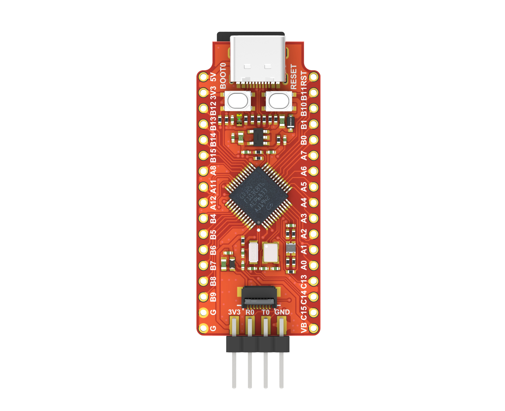
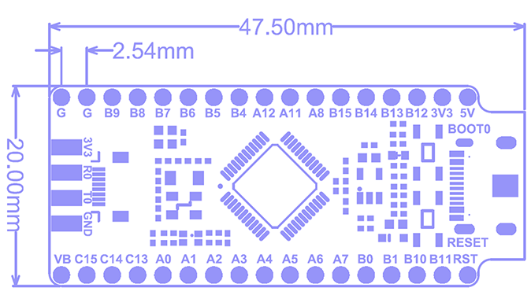

# Longan nano 

## Introduction

Longan Nano is a minimalist RISC-V development board based on GigaDevice GD32VF103CBT6. The development board draws out all the IOs of the chip, with a small and exquisite design, and has on-board USB-C, LCD, SD card, JTAG and other interfaces, which is convenient for students, engineers, and enthusiasts to learn the latest generation of RISC-V processors.

## Specification

| Feature | Description |
| --- | --- |
| CPU | GD32VF103CBT6 based on RISC-V 32-bit core |
| Core power consumption | 1/3 of a traditional Cortex-M3 |
| Storage | 128KB Flash, 32KB SRAM |
| Peripherals | 4 x general purpose 16-bit timer, 2 x basic 16-bit timer, 1 x advanced 16-bit timer, Watchdog, RTC, Systick 3 x USART, 2 x I2C, 3 x SPI, 2 x I2S, 2 x CAN, 1 x USBFS (OTG), 2 x ADC (10 channel), 2 x DAC |
| Buttons | 1x Reset button, 1x BOOT button (connected to GPIO） |
| Display Interface | SPI interface (standard 0.96 inch 160x80 RGB IPS LCD） |
| Storage Interface | Onboard TF card slot |
| Debug Interface | 2x 4 pin headers connected to JTAG debug interface and serial port |
| Crystal Oscillator | 8MHz passive crystal + 32.768KHz RTC passive crystal |
| LED | 1x RGB LED |
| Number of GPIOs | 2 Lead out 28 GPIOs to pin headers |
### New Photo

 

### Old Photo

## User Guide

[Longan User Guide](/soft/longan/en/README.md)

## Product technical support
The Longan Nano development board can meet the needs of customers in various scenarios. It has been widely used in AIoT, and its quality and performance have a very good reputation in the industry. The professional technical team solves hardware design and software functions for our customers. For professional technical support and more detailed product information, please contact us via e-mail <support@sipeed.com>。
