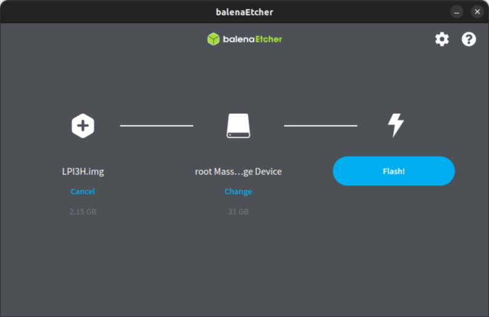

## Preparation

### Get the Image

Refer to the previous section[images](https://wiki.sipeed.com/hardware/en/longan/h618/lpi3h/3_images.html), and download the desired image.

### Get the Flashing Tool

The commonly used tools for flashing images to an SD card are balenaEtcher, Rufus, etc. Here, we'll use balenaEtcher as an example. First, go to the [balenaEtcher official website](https://etcher.balena.io/#download-etcher) to download and install the software.
For Linux, you can also use the dd command to write the image directly.

## Flashing the Image to SD cards

After preparing the image to be flashed, open balenaEtcher. First, select the image file you want to flash:


Then, select the target device:



Finally, click on "Flash" and wait for the flashing process to complete. Once it's done, you'll have an SD card with the bootable image:


The steps for Windows and Linux are similar.

### Burning the image to EMMC

 **Note that you need to use the image version 20240106 and above**
 First, copy the image file to be burned to the pre-made boot TF card, and then enter the system and use the dd command to write the image file to the EMMC: ```shell
# Assuming the image file is copied to /opt/ directory
dd if=/opt/your_image_file of=/dev/mmcblk1
sync
When the burning is finished, unplug the SD card and you can enter the system from the EMMC.

If you want to boot with EMMC and use SD card for expansion, you need to make sure that the SD card is formatted and does not contain a boot image, otherwise it may be changed to SD card boot due to priority issues.
