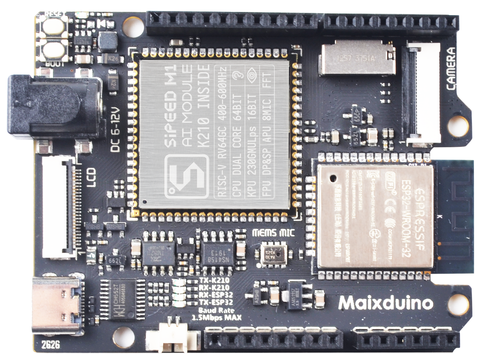

# Maix 系列开发板

##  Maix 系列开发板

目前 MaixPy 系列开发板有一下这几款型号:

- Maix Go

- Maix Dock

- Maix Duino

- Maix Bit

- Maix Cube

- Maix Amigo

## 差异对比
<table>
  <tbody>
    <tr>
      <th width="226" scope="col" >&nbsp;</th>
      <th width="226" scope="col" ></th>
      <th width="226" scope="col"></th>
      <th width="226" scope="col"></th>
      <th width="226" scope="col"></th>
      <th width="226" scope="col"></th>    
      <th width="226" scope="col"> </th>  
    </tr>
    <tr>
      <td>型号 </td>
      <td>Maix Go</td>
      <td>Maix Bit</td>
      <td>Maix Cube</td>
      <td>
Maix Dock
</td>
      <td>Maix Duino</td>
      <td>Maix Amigo</td>
    </tr>
    <tr>
      <td>USB IC</td>
      <td>STM32</td>
      <td>CH552/CH340</td>
      <td>GD32/CH552</td>
      <td>CH340</td>
      <td>CH552</td>
      <td>GD32</td>
    </tr>
    <tr>
      <td>核心模块</td>
      <td>M1</td>
      <td>M1</td>
      <td>M1n</td>
      <td>M1/M1W</td>
      <td>M1</td>
      <td>M1n</td>
    </tr>
    <tr>
      <td height="48">WIFI 功能</td>
      <td>M1W 模块集成 ESP8285</td>
      <td>---</td>
      <td>---</td>
      <td>Dock M1 (不支持 WIFI) 
        Dock M1W(支持,M1W 模块集成 ESP8285)</td>
      <td>板载 ESP32 （支持 WIFI, 蓝牙功能暂时未支持）</td>
      <td>---</td>
    </tr>
  </tbody>
</table>

## 产品技术支持
Maix系列产品可以在多种场景实现客户不同方面的需要，在AIoT上已经广泛的使用，品质和性能在行业内已经有非常好的口碑，专业的技术团队为广大客户解决硬件设计和软件功能上的各种各样问题。专业技术支持和更详细资料请联系商务<support@sipeed.com>。

