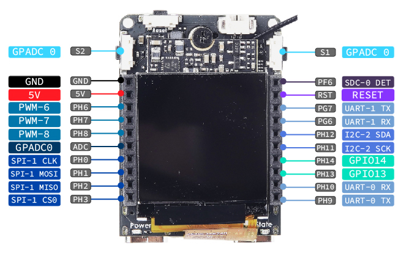

MaixII M2dock is a development board composed by bottom board and core board whose main chip is Allwinner V831.

Different from Maix-Dock, MaixII M2dock contains Tina-Linux which is based openwrt. We can develop it with [MaixPy3]()

## M2 core board

Visit [aliexpress](https://www.aliexpress.com/item/1005002538932487.html?pdp_ext_f=%7B%22sku_id%22:%2212000028593772620%22,%22ship_from%22:%22%22%7D&gps-id=pcStoreJustForYou&scm=1007.23125.137358.0&scm_id=1007.23125.137358.0&scm-url=1007.23125.137358.0&pvid=02eb4995-f1f4-42bd-a44e-ae4398b87e19&spm=a2g0o.store_pc_home.smartJustForYou_6001928813305.0) for more newest information

> Download related hardware information from [MaixII_V831_v3100](https://api.dl.sipeed.com/shareURL/MaixII/MaixII-Dock/HDK/Sipeed_MaixII_V831/MaixII_V831_v3100)

In the last year or so, we’ve started to see several camera SoCs with a built-in NPU or SIMD instructions to accelerate face detection, objects detection and so on, starting with the low-resolution Kendryte K210 processor to the 2.5K Ingenic T31 MIPS video processor, or even the 4K capable iCatch V37 camera SoC. Allwinner introduces several camera processors (V3, V316, S3…) in the past, but none of them included an NPU aka AI accelerator. This has now changed with Allwinner V831 Cortex-A7 Full HD camera SoC also including a small 200 GOPS NPU.

> Copied from [allwinner-v831-ai-full-hd-camera-soc-powers-sochip-v831-development-board](https://www.cnx-software.com/2020/04/28/allwinner-v831-ai-full-hd-camera-soc-powers-sochip-v831-development-board/)

Click to download [V833／V831 Datasheet V1.0.pdf](https://linux-sunxi.org/images/b/b9/V833%EF%BC%8FV831_Datasheet_V1.0.pdf)

### M2 board details

Compared with pre MAIX generation

| Item                    | MAIX-I (K210)                        | MAIX-II (V831)                                                                 |
| ----------------------- | ------------------------------------ | ------------------------------------------------------------------------------ |
| Main frequency          | 400~600Mhz                           | 800~1000Mhz                                                                    |
| Video encoder           | None                                 | H.264, up to 1080p@30fps H265, up to 1080p@30fps JPEG, up to 1080p@30fps |
| NPU                     | 0.23TOPS support Conv+BN+ACT+POOL | 0.2TOPS support Conv,Inner_Product,Pool,Eltwise,ACT,BN,Split,Concat         |
| Memory                  | 8MB SRAM                             | SIP 64MB DDR2                                                                  |
| Storage                 | 16MB SPI Nor Flash                   | Choosable 16M flash(Blank default)                                             |
| Camera                  | DVP, support 30W pixels max          | 2lane MIPI, Up to 1080P@60fps                                                  |
| Display                 | 8bit MCU LCD                         | 8bit MCU LCD, can use other screen by convert board                            |
| SDIO                    | None                                 | SMHC x2 (SDC0, SDC1)                                                           |
| SPI                     | SPIx3                                | SPI x2 (SPI0, SPI1)                                                            |
| I2C                     | I2C x3                               | I2C x4 (TWI0, TWI1, TWI2, TWI3)                                                |
| I2S                     | 8bit I2S                             | I2S x1 (I2S0)                                                                  |
| Ethernet                | None                                 | 10/100 Mbit/s Ethernet port with RMII interface                                |
| ADC                     | None                                 | 1-ch 6bit LRADC for key                                                        |
| Audio                   | None                                 | LINEOUTP + MICIN1P/N                                                           |
| Development environment | Maixpy/C                             | MaixPy3/linux                                                                  |

## Bottom board

Normally we think the screen panel is the front and camera is back.

> Thanks for net users sharing the [NGFF M.2 B-key footprint for Maix-II module](https://bbs.elecfans.com/jishu_2036119_1_1.html)
> Download information about bottom board [MaixII_V831_v3100](https://api.dl.sipeed.com/shareURL/MaixII/MaixII-Dock/HDK/Sipeed_MaixII_V831/MaixII_V831_v3100)

### Bottom board Specs

| Number | Maix II Part                       | Function                                              | Note                                                             |
| ------ | ---------------------------------- | ----------------------------------------------------- | ---------------------------------------------------------------- |
| 1      | M.2 B-KEY female slot*1            | Used for connect V831 core board                      | Have connectted with core board when sold                        |
| 2      | Core board M2 copper column nuts*1 | Fix core board with bottom board                      | Have been fixed when sold                                        |
| 3      | Power LED*1                        | Show power state                                      | ---                                                              |
| 4      | State LED*1                        | User programmable led                                 | ---                                                              |
| 5      | CPU Reset button*1                 | Reset V831 chip                                       | ---                                                              |
| 6      | User button*2                      | Change IO voltage value，custome usage                | ---                                                              |
| 7      | Wi-Fi module*1                     | RTL8189FTV，adds Wi-Fi function for this board        | SDIO Interface                                                   |
| 8      | BTB camera interface*1             | Connect BTB camera module                             | Have connectted with bottom board when sold                      |
| 9      | Camera M2 copper column nuts*2     | Fix BTB camera with bottom board                      | Have been fixed when sold                                        |
| 10     | FHD camera*1                       | Default SP2305 Sensor BTB style, 1080P                | Default 6mm focal length M12 lens，can use other Suitable camera |
| 11     | USB to UART chip*1                 | Provide serial port communication                     | ---                                                              |
| 12     | Type-C interface(USB OTG) *1       | Used for V831 otg function                            | Can be used for power supply                                     |
| 13     | Type-C interface(UART) *1          | Used for V831 uart debugging                          | Can be used for power supply                                     |
| 14     | Three-axis accelerometer*1         | I2C interface，can read 3 axes acceleration data      | ---                                                              |
| 15     | MicroSD card slot*1                | Connect microSD card                                  | Default boot from SD card                                        |
| 16     | LCD interface*1                    | FPC0.5mm 24Pin，MCU interface                         |                                                                  |
| 17     | IPS HD screen\*1                   | 1.3 inch IPS screen，resolution 240\*240              | Have connectted with core board when sold                        |
| 18     | IPEX Wi-Fi antenna connector       | IPEX(first generation) Wi-Fi antenna                  | ---                                                              |
| 19     | Extension female header            | Route V831 general IO，used for connecting peripheral | ---                                                              |
| 20     | Speaker connector*1                | MX1.25 2P interface（1.25mm pitch）                   | ---                                                              |
| 21     | Loudspeaker*1                      | 8Ω1W 1609 composite aluminum membrane speakers        | Have connectted with core board when sold                        |
| 22     | Microphone*1                       | Analog electret microphone                            | ---                                                              |

## Resource

[MaixII_V831_v3100 Hardware information](https://api.dl.sipeed.com/shareURL/MaixII/MaixII-Dock/HDK/Sipeed_MaixII_V831/MaixII_V831_v3100)

[MaixPy3 software documents]()