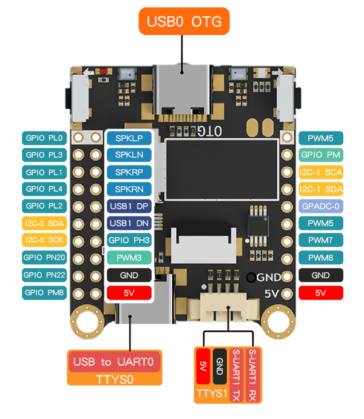

# Config system

Here is the pinmap of Lichee MaixSense



## Connect the serial port

Connect the serial port to communicate to the board.

Steps: Use type-C cable connect computer with the board marked TTYS0, then do following steps depending on your computer OS.


### Linux & macOS

For linux OS, use command `ls /dev/ttyUSB*` to see your device COM number, then use serial application to connect the board.

### Windows

Lichee MaixSense equips with CH340 as serial chip, but we need install its driver to use it.

Click this to download the driver for this serial chip, after installing [ch340 ch341 driver](https://api.dl.sipeed.com/shareURL/MAIX/tools/ch340_ch341_driver), you can find your `device serial port` from `Device manager`.

## Config Tina OS

We suggest beginners use Armbian OS because there is a lot of information about it on the internet, and for Tina OS suits those who are good at Linux.

The Tina OS configuration steps of Lichee MaixSense are similar to [M2dock](./../M2/usage.md), so here will not retell its usages.
<!-- 
You can use type-c cable connecting computer with Lichee MaixSense type-c port marked with DEBUG, then use serial software application like [Mobaxterm](./../M2/tools/mobaxterm.md) to operate it. Besides, Lichee MaixSense with Tina OS can be operated by [adb shell](https://developer.android.google.cn/studio/releases/platform-tools), if it's connected with computer by its type-c port, which connects a USB camera by default, marked with OTG. -->

## Config armbian OS

After connecting computer with this board, we can use serial application to control this board, and the baudrate is 115200.

We provide 2 armbian image, their login steps are different, so here we tell how to login ths OS.

### Image containing MaixPy3

The username and password are all `root`. Be sure not input any wrong word when logging.

The log is as following if you succeed logging.\

```bash
Armbian 21.08.0-trunk Bullseye ttyS0

maixsense login: root
Password:
 __  __       _       ____
|  \/  | __ _(_)_  __/ ___|  ___ _ __  ___  ___
| |\/| |/ _` | \ \/ /\___ \ / _ \ '_ \/ __|/ _ \
| |  | | (_| | |>  <  ___) |  __/ | | \__ \  __/
|_|  |_|\__,_|_/_/\_\|____/ \___|_| |_|___/\___|

Welcome to Armbian 21.08.0-trunk Bullseye with bleeding edge Linux 5.14.0-rc7-sun50iw11

No end-user support: built from trunk & unsupported (bullseye) userspace!

System load:   133%             Up time:       0 min
Memory usage:  53% of 231M      Zram usage:    23% of 115M      IP:            192.168.0.251
CPU temp:      50°C             Usage of /:    77% of 2.9G

[ 0 security updates available, 66 updates total: apt upgrade ]
Last check: 2022-08-31 01:45

[ General system configuration (beta): armbian-config ]

Last login: Tue Aug 30 10:34:06 UTC 2022 on ttyS0
root@maixsense:
```

### Image without MaixPy3

The first time to start this system we need to set password. If you didn't set the password at the first time, there is no way to login anymore, only reburn system you can get the chance to set the password again.

If the password you set at the first time is complex enough, the system wil not accept the password and you need reset your password.

```bash
New to Armbian? Documentation: https://docs.armbian.com Support: https://forum.armbian.com

New root password: **********
Repeat password: **********
```

After setting the password, we need to choose our shell, normally we use bash.

```bash
Choose default system command shell:

1) bash
2) zsh

Shell: BASH
```

Then it asked to add a new user to avoid us only using root username, which is a good way to help us not destroying the system. Set the username and password by yourself.

```bash
Creating a new user account. Press <Ctrl-C> to abort

Please provide a username (eg. your forename): ll
Create password: *********
Repeat password: *********
```

The new created user is granted root permission by default, and we can use this identity to login this board and control this system.

We can use command `passwd` to change the password or delete the password.

For example, we can use `passwd -d root` to delete the root password which we create at the beginning. We also can use `passwd root` to reset password of root.

The following log are examples about `passwd`

```bash
root@maixsense:~# passwd -d root
passwd: password expiry information changed.
root@maixsense:~# passwd root
New password:
Retype new password:
passwd: password updated successfully
```

Here are part of example:

