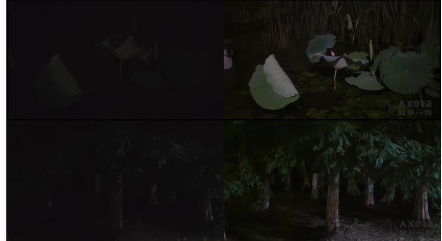
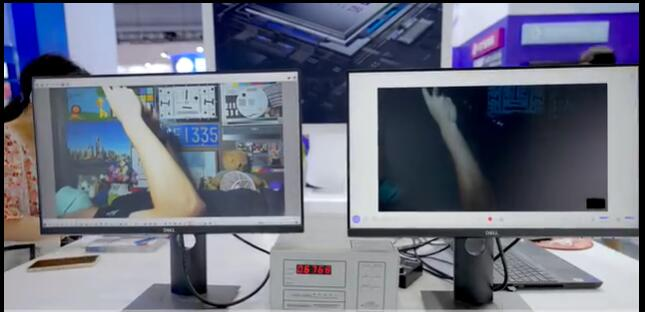
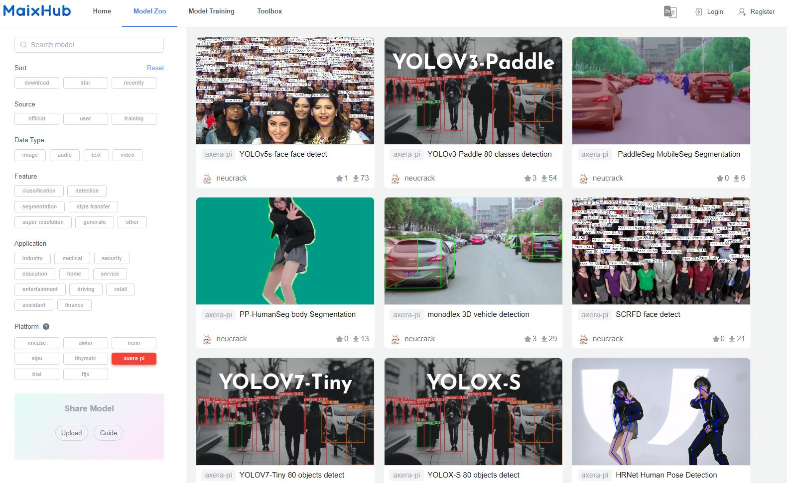

> This page is on building, please use translation application to see https://wiki.sipeed.com/m3axpi instead.

If you think this AI development board are excellent enough and your friends may be interested with this, just share with them this link [http://wiki.sipeed.com/m3axpi](http://wiki.sipeed.com/m3axpi)

> [Official Online Store](https://www.aliexpress.com/item/1005005016931077.html)

In the past few years, many Linux AI chips come out.

Raspberry Pi and Jetson Nano these boards are really popular by their good performance, but now MAIX-III AXera-Pi comes out, equipped with the high-performance 3.6TOPs@INT8 chip ax620a, which will be your good choice and provice you a really good experience.

<!-- 2021 年的时候，国内各大芯片原厂纷纷亮出了自己的 Linux 边缘 AI 芯片。

但在 AI 开发板的市场中，前有树莓派（Raspberry Pi），后有英伟达（Jetson Nano）等国外老牌选手强力围剿国内 Linux AI 开发板，在这之前国产的同类产品无论是价格还是体验，都被打的丢盔弃甲。

如今在千元内的选手有晶晨 A311D 、地平线 X3 、瑞芯微 RV1126、堪智 K510、全志 V85X 、晶视 CR182x 、亿智 SV826 、酷芯微 AR9341 等等国产芯片，看上去感觉有很多选择？

但是，它们要么资料太少（资料封闭）、能效比低、价格太贵、生态贫瘠、开发困难、视觉效果太差存在各种各样的问题。

真的很难有一款边缘 AI 板子可以满足开发者的要求！！！

但现在！这些问题可能不再是问题了！

是时候请出我们新一轮的参赛选手了！

练习时长两年半（不是），一颗 3.6TOPs@INT8 大算力低功耗超强夜景的芯片总算是来到了 MAIX-III Linux AI 系列！ -->

We design this chip into a core module, which is convenient if you want to design the ext-board for yourself.

<table>
<thead>
<tr>
  <th colspan=2>MaixIII Core module</th>
</tr>
</thead>
<tbody>
<tr>
  <td>CPU</td>
  <td>Cortex-A7@1.0Ghz*4</td>
</tr>
<tr>
  <td>NPU</td>
  <td>14.4Tops@int4，3.6Tops@int8</td>
</tr>
<tr>
  <td>ISP</td>
  <td>4K@30fps</td>
</tr>
<tr>
  <td>Codec format</td>
  <td>H.264, H.265</td>
</tr>
<tr>
  <td>Video encode</td>
  <td>4K@30fps</td>
</tr>
<tr>
  <td>Video decode</td>
  <td>1080P@60fps</td>
</tr>
<tr>
  <td>Ethernet</td>
  <td>Support RGMII / RMII Ethernet</td>
</tr>
<tr>
  <td>Display</td>
  <td>MIPI DSI 4 Lane，up to 4K@30FPS</td>
</tr>
<tr>
  <td>DRAM</td>
  <td>2GB LPDDR4X 3733Mhz</td>
</tr>
<tr>
  <td>Storge</td>
  <td>Optional 16GB EMMC (Boot from TF card by default)</td>
</tr>
<tr>
  <td>IO pins</td>
  <td>DDR4 SODIMM 260P route all IO</td>
</tr>
</tbody>
</table>

<!-- 没错，它就是来自「[爱芯元智](https://axera-tech.com/)」的 [AX620A](https://axera-tech.com/product/T7297367876123493768)，这是一款高算力，高能效比，低功耗的 AI SoC 芯片，芯片集成了四核 Cortex A7 @ 1Ghz CPU，拥有 3.6TOPs@INT8 的高算力 NPU，支持 4K@30fps 的 ISP，以及支持 H.264、H.265 编码的 VPU，AX620A 还支持 32bit LPDDR4x，支持 EMMC v5.1 / SPI Flash，最多支持 6 路 MIPI 输入，同时最多支持 4 路工作，支持多路子码流，支持 1 路千兆 Ethernet，支持 1 路 USB2.0，支持 2 路 MIPI DSI/CSI 输出。拥有大算力和优异画质处理能力的 AX620A 可以实现更多的 AI 功能，带来最优的 AI 体验！（来自官方） -->

## Introduction

In WORLD ARTIFICIAL INTELLIGENCE CONFERENCE 2022, this AI board is shown the first tima, like what's in the following picture.

  

And finally we launched this AI development board equipped with AX620A in 20221001. Its official name is **MAIX-III AXera-Pi**, while we like to call it **m3axpi** in the following content.

  <video src="../../../zh/maixIII/assets/axpi_boom.mp4"
    width="100%" controls="controls" autoplay="autoplay"
    x5-playsinline=""
 		playsinline
 		webkit-playsinline="true"
 		poster="../../../zh/maixIII/assets/maix-iii-small.jpg"
 		preload="auto"
  >
  </video>

So, why is this AI development board good?

- Lack of documents? Follow our guides, to start journey from embedded Linux development to AI model deployment.
- High power consumption? Just use one usb cable connecting with USB3.0 port to boot this device, no need of other power supply.
- Hard in development? Compile your own application just by this board, or train your own AI model online and deploy it on board.
- Bad camera result? This chip is aimed for AI ISP night vision enhancement, we have adjust the camera to best state.
- Too expensive? This board sold about 100$, chiper than any other similar board.

<!-- - 资料太少？文档教你从开箱到开发，从嵌入式 Linux 开发到 AI 模型开发指南一应俱全！
- 能效比差？四核 A7 靠一条 USB3.0 就可以带起来！和你的外接电源、散热器说拜拜吧！！
- 开发困难？支持 debian11 系统内置 SDK 直接板上编译！白嫖在线 AI 模型训练直到部署！！！
- 没有生态？ SIPEED 拥有关于 LINUX、RISCV、AIOT、FPGA、MCU 等嵌入式领域的内容！！！！
- 摄像效果太差？芯片主打 AI ISP 夜视增强！由原厂亲手为你调试白天到夜间的超强影像！！！！！
- 价格太贵？从核心+底板+屏幕+摄像头+卡+外壳支架全套总共人民币 **579** ！（咆哮！！！！！！） -->

## Features

### Camera effect

#### Night vision enhancement

<table>
    <tr>
        <th colspan="2">Left picture is original, right picture is enhanced</th>
    </tr>
    <tr>
        <td></td>
        <td></td>
    </tr>
    <tr>
        <td></td>
        <td></td>
    </tr>
</table>

<!-- 

    <iframe src="//player.bilibili.com/player.html?aid=561523949&bvid=BV1Ee4y1v7iF&cid=860676576&page=1" scrolling="no" border="0" frameborder="no" framespacing="0" allowfullscreen="true" style="max-width:640px; max-height:480px;"> </iframe>

 -->

#### Exhibition darkroom

- The left screen shows the enhanced picture and the righr screen is the original one.

<!-- 

    <iframe src="//player.bilibili.com/player.html?aid=430541632&bvid=BV1iG41137tx&cid=831645988&page=1&t=83.6" scrolling="no" border="0" frameborder="no" framespacing="0" allowfullscreen="true" style="max-width:640px; max-height:480px;"> </iframe>

 -->

#### Actual AI effect

    <iframe src="//player.bilibili.com/player.html?aid=773227207&bvid=BV1B14y1Y7A4&cid=837154353&page=1" scrolling="no" border="0" frameborder="no" framespacing="0" allowfullscreen="true" style="max-width:640px; max-height:480px;"> </iframe>

### AI advantages

#### Support many Operator

Screenshots of part operators. [Click me to see whole operator support list](https://pulsar-docs.readthedocs.io/en/latest/appendix/op_support_list.html)

#### Many AI models

Before receiving this board, visit [MaixHub](https://maixhub.com/model/zoo) to see your interested model, choose Platform `axera-pi` at the Lower left corner to find model can be deployed on `AX-PI`

Apart from these, the models are uploaded to [github AXERA-TECH/ax-samples](https://github.com/AXERA-TECH/ax-samples), and there are also some models in the system image, flashing the system and boot it you will get some models too. The supported models are as followings:

<!-- 
还可以在 [AXERA-TECH/ax-samples](https://github.com/AXERA-TECH/ax-samples) 仓库也可以找到模型，板子系统里也预置了模型资源，后续模型更新会在这里[「ax-models」](https://github.com/AXERA-TECH/ax-models)，而 [ AX-Samples 将不断更新最流行的、实用的、有趣的示例代码](https://github.com/AXERA-TECH/ax-samples/tree/main/examples#examples)，目前有如下模型支持列表： -->

- Objects Classification
  - MobileNetv1
  - [MobileNetv2](https://github.com/AXERA-TECH/ax-samples/blob/main/examples/README.md#MobileNetv2)
  - MobileOne-s0
  - ResNet18
  - ResNet50
  - Others......
- Objects Detection
  - [PP-YOLOv3](https://github.com/AXERA-TECH/ax-samples/blob/main/examples/README.md#yolov3paddle)
  - YOLOv3
  - YOLOv3-Tiny
  - YOLOv4
  - YOLOv4-Tiny
  - YOLOv4-Tiny-3l
  - [YOLOv5s](https://github.com/AXERA-TECH/ax-samples/blob/main/examples/README.md#YOLOv5s)
  - [YOLOv5-Lite](https://github.com/AXERA-TECH/ax-samples/blob/main/examples/README.md#YOLOv5-Lite)([original model](https://github.com/ppogg/YOLOv5-Lite))
  - [YOLOv7-Tiny](https://github.com/AXERA-TECH/ax-samples/blob/main/examples/README.md#YOLOv7-Tiny)
  - [YOLOX-S](https://github.com/AXERA-TECH/ax-samples/blob/main/examples/README.md#YOLOX-S)
  - YOLO-Fastest-XL
  - NanoDet
- Human Body Detection
  - YOLO-Fastest-Body
- Human Face Detection
  - [scrfd](https://github.com/AXERA-TECH/ax-samples/blob/main/examples/README.md#Scrfd)
  - [YOLOv5-Face](https://github.com/AXERA-TECH/ax-samples/blob/main/examples/README.md#YOLOv5-Face)([original model](https://github.com/deepcam-cn/yolov5-face))
- Human Body Segmentation
  - Face_Parsing
- Obstacles Detection
  - Robot-Obstacle-Detect
- Object detection of Uav view
  - [YOLOv5s_visdrone](https://github.com/AXERA-TECH/ax-samples/blob/main/examples/README.md#YOLOv5s_visdrone)
- Monocular 3D Vehicle Detection
  - [Monodlex](https://github.com/AXERA-TECH/ax-samples/blob/main/examples/README.md#Monodlex)
- Human body Key points
  - [HRNet](https://github.com/AXERA-TECH/ax-samples/blob/main/examples/README.md#HRNet)
  - [AX-POSE-PPL](https://github.com/AXERA-TECH/ax-samples/blob/main/examples/README.md#AX-POSE-PPL)
  - [HandPose](https://github.com/AXERA-TECH/ax-samples/blob/main/examples/README.md#HandPose)
- Human body Segmentation
  - [PP-HumanSeg](https://github.com/AXERA-TECH/ax-samples/blob/main/examples/README.md#PP-HumanSeg)
- Semantics Segmentation
  - [PP-Seg](https://github.com/AXERA-TECH/ax-samples/blob/main/examples/README.md#MobileSeg)
- Classic CV
  - CropResize
- Pipeline example
  - NV12 -> CropResize -> NN(Classification)

Visit [Deploy models to AX-Pi (Maix-III(M3) series) board](/ai/en/deploy/ax-pi.html) to deploy models to AX-Pi.

<!-- 

  

 -->

#### Online tranning model

Now the [MaixHub](https://maixhub.com/welcome) has been upgraded, with more friendly interface and more functions, here are steps to tranning model online.

  

> m3axpi doec not support deploy model by scanning QR code while m2dock can do, m3axpi only can be deployed models by local operations.

<!-- 

    <iframe src="//player.bilibili.com/player.html?aid=597374704&bvid=BV1eB4y1Q74i&cid=741940038&page=1" scrolling="no" border="0" frameborder="no" framespacing="0" allowfullscreen="true" style="max-width:640px; max-height:480px;"> </iframe>

 -->

#### Share model

There will be a model file and codes or programs to run the code, you can share these on [Maixhub](https://maixhub.com/model/zoo) to other people, let's build the model Community together.

  

  

### Defaule cases

> Updated in 20221205

  
  

### Linux development

<!-- #### 超高性价比与能效比

别搞那些虚的。来点实际点的，以下是目前（20221014）市场上销量排行的典型 AI 开发产品，**商品价格会随时变动，有疑问可查询或指出并纠正**。（已除去低成本 38 板摄像头和芯片原厂超昂贵开发板）

| AI 开发板                                              | 全家桶套餐的主要内容                                                                                                        | 大致价格（20221013） |
| ------------------------------------------------------ | --------------------------------------------------------------------------------------------------------------------------- | -------------------- |
| 英伟达 JETSON NANO 开发板                              | 4GB 主板、铝合金外壳（带风扇）、5V4A 电源、双频无线网卡、64G U 盘、IMX279 摄像头、HDMI 线 + 网线、7 寸触摸屏+支架、         | ¥2129.00             |
| Raspberry Pi 树莓派 4B                                 | 4GB 主板、七寸触摸屏+支架、64G U 盘、散热片、HDMI 线 + 网线、5V3A 电源、亚克力外壳（带风扇）、500w USB 摄像头、入门指导手册 | ¥1439.00             |
| Khadas vim3 物联网 a311d（目前线上销量不高，但很典型） | VIM3（4GB+32G）开发板、外壳、散热器、风扇、30W 电源、HDMI 线                                                                | ¥1399.00             |
| 迅为 RK3568 开发板瑞芯微                               | 商业级 2G+16G、7 寸 MIPI 屏、OV5695 摄像头、（没有配电源）                                                                  | ¥1380.00             |
| EASY EAI Nano AI 开发板 瑞芯微 RV1126                  | 1GB 单主板、200w 双目摄像头（gc2xxx）、5 寸 ips 屏、天线、喇叭、铜柱、2A 电源                                               | ¥799.00              |
| 亚博智能 旭日 X3 派开发板                              | 2GB 主板、古月居课程、WIFI 天线、铝合金外壳、gc4663 摄像头、32G U 盘、5V3A 开关电源、HDMI 线                                | ¥769.00              |
| Sipeed M3AXPI Linux AI 微光夜视 爱芯派                 | 2GB 单主板、400w gc4653 摄像头、5 寸 ips 屏、外壳、数据线、32G TF 卡、在线模型训练服务、活力四射的开源社区                  | ¥579.00              |

想想某些产品为什么卖这么贵，销量还这么好？凭什么？

这些产品除了本身的质量要过硬，功能要够强，还要凭借自身的社区生态、软件支持、丰富资料、开源代码、用户口碑等等特色，来支撑产品高性价比的形象。

> 笔者在这里认为所谓的性价比不是一昧地追求产品的最低价，而是在同类产品市场的主流价格区间内，选出社区用户群体可以接受的价格，然后在这个定位里去尽力做出效果最好的产品。

从这些典型的产品中可以看出 m3axpi 套餐是没有配「散热片和风扇还有外接电源」的，这也是它的另一个特色「高能效比」。

是的，这个产品不需要散热器/风扇，也不需要外接 2A 电源就可以启动系统，更不需要找 hdmi 线和显示器。

来一个实际测量的温度和功耗，注意要使用 USB3.0 的口来供电喔。

  

> 从实测结果上来看，这个功耗和温度控制得挺好，用 USB3.0 5V@1A 承载了底板、核心板、WIFI、以太网、摄像头、5 寸屏的工作。 -->

#### Based on debian

We provide debian11 Linux system, and support boot from SD card and burn system by dd(A linux command), make it easiler for user to use. Besides, it's really conveient to program AI application by Python API.

1. Burning image: [WIKI AXera-Pi burn image](https://wiki.sipeed.com/hardware/zh/maixIII/ax-pi/flash_system.html#%E8%8E%B7%E5%8F%96%E9%95%9C%E5%83%8F)

2. Basic use：[WIKI AXera-Pi 上手必看](https://wiki.sipeed.com/hardware/zh/maixIII/ax-pi/flash_system.html)

3. Program with Python：[ax_pipeline_api](https://github.com/junhuanchen/ax_pipeline_api)

<!-- 4. 开发笔记：[[maixpy3 axpi] 关于爱芯 ax620a 移植 debian11 系统这件事](https://www.cnblogs.com/juwan/p/16751348.html)

5. 开发笔记：[[maixpy3 axpi] 编辑发布 debian 镜像与在 PC 上交叉编译程序 ](https://www.cnblogs.com/juwan/p/16769237.html) -->

#### BSP SDK

提供各类开发源码，提供 API 开发文档，SDK 开发方法等说明，细节可以从[SDK 开发指南](https://wiki.sipeed.com/hardware/zh/maixIII/ax-pi/sdk_usage.html) 得知。

##### [ax-sample](https://github.com/AXERA-TECH/ax-samples)

由爱芯提供典型 AI 模型的开发与评估验证，提供给有经验的 AI 开发者使用或只想蹭模型的同学，不涉及任何硬件外设有关的内容。

1. [示例项目 examples](https://github.com/AXERA-TECH/ax-samples/tree/main/examples)
2. [物体检测 PP-YOLOv3](https://github.com/AXERA-TECH/ax-samples/blob/main/examples/README.md#yolov3paddle)
3. [人体分割 PP-HumanSeg](https://github.com/AXERA-TECH/ax-samples/blob/main/examples/README.md#MobileSeg)
4. [语义分割 PP-Seg](https://github.com/AXERA-TECH/ax-samples/blob/main/examples/README.md#PP-HumanSeg)

##### [libmaix](https://github.com/sipeed/libmaix)

由 SIPEED 提供在嵌入式平台统一的嵌入式开发环境，主要有摄像头、屏幕、视觉、图像处理、部署 Pipeline 相关的实机例程，适合刚入门嵌入式 linux 开发的同学使用。

1. [测试一下屏幕显示](https://github.com/sipeed/libmaix/tree/release/examples/display)
2. [把摄像头显示到屏幕](https://github.com/sipeed/libmaix/tree/release/examples/axpi)
3. [摄像头+yolov5 模型+屏幕](https://github.com/sipeed/libmaix/tree/release/examples/axpi_yolov5_cam)

##### [axpi_bsp_sdk](https://github.com/sipeed/axpi_bsp_sdk)

芯片商用时所用的 bsp 开发包，这里主要提供的是芯片的原始开发资料，如 uboot、linux、msp 、sample、rtsp、ipcdemo 等工程代码，这个部分是逐步开源的，你可以从这里得到商业评估用的代码，例如 ipcdemo 这样的程序，但这些代码会很复杂且高耦合，适合有经验的同行出于商业落地的目的使用。

1. 开发文档 [docs](https://github.com/sipeed/axpi_bsp_sdk/tree/main/msp/sample/vo_fb)
2. 框架应用 [ipcdmeo](https://github.com/sipeed/axpi_bsp_sdk/tree/main/app/IPCDemo)
3. 外设验证 [sample](https://github.com/sipeed/axpi_bsp_sdk/tree/main/msp/sample)

##### [ax-pipeline](https://github.com/AXERA-TECH/ax-pipeline)

AX-Pipeline 由爱芯主导开发。该项目基于 AXera-Pi 展示 ISP、图像处理、NPU、编码、显示 等功能模块软件调用方法，方便社区开发者进行快速评估和二次开发自己的多媒体应用。

1. [快速编译](https://github.com/AXERA-TECH/ax-pipeline/blob/main/docs/compile.md) 基于 cmake 实现简单的跨平台编译。
2. [如何更换自己训练的 yolov5 模型](https://github.com/AXERA-TECH/ax-pipeline/blob/main/docs/how_to_deploy_custom_yolov5_model.md)
3. [如何部署自己的其他模型](https://github.com/AXERA-TECH/ax-pipeline/blob/main/docs/how_to_deploy_custom_model.md)
4. [如何调整图像方向](https://github.com/AXERA-TECH/ax-pipeline/blob/main/docs/how_to_adjust_image_orientation.md)
5. [ModelZoo](https://github.com/AXERA-TECH/ax-pipeline/blob/main/docs/modelzoo.md) 一些支持或将支持的模型和一些模型的说明。

## 社区资源

以下是由社区开发者贡献的内容，欢迎你也来贡献喔！！！（直接丢群里都可以喔！）

<!-- - [爱芯派-AI 微光全彩夜视-开箱体验](https://zhuanlan.zhihu.com/p/571233089)
- [爱芯 AX620A NPU 初体验](https://neucrack.com/p/440)
- [爱芯元智 AX620A 部署 yolov5 6.0 模型实录](https://zhuanlan.zhihu.com/p/569083585)
- [ubuntu22.04 搭建 AX620A 官方例程开发环境](http://t.csdn.cn/p8Nno)
- [AX620A 运行 yolov5s 自训练模型全过程记录（windows）](http://t.csdn.cn/oNeYG)
- [MAIX-III AXera-Pi 爱芯派从零入门开发【1】开箱试玩](https://www.bilibili.com/video/BV1LP4y1274d/?spm_id_from=333.999.0.0)
- [MAIX-III AXera-Pi 爱芯派从零入门开发【2】开发部署](https://www.bilibili.com/video/BV1Ne4y117U9/?spm_id_from=333.999.0.0)
- [MAIX-III AXera-Pi 爱芯派从零入门开发【3】模型转换及部署](https://www.bilibili.com/video/BV1jg411z7C8/?spm_id_from=333.999.0.0)
- [MAIX-III AXera-Pi 爱芯派从零入门开发【4】视频推理及推流](https://www.bilibili.com/video/BV14D4y147Ed/?spm_id_from=333.999.0.0) -->

## 硬件参数

  
  
  

### 硬件标注图

  
  

### 核心板参数

### 底板参数

| 项目       | 参数                                                                   |
| ---------- | ---------------------------------------------------------------------- |
| 摄像头输入 | （默认单摄）最高支持 3 摄:1 个 MIPI4-LANE+2 个 MIPI2-LANE              |
| 屏幕输出   | 支持最高 4-LANE MIPI DSI 屏幕                                          |
| SD 插槽    | 默认从 SD 卡启动                                                       |
| 录音输入   | 板载两个 MEMS MIC 支持双麦降噪                                         |
| 音频输出   | 3.5MM 耳机接口 支持立体声输入和 MIC 输入                               |
| 网络接口   | 支持 千兆以太网（ETH） 和 2.4GHZ WI-FI 板载天线                        |
| USB 接口   | 1xUSB2.0HS 支持 OTG 或 HOST 功能，1xUSB-UART 系统串口                  |
| 其他资源   | 1x 用户按键，3x 系统按键，1xRTC 时钟，2xLED                            |
| 对外接口   | 引出 CJTAG，可自行连接相应调试器，引出 2x12 排针，4 个 M2.5 螺丝定位孔 |

[硬件资源汇总](https://dl.sipeed.com/shareURL/MaixIII/AXera)

- [原理图](https://dl.sipeed.com/shareURL/MaixIII/AXera/02_Schematic)
- [点位图](https://dl.sipeed.com/shareURL/MaixIII/AXera/03_Bit_number_map)
- [模型文件](https://dl.sipeed.com/shareURL/MaixIII/AXera/05_3D_file)
- [尺寸图](https://dl.sipeed.com/shareURL/MaixIII/AXera/04_Dimensional_drawing)

### 摄像头一览

- 低配 gc4653 400w 基础体验版本。

  

- 高配 os04a10 400w 夜景增强版本。

  

> [更换摄像头可以看这个](https://wiki.sipeed.com/hardware/zh/maixIII/ax-pi/faq_axpi.html)

## 其他资源

### 产品相关

- AI 服务 http://maixhub.com
- 文档资料 http://wiki.sipeed.com
- 交流社区 http://bbs.sipeed.com
- 开源组织 http://github.com/sipeed

### 售后支持

- AXERA 技术交流群：（ 139953715 ）专供 AI ISP 技术交流
- 荔枝 MaixPy3 AI 交流群：（ 756313869 ）给产品开箱小白答疑

> 一些常见问题（FAQ） Q & A 请到 [Maix-III 系列 AXera-Pi 常见问题（FAQ）](./ax-pi/faq_axpi.md) 了解喔。
