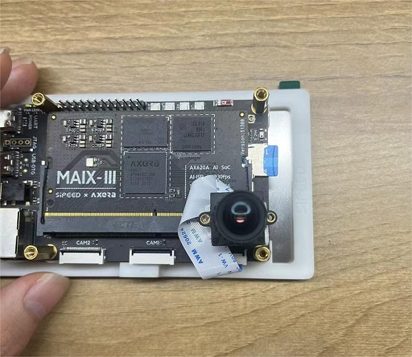
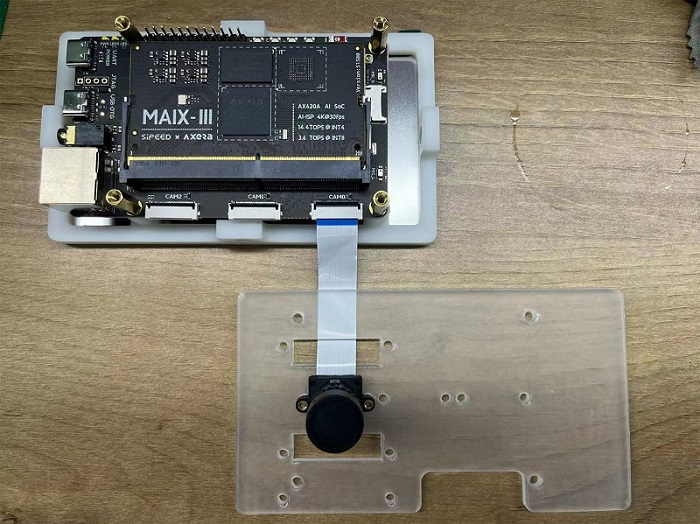
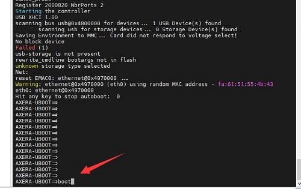
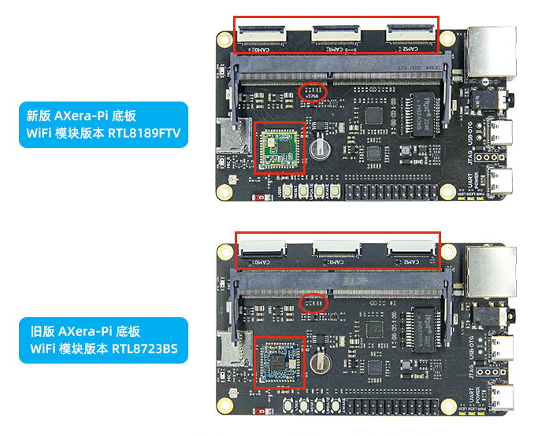
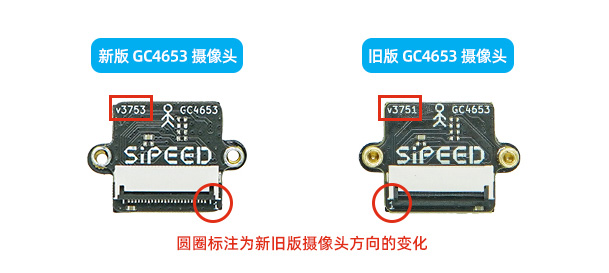
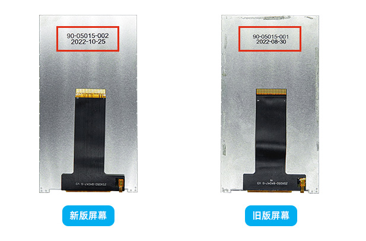

## Q：Device not work

A: Try to plug connect the 2 USB on m3axpi, by this m3axpi can get enough power to boot. m3axpi comsume 5V*1A maximum.

## Q：How to switch to os04a10 camera？

A：**Change the parameter, or edit code**

- For examples like [`sample_vin_vo`](https://wiki.sipeed.com/hardware/en/maixIII/ax-pi/flash_system.html#VIDEO), we can change the parameter `-c 2` into `-c 0` to switch camera.
- For command line example like [IPCDemo](https://wiki.sipeed.com/hardware/en/maixIII/ax-pi/flash_system.html#IPCDemo) we can change the json file in the end.
  
- For example script like [rstp](https://wiki.sipeed.com/hardware/en/maixIII/ax-pi/flash_system.html#rtsp) we can edit the script file to change the camera configuration.
  
- Edit the C code `COMMON_SYS_CASE_E eSysCase = SYS_CASE_SINGLE_GC4653;` to switch the camera, visit [github libmaix](https://github.com/sipeed/libmaix/blob/release/components/libmaix/lib/arch/axpi/libmaix_cam/libmaix_cam.cpp) to know more.
<div>
   
   
</div>

## Q：Error `i2c_read: Failed to read reg: Remote I/O error.!` when using camera

A: Make sure you have connected the camera and board correctly, and run the command correctly, like using the mismatched camera parameters or wrong parameters in command. If these are all right but this error still occurs, there are some errors on the device.

## Q：How to use the other screen？

A：Up to now we only provide screen with 5 inches, and for other screens you need to build the driver, edit the device tree and the application codes to display.

## Q：Error `locale.Error: unsupported locale setting !` when running `xxxx menuconfig`

A: Run `sudo localedef -i en_US -f UTF-8 en_US.UTF-8` to restore the configuration to slove this.

## Q：Error `VCEncInit:ERROR codecFormat NOT support by HW !` when running `IPC ODM`

A: Try to reboot device by pressing the RST key onboard or replug device.

## Q：Screen display wrong


A: Check if you have set the correct camera parameters.

## Q：Screen shows opposite camera content

A: This occurs because of the different batches of products, connecting them with 180° rotation.



Those who have shell for AXera-Pi can connect them like in the following pictures:

<html>
      
      
</html>

## Q：Error `Bus Error！`


A：This happens when data in the tf card system is broken because of the bad quality of tf card.

- Try to use a good tf card, like what we sell, and you can choose your tf card based on our test: [Choose tf card](https://wiki.sipeed.com/hardware/en/maixIII/ax-pi/flash_system.html#Choose-TF-card)

## Q：No eth0 ip address after running `ifconfig -a`

A：There is no ip address if the ethernet is not connected to the Internet, check your ethernet connection. Or use command `dhclient eth0` to get the ip address mannaly or visit [config eth0](https://wiki.sipeed.com/hardware/en/maixIII/ax-pi/flash_system.html#Connect-by-Ethernet) to know more.

## Q：Device not found after running uvc

A：This might happen on Windows. Check if there is an error in Windows device manager, remove the incorrect device then this error will be solved.

## Q：The device is stuck after running uvc

A：Reboot the board

## Q：No wlan0 shown in result after running command `ifconfig`

A：
- Maybe the bad connection between Core Model and ext-board because of the express, reconnect them to fix this bad connection.
- We have two version of the wireless module, and they need different configuration file, run following command to apply your wireless module configuration.

```bash
ls /boot/
cp /boot/kernel.img.rtl8189fs kernel.img
```

## Q：Error `packet_write_wait: Connection to 10.xxx.xxx.xxx port 22: Broken pipe！` after login by ssh

A: Reboot device after run Run command `python3 -c "import os, binascii; os.system('sed -i \'/iface eth0 inet dhcp/ahwaddress ether {}\' /etc/network/interfaces'.format(binascii.hexlify(bytes.fromhex(open('/proc/ax_proc/uid').read().split('0x')[1][:-5]),':').decode('iso8859-1'))) if os.system('grep \'hwaddress ether\' /etc/network/interfaces -q') != 0 else exit();"` in serial port.

## Q：The screen is blurred after booting.
## Q：Sticking Image on screen

<html>
      
      
</html>

A：Because of the because of the different batches of screen, the configuration for screen is different, replace the `dtb` file in `/boot/` folder to apply the screen. Make sure not use the wrong configuration file for a long time, which will burn the screen.

```bash
ls /boot/
cp /boot/dtb.img.lcd20220830 dtb.img #dtb.img.lcd20221025 dtb.img
```

## Q：Error `can't open camera by index` when running opencv.

A：Check if the camera in the code matches the camera you use. [switch camera](#qhow-to-switch-to-os04a10-camera)

## Q：`XERA-UBOOT=>` is shown from serial port.

A：This happens when autoboot is canceled when booting device, use command `boot` to start system.



## The change of hardware

Because of some reasons, we change some hardwares, here are what we changed.

### Change of the ext-board

1. On the latest ext-board we marked `v3768`, and the pervious ext-board is not marked.

2. We use `RTL8189FTV` Wifi module on the latest ext-board, and the pervious ext-board use Wifi module `RTL8723BS`, replace the kernel file to change the configuration. Read [No wlan0](#qno-wlan0-shown-in-result-after-running-command-ifconfig) to know more.

```bash
ls /boot/
cp kernel.img.rtl8723bs kernel.img # For the previous ext-board
#cp /boot/kernel.img.rtl8189fs kernel.img  
```



### Change of camera

The connector direction of camera changed, make sure the `1` on the connector of ext-board matches the `1` the connector of the camera.



### Change of screen

We change the screen into new version, and the dafalut image use the latest version screen, see following photo to know your screen version, and for pervious version screen if need to run command `cp /boot/dtb.img.lcd20220830 dtb.img` to apply the hardware. Read [wrong display](#qscreen-display-wrong) to know more.



## Q：Why I can only use less than 2G ram

Why we can only see there is about 1.3G ram for us.


From the following diagram we cansee the original memory map of Axera 620A evb-board, it's equipeed with 1GB ram and is divided into 256MB kernel memory block and 768MB CMM (Contiguous Memory Model) memory block


And on Axera-Pi we equip 2GB ram, and set 512M CMM memory block and 256M kernel memory block, so there is less than 2GB ram for use.

We can see the `insmod /soc/ko/ax_cmm.ko cmmpool=anonymous,0,0x60000000,512M` to initialize 512M MMC memery from the `auto_load_all_drv.sh`.


CCM memory block is used for NPU and ISP processing, processor will use this CMM memory for imaging processing and model processing task.

And the boot args in system.


