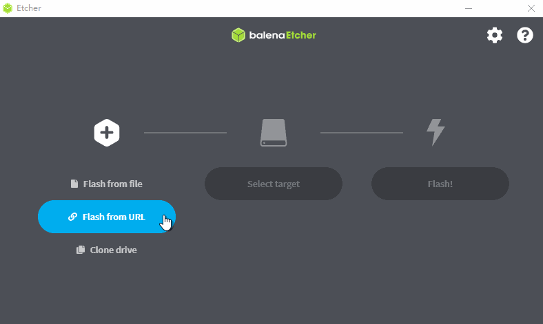
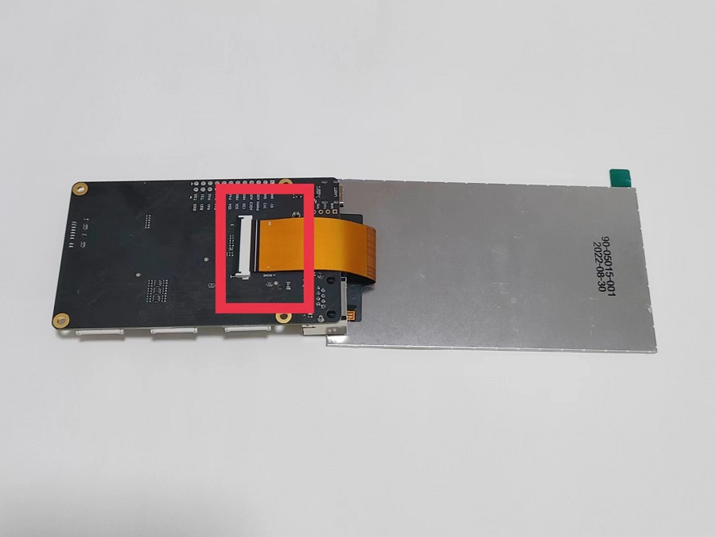
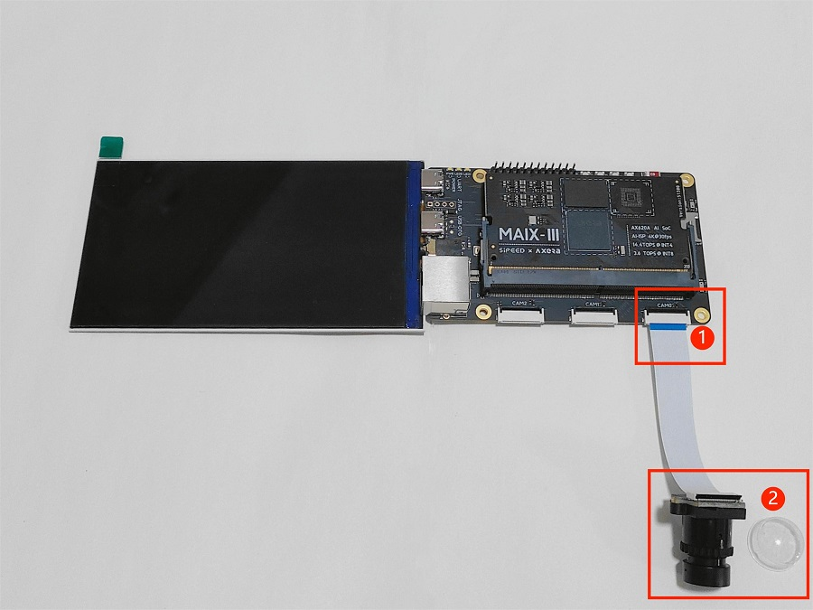
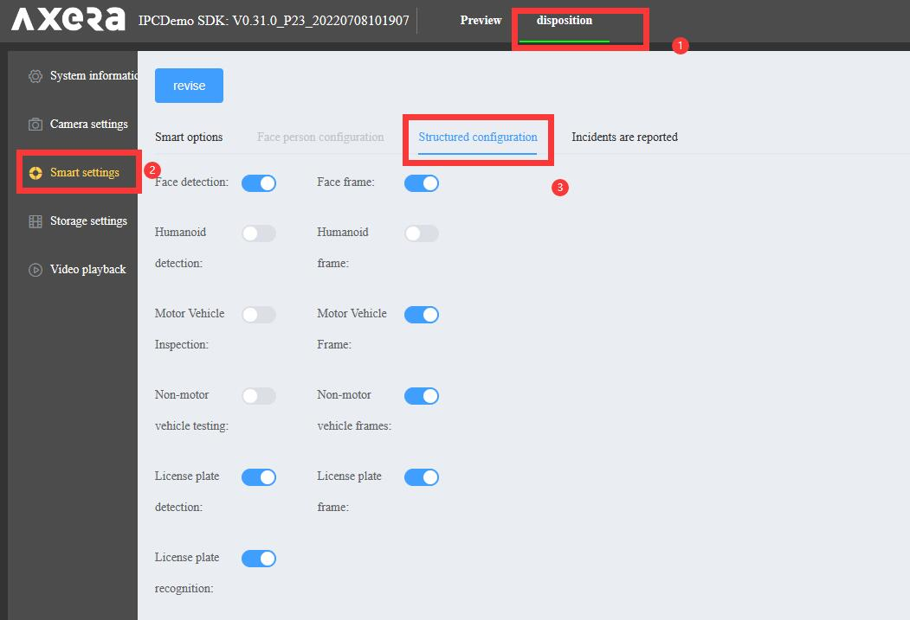
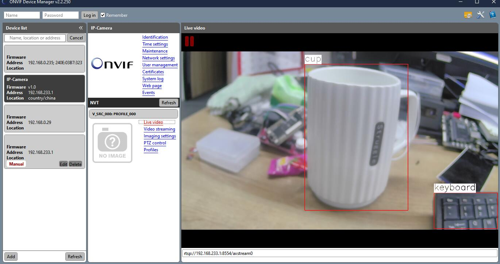
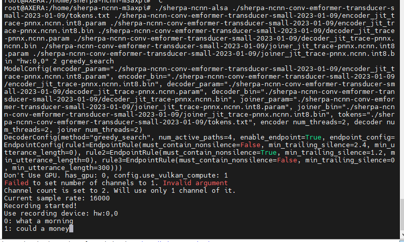

---

## Board Usage

To make it easier to use this board, we make this guide.

## OS introduction

**The default AXera-Pi kit has no onboard memory storage, so it's necessary to prepare a TF card to boot this device.**

For Axera-Pi, we provide Debian11 Bullseye image file.

> 
> [Reasons to use Debian](https://www.debian.org/intro/why_debian.en.html).

TF card which has been flashed system image can be bought from [Sipeed aliexpress](https://sipeed.aliexpress.com/store/1101739727), otherwise you need to prepare your own system image TF card by following steps.

## Choose TF card

People who have bought the TF card which has been burned system image can skip this chapter and read [start Linux](#boot-axera-pi) to use this board

We have tested the read and write speed of some TF cards on Axera-pi, for users to make the choice of TF card.


> Some TF cards are added to test after this photo, so they are not in this photo but they can be recognized by their number.

| Number | Model                                    | <p style="white-space:nowrap">Write speed（Write 160MB）</p> | <p style="white-space:nowrap">Read speed（Read 160MB） </p> |
| ------ | ---------------------------------------- | ------------------------------------------------------------ | ----------------------------------------------------------- |
| 1.     | Netac A2  P500-HS-64GB                   | 2.04697 s, 80.0 MB/s                                         | 1.8759 s, 87.3 MB/s                                         |
| 2.     | Samsung microSDXC UHS-I 128G (Blue card) | 2.53387 s, 64.7 MB/s                                         | 1.99882 s, 82.0 MB/s                                        |
| 3.     | EAGET T1 series 64G                      | 6.56955 s, 24.9 MB/s                                         | 7.13792 s, 23.0 MB/s                                        |
| 4.     | Keychron microSDXC UHS-I 128G            | 2.28133 s, 71.8 MB/s                                         | 1.92001 s, 85.3 MB/s                                        |
| 5.     | KIOXIA microSDXC UHS-I 32G               | 6.71284 s, 24.4 MB/s                                         | 2.36794 s, 69.2 MB/s                                        |
| 6.     | Netac  A1 32GB                           | 4.31411 s, 38.0 MB/s                                         | 2.00759 s, 81.6 MB/s                                        |
| 7.     | BanQ JOY card platinum 64G               | 9.08105 s, 18.0 MB/s                                         | 9.02843 s, 18.1 MB/s                                        |
| 8.     | Hiksemi HS -TF- P2 64G                   | 2.28079 s, 71.8 MB/s                                         | 1.87698 s, 87.3 MB/s                                        |

The following TF cards are not in this photo but we also tested them.

| Number | Model                                 | <p style="white-space:nowrap">Write Speed (Write 160MB) </p> | <p style="white-space:nowrap">Read Speed (Read 160MB) </p> |
| ------ | ------------------------------------- | ------------------------------------------------------------ | ---------------------------------------------------------- |
| 1.     | Lexar 64GB TF（MicroSD）C10 U3 V30 A2 | 2.59644 s, 63.1 MB/s                                         | 1.9106 s, 85.8 MB/s                                        |
| 2.     | Lexar 128GB TF（MicroSD）C10 U3 V30   | 6.73793 s, 24.3 MB/s                                         | 6.94079 s, 23.6 MB/s                                       |

## Burn system image


We only reserved EMMC pad on board, so we need a TF card which has been burned system image to boot linux on this board.

### Get image

Because the system image is about 2G memory storage, we only provide mega link to download.

Visit mega [Click me](https://mega.nz/folder/9EhyBbJZ#lcNhhm9aWXOyo2T0DDaSqA) to download the image file.


The file name ends with `img.xz` is the compressed system image file, and the other file name ends with `img.xz.md5sum` is the check file, which we use to check the compressed system image file.

The name rule of compressed system image file is `Image provider` _ `Target chip` _ `Linux distribution` _ `Created time` + `img.xz`

The check file should be used in Linux, and users using windows10 or windows 11 can use the wsl to prepare a Linux environment

Run command `md5sum -c *.md5sum*` in the path where compressed system image file and check file are to check the compressed system image file.

| Check succeeded                                                       | Check failed                                                     |
| -------------------------------------------------------------- | ------------------------------------------------------------ |
|  |  |

If there is some thing with the compressed system image file, it will show FAILED. Normally we don't need to check the compressed system image file, this is only for those who need it.

### Burn image

**Before burning the image, we need to do the following preparation:**

- A TF card with a storage capacity card over 8GB. It is recommended to buy an official image card, otherwise it may lead to a bad experience due to the bad performance of the TF card
- A card reader: It is recommended to use the card reader that supports USB3.0, this will save time on burning the system image card.
- [Etcher](https://www.balena.io/etcher/) application: Download the edition of this application suitable for your computer system.

**Burning system image steps**

Run [Etcher](https://www.balena.io/etcher/ "Etcher") application, click `Flash from file`, choose the compressed system image `img.xz` file， then click `Select target` to choose the TF card，click `FLASH` to burn your TF card.

**Burn the TF card**




| Burning                                                                          | Finish burning                                                    |
| ------------------------------------------------------------------------------- | ----------------------------------------------------------- |
|  |  |

Note that after finishing burning the application shows `Flash Complete!` and `Successful`.

Finishing the above steps, the computer will ask us to format the udisk, we just ignore this information and remove the TF card (Because we have made `Successful` in Etcher), prepare for the following operations.

### Burning Questions

#### 1. After selecting system image, Etcher shows error.

Rerun Etcher application to solve this error due to software cache or other issues

#### 2. After finishing burning software the application shows FAILED not Successful

Reburn the TF card.

#### 3. The storage capacity of tf card is too small

In this case, those who use Windows and MaxOS can use [SD Card Formatter](https://www.sdcard.org/downloads/formatter/eula_windows/SDCardFormatterv5_WinEN.zip) to format tf card, and those who use Linux can format the tf card by [Gparted](https://gparted.org/).

## Boot System

Finishing burning system image into tf card, we can assemble this board and boot this device.


### Assemble this board

> Those who have bought the `Full board package` can skip these steps and visit [boot Axera-pi] to start.

**Preparation**

- An AXera-Pi development board
- At least one USB3.0 connector to connect device(This board may fail to boot because  of insufficient power supply from USB2.0)
- A tf card which has been burned system image
- GC4653 camera or OS04a10 camera
- The 5 inch MIPI screen suitable for Axera-pi


**Follow these steps to make sure you assemble them correctly**

1. Set the screen and the board as shown in the image below, and connect them.
2. Insert tf card which has been burned system image into the card slot on Axera-pi.
3. Connect the camera with Axera-pi as shown in the image below, make sure you have removed the cover on the camera after finishing connecting.

<html>
  
  
</html>

**Camera connection**

There are 2 versions of camera, make sure the `1` on the camera matches the `1` on the board. Wrong connection will burn and destroy the camera.


Different onboard camera FPC connector needs different configuration, we use `CAM0` as the default one.

### Boot AXera-Pi

Connect both `USB-UART` and `USB-OTG` port with computer by USB type-c cable to boot AXera-Pi, make sure you have inserted the tf card which has been burned system image.


Because of the change of screen version, visit [bad display](https://wiki.sipeed.com/hardware/en/maixIII/ax-pi/faq_axpi.html#Q%EF%BC%9AThe-screen-is-blurred-after-booting) if your screen does not display the picture well.

> In **20221013** we update the power-on phenomenon:

- The 3.5mm stereo connector plays the music if connected with device.
- 5 inches screen displays picture.
- The logs are printed to USB-UART port, run serial port application to see it if you need.

Here are the drivers for CH340 which is the USB-UART chip on Axera-Pi, install it if you can't see the serial device on your computer.

[CH34x Windows driver](https://dl.sipeed.com/shareURL/MAIX/tools/ch340_ch341_driver)
[CH34x Linux driver](http://www.wch-ic.com/downloads/CH341SER_LINUX_ZIP.html)

If logs are not printed on serial terminal, press `RST` key on AXera-Pi to restart device.

And those who use Ubuntu22.04 may not be able to open serial port (ttyUSB), read [this](https://www.chippiko.com/ch340-dev-ttyusb-not-showing) to see the solution.


- `DRAM 1 GiB` in the log is not accuracy, in system we can check there is `2 GiB` memory.

## Login AXera-Pi


> When the logo above is displayed on the screen of AXera-Pi, the system has finished booting, and we can login to AXera-Pi.


The first time to login to device, we need to use serial port application to open the serial port to communicate with the device to login, and using SSH login is also OK if you know the ip address of your board.

[MobaXterm](https://mobaxterm.mobatek.net/) is a ultimate toolbox for remote computing, we use this software to run our command on the board for example.


### Login via serial port

We take MobaXterm as an example serial port software, you can use your favorite one.

In MobaXterm, we create a serial session. Set baudrate 115200, then click OK to create it.


Then click the created serial session to open the serial port to build communication.


Run the serial port application, use username `root` and password `root` to login.

The password is not displayed when you enter it, so just retry if you fail to login.


### Login by SSH

To login by SSH, we need to know the ip address of Axera-Pi.

#### Traditional ip address

We make Axera-Pi and the computer in a same network environment, then run command `ifconfig` on Axera-Pi to get the ip address of Axera-Pi in this network environment.

But you need to make sure you have connected Axera-Pi to network, visit [Connect to network](#connect-to-network) to know how to connect to network.

#### RNDIS

Connect the computer with USB-OTG port on Axera-Pi.


Normally RNDIS is driver free in Linux, and in Windows we need to update the driver [Click me](./rndis.md), for macos it needs to build and install `horndis` to use RNDIS.

Deflaut RNDIS driver error in Windows:


Run command `ifconfig`, we can see there is a usb device with IP `192.168.1.233`, we'll use this ip address many times in the following content.


#### Login to board

Up to now you have get one of your ip address, run command `ssh {username}@{ip address}` to connect to your board.

Here we take the RNDIS ip address for example to connect Axera-Pi by SSH, and the username is root, you can use other ip address or username you like if you have created the new user.

```bash
ssh root@192.168.233.1
```


## Connect to network

Axera-Pi connects to network via network cable or wireless module.

### Connect by Ethernet

Connect the board ethernet port with a network gateway by network cable.

Run command `ifconfig eth0` to see whether there is the ip address.


If there is no ip address of eth0 after connecting with network gateway, run command `dhclient eth0 &` to get the ip address manually.


And we can also use command `ifdown eth0` to disable Ethernet, and then use `ifup eth0 --force` to restart Ethernet to get the ip address.

### Wireless network

1. Run command `ifconfig wlan0` to see whether there is the wireless device first, if there is no wireless device, visit [AXera-Pi Q&A](https://wiki.sipeed.com/hardware/en/maixIII/ax-pi/faq_axpi.html#Q%EF%BC%9ANo-wlan0-shown-in-result-after-running-command-%3Ccode%3Eifconfig%3C/code%3E) to solve this problem. And only 2.4GHz wireless network is feasible.

2. Run command `nmtui-connect` to open a wireless internet graphical interface.


3. Run command `ifconfig wlan0` to see whether there is the ip address.


Besides, Run command `nmcli device wifi connect Sipeed_Guest password qwert123` can also connect to wireless network, change the `Sipeed_Guest` into your wireless network name and change `qwert123` into your wireless network password. It will autoconnect to the wireless network when board boots.

## Config System

### System time

Maix-III AXera-Pi uses the NTP protocol to update the system time. You can run the `date` command to get the current system time.

> After connecting to Internet, system will automatically run `ntpdate-debian` to update system time.

#### Change timezone

Maix-III AXera-Pi default timezone is GMT+8, you can change it with command `dpkg-reconfigure tzdata` if necessary.


#### Update time

Run `ntpdate-debian` command after connecting Maix-III AXera-Pi to network to update time.

### Install application

Based on debian, we can use `apt` to install the software on Maix-III AXera-Pi. Change the software resource if you think it's slow to download the software.

Here we install `gcc`, `gparted`.

```bash
sudo apt update
sudo apt install gcc gparted
```


### Reboot/Shutdown device

For Linux we suggest rebooting or shutting down the device by command line instead of disconnecting the USB cable or clicking the reset key, which may destory the file system.

Run command `reboot` to restart device.

```bash
reboot
```

Run command `shutdown` to power off device.

```bash
poweroff
```

### Resize system storage

Run command `lsblk` to see the partition information, then resize the memory partition by command `cfdisk /dev/mmcblk2`.


Then the following similar interface shown, and we choose `/dev/mmcblk2p2` by arrow keyboard `↑` `↓`, select the `Resize` below by arrow keyboard `←` `→`. 


The whole free space is resized by default, and you can enter your desired memory storage.


Enter your desired memory storage, and press Enter keyboard to save your temp change. Use arrow keyboard `←` `→` and choose `Write` to apply your change, and enter `yes` to confirm the change.


Use arrow keyboard `←` `→` and select `Quit` to quit the storage partition.


Finishing these, we run command `df -h` to see the disk space usage, and we can see that the resized memory storage is not applied, we use command `resize2fs /dev/mmcblk2p2` to change the size of `mmcblk2`, and run command `df -h` again to see the applied change.


> Run `reboot` if there is some trouble resizing the storage memory.

### Boot script

The boot script is in `/boot` and named `rc.local`, you can edit it if you need.

The boot script uses the root directory `/` by default, for example, if you want to run `/home/run.sh` at startup:

1. Use the absolute path to run the script background `/home/run.sh & `, if it's not running background we may not be able to control the board by command line anymore.
2. Use the relative path to run the script background `cd /home && ./run.sh &`, note that the path is different from the absolute path.

Here is the default boot script.

```bash
root@AXERA:~# cat /boot/rc.local
```

```txt
#!/bin/sh

# this file is called by /etc/rc.local at boot.

# systemctl stop usb-gadget@g0
# mkdir -p /mnt/udisk && mount /dev/sda1 /mnt/udisk
# python3 /mnt/udisk/alltest.py

# this control lcd backlight(50 ~ 1000)
echo 0 > /sys/class/pwm/pwmchip0/export
echo 1000 > /sys/class/pwm/pwmchip0/pwm0/period
echo 500 > /sys/class/pwm/pwmchip0/pwm0/duty_cycle
echo 1 > /sys/class/pwm/pwmchip0/pwm0/enable

# wifi connect ssid Sipeed_Guest pasw qwert123
nmcli device wifi connect Sipeed_Guest password qwert123

if [ -f "/root/boot" ]; then
  cd /root/ && chmod 777 * && ./boot &
elif [ -d "/root/app" ]; then
  cd /root/app && chmod 777 *
  if [ -f "./main" ]; then
    ./main &
  elif [ -f "./main.bin" ]; then
    ./main.bin &
  elif [ -f "./main.py" ]; then
    python3 ./main.py &
  fi
else
  aplay /home/res/boot.wav >/dev/null 2>&1 &
  /opt/bin/sample_vo_fb -v dsi0@480x854@60 -m 0 >/dev/null 2>&1 &
  sleep 0.8 && /home/fbv-1.0b/fbv /home/res/2_480x854.jpeg && killall sample_vo_fb &
  python3 -c "import os, binascii; os.system('sed -i \'/iface eth0 inet dhcp/ahwaddress ether {}\' /etc/network/interfaces'.format(binascii.hexlify(bytes.fromhex(open('/proc/ax_proc/uid').read().split('0x')[1][:-5]),':').decode('iso8859-1'))) if os.system('grep \'hwaddress ether\' /etc/network/interfaces -q') != 0 else exit();" &
fi

exit 0
```


From the boot script `rc.local`, we can see that `/home/res/2_480x854.jpeg` is what is displayed on the screen, and you can change it if you need.

### Update kernel and driver

The first partition of system image card is mounted at `/boot` after booting, and replace with the file we can update the firmware to fit our hardware after rebooting the device.

- `boot.bin` spl initialize file

- `uboot.bin` uboot boot file 

- `kernel.img` linux kernel

- `dtb.img` linux device tree

For example:

- Update device tree: `cp /boot/dtb.img.lcd20221025 /boot/dtb.img` 

- Update kernel `cp /boot/kernel.img.rtl8723bs /boot/kernel.img`

Then reboot device to apply the new configuration.

## Transfer file

> If you need to transfer file to AXera-Pi, here are some ways to do this.

### SD card reader

Because of the `ext4` format file system, those who use Windows/Mac can't open the file without other application, so it's only suggested to open the tf image card in Linux. And it's also a good idea to transfer by u-disk connected to the USB-OTG port on AXera-Pi.

### Connect to computer

#### Network SSH

We have told the way to login AXera-Pi by [SSH](#login-by-ssh), and with [mobaxterm](https://mobaxterm.mobatek.net/) it's really convenient to transfer files on Windows. Besides, login by ssh on [vscode](https://code.visualstudio.com/), we can transfer file by the Vscode Explorer.


Besides, we can not only use mobaxterm for file transfer, but also run X11 on this software if you login by ssh. This is an example of running gparted on Axera-Pi with X11 on mobaxterm.


#### Serial communication

If you connect the board with computer by [serial port](#serial-communication), after installing the `lrzsz` application by command `apt-get install lrzsz` after AXera-Pi is connected to network, we can transfer it by `minicom` on Linux or [mobaxterm](https://mobaxterm.mobatek.net/) on Windows.

## Check the peripheral

### Built in application

Maix-III AXera-Pi includes some Built-in Linux applications, and they are in `ls /opt` directory.

```bash
root@AXERA:~# ls /opt
```

```bash
bin  include  lib  scripts  share
```

And some resources are in the `/home` directory

```bash
root@AXERA:~# tree -L 1 /home
```

```bash
├── ax-samples          # npu ai sdk
|-- bin                 # Ax example applications
├── examples            # Ax example applications
├── fbv-1.0b            # fbv picture viewer
├── images              # Test pictures
├── libmaix             # simple pipeline sdk
├── models              # Built in AI models
├── res                 # Pictures and fonts
├── systemd-usb-gadget  # Config usb service
├── usb-uvc-gadget      # Config uvc service
└── ustreamer           # mjpeg application
```

We have put `gcc g++ gdb libopencv ffmpeg` into the Linux system image, with which we can compile the application on AXera-Pi.


Here is an example using libmaix：

```bash
cd /home/libmaix/examples/axpi/
python3 project.py build
fbon
./dist/start_app.sh
```

Screen displays the content of camera, if you failed running this application, visit [AXear-Pi Q&A](./faq_axpi.md) to see how to switch camera.


The axsample has been compiled, and its joint models are in `/home/models/` directory for people to use.

```bash
/home/ax-samples/build/install/bin/ax_yolov5s -m /home/models/yolov5s.joint -i /home/images/cat.jpg -r 10
fbon
fbv yolov5s_out.jpg
```

Screen shows the yolovs_out.jpg picture file, `reboot` system if there is something occupying the system resources


Run `git pull` to get the latest libmaix code.

### Pin maps


### RTC

There is a RTC(Real Time Clock) on the ext-board under the Core module, which provides the read time for Maix-III AXera-Pi when not accessed wireless. Use command `hwclock -w -f /dev/rtc0` to write current system time into RTC to adjust its time date.

Run command `ls /sys/class/rtc`, we can see two rtc devices: `rtc0` and `rtc1`, `rtc0` is the Real Time Clock on the ext-board and `rtc1` is the AXera-Pi internal Real Time Clock.


### CPU & RAM

Default runs at 800MHz, and can be changed into 1GHZ.

By command `ax_lookat`, we can get the values of memory.


Set cpu at 800MHz:

```bash
root@AXERA:~# ax_lookat 0x01900000 -s 33
```

View cpu frequency:

```
root@AXERA:~# ax_clk
AX620A:
DDR:            3733 MHz
CPU:            800 MHz
BUS of VPU:     624 MHz
BUS of NPU:     624 MHz
BUS of ISP:     624 MHz
BUS of CPU:     624 MHz
NPU OTHER:      800 MHz
NPU GLB:        24 MHz
NPU FAB:        800 MHz
NPU CORE1:      800 MHz
NPU CORE0:      800 MHz
ISP:            533 MHz
MM:             594 MHz
VPU:            624 MHz
```

Set cpu at 1GHz:

```
root@AXERA:~# ax_lookat 0x01900000 -s 35
```

View cpu frequency:

```
root@AXERA:~# ax_clk
AX620A:
DDR:            3733 MHz
CPU:            1000 MHz
BUS of VPU:     624 MHz
BUS of NPU:     624 MHz
BUS of ISP:     624 MHz
BUS of CPU:     624 MHz
NPU OTHER:      800 MHz
NPU GLB:        24 MHz
NPU FAB:        800 MHz
NPU CORE1:      800 MHz
NPU CORE0:      800 MHz
ISP:            533 MHz
MM:             594 MHz
VPU:            624 MHz
```

### VIDEO

This is a demo for testing camera, visit [built in application](#built-in-applications) for more usages.

- gc4653 （Defaule camera）
- os04a10（Night enhanced camera）

```bash
sample_vin_vo -c 2 -e 1 -s 0 -v dsi0@480x854@60 # For gc4653 camera
# sample_vin_vo -c 0 -e 1 -s 0 -v dsi0@480x854@60 # For os04a10 camera
```


> Those using os04a10 visit [AXera Pi](https://wiki.sipeed.com/hardware/en/maixIII/ax-pi/faq_axpi.html#Q%EF%BC%9AHow-to-switch-to-os04a10-camera%EF%BC%9F) to see how to switch camera.

### DISPLAY

Because of the change of screen version, visit [bad display](https://wiki.sipeed.com/hardware/en/maixIII/ax-pi/faq_axpi.html#Q%EF%BC%9AThe-screen-is-blurred-after-booting.) if your screen does not display well.

Run command `sample_vo -v dsi0@480x854@60 -m 0` we can see there is colorbar on the screen to test the screen display, make sure you have disabled the framebuffer with command `fboff`, otherwise this `sample_vo -v dsi0@480x854@60 -m 0` will not work, and use command hotkey `Ctrl` + `c` to cancel the command is you want to stop running the application.

#### Show a picture

Now we use framebuffer (/dev/fb0) to control the camera content, run command `fbon` to enable the framebuffer, and `fboff` to disable the framebuffer. When `/dev/fb0` is enabled, we can display picture on the screen by command `fbv xxx.jpg`, and some pictures have been stored in `/home/res/` directory, display them by yourself.


```
fbon                        # enable framebuffer
fbv /home/res/logo.png      # display picture
fboff                       # disable framebuffer
```


#### Play video

We can play video via `ffmpeg`. The video should be `BGR format`, with `90° clockwise rotation` and `480*854 resolution`.

If you think the video plays too fast, run `ffmpeg -i /home/kun_1_output.mp4 -vf "setpts=2*PTS" test3.mp4` to rebuild a slow video.

```bash
fbon
ffmpeg -i /home/test3.mp4 -pix_fmt rgba -f fbdev /dev/fb0
fboff
```

In python we can run all commands above by `os.system()`.

```python
import os
os.system("fbon")
os.system("fbv /home/res/logo.png")
os.system("fboff")
os.system("fbon")
os.system("ffmpeg -i /home/test3.mp4 -pix_fmt rgba -f fbdev /dev/fb0")
os.system("fboff")
```

### NPU

The NPU examples are in the `/home/ax-samples/build/install` directory, just run them to see their results.

```bash
fbon
/home/ax-samples/build/install/bin/ax_yolov5s -m /home/models/yolov5s.joint -i /home/images/cat.jpg -r 10
fbv yolov5s_out.jpg
```

### AUDIO

There is a 3.5mm audio connector on AXera-Pi, we can use is to play or record audio, here are examples to test this peripheral, it's a bit loud, change the volume by `alsamixer`.


And these are examples:

- **Test command**：`speaker-test -t sine -f 440 -c1`
- **Record audio**: `arecord test.wav -c 2 -f cd -d 2`
- **Play audio**：`aplay test.wav`

And this is a python example to record and play the audio.

```python
import pyaudio
try:
    chunk = 1024      # Each chunk will consist of 1024 samples
    sample_format = pyaudio.paInt16      # 16 bits per sample
    channels = 2      # Number of audio channels
    fs = 44100        # Record at 44100 samples per second
    time_in_seconds = 30
    p = pyaudio.PyAudio()
    stream = p.open(format=sample_format,
                    channels = channels,
                    rate = fs,
                    frames_per_buffer = chunk,
                    input = True, output = True)
    # Store data in chunks for 3 seconds
    for i in range(0, int(fs / chunk * time_in_seconds)):
        data = stream.read(chunk)
        stream.write(data)
finally:
    # Stop and close the Stream and PyAudio
    stream.stop_stream()
    stream.close()
    p.terminate()
```

### USB

There is a USB-OTG port on AXera-Pi, we can change its function to be a OTG device or HOST device.

#### USB OTG RNDIS

We set this function as the default function of USB-OTG port, with this we can see there is a usb RNDIS device in the device manager and we can login to AXera-Pi by SSH with ip `192.168.233.1` if connecting the computer with AXera-Pi via its USB-OTG port. [Click me](#rndis) to know how to login with RNDIS by ssh.


The system enables amd starts this service by command `systemctl enable usb-gadget@g0` and `systemctl start usb-gadget@g0`, run command `systemctl disable usb-gadget@g0` to disable this service or command `systemctl stop usb-gadget@g0` to stop this service, by stopping this we can use this USB-OTG port for other functions, we'll describe these in the following content.

#### USB HOST Device

Stop the RNDIS service with command `systemctl stop usb-gadget@g0`, then run command `systemctl start usb-gadget@g1` to set the USB-OTG port as the HOST function, connect a USB device with the USB-OTG port, run command `lsusb` to check the usb device.

Here are the example logs(To read a usb storage device and mount it on AXera-Pi).

```bash
root@AXERA:~# systemctl stop usb-gadget@g0
root@AXERA:~# lsusb
Bus 002 Device 001: ID 1d6b:0003 Linux Foundation 3.0 root hub
Bus 001 Device 002: ID 067b:2731 Prolific Technology, Inc. USB SD Card Reader
Bus 001 Device 001: ID 1d6b:0002 Linux Foundation 2.0 root hub
root@AXERA:~# fdisk -l
Disk /dev/mmcblk2: 58.94 GiB, 63281561600 bytes, 123596800 sectors
Units: sectors of 1 * 512 = 512 bytes
Sector size (logical/physical): 512 bytes / 512 bytes
I/O size (minimum/optimal): 512 bytes / 512 bytes
Disklabel type: dos
Disk identifier: 0x32eb5429

Device         Boot  Start       End   Sectors  Size Id Type
/dev/mmcblk2p1 *      2048    264191    262144  128M  c W95 FAT32 (LBA)
/dev/mmcblk2p2      264192 123596799 123332608 58.8G 83 Linux


Disk /dev/sda: 240 MiB, 251658240 bytes, 491520 sectors
Disk model: SD Card Reader
Units: sectors of 1 * 512 = 512 bytes
Sector size (logical/physical): 512 bytes / 512 bytes
I/O size (minimum/optimal): 512 bytes / 512 bytes
Disklabel type: dos
Disk identifier: 0x0607cfd2

Device     Boot Start    End Sectors   Size Id Type
/dev/sda1  *      240 490239  490000 239.3M  e W95 FAT16 (LBA)
root@AXERA:~# mkdir /mnt/sdcard && mount /dev/sda1 /mnt/sdcard
```

#### USB OTG CAM

**usb-uvc-gadget**：[usb-uvc-gadget](https://github.com/junhuanchen/usb-uvc-gadget)

Visit [uvc_vo](#uvc_vo) to find out more.

#### USB HOST CAM

With this example we can connect a USB camera to AXera-Pi USB-OTG port, and display the usb camera content in the browser, so we need to make sure AXera-Pi has connected to the network first, and we need to get the ip address of AXera-Pi, with which we can view the usb camera content in the browser.

**Ustreamer**：[Github](https://github.com/pikvm/ustreamer)

Run the following code, and open the ip address of AXera-Pi in a web browser.

```bash
/home/ustreamer/ustreamer --device=/dev/video0 --host=0.0.0.0 --port=80
```


We have these choices: 


Streamer example:


- **Read USB Camera by OPENCV**

Run following python code to display the USB camera content on the screen of AXera-Pi by OPENCV

```python
import os
import cv2
video = cv2.VideoCapture(0)
for i in range(30):
    ret, frame = video.read()
    if ret:
        cv2.imwrite("/tmp/capture.jpg", frame)
        os.system("fbon && fbv /tmp/capture.jpg")
```


> Visit [AXera-Pi FAQ](./faq_axpi.md) if you have some trouble.

### GPIO

#### Read KEY input：GPIO2 21

This is the USER key on AXera-Pi.

Config the USER key first.

```bash
echo 85 > /sys/class/gpio/export            # export the USER key
echo in > /sys/class/gpio/gpio85/direction  # set the exported USER key direction
```

Get the USER key value

```bash
cat /sys/class/gpio/gpio85/value            # Get the value of USER key, 1 is unpressed and 0 is pressed
```

#### Blink a LED GPIO2 A4-68 A5-69

Export the LED IO and set its direction.

```bash
echo 68  > /sys/class/gpio/export
echo out > /sys/class/gpio/gpio68/direction
```

Set led IO voltage value to control the LED.

```bash
echo 1 > /sys/class/gpio/gpio68/value
sleep 1
echo 0 > /sys/class/gpio/gpio68/value
sleep 1
echo 1 > /sys/class/gpio/gpio68/value
```

> Calculating Rule: GPIO2 A4 == 32 *  2 + 4 = 68

For Axera chip, GPIO0 means A IO port and GPIO2 means C IO port, and example like A4 is just a signal.

GPIO2 A4 in AXera-Pi is GPIO C(2) 4(A4) in standard definition , and standard definition GPIOA0 means IO GPIO0A4 in AXera-Pi.

In the future, we'll apply definition like PA0 and PC4, which is easier to understand.

Here we use Python to control the GPIO, from the following figure, we can see that the BOT_GPIO_0-7 of the pin headers are GPIO2_A16_m - GPIO2_A23_m in the system.


The relationship between PA0-3 and the figure above is as follows:


We use Python3 libgpiod to encapsulate gpio class.

```python

try:
    from gpiod import chip, line, line_request
    config = None # rpi is default value A 0
    def gpio(gpio_line=0, gpio_bank="a", gpio_chip=0, line_mode = line_request.DIRECTION_OUTPUT):
        global config
        if config != None and gpio_line in config:
            gpio_bank, gpio_chip = config[gpio_line]
        l, c = [32 * (ord(gpio_bank.lower()[0]) - ord('a')) + gpio_line, chip("gpiochip%d" % gpio_chip)]
        tmp = c.get_line(l)
        cfg = line_request() # led.active_state == line.ACTIVE_LOW
        cfg.request_type = line_mode # line.DIRECTION_INPUT
        tmp.request(cfg)
        tmp.source = "GPIO chip %s bank %s line %d" % (gpio_chip, gpio_bank, gpio_line)
        return tmp
    def load(cfg=None):
        global config
        config = cfg
except ModuleNotFoundError as e:
    pass

```

GPIO input test:

```python

led0 = gpio(16, gpio_chip=2, line_mode = line_request.DIRECTION_INPUT)
led1 = gpio(17, gpio_chip=2, line_mode = line_request.DIRECTION_INPUT)
led2 = gpio(18, gpio_chip=2, line_mode = line_request.DIRECTION_INPUT)
led3 = gpio(19, gpio_chip=2, line_mode = line_request.DIRECTION_INPUT)

def test():
    import time
    print(led0.get_value())
    print(led1.get_value())
    print(led2.get_value())
    print(led3.get_value())
    time.sleep(1)
    print(time.asctime())

while True:
    test()

```

GPIO output test：

```python

led0 = gpio(16, gpio_chip=2, line_mode = line_request.DIRECTION_OUTPUT)
led1 = gpio(17, gpio_chip=2, line_mode = line_request.DIRECTION_OUTPUT)
led2 = gpio(18, gpio_chip=2, line_mode = line_request.DIRECTION_OUTPUT)
led3 = gpio(19, gpio_chip=2, line_mode = line_request.DIRECTION_OUTPUT)

def test():
    import time
    time.sleep(1)
    led0.set_value(1)
    led1.set_value(1)
    led2.set_value(1)
    led3.set_value(1)
    time.sleep(1)
    led0.set_value(0)
    led1.set_value(0)
    led2.set_value(0)
    led3.set_value(0)
    print(time.asctime())

while True:
    test()

```

C example to control gpio: [gpio.h/gpio.c](https://www.cnblogs.com/juwan/p/16917802.html#gpio--pwm)

### UART

The default uart port of USB-UART is **ttyS0**, and the UART on the pin header is **ttyS1**, the virtual USRT is **ttyGS0**.


Here is a `python3 pyserial` example code to test the UART on the pin header, make sure you have connected the GND on your UART-TTL with the GND on the AXera-Pi.

```python
import serial
ser = serial.Serial('/dev/ttyS1', 115200, timeout=1)
ser.write(b'hello world\n')
ser.close()
```

Example [ uart.h/uart.c ](https://www.cnblogs.com/juwan/p/16917802.html#linux-uart-ttysx)

### PWM

Here we change the brightness of the screen of AXera-Pi to test the pwm example
**Example**：Run command `echo 204 > /sys/class/pwm/pwmchip0/pwm0/duty_cycle` and the screen is only one-tenth of the original brightness.

```bash
echo 0 > /sys/class/pwm/pwmchip0/export
echo 4167 > /sys/class/pwm/pwmchip0/pwm0/period
echo 204 > /sys/class/pwm/pwmchip0/pwm0/duty_cycle
echo 2084 > /sys/class/pwm/pwmchip0/pwm0/duty_cycle
echo 1 > /sys/class/pwm/pwmchip0/pwm0/enable
```

PWM Example：[Click me](https://wiki.sipeed.com/soft/maixpy3/zh/usage/hardware/PWM.html#%E5%BC%80%E5%A7%8B).

### I2C

> The I2C on the pin header is `/dev/i2c-7` in AXera-Pi, we use command `i2cdetect` to check the i2c device.


The `i2c-0`, `i2c-1`, `i2c-2` are the camera interface, and `i2c-7` is the connector on pin header, `i2c-8` is the RTC clock, and `i2c-9` is reserved.


For example we use command `i2cdetect -y 0` to see the device on the i2c bus.

If you can't detect your i2c device, make sure you have pulled up the data line.

```bash
root@AXERA:~# i2cdetect -y -r 0
     0  1  2  3  4  5  6  7  8  9  a  b  c  d  e  f
00:                         -- -- -- -- -- -- -- --
10: -- -- -- -- -- -- -- -- -- -- -- -- -- -- -- --
20: -- 21 -- -- -- -- -- -- -- -- -- -- -- -- -- --
30: -- -- -- -- -- -- 36 -- -- -- -- -- -- -- -- --
40: -- -- -- -- -- -- -- -- -- -- -- -- -- -- -- --
50: -- -- -- -- -- -- -- -- -- -- -- -- -- -- -- --
60: -- -- -- -- -- -- -- -- -- -- -- -- -- -- -- --
70: -- -- -- -- -- -- -- --
```

The **0x21** 和 **0x36** in the log means there is a i2c device connecting to the `/dev/i2c-0` connector, and we can use command `i2cget` to read the data of the i2c device or command `i2cset` to write the i2c device.

### SPI

### CHIP ID

Get the unique chip id of the main chip.

```bash
cat /proc/ax_proc/uid
```

### ADC

### Factory test script

.. details::This is the factory test python script
    ```python
    test_flag = False

    try:
        from gpiod import chip, line, line_request
        config = None # rpi is default value A 0
        def gpio(gpio_line=0, gpio_bank="a", gpio_chip=0, line_mode = line_request.DIRECTION_OUTPUT):
            global config
            if config != None and gpio_line in config:
                gpio_bank, gpio_chip = config[gpio_line]
            l, c = [32 * (ord(gpio_bank.lower()[0]) - ord('a')) + gpio_line, chip("gpiochip%d" % gpio_chip)]
            tmp = c.get_line(l)
            cfg = line_request() # led.active_state == line.ACTIVE_LOW
            cfg.request_type = line_mode # line.DIRECTION_INPUT
            tmp.request(cfg)
            tmp.source = "GPIO chip %s bank %s line %d" % (gpio_chip, gpio_bank, gpio_line)
            return tmp
        def load(cfg=None):
            global config
            config = cfg
    except ModuleNotFoundError as e:
        pass

    key = gpio(21, gpio_chip=2, line_mode = line_request.DIRECTION_INPUT)
    led0 = gpio(4, gpio_chip=2, line_mode = line_request.DIRECTION_OUTPUT)
    led1 = gpio(5, gpio_chip=2, line_mode = line_request.DIRECTION_OUTPUT)

    import time
    import ifcfg
    import os

    def check_ifconfig():
        result = []
        for name, interface in ifcfg.interfaces().items():
            if name in ['eth0', 'wlan0'] and interface['inet']:
                result.append(name)
        return result

    try:
        if (0 == key.get_value()):
            os.system("export LD_LIBRARY_PATH=/opt/lib:LD_LIBRARY_PATH && /opt/bin/sample_vin_vo -c 2 -e 1 -s 0 -v dsi0@480x854@60 &")
            led1.set_value(1)
            while True:
                led0.set_value(1)
                time.sleep(0.2)
                led0.set_value(0)
                time.sleep(0.2)
                tmp = check_ifconfig()
                if len(tmp) > 1:
                    led0.set_value(0)
                    led1.set_value(0)
                    test_flag = True
                    break
            while (0 == key.get_value()):
                time.sleep(0.2)
            os.system("aplay /home/res/boot.wav")
            led0.set_value(1)
            led1.set_value(1)
            import pyaudio
            chunk = 1024      # Each chunk will consist of 1024 samples
            sample_format = pyaudio.paInt16      # 16 bits per sample
            channels = 2      # Number of audio channels
            fs = 44100        # Record at 44100 samples per second
            p = pyaudio.PyAudio()
            stream = p.open(format=sample_format,
                            channels = channels,
                            rate = fs,
                            frames_per_buffer = chunk,
                            input = True, output = True)
            while (1 == key.get_value()):
                data = stream.read(chunk, exception_on_overflow = False)
                stream.write(data)
            while (0 == key.get_value()):
                time.sleep(0.2)
            os.system('killall sample_vin_vo')
            os.system('killall sample_vin_vo')
            # Stop and close the Stream and PyAudio
            stream.stop_stream()
            stream.close()
            p.terminate()
    except Exception as e:
        print(e)
    finally:
        if test_flag:
            led0.set_value(0)
            led1.set_value(0)

    '''

    import pyaudio
    try:
        chunk = 1024      # Each chunk will consist of 1024 samples
        sample_format = pyaudio.paInt16      # 16 bits per sample
        channels = 2      # Number of audio channels
        fs = 44100        # Record at 44100 samples per second
        time_in_seconds = 300
        p = pyaudio.PyAudio()
        stream = p.open(format=sample_format,
                        channels = channels,
                        rate = fs,
                        frames_per_buffer = chunk,
                        input = True, output = True)
        for i in range(0, int(fs / chunk * time_in_seconds)):
            data = stream.read(chunk)
            stream.write(data)
    finally:
        # Stop and close the Stream and PyAudio
        stream.stop_stream()
        stream.close()
        p.terminate()

    '''
    ```


## Built in applications

### IPCDemo

This is an IPC (IP camera) demo program, and its functions are as follows:

- ISP: Transfers the RAW data stream from Sensor into YUV data stream, and output it in 3 channels
- IVPS: Image Video Processing submodule, Resize, Crop, Rotate the video image, or change the video image into multiple ones.
- VENC / JENC：Video / JPEG encoded output.
- Detect: Face detection or structure detection.
- Web display: H264 Web stream and provides to view real-time Web video.
- RTSP Stream: H264 stream RTSP package and transmission.
- TF card Video storage: Package H264 stream into MP4 format and save it to TF card or FLASH.

<p align="center">
    <iframe src="//player.bilibili.com/player.html?aid=260625114&bvid=BV1me411T7g8&cid=837160730&page=1" scrolling="no" border="0" frameborder="no" framespacing="0" allowfullscreen="true" style="max-width:640px; max-height:480px;"> </iframe>
</p>

<p align="center">
    <iframe src="//player.bilibili.com/player.html?aid=688159412&bvid=BV1p24y1d7Te&cid=837167669&page=1" scrolling="no" border="0" frameborder="no" framespacing="0" allowfullscreen="true" style="max-width:640px; max-height:480px;"> </iframe>
</p>

#### Usages

Run the following command to start this application, and we can visit the ip address ([USB-OTG RNDIS](#rndis) or network ip address) of AXera-Pi and add port `8080` in web browser to see the streaming video.

```bash
/opt/bin/IPCDemo/run.sh /opt/bin/IPCDemo/config/gc4653_config.json
```

We use the default camera gc4653 as the example, change the config_json file of your real camera in the end of example command with following choice.


Running this application, lots of logs are shown.


Open the ip address of AXera-Pi with port `8080` in the web browser, here I take `192.168.233.1:8080` as an example (this ip address is the RNDIS ip address of AXera-Pi and can be visited after connecting the computer with the USB-OTG port of AXera-Pi), click the blue frame to login. Sadly this application is only Chinese language support, you can use web translation tool to translate the web content into your language.


#### Snapshot and Record

**Snapshot**

Login to the web stream service (Visit the ip address of AXera-Pi port `8080` after running IPCDemo), there is a camera icon and record icon in the bottom right stream video corner.
Click the camera icon to snapshot the video, and the snapshot picture will be automatically downloaded for viewing.


**Record**

Click the record icon in the bottom right stream video corner to record the video (mp4 format), and click the record icon to stop recording.


| Recording | Unrecording |
| --- | --- |
|  |  |

And we can play or download the recorded video in following step marked with ① and ② in the following picture


**20221017 demo updating** we set the video automatically saved to `/opt/mp4` directory, with which you can use this board as a surveillance network camera after mounting a hard disk.


#### Face detection

In the IPCDemo, we also set other functions, like `Face detection` or `LPRnet`

Login to the IPC website (Visit the ip address of AXera-Pi after running IPCDemo) first, then click what's the following picture marked for your need, use web translation tool to translate these settings.



Tick your needed configurations, we can do face detection in the preview page. IPCDemo application will automatically detect the face and take snapshot, and we can see the detected face picture in the following preview blank area.

- Left: Face detection. Right: Body detection
  
<html>
  
  
</html>

#### LPRnet

Login to the IPC website (Visit the ip address of AXera-Pi after running IPCDemo) first, then click what's the following picture marked for your need, use web translation tool to translate these settings.


Tick your needed configurations, we can do LPRnet detection in the preview page. IPCDemo application will automatically detect the LPRnet and take snapshot, and we can see the detected LPRnet result in the following preview blank area.


### rtsp

> **rtsp**：Real Time Streaming Protocol is an application-level network protocol designed for multiplexing and packetizing multimedia transport streams (such as interactive media, video and audio) over a suitable transport protocol.

Here we use [VLC Media Player](https://www.videolan.org/vlc/) to play the rtsp stream video.


Run the following command on AXera-Pi, open `VLC Media Player` and use hotkey `Ctrl + N` to open a network stream video, enter the ip address of AXera-Pi like `rtsp://192.168.233.1:8554/axstream0` to play the stream video.

Run this command on AXera-Pi:
```bash
/home/examples/vin_ivps_joint_venc_rtsp_vo_onvif_mp4v2/run.sh
```
 
The log of AXera-Pi running rtsp stream video


Enter the ip address of AXera-Pi for playing the stream video, use hotkey `Ctrl + P` to play after entering the ip address of AXera-Pi.


The rtsp example is as follows:
  
<html>
  
  
</html>

Edit `/home/examples/vin_ivps_joint_venc_rtsp_vo_onvif_mp4v2/run.sh` if your camera is not gc4653.


#### ffplay

Except `VCL`, we can use `ffplay` to play the stream video.
**ffplay** :[Click me to download windows edition ffplat](https://dl.sipeed.com/shareURL/MaixIII/AXera/09_Software_tool), for linux user run command `sudo apt install ffmpeg` to install ffplay.

After getting ffplay ready, run following command in command line to play the rtsp stream video of AXera-Pi, change the ip address if necessary.

```bash
ffplay rtsp://192.168.233.1:8554/axstream0 -fflags nobuffer
```

### ONVIF ODM

**ONVIF Device Manager**：[Click to download](https://sourceforge.net/projects/onvifdm/)

Different from VLC player, ODM has many different usages.
    


Run following command on AXera-Pi, the screen on AXera-Pi displays the yolov5s model, then we use `ODM` to display the content on computer.

```bash
/home/examples/vin_ivps_joint_venc_rtsp_vo_onvif_mp4v2/run.sh
```

Edit `/home/examples/vin_ivps_joint_venc_rtsp_vo_onvif_mp4v2/run.sh` file to switch camera if your screen failed display the camera content.


Screen displays the camera content:


Run the `ONVIF Device Manager`, click `Refresh` to scan device, make sure you have connected computer with USB-OTG port of AXera-Pi and there is RNDIS device in your computer manager (Here we take RNDIS as network example and we play the video through `192.168.233.1`). After clicking `Refresh` there is a IP-Camera with IP `192.168.233.1`, choose it and click `Live` video to stream the video.




And we just take RNDIS as example, other IP address like wireless or ethernet are also fine. Make sure your network is good, and bad network can not use `ONVIF Device Manager` with good experience.

- Switch model

> `20221116` we set the different camera parameters in `run.sh`
> `20221111` we set yolov5s face/object detection model in the system image, read the following content to see how to edit the script and switch model.

``` bash
nano /home/examples/vin_ivps_joint_venc_rtsp_vo_onvif_mp4v2/run.sh
```

Run this command on AXera-Pi, we can edit `run.sh` shell annotation `#` to switch model or load other model.
Use hotkey `Ctrl + x` to save your changes.

Follow the instruction press `Y` to save modified buffer.
And use the default file name. Run `run.sh` we can see different detection effects on the screen of Axera-Pi.


- **Press key and Record MP4**
While running `run.sh`, click `USER` key to record video, and **LED0** is on when AXera-Pi is recording.


Click `USER` key again to stop recording and **LED0** is off


The recorded mp4 files are in **`home/examples/`** directory.


### PP_human

Run following command on AXera-Pi, screen displays the background picture, and when capturing a human, it will be shown on the screen.

```bash
/home/examples/vin_ivps_joint_vo_pp_human_seg/run.sh
```


Use the following command to edit the script file, change the annotation `#` to switch camera.

```bash
nano /home/examples/vin_ivps_joint_vo_pp_human_seg/run.sh
```

Use hotkey  `Ctrl + X` and follow instructions we save the change of editing.


### uvc_vo

**usb-uvc-gadget**：[Github repository](https://github.com/junhuanchen/usb-uvc-gadget)

This demo is not very stable. For the first time running this demo application, the usb otg rndis will change into usb otg uvc and lead to the device reboot. After that run this demo application again then everything is right. 

If your screen displays green interface, this means the wrong camera configuration, edit the script to switch camera.

Before running this demo, connecting both USB-UART and USB-OTG port, we use USB-UART port to control AXera-Pi and use USB-OTG to transfer uvc stream to the computer.

Run the following command to start this demo application.

```bash
/home/examples/vin_ivps_joint_venc_uvc_vo/run.sh
```


Run your computer camera application to display the camera detection of AXera-Pi.


The following command can be used to `start`, `stop` or `restore` `uvc demo.

```bash
/home/usb-uvc-gadget/uvc-gadget.sh #start/stop/restore
```

- **Android phone uvc**

This uvc demo application can also display on Android phone which support OTG mode. Download and install a USB camera application on the phone first.

Connect USB-OTG port with Android phone, and run `/home/examples/vin_ivps_joint_venc_uvc_vo/run.sh` on AXera-Pi by USB-UART or SSH to start uvc demo, and start the USB camera application on the Android phone, then the camera content displays both on AXera-Pi screen and Android phone.


This demo can run at system finishing boot if it's written into [rc.local](#boot-script)

### lvgl7 UI

Run following command we can run this lvgl demo.

```bash
/home/bin/sample_vin_ivps_joint_vo_lvgl -c 0
```


<p align="center">
    <iframe src="//player.bilibili.com/player.html?aid=690497396&bvid=BV1n24y1C7DN&cid=901748014&page=1" scrolling="no" border="0" frameborder="no" framespacing="0" allowfullscreen="true"> </iframe>
</p>

### Python API

It's also good to program your application via python, read [Python on Maix-III AXera-Pi](https://wiki.sipeed.com/hardware/en/maixIII/ax-pi/python_api.html) for more.

### Human Parts detection

This demo has been built in system, run following command to experience it.

```bash
./home/run.sh
```

And there are many other models in this system, edit `run.sh` to load and test other models.

```bash
sample_vin_ivps_joint_vo
sample_vin_ivps_joint_venc_rtsp_vo
```

```bash
yolov5_seg.json         yolov7.json           yolox.json
yolov5s_face.json       pp_human_seg.json     ax_pose.json
hrnet_animal_pose.json  hand_pose.json
```

Use command `nano /home/run.sh` to enable the model you want to try. And change the camera by edit `-c 2` to switch to another camera.


<p align="center">
<iframe src="//player.bilibili.com/player.html?aid=647932316&bvid=BV1Pe4y1W7n6&cid=901750338&page=1" scrolling="no" border="0" frameborder="no" framespacing="0" allowfullscreen="true"> </iframe>
</p>

- More built-in examples

There are more examples in `/home/bin`, run then if you want.

```bash
root@AXERA:~# ls /home/bin
sample_h264_ivps_joint_vo       sample_v4l2_user_ivps_joint_vo      sample_vin_ivps_joint_vo       sample_vin_joint
sample_rtsp_ivps_joint          sample_vin_ivps_joint_venc_rtsp     sample_vin_ivps_joint_vo_h265
sample_rtsp_ivps_joint_rtsp_vo  sample_vin_ivps_joint_venc_rtsp_vo  sample_vin_ivps_joint_vo_lvgl
```

Here is an example runnning `sample_vin_ivps_joint_vo_h265`, and `-c 2` means the camera choice.

```bash
/home/bin/sample_vin_ivps_joint_vo_h265 -c 2
```

These are the command logs.


###  sherpa-ncnn (Chinese and English speech recognition)

#### Basic usage

Open directory `/home/sherpa-ncnn-m3axpi`, here are the demos.

```bash
cd /home/sherpa-ncnn-m3axpi
```

- Chinese speech recognition

```bash
./sherpa-ncnn-alsa \
./sherpa-ncnn-streaming-zipformer-small-bilingual-zh-en-2023-02-16/tokens.txt \
./sherpa-ncnn-streaming-zipformer-small-bilingual-zh-en-2023-02-16/encoder_jit_trace-pnnx.ncnn.param \
./sherpa-ncnn-streaming-zipformer-small-bilingual-zh-en-2023-02-16/encoder_jit_trace-pnnx.ncnn.bin \
./sherpa-ncnn-streaming-zipformer-small-bilingual-zh-en-2023-02-16/decoder_jit_trace-pnnx.ncnn.param \
./sherpa-ncnn-streaming-zipformer-small-bilingual-zh-en-2023-02-16/decoder_jit_trace-pnnx.ncnn.bin \
./sherpa-ncnn-streaming-zipformer-small-bilingual-zh-en-2023-02-16/joiner_jit_trace-pnnx.ncnn.param \
./sherpa-ncnn-streaming-zipformer-small-bilingual-zh-en-2023-02-16/joiner_jit_trace-pnnx.ncnn.bin \
"hw:0,0" \
4 \
greedy_search
```

- English speech recognition

```bash
./sherpa-ncnn-alsa \
./sherpa-ncnn-conv-emformer-transducer-small-2023-01-09/tokens.txt \
./sherpa-ncnn-conv-emformer-transducer-small-2023-01-09/encoder_jit_trace-pnnx.ncnn.int8.param \
./sherpa-ncnn-conv-emformer-transducer-small-2023-01-09/encoder_jit_trace-pnnx.ncnn.int8.bin \
./sherpa-ncnn-conv-emformer-transducer-small-2023-01-09/decoder_jit_trace-pnnx.ncnn.param \
./sherpa-ncnn-conv-emformer-transducer-small-2023-01-09/decoder_jit_trace-pnnx.ncnn.bin \
./sherpa-ncnn-conv-emformer-transducer-small-2023-01-09/joiner_jit_trace-pnnx.ncnn.int8.param \
./sherpa-ncnn-conv-emformer-transducer-small-2023-01-09/joiner_jit_trace-pnnx.ncnn.int8.bin \
"hw:0,0" \
2 \
greedy_search
```

Running the command above, speak to the MIC on AXera-Pi or play audio, detection results are printed to terminal.



#### Update sherpa-ncnn

You can update the speech model to get better experience.

Open the directory `/home/sherpa-ncnn-m3axpi` first.

```bash
cd /home/sherpa-ncnn-m3axpi
```

We need to enable the large files first, install `git-lfs` in your Axpi, and enable it.

```bash
sudo apt install git-lfs
git lfs install
```

Then clone the latest sherpa-ncnn speech model, make sure you are in `/home/sherpa-ncnn-m3axpi` directory.

```bash
git clone https://huggingface.co/marcoyang/sherpa-ncnn-streaming-zipformer-zh-14M-2023-02-23
```


Then you can run following code to test the model(Make sure you are in `/home/sherpa-ncnn-m3axpi` directory):

```bash
./sherpa-ncnn-alsa ./sherpa-ncnn-streaming-zipformer-zh-14M-2023-02-23/tokens.txt  \
./sherpa-ncnn-streaming-zipformer-zh-14M-2023-02-23/encoder_jit_trace-pnnx.ncnn.param \
./sherpa-ncnn-streaming-zipformer-zh-14M-2023-02-23/encoder_jit_trace-pnnx.ncnn.bin \
./sherpa-ncnn-streaming-zipformer-zh-14M-2023-02-23/decoder_jit_trace-pnnx.ncnn.param \
./sherpa-ncnn-streaming-zipformer-zh-14M-2023-02-23/decoder_jit_trace-pnnx.ncnn.bin \
./sherpa-ncnn-streaming-zipformer-zh-14M-2023-02-23/joiner_jit_trace-pnnx.ncnn.param \
./sherpa-ncnn-streaming-zipformer-zh-14M-2023-02-23/joiner_jit_trace-pnnx.ncnn.bin \
"hw:0,0" 2 greedy_search
```