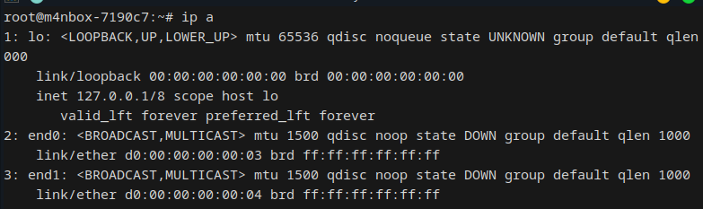

## How to enable root user password login for SSH when the correct password is entered but login fails?
Default password: root
*For security reasons, the default policy only allows the root user to log in remotely via SSH key authentication, which is not only convenient and fast but also secure. The required steps are as follows: After logging into the system via serial port or desktop, manually paste your public key into the `/root/.ssh/authorized_keys` file (create the file if it does not exist). For a more detailed process, you can search for "SSH login with key" or refer directly to this [tutorial](https://www.runoob.com/w3cnote/set-ssh-login-key.html)。*

If you insist on enabling password login, follow these steps:
```bash
# Log in via the serial terminal and execute the following commands:  
# Enable remote password login for the root user  
echo "PermitRootLogin yes" > /etc/ssh/sshd_config.d/allow-root.conf
systemctl restart sshd
```
After development, to avoid risks caused by accidental root password leakage, it is recommended to disable remote password login for the root user by executing the following commands:
```bash
# Log in to any terminal and execute the following commands:  
# Disable remote password login for the root user  
rm /etc/ssh/sshd_config.d/allow-root.conf
systemctl restart sshd
```


## Q: The root filesystem partition is too small by default when using TFCard & eMMC images. How to expand eMMC or TFCard?
```bash
# Log in to any terminal and execute the following commands:  
# Replace mmcblkX below with mmcblk0 (eMMC) or mmcblk1 (TFCard). 
# /dev/mmcblkXp2 is the second partition, which is the root filesystem partition. 
parted /dev/mmcblkX resizepart 2 100%
resize2fs /dev/mmcblkXp2
fsck -y /dev/mmcblkXp2
sync
```


## Q: Some large language models require executing tokenizer-related Python scripts, but an error "ModuleNotFoundError" occurs. How to resolve this?
```bash
# To avoid polluting the system Python libraries, create a virtual environment: 
apt install python3-venv
python3 -m venv venv-llm
# Activate the virtual environment: 
source venv-llm/bin/activate
# Install the missing Python modules (use Tsinghua Mirror for faster installation in China): 
pip install transformers jinja2 -i https://mirrors.tuna.tsinghua.edu.cn/pypi/web/simple
# After installation, you can proceed to execute the script. 
```
Remember to activate the virtual environment before running related Python scripts each time:
```bash
# Activate the virtual environment:  
source venv-llm/bin/activate
```

## Q: If GPIO2_A27 is configured as I2C3_SCL in the device tree, how can I control GPIO2_A27 when I2C3 is not in use? (pinctrl)
```bash
cd /sys/kernel/debug/pinctrl/4250200.pinctrl
grep "GPIO2_A27" pinmux-functions
# output # function 447: GPIO2_A27, groups = [ I2C3_SCL ]
grep "I2C3_SCL" pinmux-pins
# output # pin 87 (I2C3_SCL): device 2024000.i2c function i2c3_scl group I2C3_SCL
echo 2024000.i2c > /sys/bus/platform/drivers/i2c_designware/unbind
grep "I2C3_SCL" pinmux-pins
# output # pin 87 (I2C3_SCL): UNCLAIMED

# echo "<group-name function-name>" > pinmux-select
echo "I2C3_SCL GPIO2_A27" > pinmux-select

gpioset gpiochip2 27=0
gpioset gpiochip2 27=1
```

## Q: The MAC physical address is randomly generated upon each reboot, causing unstable IP addresses. How can this be resolved?

A: Starting from sdcard-20250627.img.xz, the `config.txt` file in the root directory of the first partition (FAT32) contains the U-Boot environment variable configuration. To permanently modify the MAC addresses of the corresponding network interfaces, add the environment variables `ethaddr` and `eth1addr` like this below:

```
ethaddr=d0:00:00:00:00:03
eth1addr=d0:00:00:00:00:04
```

