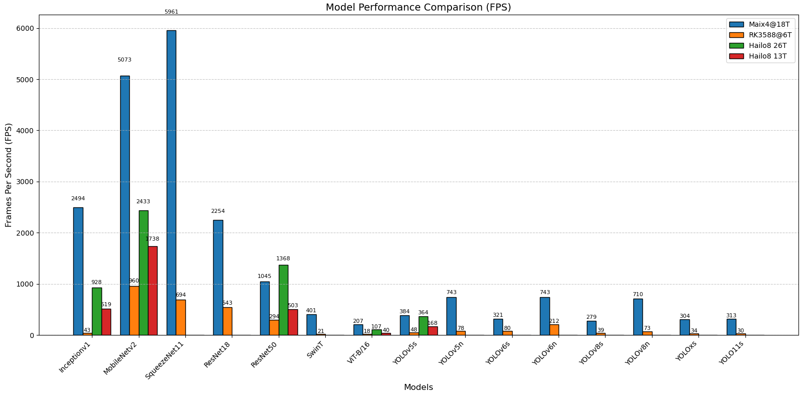
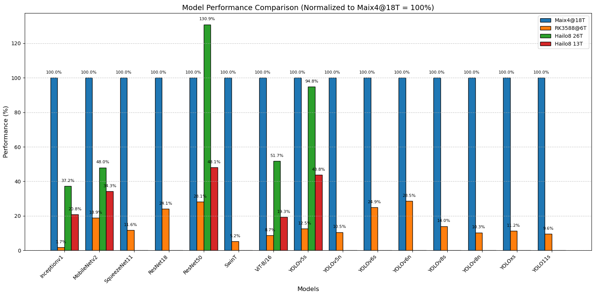

## Introduction

The M4N-Hat is a highly integrated AI computing module developed by Sipeed, featuring a compact design powered by AXERA's AX650N/C chip. As an embedded expansion module, it delivers 72 TOPS@INT4 (18 TOPS@INT8) computing power while retaining 8K video encoding/decoding capabilities, making it ideal for space-constrained edge computing applications.

This module supports plug-and-play compatibility with mainstream Raspberry Pi development boards and accelerates Transformer-based architectures. With its onboard 0.8mm 4-pin USB and Type-A USB SS 5Gbps interfaces, it enables quick expansion for peripherals like cameras and storage, making it perfect for smart cameras, industrial inspection, and other lightweight AI applications. The PCIE 2.0 expansion interface is fully compatible with Raspberry Pi 5, supporting multi-modal edge computing nodes and the deployment of quantized large models such as QWen 2.5, QWen 3, DeepSeek, and InternVL2.5.

## Showcase

  
  
  
  

## Interface Annotation Diagram

## Key Specifications

| Component | Description                                       |
| ------- | --------------------------------------------------- |
| CPU     | 8x A55@1.7Ghz, integrated FPU, supports NEON acceleration  |
| NPU     | 72 TOPS@INT4 / 18 TOPS@INT8, supports INT4/INT8/INT16/FP16/FP32 inputs, TopN (N<=32) |
| CODEC   | H.264/H.265 encoding/decoding, up to 8K@60fps decoding & 8K@30fps encoding  |
| DSP     | Dual-core 800MHz                           |
| RAM     | 8GB 64-bit LPDDR4x (adjustable allocation: default 2GB system + 6GB AI CMM)  |
| ROM     | 32GB eMMC 5.1 (system storage)             |
| Video Output | 1x HDMI 2.0a (max 4K@60fps)                |
| Video Input| 11x 0.8mm 4-pin USB camera interface       |
| PCIE | 1x 16-pin FPC (1-lane PCIE2.0 @5Gbps), Raspberry Pi 5 compatible  |
| USB  | 1x Type-A USB SS 5Gbps + 1x Type-C USB HS 480Mbps  |
| Others  | 1x 1.25mm 2-pin speaker, 1x 1.25mm 2-pin fan, 1x 10-pin FPC SPI display, 1x 6-pin FPC I2C touch |

## Performance Benchmarks

| Models      | RK3588@6T| Maix4@18T  | Hailo8 26T | Hailo8 13T |
|-------------|----------|------------|------------|------------|
| Inceptionv1 | 43       | 2494       | 928        | 519        |
| MobileNetv2 | 960      | 5073       | 2433       | 1738       |
| SqueezeNet11| 694      | 5961       | -          | -          |
| ResNet18    | 543      | 2254       | -          | -          |
| ResNet50    | 294      | 1045       | 1368       | 503        |
| SwinT       | 21       | 401        | -          | -          |
| ViT-B/16    | 18       | 207        | 107        | 40         |
| YOLOv5s     | 48       | 384        | 364        | 168        |
| YOLOv5n     | 78       | 743        | -          | -          |
| YOLOv6s     | 80       | 321        | -          | -          |
| YOLOv6n     | 212      | 743        | -          | -          |
| YOLOv8s     | 39       | 279        | -          | -          |
| YOLOv8n     | 73       | 710        | -          | -          |
| YOLOxs      | 34       | 304        | -          | -          |
| YOLO11s     | 30       | 313        | -          | -          |

| Models                       | Item                         | Maix4@18T    | RK3588@6T    |
|------------------------------|------------------------------|--------------|--------------|
| SmolVLM-256M                 | Image Encoder 512*512        | 105ms        | 842ms        |
|                              | TTFT                         | 57ms         | 87ms         |
|                              | Decode                       | 80 tokens/s  | 77 tokens/s  |
| StableDiffusion 1.5(512*512) | U-Net                        | 0.43 s/it    | 5.65 s/it    |
|                              | VAE Decoder                  | 0.91 s       | 11.13 s      |
| Qwen2.5-VL-3B                | Image Encoder 448*448        | 780 ms       |              |
|                              | TTFT 320 tokens              | 2857 ms      |              |
|                              | Decode                       | 6.2 tokens/s |              |
|                              | Image Encoder 392*392        |              | 2930 ms      |
|                              | TTFT 196 tokens              |              | 1262 ms      |
|                              | Decode                       |              | 8.6 tokens/s |

## Resources

### Hardware Documentation
Datasheet: https://dl.sipeed.com/shareURL/MaixIV/M4N-Dock

### Software Documentation
Docs: https://dl.sipeed.com/shareURL/MaixIV/M4N-Dock
SDK: https://www.ebaina.com/down/240000038900

### AI Development
LMM & AXCL: https://axcl-docs.readthedocs.io
Raspberry Pi 5 AXCL Guide: https://axcl-pi5-examples-cn.readthedocs.io

Model Hub: https://huggingface.co/AXERA-TECH

AI Toolchain (ONNX Conversion/Deployment)
- Pulsar2 (AXERA's ALL-IN-ONE Neural Network Compiler):
Docs: https://pulsar2-docs.readthedocs.io/en/latest/pulsar2/introduction.html
Download: https://huggingface.co/AXERA-TECH/Pulsar2/tree/main

op_support_list: https://pulsar2-docs.readthedocs.io/en/latest/appendix/op_support_list_ax650.html

Samples source: https://github.com/AXERA-TECH/ax-samples
LLM source: https://github.com/AXERA-TECH/ax-llm

## Technical Support
For custom development (kernel/OS customization, application-layer SDKs), contact: support@sipeed.
