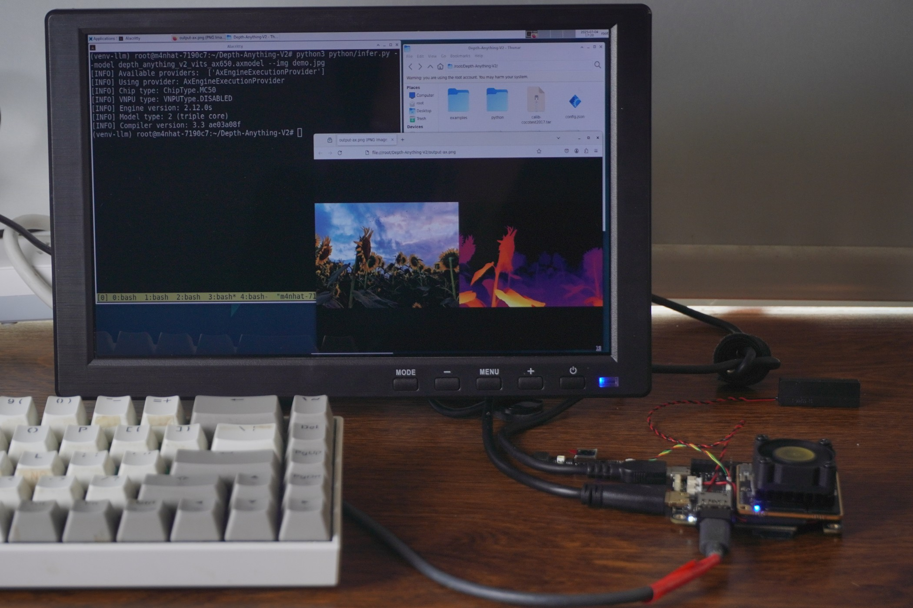

## System Update
For details, refer to the [Flashing OS Image](../m4n/system-update.html)，The TFCard&eMMC image (Debian 12) is recommended.

The following instructions are based on this image. If using a custom-built image, pay attention to operational details.

## System Boot

### Pre-Boot Preparation

1. 5V USB power supply

2. mini HDMI cable and display

3. USB serial tool (e.g., [SLogic Combo8](../../logic_analyzer/combo8/index.html) (optional, for debugging/login))

### Normal Boot

<div style="display: flex; flex-wrap: wrap; gap: 10px; width: 100%;">
  
  
</div>

1. Login Interface

    - Connect a display via mini HDMI and power on. The core board’s blue LED and Hat baseboard’s white LED should light up, indicating normal power supply.

    - If the eMMC contains the default Raspberry Pi slave image, flash a new standalone image to the TF card and insert it into the M4N-Hat.

    - Press and hold the `BOOT0` button, then press `RST`. After ~20 seconds, the LightDM login screen will appear, indicating a successful boot.

2. Xfce4 Desktop

    - Connect a mouse/keyboard to the onboard USB-A port for input.

    - Default credentials: Username: `root`, Password: `root`.

### Advanced: Serial & SSH Login

The onboard Type-C USB port serves as the default debug UART (**115200 8n1**).

Use a serial tool to view kernel logs or log in directly via terminal.

For SSH access, expand network connectivity via USB Ethernet/WiFi dongles.

Note: The system only has the root superuser, and SSH password login is disabled by default for security. For temporary access, refer to [here](../m4n/FAQ.md)。


## LLM

### DeepSeek-R1 & QWen3

Left: [DeepSeek-R1 1.5B](https://huggingface.co/AXERA-TECH/DeepSeek-R1-Distill-Qwen-1.5B)
Right: [QWen3 0.6B](https://huggingface.co/AXERA-TECH/Qwen3-0.6B)

Deployment guide: [here](../m4n/axmodel-deploy.html#部署大语言、多模态模型)


## VLM

### internVL3


Demo video:

<video controls autoplay src="../../../zh/maixIV/assets/m4nhat/m4nhat-run-llm-internVL-2025-07-07.mp4" type="video/mp4"> Your browser does not support video playback. </video>

## DepthAnything v2

1. Download the [axcl npu python library](https://github.com/AXERA-TECH/pyaxengine/releases)

2. Install: `pip install axengine-x.y.z-py3-none-any.whl`.

3. Run:

    ```bash
    source ../venv-llm/bin/activate
    python python/infer.py --img examples/demo02.jpg --model depth_anything_v2_vits_ax650.axmodel
    ```




## Interactive Image Segmentation & Inpainting

A QT-based GUI for real-time segmentation (point/box selection) and inpainting.


Open Source Official GitHub Repo: [SAM-ONNX-AX650-CPP](https://github.com/AXERA-TECH/SAM-ONNX-AX650-CPP)
Download prebuilt binaries or compile from source.

Example: Removing a player from a photo:

<div><table><tr>
<td></td>
<td></td>
</tr></table></div>

Live Demo (Screenshots):

<div><table><tr>
<td></td>
<td></td>
<td></td>
</tr><tr>
<td>RAW</td>
<td>SAM</td>
<td>Inpaint</td>
</tr></table></div>


## Interactive Text-to-Image Search (CLIP)
A QT-based GUI using OpenAI’s CLIP (Contrastive Language–Image Pre-training) for zero-shot image retrieval via text input (supports Chinese/English).

Open Source Official GitHub Repo: [CLIP-ONNX-AX650-CPP](https://github.com/AXERA-TECH/CLIP-ONNX-AX650-CPP)

[DEMO VIDEO](https://github.com/sipeed/sipeed_wiki/assets/13964381/df4cec7f-29af-465f-bfad-e54312274437)

1. Install QT:
    ```bash
    apt update
    apt install cmake qt6-base-dev
    ```

2. Download prebuilt files (executable, models, test images/text):
    - [Baidu Pan](https://pan.baidu.com/s/17M5ugUyuf9mbi1cHLGJHXg)

3. Extract *CLIP.zip* to `/root/Desktop/`:
    ```bash
    root@m4nhat-7190c7:~/Desktop/CLIP# tree -L 1
    .
    ├── CLIPQT
    ├── cn_vocab.txt
    ├── coco_1000
    ├── libonnxruntime.so
    ├── libonnxruntime.so.1.16.0
    ├── onnx_models
    ├── run_en.sh
    ├── run_zh.sh
    └── vocab.txt
    ```

4. Run in Desktop's terminal:
    ```bash
    ./run_zh.sh  # For Chinese  
    ./run_en.sh  # For English  
    ```

Screenshots:


