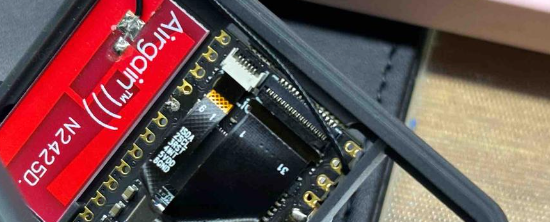

**The screen protector and lens cover serve as protective measures during shipping. Please remove them before use.**

MaixCAM comes with a 3D-printed case that protects the hardware of the MaixCAM.

## Disassembly

It is strongly recommended to choose the package with a TF card. The factory default is already assembled, and you can skip this step and use it directly.

The factory default is already assembled. If you need to replace the TF card or solder the pin header, you can try to disassemble it.

Here are a few points to note:
* Make sure to power off before disassembly.
* There is thermal grease (non-conductive) between the CPU and the case. Please be careful not to get your clothes dirty during disassembly.
* The heat sink is also in contact with the heat sink plate through thermal grease. Please be careful not to get your clothes dirty during disassembly.
* Be careful not to damage the camera, touch, and screen cables. Do not break the cables.
* Pay attention to the direction of the cable, do not plug it in the wrong way.

### Replacing the TF Card

1. **Open the Case:** Gently pry open the clasps on both sides of the device to separate the front and back covers.

   

2. **Access the TF Card:** Once the case that holds the screen is lifted, you will see the TF card.

   

3. **Reassemble the Screen:** Before reattaching the screen, ensure that the screen's ribbon cable is properly connected. If it is misaligned, reconnect the ribbon cable correctly

   

## Open Source Case Files

**File Uploaded on MakerWorld:** [Click here to view](https://makerworld.com/zh/models/440321)

**Recommended Material:** It is recommended to use a resin with a heat resistance of 70 degrees Celsius for photopolymerization printing.
