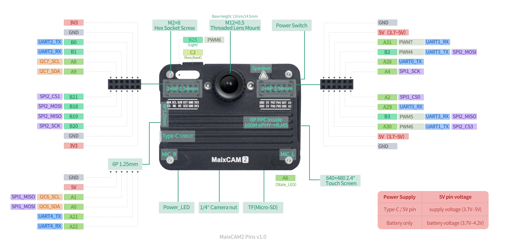

<!--  -->

    

        

            
        

    

    <a target="_blank" class="btn_red" href="https://www.aliexpress.com/store/911876460">AliExpress</a>
    <a target="_blank" class="btn_red" href="https://sipeed.taobao.com">Taobao</a>

## Introduction to MaixCAM2

`MaixCAM2` is a hardware product designed for better implementation of AI vision, audio, and AIoT applications. It provides a platform for rapid prototype verification and mass production.

### **Key Features**:

1. **Outstanding hardware performance**: Dual-core `A53` + `12.8Tops@INT4 / 3.2Tops@INT8` + `4GB LPDDR4` + multiple hardware codecs. Only run the model on `640x640` resolution, `YOLO11n` reaches up to `113FPS`, and `YOLO11s` up to `62FPS`.
    Here are some SOC run YOLO11n's benchmark:
    
2. **Integrated hardware package**: Supports up to `4K 1/1.8"` camera, `640x480` high-definition touchscreen, dual microphones, `WiFi6` + `BLE5.4`, and more. No complex hardware adaptation required, ready to use out of the box.
3. **Various hardware form factors**: Versions available with enclosures and different accessory configurations, as well as a `core board`.
4. **Offline AI large model support**: In addition to `convolutional models`, supports `Transformer models`, with plug-and-play `LLM / VLM / ASR / TTS`.
5. **Comprehensive and easy-to-use software ecosystem**: Provides well-polished [MaixPy](https://wiki.sipeed.com/maixpy) (`Python`) + [MaixCDK](https://wiki.sipeed.com/maixcdk) (`C++`) SDKs, extensive documentation, professional IDE, and cloud platform support.

### Based on `MaixCAM2`, you can create:

* **DIY Smart Camera**: Equipped with `4K` large-format `1/1.8"` sensor, supporting `JPEG / RAW / H.264 / H.265` encoding, easy-to-use software, and `NPU`-accelerated `AI` features, making DIY smart cameras simple.
* **Robots**: Dual mics + HD camera + HD touchscreen + AI acceleration + rich peripherals. Supports `convolutional models` and `Transformer models` with plug-and-play `YOLO / LLM / VLM / ASR / TTS`. Suitable for everything from toys to professional intelligent robots.
* **Production Line Quality Inspection Assistant**: Traditional algorithms (OpenMV / OpenCV) plus hardware-accelerated AI recognition easily meet the demands of high-precision, real-time, and low-cost production line applications.
* **Competition Weapon**: A strong tool for competitions, offering high performance, compact size, and easy-to-use Python (MaixPy) and C++ (MaixCDK) SDKs. Enables lightning-fast development of competitive projects. Many students have already won top awards using MaixCAM.
* **Educational Aid**: For university research, teaching, STEM education, spreading cutting-edge knowledge, and inspiring future technologies.
* **And more**: Waiting to be discovered by you!

### Feature Showcase

**For more feature introductions, please refer to:** <a target="_blank" class="btn_red" href="https://wiki.sipeed.com/maixpy/">MaixPy 主页</a>

## MaixCAM2 Hardware Specifications

Bold items are upgrades compared to MaixCAM / MaixCAM-Pro (first generation).

| Component        | Description                                                                                                                                                                |
| ---------------- | -------------------------------------------------------------------------------------------------------------------------------------------------------------------------- |
| CPU (Big Cores)  | **1.2GHz A53 x2, runs Linux (Ubuntu)**                                                                                                                                     |
| CPU (Small Core) | RISC-V 32bit E907, runs RTT                                                                                                                                                |
| NPU              | **12.8Tops@INT4 / 3.2TOPS@INT8**, supports convolution and **Transformer models** such as YOLO/**LLM/VLM**, **YOLO11n 640x640 reaches up to 113FPS**                                      |
| Memory           | **1GB / 4GB LPDDR4** options                                                                                                                                               |
| Storage          | **Onboard 32GB eMMC**, onboard TF card slot                                                                                                                                |
| Camera           | Supports up to **8MP (4K)@30fps**, 4-lane MIPI CSI input, 22-pin interface, supports split dual CSI                                                                        |
| Display          | 2.4-inch HD IPS capacitive touchscreen, resolution 640x480 (4-lane MIPI DSI output, standard 31-pin interface, 6-pin capacitive touch), supports up to 1080p\@60fps output |
| Audio Output     | Onboard PA amplifier + **1W speaker**                                                                                                                                      |
| Audio Input      | Onboard **analog silicon mics x2**, direct audio capture                                                                                                                   |
| Networking       | Onboard WiFi6 + BLE5.4 module, **6-pin FPC Ethernet interface (with external FPC-to-RJ45 module)**                                                                         |
| USB              | Type-C USB2.0, supports both Device and Host modes, supports USB cameras                                                                                                   |
| IO Interface     | 2.54mm PMOD interface, provides **20 IOs** + Vsys/3.3V/GND + 1.25mm 6-pin expansion interface, **core board offers more IOs**                                              |
| Buttons          | 1 x Power switch + 1 x Func (function) button                                                                                                                              |
| LEDs             | Power indicator + User LED + **Illumination LED**                                                                                                                          |
| Codec            | H.264 / H.265 / MJPEG hardware codec, supports **4K\@30fps encoding, 1080p\@60fps decoding**                                                                               |
| Peripherals      | I2C / SPI / UART / ADC / PWM / WDT and other common peripherals                                                                                                            |
| Power            | **Supports Li-ion battery charge/discharge management, with battery-equipped version available**                                                                           |
| Enclosure        | **Protective case measures 65x49x20mm with 1/4-inch standard tripod mount**                                                                                                                    |
| IMU              | **Onboard six-axis IMU (3-axis accelerometer + 3-axis gyroscope)**                                                                                                         |
| RTC              | **Onboard BM8563EMA RTC chip + rechargeable coin battery, maintains time during power-off**                                                                                |
| Core Board       | **Gold-finger core board containing only chip core circuit + DDR**, for easy custom hardware design                                                                        |

<!-- | Dimensions | **67x51x12mm (non-battery enclosure version)**  | -->

## MaixCAM2 Software Ecosystem

We don’t just provide hardware — MaixCAM2 comes with a complete software ecosystem, including:

| Name                                                      | Description                                                  | Image/Video                                                  |
| --------------------------------------------------------- | ------------------------------------------------------------ | ------------------------------------------------------------ |
| **[MaixPy](https://wiki.sipeed.com/maixpy/)**             | Python SDK with rich and easy-to-use APIs, optimized for MaixCAM, supports hardware acceleration, and comes with comprehensive documentation and tutorials | 1. [MaixPy Homepage](https://wiki.sipeed.com/maixpy/) 2. [MaixPy Source Code](https://github.com/sipeed/MaixPy) |
| [MaixVision](https://wiki.sipeed.com/maixvision)          | AI vision IDE for coding, code execution, real-time image preview, even graphical programming. Greatly lowers the difficulty and barriers to setup. |   <video playsinline controls muted preload style="width:100%" src="https://wiki.sipeed.com/maixpy/static/video/maixvision.mp4"></video> |
| [MaixHub](https://maixhub.com)                            | Online AI model training platform. No AI knowledge or expensive hardware required — train models with one click and deploy them to MaixCAM instantly |               |
| [MaixCDK](https://github.com/sipeed/MaixCDK)              | C++ SDK equivalent of MaixPy. Developers familiar with C/C++ can get started immediately | See [MaixCDK Homepage](https://github.com/sipeed/MaixCDK)    |
| [App Store](https://maixhub.com/app)                      | Various apps and tools available for download without development. Developers can also upload and share apps | See [MaixHub App Store](https://maixhub.com/app)             |
| [Sharing Hub](https://maixhub.com/share)                  | A community for developers to share experiences and projects | See [MaixHub Sharing Hub](https://maixhub.com/share)         |
| [Local Large Models](https://wiki.sipeed.com/maixpy/doc/zh/mllm/basic.html) |     Running Offline Large Models Locally                   | See [Large Model User Guide](https://wiki.sipeed.com/maixpy/doc/zh/mllm/basic.html) |

## Resources

### MaixCAM Exclusive Resources (Provided by Sipeed)

* [MaixCAM-Pro Official Docs](https://wiki.sipeed.com/maixcam2) (this documentation)
* [MaixPy Official Docs](https://wiki.sipeed.com/maixpy/) (Python SDK) ([MaixPy Source Code](https://github.com/sipeed/MaixPy))
* [MaixCDK](https://github.com/sipeed/MaixCDK) (C/C++ SDK) ([MaixCDK Source Code](https://github.com/sipeed/MaixCDK))
* [System Source Code](https://github.com/sipeed/maix_ax620e_sdk)
* [System Flashing Guide](./maixcam2_os.md)
* [Camera and Lens](./maixcam2_camera_lens.md)
* [Hardware Resource Downloads](https://dl.sipeed.com/shareURL/MaixCAM/MaixCAM2)
* Enclosure and Mounts: Open-source 3D model files for enclosures, mounts, etc. are available on [makerworld.com](https://makerworld.com/) (recommended) or [makerworld.com.cn](https://makerworld.com.cn). Search for `MaixCAM` / `MaixCAM2`.
* Pinout Diagram:
> Note: To prevent incorrect insertion of PMOD or other modules that could cause damage, the `A2` pin is intentionally blocked by default as a fool-proof design.
  

### Chip Resources

MaixCAM2 is based on the AX630C chip from Axera, so their resources can also be referenced.

* [Chip Vendor Resource Downloads](https://dl.sipeed.com/shareURL/MaixCAM/MaixCAM2)
* [Chip Vendor AI Models](https://huggingface.co/AXERA-TECH)
* [Chip Vendor GitHub](https://github.com/AXERA-TECH)

### Accessories

* [TOF Ranging and Thermal Imaging Module](./tof_thermal.md)
* [Microscope Kit](./microscope.md)

### Community

* [MaixHub App Store](https://maixhub.com/app)
* [MaixHub Sharing Hub](https://maixhub.com/share)
* Search `MaixCAM` or `MaixPy` on [GitHub](https://github.com)
* Search `MaixCAM` or `MaixPy` on [Bilibili](https://bilibili.com)
* Search `MaixCAM` on [makerworld.com](https://makerworld.com/) (recommended) or [makerworld.com.cn](https://makerworld.com.cn)
* QQ Group: 862340358
* Telegram: [MaixPy](https://t.me/maixpy)

## Purchase

* [Sipeed Taobao](https://sipeed.taobao.com/)
* [AliExpress](https://www.aliexpress.com/store/911876460)

