This page uses a real MaixCAM2 development recording as an example to show how to use an AI Agent to build a UART4 two-axis gimbal red-object tracker with the MaixCAM2 built-in camera. The recording used Codex with MCP to call maixpy-skill. To make the setup easier to reproduce on Windows, macOS, and Linux, this page only demonstrates OpenCode for installation and model configuration. The Codex and MCP UI shown in some images is only from the recorded session and is not the OpenCode interface.

## Final Result

The goal is to detect a red object in the camera image and keep it near the center of the frame by driving a two-axis gimbal.

<p align="center">
  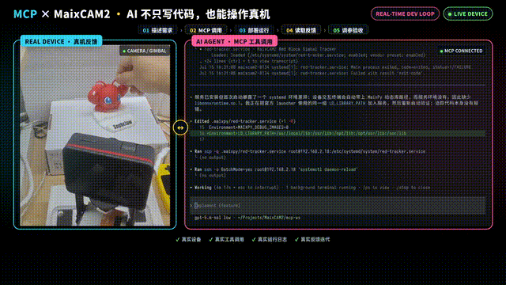
</p>

When the object moves, the gimbal adjusts accordingly. This is the target behavior for the following development, debugging, and acceptance steps.

## Video Tutorial

<iframe src="//player.bilibili.com/player.html?isOutside=true&bvid=BV13W3w6REa2&p=1" scrolling="no" allowfullscreen style="width:90%; max-width:960px; aspect-ratio:16/9; height:auto; border:0; display:block; margin:0 auto;"></iframe>

If the embedded video does not play, open it on Bilibili: [MaixCAM2 x MCP auto debugging video tutorial](https://www.bilibili.com/video/BV13W3w6REa2/).

## Choose an AI Agent

You can use Codex, Claude Code, or OpenCode. The recorded Agent was Codex + MCP, while this page only covers OpenCode installation and configuration to avoid duplicating multiple Agent interfaces. The later task description, device connection, and acceptance workflow do not depend on the Agent UI shown in the recording.

The Agent should at least be able to:

- read and modify the local project;
- run local tools;
- connect to the target device;
- read runtime logs;
- view debug images, or ask the user to confirm the real image when it cannot view them directly.

### Install OpenCode

Purpose: prepare an Agent that can work on the local project from the development computer.

Steps:

1. Open the [OpenCode download page](https://opencode.ai/download).
2. Select the Desktop installer for your operating system. The official page provides download entries for macOS, Windows, and Linux.
3. After installation, start OpenCode and open or create the local working directory for this project.
4. Before continuing, confirm that the Agent can read files in the directory and run local tools.

<p align="center">
  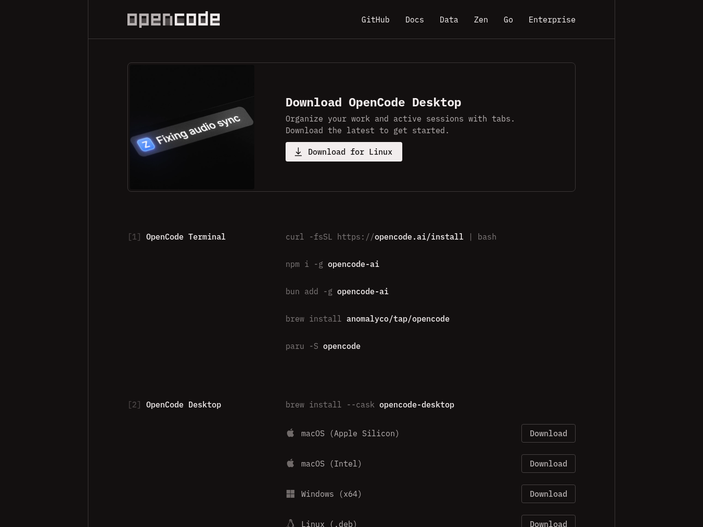
</p>

Note: the download page and client UI may change over time. Follow the system packages and versions shown on the current official download page.

### Install cc-switch and Configure the OpenCode Model

Purpose: use cc-switch to manage OpenCode providers and model settings.

Steps:

1. Download the version for your system from the [cc-switch website](https://ccswitch.io) or the [official Releases page](https://github.com/farion1231/cc-switch/releases).
2. Open cc-switch and select the OpenCode configuration entry.
3. Add or import a provider configuration, then select the model you want to use.
4. Enable the configuration, restart or reopen OpenCode, and confirm that the current model and provider match your expectation.

The cc-switch repository states that it supports Windows, macOS, and Linux, and includes OpenCode configuration management. Whether DeepSeek, Doubao, GPT, Claude, or other models are available depends on the cc-switch version, provider, and account permissions shown in your actual UI.

<p align="center">
  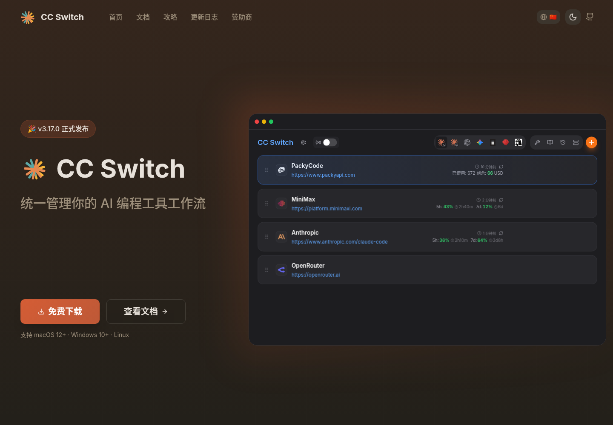
</p>

### Install uv

Purpose: prepare a Python environment management tool for installing and running maixpy-skill later.

maixpy-skill needs a Python runtime when installing and executing helper scripts for device development. Installing only a system-level Python is not recommended: built-in Python versions, `pip` permissions, and dependency isolation differ across operating systems, which can lead to packages being installed into the wrong environment, system Python pollution, or version mismatches. `uv` can manage Python versions, virtual environments, and dependency installation in a unified way. If a suitable Python version already exists, it can use it directly; if the required version is missing, it can install and manage it as needed.

Steps:

1. Install uv.

   macOS and Linux:

   ```bash
   curl -LsSf https://astral.sh/uv/install.sh | sh
   ```

   Windows PowerShell:

   ```powershell
   powershell -ExecutionPolicy ByPass -c "irm https://astral.sh/uv/install.ps1 | iex"
   ```

2. Reopen the terminal and confirm that `uv` has been added to `PATH`:

   ```bash
   uv --version
   ```

After uv is installed, continue by asking the Agent to install maixpy-skill. If maixpy-skill later needs a Python version or extra Python packages, the Agent will manage them through uv instead of modifying the system Python environment directly.

## Download and Install maixpy-skill

Purpose: give the Agent the workflows and device operation capabilities needed for MaixCAM series development.

Prerequisite: download [maixpy-skill.zip](https://dl.sipeed.com/fileList/MaixCAM/MaixCAM2/Software/maixpy-skill.zip) and extract it to a local path that the Agent can access.

You can send this directly to OpenCode:

> Open this link: https://dl.sipeed.com/fileList/MaixCAM/MaixCAM2/Software/maixpy-skill.zip, then download and install maixpy-skill. After installation, check whether it supports MaixCAM2 device connection, development mode, program execution, log reading, and debug-image artifact retrieval. Do not print the device password in the conversation or logs.

After installation, ask the Agent to report:

- whether the skill has been discovered and enabled;
- whether device connection, execution, log, and debug-image capabilities are available;
- where runtime records are stored in the current project;
- missing dependencies or information that still needs user confirmation.

OpenCode uses `SKILL.md` to define reusable Agent Skills. The actual loading path and discovery rules should follow the current OpenCode documentation.

## Prepare the MaixCAM2 Development Environment and Peripherals

Scope: MaixCAM2, the dedicated UART4 two-axis servo gimbal, and the red-object tracking project.

Checklist:

- MaixCAM2, using its built-in camera without an external camera;
- a development computer that can access the same LAN;
- dedicated UART4 two-axis servo gimbal, model `RLU-C45`;
- red object;
- enough free space for safe gimbal movement.

Steps:

1. Power on the MaixCAM2.
2. Connect the device to Wi-Fi in system settings, or use the USB network method described in the official documentation, so the computer and device can reach each other.
3. Check the device address in "Settings -> Device info" on the device.
4. Connect the gimbal to UART4 and confirm that power, ground, and signal wires are reliable.
5. Keep cables, fingers, and obstacles away from the gimbal travel range.
6. Place the red object inside the MaixCAM2 built-in camera view.

The MaixCAM2 quick-start documentation explains that the device needs network access for first use. After connecting to Wi-Fi, you can check the IP address in device information. It also explains that the computer can connect to the device through Wi-Fi or USB networking.

<p align="center">
  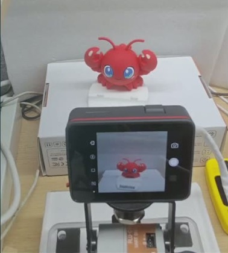
</p>

Note: UART4 pin mapping, servo IDs, power requirements, and protocol details depend on the gimbal model. Do not treat values from a reference project as universal settings.

## Describe the Requirement and Submit Task 1 to the AI

Purpose: provide the goal, reference project, validation order, safety constraints, and final behavior in one message, reducing guesses on critical conditions.

Replace `[device address]` with the current device address and send:

> Load maixpy skill and connect to MaixCAM2 at `root@[device address]`.
>
> I have connected a Sipeed-tested two-axis gimbal. The open-source reference code is at https://github.com/sipeed/MaixPy/tree/main/projects/demo_block_tracking. The gimbal is connected through UART4. Please develop a red-object tracker with fast response, real-time tracking, high precision, and stable behavior. You can use the MaixPy API documentation at https://wiki.sipeed.com/maixpy/doc/en/index.html, and my computer already has uv installed.
>
> I have placed the red object in the camera view. Before closed-loop tracking, first make small gimbal movements to confirm coordinates and actual movement direction. The real gimbal movement direction may not match the code direction, so calibrate it first. For example, command the gimbal to move left and then ask me which direction it actually moved. Do the same for other directions.
>
> The original safety range may be inaccurate. You can remove the old gimbal limits temporarily, let me manually move it to the mechanical limits, then read those positions for calibration. Use conservative values to set a suitable safe range.
>
> Please greatly increase the tracking speed and use three-stage gain: large steps for fast chasing when far away, fast convergence at medium distance, and low-gain braking near the center. If either direction overshoots, it must be able to move back in the opposite direction and relocate the object; otherwise it is only moving one way. If the object leaves the trackable angle, stop tracking and return to center.
>
> Also note: during development, when exiting a test, restore a simple MaixCAM2 built-in camera pass-through display example to avoid leaving the device with a black screen for a long time during AI coding.

`projects/demo_block_tracking` is a project directory in the official MaixPy repository. It contains the application configuration, main program, and servo-related implementation.

<p align="center">
  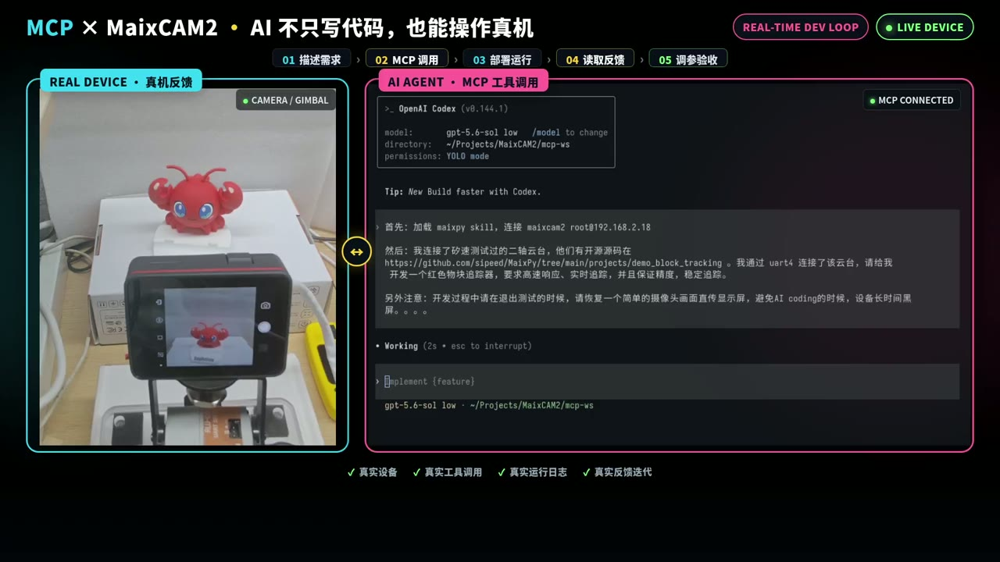
</p>

Note: do not publish private LAN addresses, passwords, or access tokens in public documentation. The reference project is used to understand the protocol and project structure. Direction, center position, limits, color thresholds, and control parameters must be validated again on the current hardware.

## Wait for Task 1 to Finish and Guide the AI When Needed

Task 1 should be completed in stages, with the Agent reporting each result. When the Agent cannot determine the actual hardware state through APIs, the user should provide observations such as "the positive horizontal command actually turns right" or "the gimbal hits the bracket at this position".

### Confirm Small Gimbal Movement

Purpose: confirm that both axes can communicate, move slightly, return to center, and establish local safety constraints.

Steps:

1. Probe whether both servos are online.
2. Read the current angle or position.
3. Move only one axis at a time with a small command.
4. Observe the actual direction and record the positive/negative direction mapping for that axis.
5. Return that axis to center, then test the other axis.
6. Try to read firmware limits. If they cannot be read, use small probing movements and user observation to establish conservative limits.

Pass criteria: both axes are online, directions are recorded, the gimbal can return to center, and movements do not approach collision positions.

<p align="center">
  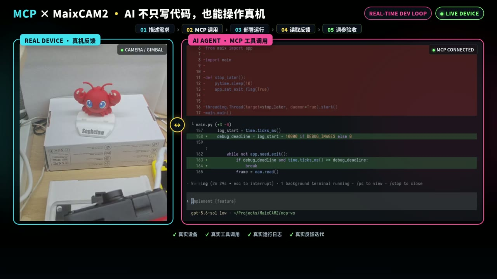
</p>

The image shows the gimbal and device feedback. The recording alone is not enough to prove that servo firmware limits were finally read successfully; this should be confirmed separately in the runtime logs.

### Red-Object Detection Unit Test Passes

Purpose: confirm that the vision input is correct before adding gimbal control.

Steps:

1. Run only the MaixCAM2 built-in camera and red-object detection, without sending gimbal tracking commands.
2. Detect red candidate regions and filter out noise with very small areas or pixel counts.
3. Select the largest candidate region and output its center coordinates, area, and frame rate.
4. Move the object and confirm that the coordinates change accordingly.
5. Move the object out of view and confirm that the program reports no target instead of continuing to use old coordinates.

Pass criteria: the target can be repeatedly detected and coordinates can be obtained; when the object disappears, old target coordinates are not reused.

<p align="center">
  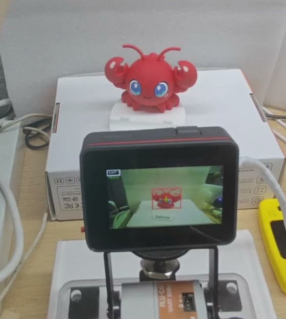
</p>

The device screen shows the red target detection box. The exact threshold, bounding box, and frame-rate values should be confirmed from the current runtime logs and debug images.

### Add Three-Stage Closed-Loop Control

Purpose: let the two-axis gimbal track the target according to the error between the object and the frame center, while avoiding overshoot from high-speed movement and oscillation near the center.

Suggested control rules:

| Error range | Behavior | Validation focus |
| --- | --- | --- |
| Far | large steps and high-speed chasing | does not exceed safe limits |
| Medium | fast convergence with acceleration limiting | does not noticeably cross the center |
| Near center | low-gain braking; hold position after entering the dead zone | no continuous oscillation |

Each axis should maintain its own direction mapping, limits, speed, acceleration, and control state. After the target is lost continuously for a threshold period, the program should stop chasing old coordinates and return to center at a safe speed.

<p align="center">
  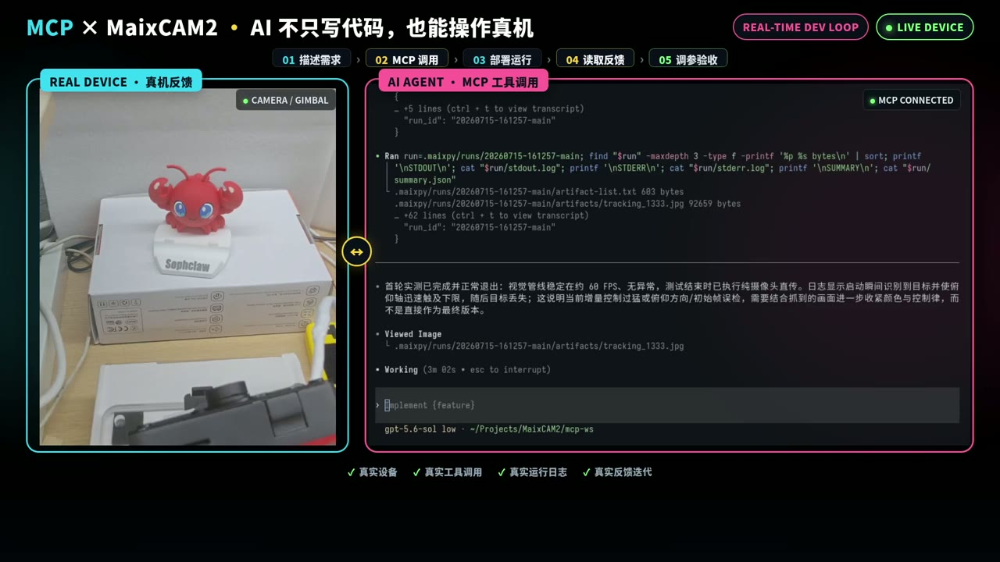
</p>

The Agent is investigating possible causes such as "movement too aggressive". The recording alone cannot prove all three-stage gain parameters; the actual parameters should be confirmed in the source code or logs.

### First Closed Loop: Target Lost

After directly using the reference implementation, the real installation direction did not match the expected direction. The gimbal moved in the wrong direction and the target left the trackable range.

Debugging steps:

1. Keep the object fixed.
2. Test only one axis at a time.
3. Compare the target offset in the image with the actual gimbal movement direction.
4. Modify only the direction mapping for the corresponding axis.
5. Test left, right, up, and down again.
6. After the direction is correct, adjust gain and speed.

<p align="center">
  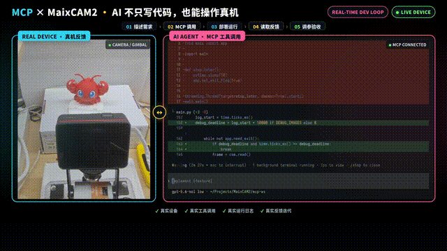
</p>

Note: before direction is confirmed, do not tune PID, speed, or thresholds first. Otherwise, it is hard to tell whether the issue is wrong control direction or bad parameters.

### Fix Oscillation and Overshoot

After fixing the pitch direction, the gimbal still oscillated left and right when the target was static. After further tuning, tracking became stable.

Recommended order:

1. Confirm again that the direction mapping is correct.
2. Increase the center dead zone.
3. Lower maximum speed and acceleration near the center.
4. Limit the single-step position change.
5. Clear integral and history state after entering the dead zone.
6. Allow reverse correction after the error crosses the center.
7. Stop chasing and return to center safely when the target is continuously lost.

<p align="center">
  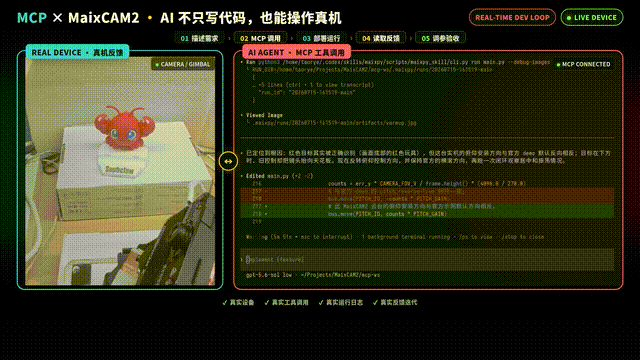
</p>

<p align="center">
  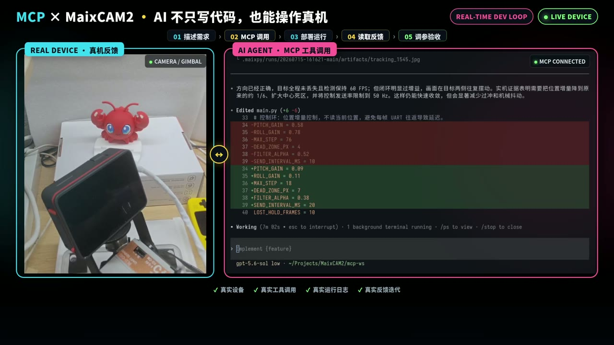
</p>

## Submit Task 2: Automated Test Passes

Purpose: use repeatable fixed-position tests instead of relying on "it looks fine once".

Send this to the Agent:

> Generate an automated position test for the current gimbal. First move the gimbal away from the color block, then run the program and check whether it can automatically track back to the color block. Choose random offset positions, but do not move the red block out of the detectable range.

Check:

- whether the directions are correct;
- whether returning to center is stable;
- whether repeated runs create accumulated drift;
- whether the gimbal approaches or exceeds safe limits;
- whether each step is recorded in logs or a test summary.

<p align="center">
  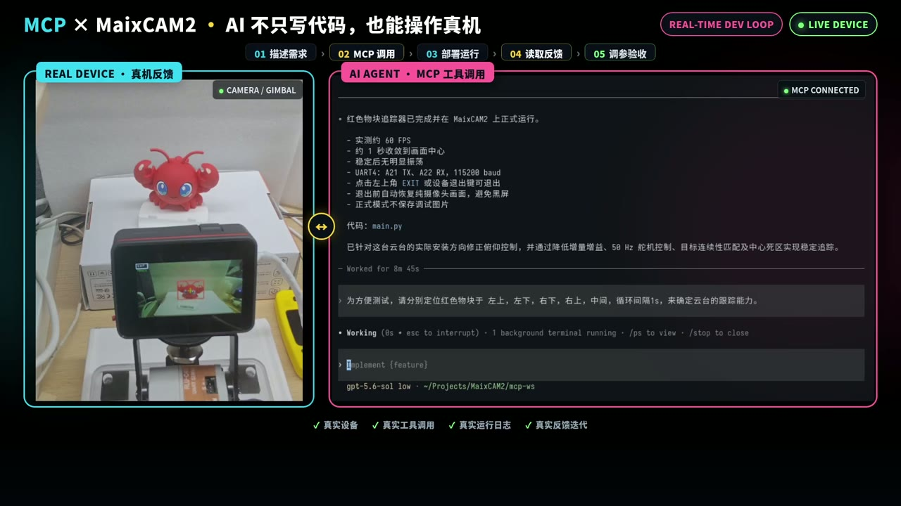
</p>

<p align="center">
  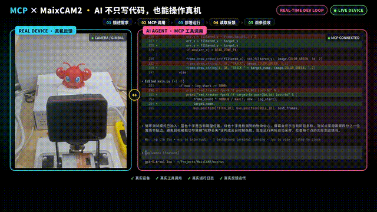
</p>

The recording also includes multiple repeated position checks. If you publish a more complete acceptance report, consider adding screenshots or a result table from those clips.

## Confirm the Result and Submit Task 3

After the automated test passes, freeze the current implementation as the final dynamic tracking version, then perform manual dynamic testing.

Send this to the Agent:

> The automated position test passed. Please finalize the current dynamic tracking implementation, disable continuous debug-image saving, keep graceful exit and restore MaixCAM2 built-in camera pass-through display after exit. I will now move the red object manually and verify the real tracking behavior. Please refer to the MaixPy documentation for the exit method; the implementation must exit gracefully.

Manual acceptance steps:

1. Keep the object still at the center.
2. Move it slowly left, right, up, and down.
3. Change direction quickly at medium distance.
4. Move it from the center to the edge.
5. Move it out of the frame and then back in.

Pass criteria: both axes move in the correct direction; far targets can be chased; there is no continuous oscillation near the center; after overshoot, the gimbal can move back in the opposite direction; after target loss, it does not continue chasing old coordinates.

<p align="center">
  
</p>

## Accept and Collect Deliverables

After acceptance, collect these deliverables from the Agent:

1. current project source code;
2. UART4, servo IDs, direction mapping, center position, and safe limits validated on the current hardware;
3. red-detection threshold and validation conditions;
4. automated test entry point, runtime records, and conclusion;
5. a small set of debug images and runtime logs;
6. known limitations and safety boundaries.

When checking the deliverables, confirm that continuous debug-image saving is disabled in the release version, that the application has a graceful exit path, and that it restores the MaixCAM2 built-in camera pass-through display after exit as required.

## Task Template

Replace the bracketed fields with your own project requirements:

> Load maixpy skill and connect to my MaixCAM2. I want to develop [target function]. Use the MaixCAM2 built-in camera by default; if another sensor is needed, the input is [input]. The device should perform [action], and the success criteria are [acceptance criteria]. Please verify device connection, peripheral communication, and input data separately before integrating the full control logic. Do not directly reuse direction, center, limit, or parameter values from other devices; confirm each item on the current hardware. After debugging, provide the project source code, test results, logs/debug artifacts, and verification video. When the program exits, restore a simple MaixCAM2 built-in camera pass-through display.

### References

1. [OpenCode download page](https://opencode.ai/download) for desktop downloads and supported systems.
2. [OpenCode Agent Skills documentation](https://opencode.ai/docs/skills/) for reusable Agent behavior defined with `SKILL.md`.
3. [OpenCode model configuration documentation](https://opencode.ai/docs/models/) for provider/model configuration and model selection rules.
4. [cc-switch repository](https://github.com/farion1231/cc-switch) for supported platforms, Agent tools, and configuration management capabilities.
5. [uv installation documentation](https://docs.astral.sh/uv/getting-started/installation/) for uv installation methods and commands.
6. [MaixCAM2 MaixPy quick start](https://wiki.sipeed.com/maixpy/doc/en/README_MaixCAM2.html) for network connection, device address, computer connection, and development environment notes.
7. [MaixPy `demo_block_tracking` project directory](https://github.com/sipeed/MaixPy/tree/main/projects/demo_block_tracking) for the reference project used here.
8. [MaixPy UART documentation](https://wiki.sipeed.com/maixpy/doc/en/peripheral/uart.html) for UART peripheral usage.
