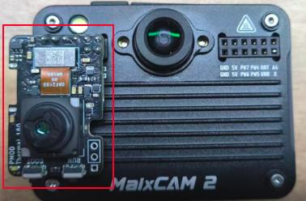

## PMOD_Thermal32

The PMOD_Thermal32 module is a low-cost thermal imaging module compliant with the PMOD interface standard. It can be directly inserted into the PMOD slot of the MaixCAM Series and combined with a visible light camera to achieve dual-light fusion functionality.

| **Module Name** | PMOD_Thermal32      |
|------------------|---------------------|
| **Resolution**   | 32x24              |
| **Temperature Range** | -40°C to 450°C  |
| **Field of View (FOV)** | 55° x 35°     |
| **Frame Rate**   | 1~30fps            |
| **Interface**    | I2C                |

PMOD_Thermal32 Installation Guide

| Platform                | Installation Guide  |
| ------------------- | ------------------------------------------------------------ |
| MaixCAM Pro |  |
| MaixCAM2            |  |

Thermal Imaging with Pseudo-color Display  

Thermal Imaging + Visible Light Fusion Display  

Reference Code:  
[GitHub Repository](https://github.com/sipeed/MaixPy/blob/main/examples/ext_dev/sensors/thermography_mlx90640/mlx90640_example.py)

---

## PMOD_TOF100

The PMOD_TOF100 module is a low-cost array ToF module compliant with the PMOD interface standard. It can be directly inserted into the PMOD slot of the MaixCAM Series and combined with a visible light camera to achieve dual-light fusion functionality.

| **Module Name** | PMOD_TOF100         |
|------------------|---------------------|
| **Resolution**   | 100x100, 50x50, 25x25 |
| **Measuring Range** | 0.2~2.5m         |
| **Field of View (FOV)** | 70°H x 60°V   |
| **Laser Emitter** | 940nm VCSEL       |
| **Frame Rate**    | 100x100: 6fps, 50x50: 22fps, 25x25: 30fps |
| **Interface**     | SPI                |

PMOD_TOF100 Installation Guide  

| Platform                | Installation Guide                                                      |
| ------------------- | ------------------------------------------------------------ |
| MaixCAM Pro |  |
| MaixCAM2            |  |

Depth Imaging with Pseudo-color Display  

Depth + Visible Light Fusion Display  

Reference Code:  
[GitHub Repository](https://github.com/sipeed/MaixPy/blob/main/examples/ext_dev/sensors/tof100/tof100_example.py)

## PMOD_Thermal160

The PMOD_Thermal160 module is a low-cost thermal imaging module compliant with the PMOD interface standard. It can be directly inserted into the PMOD slot of the MaixCAM Series and combined with a visible light camera to achieve dual-light fusion functionality.

|**Module Name**  | PMOD_Thermal160   |
|-----------|------------------|
|**Resolution**  |160x120|
|**Field of View (FOV)**|-20～120℃|
|**Laser Emitter**   | 34°x26°|
|**Frame Rate**   | 25fps|
|**Interface**   | Image:UART/USB Control:I2C |
|**NETD**|<50mK @25℃|

PMOD_Thermal160 Installation Guide

| Platform                | Installation                                                     |
| ------------------- | ------------------------------------------------------------ |
| MaixCAM Pro |  |
| MaixCAM2            |  |

> Reference code will be supported in the future.

## PMOD_Thermal256

The PMOD_Thermal256 module is a low-cost thermal imaging module compliant with the PMOD interface standard. It can be directly inserted into the PMOD slot of the MaixCAM Series and combined with a visible light camera to achieve dual-light fusion functionality.

|**Module Name**  | PMOD_Thermal256   |
|-----------|------------------|
|**Resolution**  |256x192|
|**Field of View (FOV)**|-15～150℃ (High Gain), 50～550℃ (Low Gain)|
|**Laser Emitter**   | 56°x42°|
|**Frame Rate**   | 25fps|
|**Interface**   | Image:SPI Control:I2C |
|**NETD**|<50mK @25℃|

PMOD_Thermal256 Installation Guide

| Platform                | Installation                                                     |
| ------------------- | ------------------------------------------------------------ |
| MaixCAM Pro |  |
| MaixCAM2            |  |

Reference Code:
https://github.com/sipeed/MaixPy/tree/main/examples/ext_dev/sensors/tiny1c_example.py
> To use this example, please first remove the code related to `x3c_192x256`.

