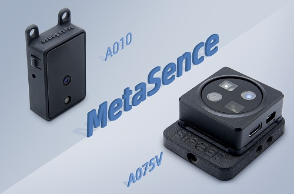
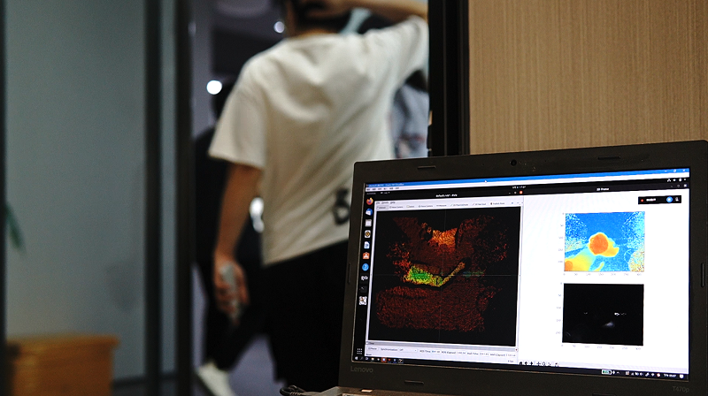
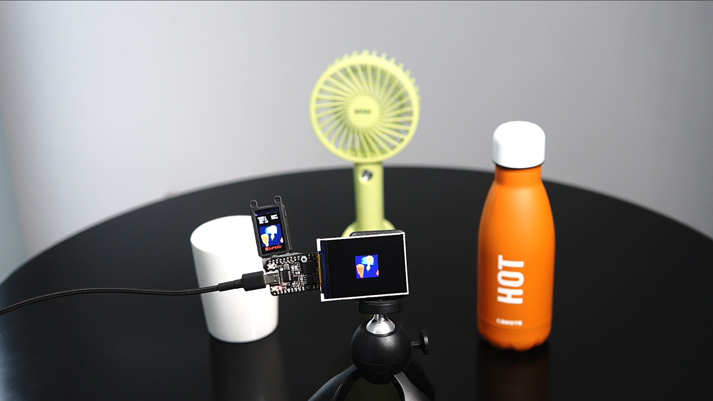

## What is MetaSense?

MetaSense series products are equipped with TOF depth cameras, currently there are two products: MetaSense-A010 and MetaSense-A075V.
- MS-A010 is an extremely cost-effective TOF 3D sensor module composed of BL702 + OPNOUS 100x100 TOF module, which supports a maximum resolution of 100x100 and 8-bit Preview the depth map after color map in real time.
- While MS-A075V is a 3D TOF camera module with RGB function, this module can realize Linux driver-free plug-and-play and real-time color 3D display.
  

Purchase method: 

|              |
MateSense-A010
 | 
MateSense-A075V
 | 
| :----------- |:----------------------------------------------- | :------------------------------------------------- | 
|              |                |                   | 
| Interface         |  UART 1.25mm  connector \*1 Type-C USB2.0 connector \*1       | UART 1.25mm connector \*1  Type-C USB2.0 connector \*1         |
|  Resolution      |TOF：100x100@30fps                               | RGB：1600x1200@30fps TOF：320x240@60fps         | 
|  FOV      |RGB：无 TOF：70°(H) * 60°(V)                  | RGB：120° TOF：55°(H)*72°(H)                    | 
| 
TOF pixel size
 |                                                 | 15um                                               | 
| Laser transmitter   |940nm VCSEL                                       | 940nm,3W                                           | 
| Distance     |0.2-2.5m                                         | 0.15-1.5m                                          | 
| Accuracy   |&lt;=1%/cm                                       | &lt;=1%/cm                                         | 

## What can MetaSense do?

### Case:Real shot of far, middle and near objects

High-precision mapping of the difference in the distance between items, the point cloud map can intuitively feel a more realistic visualization.

### Case:statistics traffic

It can monitor the flow of people in real time and make statistics with high precision and large resolution.

<html>
  
  
</html>

### Case:obstacle avoidance car

It can be mounted on a robot car to move and determine whether there are obstacles on the screen.The module comes with an LCD screen to accurately display the distance and respond to avoid obstacles.

<html>
  
  
</html>

### Case:Keyboard lights follow gesture changes

Realize super cool keyboard light follow,track the position of the hand in real time,and then map the keyboard light according to the position of the hand.

### Case:Volume measurement

After obtaining the camera internal parameters through the SDK, a preliminary point cloud is calculated, and the total volume is accumulated to achieve the effect of volume measurement.

### Case:Access to MCU

MS-A010 has strong compatibility and is based on serial protocol. It can be connected to single-chip development boards such as K210 bit or linux development boards such as Raspberry Pi for secondary development.

### Case: Support ROS1 + ROS2

Dual support ROS system, open ROS1 + ROS2 access function package, can quickly obtain depth data and depth map.

<html>
  
  
</html>

## Quick understanding of TOF technology

1. TOF: It is a method of distance measurement, which calculates the distance between the two by measuring the "time of flight" of signals such as ultrasonic/microwave/light between the transmitter and the reflector. It is the TOF sensor that can achieve TOF ranging. The most commonly used is infrared or laser ranging.
2. There is a difference in the distance between the objects. The module displays the cold and warm colors through the difference of the captured depth values. The cool and warm colors change with the mapping of the distance. 

## More

For more detailed information about MS-010: [Click to jump](https://wiki.sipeed.com/en/metasense10)
For more detailed information about MS-075: [Click to jump](https://wiki.sipeed.com/en/metasense75)
