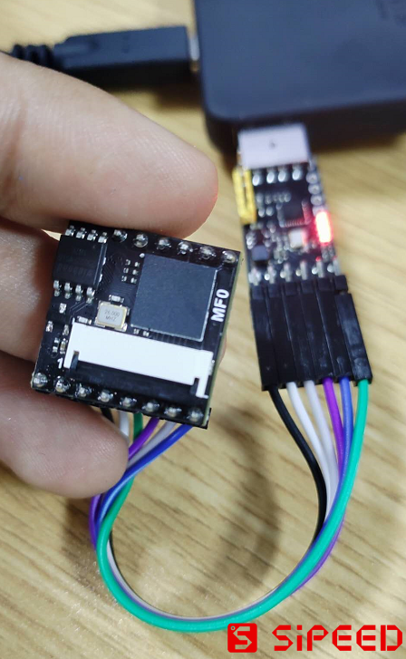

# MF0 Machine Learning Core Module

## Software and hardware overview

MF0 face recognition module appearance at a glance

<table border="3">
    <tr>
        <th colspan=3>MF0</th>
    </tr>
    <tr>
        <td width="100">Description</td>
        <td>Front view</td>
        <td>Back view</td>
    </tr>
    <tr>
        <td width="100">MF0</td>
        <td>
            
            Pin Map 
        </td>
        <td>
            
        </td>
    </tr>
    <tr>
        <td>MF0 Dock</td>
        <td>
            <!--  -->
        </td>
        <td>
        </td>
    </tr>
</table>

### Module features:

- CPU: RISC-V 64bit dual-core processor, 400Mhz standard frequency (overclockable)
- Image recognition: QVGA@60FPS/VGA@30FPS
- Deep learning framework: TensorFlow/Keras/Darknet
- Peripherals: FPIOA, UART, GPIO, SPI, I²C, I²S, WDT, TIMER, etc
- 2.54mm pitch DIP/SMT pad
- Can be connected to a breadboard
- Onboard camera connector
- ROM: 4MByte
- RAM: 6MByte (General purpose) + 2MByte (KPU dedicated)

### Hardware pin

| No. | Description |
| --- | --- |
| 24 | User IO24 |
| 25 | User IO25 |
| 26 | User IO26, MF0_Dock(LCD_RST) |
| 27 | User IO27, MF0_Dock(LCD_CLK) |
| 28 | User IO28, MF0_Dock(LCD_DC) |
| 29 | User IO29, MF0_Dock(LCD_SDA) |
| --- | --- |
| BOOT | Power-on boot mode selection (user IO16, not recommended for users) |
| IO5 | User IO5 (ISP_TX) |
| IO4 | User IO4 (ISP_RX) |
| EN | MF0 power enable pin, default high level enable |
| RST | K210 reset pin |
| VIN | External power supply 3.4-5.9V (5.0V recommended) |
| GND | External power supply ground |
| 3V3 | Module power supply 3.3V output |

## Agreement

Serial port protocol:

MFO burns HEX protocol firmware by default
MF0 has two protocol firmware, which is convenient for users to use according to specific needs

-HEX format serial protocol firmware
-JSON format serial protocol firmware

HEX example

### Serial Protocol Assistant

## Update MF0 firmware

MF0 hardware connection:

| No. | USB to serial port module | MF0 IO | Remarks |
| --- | --- | --- | --- |
| 1 | 5V | VIN | --- |
| 2 | GND | GND | --- |
| 3 | TX | IO4 | --- |
| 4 | RX | IO5 | --- |
| 5 | DTR | BOOT | --- |
| 6 | RTS | RST | --- |

MF0 Dock hardware connection:

After connecting according to the following table, when downloading using kflash_gui, you need to press the boot and rst buttons, and release the rst and then the boot button to ensure that the K210 enters the download mode (ISP mode)

| No. | USB to serial port module | MF0 Dock IO | Remarks |
| --- | --- | --- | --- |
| 1 | 5V | VIN | --- |
| 2 | GND | GND | --- |
| 3 | TX | IO4 | --- |
| 4 | RX | IO5 | --- |

Then use kflash_gui to download the MF0 firmware

