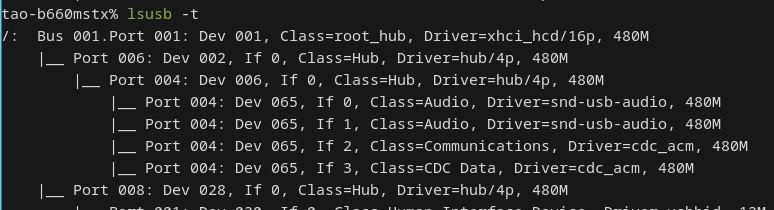
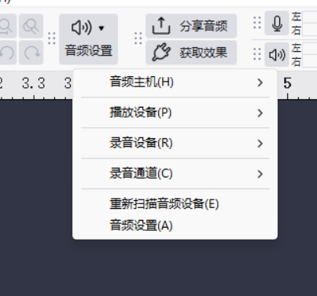
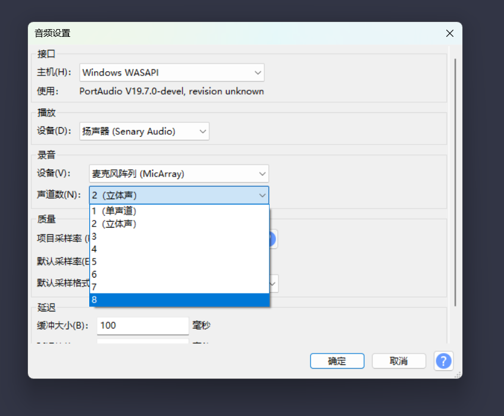
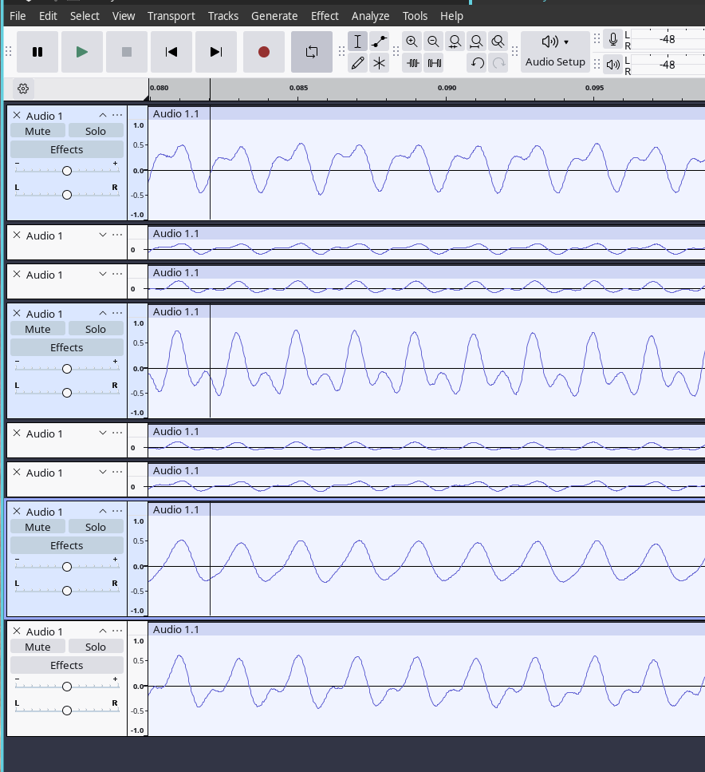
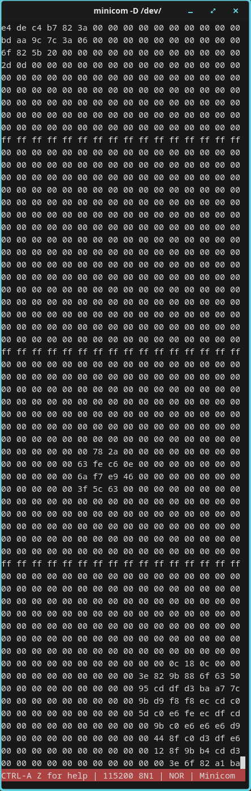

# MicArray UAC Drive Board (MA-USB8)

## Introduction

Driving a [microphone array module]((./micarray.md)), it provides UAC2.0 + CDC ACM + UART interfaces.

- UAC2.0: 8CH S16_LE 48000HZ
- CDC ACM: 16x16 Hotmap Frame
- UART: 16x16 Hotmap Frame on baudrate:2000000 

### Hotmap Frame Format:

| frame| bytes        | value    |
|------|--------------|----------|
| head | 16           | 16x 0xFF |
| data | 16x16 (HxW)  | ...      |

## Connection

Choose one of the following connection methods:

  - Preferred: USB <---> UAC2.0 + CDC ACM (Full functionality: obtain audio data and sound field map simultaneously)

  - Or: UART/USB2TTL <---> UART (Limited performance scenarios, e.g., MCU: obtain sound field map only)

### Linux

### Windows

## Usage

### USB UAC2.0 (Audacity)

**Windows WASAPI**

  
  

### USB UAC2.0 Beamforming (Audacity)

This board supports 12-direction beamforming, which suppresses audio from other directions than the user-set monitoring direction, thereby achieving noise reduction and gain for the target monitoring direction. The following example uses a sine wave audio test for demonstration:

Mic0(CH0) is near the 500HZ SINE wave and Mic3(CH3) is near the 1000HZ SINE wave.

Type `0` in serial so that CH6 is the output of beamforming at CH0.

Obviously on CH6, the gain of the 500 Hz sine wave signal near CH0 has been increased, while the impact of the 1000 Hz sine wave signal from other directions has been eliminated.

### USB CDC ACM RAW (Minicom) and USB2TTL UART HEX-CMAP (Picocom)

### USB CDC ACM RAW (Minicom)

`minicom -D /dev/ttyACM0 -H`

### USB2TTL UART RAW (Minicom)

`minicom -D /dev/ttyUSB0 -b 2000000 -H`

### USB2TTL UART RAW,HEX-CMAP (Picocom)

1. `picocom -b 2000000 /dev/ttyUSB0`

2. type `F` and then `C`

  
  

3. type `f`

## Commands

| Command                                          | Input (Lower/Uppercase: Off/On) | Default | Remarks                                      | Input Sources   |
|--------------------------------------------------|---------------------------------|---------|----------------------------------------------|-----------------|
| Set UAC CH6 Beamforming Direction Angle          | 0,1,..9,A,B | 0  | Actual angle = input value × 30 (0,1,..B => 0°,30°,...,330°). Corresponds to the clockwise direction starting from microphone 0, as per the [microphone array](./micarray.md).                                                           | Any             |
| UART Sound Source Map Pseudocolor Mapping Toggle | c, C        | c  | Requires precondition: UART 16x16 sound source map printing enabled.  | UART input only |
| UART Internal Debug Info Toggle                  | d, D        | d  | Controls internal debugging output.                                   | UART input only |
| LED Real-Time Sound Direction Indicator Toggle   | e, E        | E  | Controls LED indicators.                                              | Any             |
| UART 16x16 Sound Field Map Print Toggle          | f, F        | f  | Toggles printing of 16x16 sound source map (ASCII).                   | UART input only |
| Restore Default Settings                         | R           | \  |Restores a series of configurations to default values.                 | Any             |

## Firmware

Download it from [here](../../assets/modules/micarray_usbboard_bl616/firmware/MA-USB8-250822.bin) and then refer to [this guide](../logic_analyzer/combo8/update_firmware.html#Burn-firmware) to update the firmware.