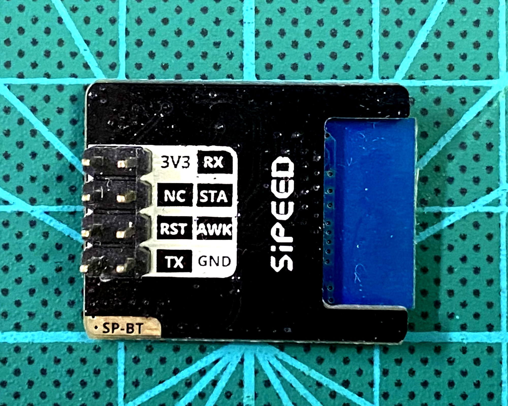
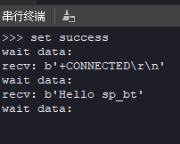

# SPMOD - BT


## 概述


SPMOD-BT(蓝牙 模块)采用 YDJ-23。

## SPMOD - BT 介绍

- 采用 **Sipeed-SPMOD** 接口(2.54mm * 8PIN 排针)，统一 MaixPy 开发板接口
- 利用 SP-MOD UART 和蓝牙模块通讯
- JDY-23蓝牙模块：支持BLE 5.0（兼容 BLE4.0、BLE4.2）。具有UART接口。模块支持AT指令控制。具备超低功耗特性和高可靠性
- 板载两个状态指示LED，模块状态一目了然
- 模块尺寸：25.6\*20.2\*3.2mm

### JDY-23 蓝牙介绍：


| 功能特点： | 参数 |
| --- | -- |
| 工作频段：| 2.4G |
| 发射功率：| 4db（最大） |
| 通信接口：| UART |
| 工作电压：| 1.8V~3.6V |
| 工作温度：| -40℃ - 80℃ |
| 天线：| 板载PCB天线 |
| 接收灵敏度：| -97dbm |
| 主从支持：| 从机 |
| 蓝牙版本：| BLE 5.0（兼容 BLE4.0、BLE4.2） |
| 唤醒状态电流：| 800uA（广播模式） |
| 浅睡状态电流：| <50uA (广播模式) |
| 深度睡眠电流：| 9uA （无广播） |
| 默认串口波特率：| 9600 |

### SPMOD_BT 模块引脚定义：

| 引脚序号 | 引脚名称 | 类型 | 引脚说明 |
| -------- | -------- | ---- | --- |
| 1 | GND | G | 模块电源地 |
| 2 | AWK | I/O | 模块休眠唤醒引脚，低有效 |
| 3 | STA | I/O | 蓝牙连接状态连接，连接成功时输出高电平 |
| 4 | RX | I | 模块UART数据接受引脚，连接上位机TX |
| 5 | 3V3 | V | 模块电源输入正 |
| 6 | --- | NC | 悬空引脚，无功能 |
| 7 | RST | I/O | 模块复位引脚，低电平有效 |
| 8 | TX  | O | 模块UART数据发送引脚，连接上位机的RX |



- 接线方式：

| MCU:FUN(IO) | SP_BT |
| :---------: | :---: |
| UART:TX(IO_7) | RX |
| USRT:RX(IO_6) | TX |
| 1.8-3.3V | 3.3V |
| GND | GND |


### 主要 AT 指令列表：

| 指令 | 描述 |
| --- | --- |
|AT+POWR | 显示模块发送功率 |
|AT+RST	| 软复位 |
|AT+MAC	| 显示MAC 地址 |
|AT+NAME | 显示广播名 |
|AT+HOSTEN | 从模式或 IBEACON 工作模式 |
|AT+IBUUID | IBEACON 的 UUID |
|AT+DISC | 指令断开连接 |
|AT+SLEEP | 睡眠 |
|AT+MTU | 设置模块发送的发包数长 |

*更多AT指令请参考[JDY-23-V2.1.pdf](https://cn.dl.sipeed.com/shareURL/MAIX/HDK/sp_mod/sp_bt)*

## 使用例程

* 流程
  1. 发送 AT 指令
  2. 接收数据
  3. 判断是否设置成功

### C 示例：


```c

  // set uart rx/tx func to io_6/7
  fpioa_set_function(6, FUNC_UART1_RX + UART_NUM * 2);
  fpioa_set_function(7, FUNC_UART1_TX + UART_NUM * 2);
  uart_init(UART_DEVICE_1);
  uart_configure(UART_DEVICE_1, 9600, 8, UART_STOP_1, UART_PARITY_NONE);

  //change the name of sp_bt module to MAIXCUBE
  uart_send_data(UART_NUM, "AT+NAMEMAIXCUBE\r\n", strlen("AT+NAMEMAIXCUBE\r\n")); //send AT order
  msleep(100);
  ret = uart_receive_data(UART_NUM, rcv_buf, sizeof(rcv_buf)); //receive response
  if(ret != 0 && strstr(rcv_buf, "OK"))
  {
     printk(LOG_COLOR_W "set name success!\r\n");
  }

  // get the name of sp_bt module
  uart_send_data(UART_NUM, "AT+NAME\r\n", strlen("AT+NAME\r\n")); //send AT order
  msleep(100);
  ret = uart_receive_data(UART_NUM, rcv_buf, sizeof(rcv_buf)); //receive response
  if(ret != 0 && strstr(rcv_buf, "NAME"))
  {
     printk(LOG_COLOR_W "get name success!\r\n");
  }

```

### MaixPy 例程：

```python
    # set uart rx/tx func to io_6/7
  fm.register(6,fm.fpioa.UART1_RX)
  fm.register(7,fm.fpioa.UART1_TX)
  uart = UART(UART.UART1,9600,8,1,0,timeout=1000, read_buf_len=4096)

  #change the name of sp_bt module to MAIXCUBE
  uart.write("AT+NAMEMAIXCUBE\r\n") #send AT order
  time.sleep_ms(100)
  read_data = uart.read() #receive response
  if read_data:
      read_str = read_data.decode('utf-8')
      count = read_str.count("OK")
      if count != 0:
          uart.write("set name success\r\n")

  # get the name of sp_bt module
  uart.write("AT+NAME\r\n") #send AT order
  time.sleep_ms(100)
  read_data = uart.read() #receive response
  if read_data:
      read_str = read_data.decode('utf-8')
      count = read_str.count("NAME")
      if count != 0:
          uart.write("get name success\r\n")
```

*注意发送AT指令后一定要加上\r\n*

### 运行结果:

  使用[BLE Utility](../../tools/bledebugger.apk)连接设备后进行收发测试结果如下:

  <center class="third">
      
  </center>

### 运行环境:

  |  语言  |  开发板  | SDK/固件版本                   |
  | :----: | :------: | :----------------------------- |
  |   C    | MaixCube | kendryte-standalone-sdk v0.5.6 |
  | MaixPy | MaixCube | maixpy v0.5.1                  |

## 参考设计

- SPMOD_BLE 尺寸图：


## 资源链接

| 资源 | --- |
| --- | --- |
| 官网 | www.sipeed.com |
| SIPEED 官方淘宝店 |[sipeed.taobao.com](sipeed.taobao.com) |
|Github | [https://github.com/sipeed](https://github.com/sipeed) |
|BBS | [http://bbs.sipeed.com](http://bbs.sipeed.com) |
|MaixPy 文档官网 | [http://maixpy.sipeed.com](http://wiki.sipeed.com/maixpy) |
|Sipeed 模型平台 | [https://maixhub.com](https://maixhub.com) |
|SDK 相关信息 | [https://dl.sipeed.com/shareURL/MAIX/SDK](https://dl.sipeed.com/shareURL/MAIX/SDK) |
|HDK 相关信息 | [https://dl.sipeed.com/shareURL/MAIX/HDK](https://dl.sipeed.com/shareURL/MAIX/HDK) |
|E-mail(技术支持和商业合作) | [Support@sipeed.com](mailto:support@sipeed.com) |
|telgram link | https://t.me/sipeed |
|MaixPy AI QQ 交流群 | 878189804 |
|MaixPy AI QQ 交流群(二群) | 1129095405 |
