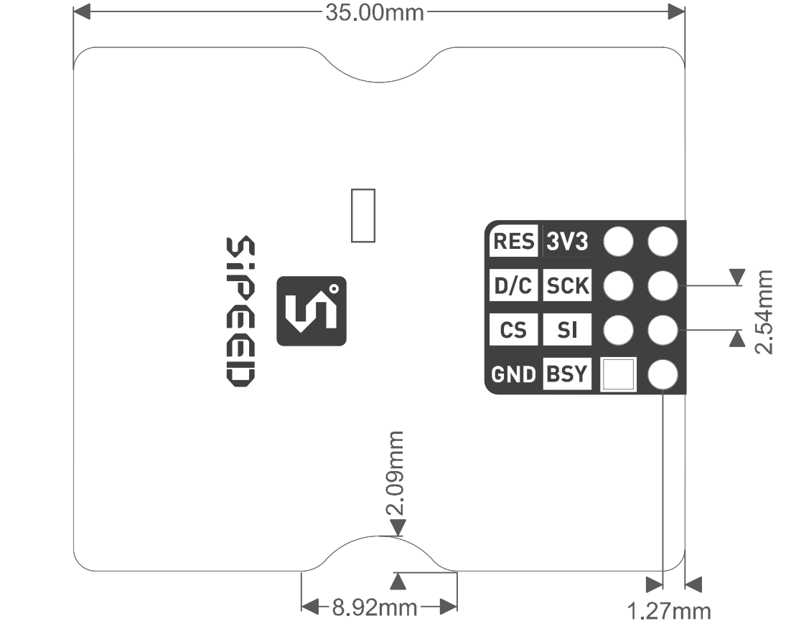

# SPMOD - Eink


## 概述


SPMOD_Eink(墨水屏模块)采用 GDEW0154M09 电子墨水屏。

## SPMOD - Eink 介绍

- 采用 **Sipeed-SPMOD** 接口(2.54mm * 8PIN 排针)，统一 MaixPy 开发板接口
- 通过SP-MOD SPI接口与屏幕底板相连
- 电子墨水屏：GDEW0154M09是一款1.54”，SPI接口控制，拥有24P FPC(0.5mm间距)接口的电子墨水屏。拥有超广可视角。
- 支持 1 bit 黑/白显示
- 分辨率：200x200
- 模块尺寸：35*30*3.8mm

### GDEW0154M09 电子墨水屏介绍

| 功能特点： | 参数 |
| --- | -- |
| 工作电压 | 2.3V~3.6V |
| 工作电流 | 1~3mA |
| 工作温度范围 | -40℃~85℃ |
| 休眠电流 | <5uA |
| 屏幕大小 | 1.54英寸 |
| 有效显示区域 | 27.6mm |
| 分辨率 | 200*200 |
| 色彩 | 1 bit 黑/白显示 |
| 对外接口 | 24P FPC (0.5mm间距) |
> 内部集成电路包含门缓冲器、源缓冲器，接口，时序控制逻辑，振荡器，DC-DC，SRAM，LUT，VCOM


###  SPMOD_Eink 模块引脚定义：

| 引脚序号 | 引脚名称 | 类型 | 引脚说明 |
| -------- | -------- | ---- | --- |
| 1 | GND | G | 模块电源地 |
| 2 | CS | I | SPI片选引脚 |
| 3 | D/C | I | 数据/命令输入切换引脚 |
| 4 | RES | I |  模块复位引脚，低有效 |
| 5 | 3V3 | V | 模块电源输入正 |
| 6 | SCK | I |SPI串行时钟引脚 |
| 7 | SI | I/O | MOSI数据引脚，主机输出从机输入 |
| 8 | BSY | O | BUSY状态输出引脚 |


- 接线方式：

|  MCU:FUN(IO)   | SP_Eink |
| :------------: | :-----: |
|  GPIOHS(IO_7)  |   RES   |
| SPIOHS(IO_15)  |   D/C   |
| SPIOHS(IO_20)  |   CS   |
| SPI:SCK(IO_21) |   SCK   |
| SPI:MOSI(IO_8) |   SI    |
|  GPIOHS(IO_6) |   BSY   |
|  2.3-3.6V   |  3.3V   |
|   GND    |   GND   |


### 基本指令列表

| 指令  |       功能       |
| :---: | :--------------: |
| 0x10  | 开始发送黑白图像 |
| 0x13  | 开始发送红白图像 |
| 0x12  |  刷新图像到屏幕  |

*更多指令信息参考[GDEW0154M09.pdf](https://dl.sipeed.com/shareURL/MAIX/HDK/Spmod_CN/sp_eink)*

## 使用例程

* 流程

  1. 初始化配置
  2. 创建 Image 并填充
  3. 发送图像并刷新

### C 示例：

```c

  spi_init(1, SPI_WORK_MODE_0, SPI_FF_STANDARD, DATALENGTH, 0);

  fpioa_set_function(SPI_Eink_CS_PIN_NUM, FUNC_SPI1_SS0);   // SPI_Eink_CS_PIN_NUM: 20;
  fpioa_set_function(SPI_Eink_SCK_PIN_NUM, FUNC_SPI1_SCLK); // SPI_Eink_SCK_PIN_NUM: 21;
  fpioa_set_function(SPI_Eink_MOSI_PIN_NUM, FUNC_SPI1_D0);  // SPI_Eink_MOSI_PIN_NUM: 8;

  fpioa_set_function(SPI_Eink_DC_PIN_NUM, FUNC_GPIOHS0 + SPI_Eink_DC_GPIO_NUM);   // SPI_Eink_DC_PIN_NUM: 21;
  fpioa_set_function(SPI_Eink_RST_PIN_NUM, FUNC_GPIOHS0 + SPI_Eink_RST_GPIO_NUM); // SPI_Eink_RST_PIN_NUM: 7;
  fpioa_set_function(SPI_Eink_BL_PIN_NUM, FUNC_GPIOHS0 + SPI_Eink_BL_GPIO_NUM);   // SPI_Eink_BL_PIN_NUM: 6;

  gpiohs_set_drive_mode(SPI_Eink_DC_GPIO_NUM, GPIO_DM_OUTPUT);
  gpiohs_set_drive_mode(SPI_Eink_RST_GPIO_NUM, GPIO_DM_OUTPUT);

  gpiohs_set_pin(SPI_Eink_DC_GPIO_NUM, GPIO_PV_HIGH);
  gpiohs_set_pin(SPI_Eink_RST_GPIO_NUM, GPIO_PV_HIGH);

  gpiohs_set_drive_mode(SPI_Eink_BL_PIN_NUM, GPIO_DM_INPUT_PULL_UP);
  gpiohs_set_pin_edge(SPI_Eink_BL_PIN_NUM, GPIO_PE_BOTH);

    EPD_DisplayInit(); //EPD init

  //Paint initialization
  Paint_NewImage(BlackImage, EPD_WIDTH, EPD_HEIGHT, 270, WHITE); //Set screen size and display orientation
  Paint_SelectImage(BlackImage);                                 //Set the virtual canvas data storage location

  Paint_Clear(WHITE); //clear paint
  Paint_DrawString_EN(0, 0, "sipeed", &Font8, WHITE, BLACK);   //5*8
  Paint_DrawString_EN(0, 10, "sipeed", &Font12, WHITE, BLACK); //7*12
  Paint_DrawString_EN(0, 25, "sipeed", &Font16, WHITE, BLACK); //11*16
  Paint_DrawString_EN(0, 45, "sipeed", &Font20, WHITE, BLACK); //14*20
  Paint_DrawString_EN(0, 80, "sipeed", &Font24, WHITE, BLACK); //17*24
  EPD_FullDisplay(BlackImage, BlackImage, 0);                  //display image

```

### MaixPy 例程：

```python

  spi1 = SPI(SPI.SPI1, mode=SPI.MODE_MASTER, baudrate=600 * 1000,
              polarity=0, phase=0, bits=8, firstbit=SPI.MSB, sck=21, mosi=8)

  fm.register(20, fm.fpioa.GPIOHS20, force=True) # SPI_Eink_SS_PIN_NUM: 20;
  fm.register(15, fm.fpioa.GPIOHS15, force=True) # SPI_Eink_DC_PIN_NUM: 15;
  fm.register(6, fm.fpioa.GPIOHS6, force=True) # SPI_Eink_BUSY_PIN_NUM: 6;
  fm.register(7, fm.fpioa.GPIOHS7, force=True) # SPI_Eink_RST_PIN_NUM: 7;

  cs = GPIO(GPIO.GPIOHS20, GPIO.OUT)
  dc = GPIO(GPIO.GPIOHS15, GPIO.OUT)
  busy = GPIO(GPIO.GPIOHS6, GPIO.IN, GPIO.PULL_DOWN)
  rst = GPIO(GPIO.GPIOHS7, GPIO.OUT)

  epd = SPEink(spi1, cs, dc, rst, busy, SPEink_WIDTH, SPEink_HEIGHT, SPEink_ROTATION)
  epd.init()

  img = image.Image()
  img = img.resize(200, 200)
  img.draw_line(0, 0, 100, 100)

  epd.display(img)

```

### 运行环境

|  语言  |  开发板  |          SDK/固件版本          |
| :----: | :------: | :----------------------------: |
|   C    | MaixCube | kendryte-standalone-sdk v0.5.6 |
| MaixPy | MaixCube |         maixpy v0.5.1          |

*MaixPy固件建议自行从最新源码编译*

### 运行结果

* C

  

* MaixPy

  

### 移植

修改以下参数即可

* C

  ```c
    // board_config.h
    #define SPI_INDEX 1
    #define SPI_SCLK_RATE 600 * 1000
    #define SPI_CHIP_SELECT_NSS 0 //SPI_CHIP_SELECT_0

    #define SPI_Eink_CS_PIN_NUM 20
    #define SPI_Eink_SCK_PIN_NUM 21
    #define SPI_Eink_MOSI_PIN_NUM 8

    #define SPI_Eink_DC_PIN_NUM 15
    #define SPI_Eink_BL_PIN_NUM 6
    #define SPI_Eink_RST_PIN_NUM 7

    #define SPI_Eink_DC_GPIO_NUM 15
    #define SPI_Eink_BL_GPIO_NUM 6
    #define SPI_Eink_RST_GPIO_NUM 7
  ```

* MaixPy

  ```python
  ################### config ###################
    SPI_Eink_NUM = SPI.SPI1
    SPI_Eink_DC_PIN_NUM = const(15)
    SPI_Eink_BUSY_PIN_NUM = const(6)
    SPI_Eink_RST_PIN_NUM = const(7)
    SPI_Eink_CS_PIN_NUM = const(20)
    SPI_Eink_SCK_PIN_NUM = const(21)
    SPI_Eink_MOSI_PIN_NUM = const(8)
    SPI_Eink_FREQ_KHZ = const(600)
  ##############################################
  ```


## 参考设计

- SPMOD_Eink 尺寸图：




-----

## 资源链接

| 资源 | --- |
| --- | --- |
| 官网 | www.sipeed.com |
| SIPEED 官方淘宝店 |[sipeed.taobao.com](sipeed.taobao.com) |
|Github | [https://github.com/sipeed](https://github.com/sipeed) |
|BBS | [http://bbs.sipeed.com](http://bbs.sipeed.com) |
|MaixPy 文档官网 | [http://maixpy.sipeed.com](http://wiki.sipeed.com/maixpy) |
|Sipeed 模型平台 | [https://maixhub.com](https://maixhub.com) |
|SDK 相关信息 | [https://dl.sipeed.com/shareURL/MAIX/SDK](https://dl.sipeed.com/shareURL/MAIX/SDK) |
|HDK 相关信息 | [https://dl.sipeed.com/shareURL/MAIX/HDK](https://dl.sipeed.com/shareURL/MAIX/HDK) |
|E-mail(技术支持和商业合作) | [Support@sipeed.com](mailto:support@sipeed.com) |
|telgram link | https://t.me/sipeed |
|MaixPy AI QQ 交流群 | 878189804 |
|MaixPy AI QQ 交流群(二群) | 1129095405 |
