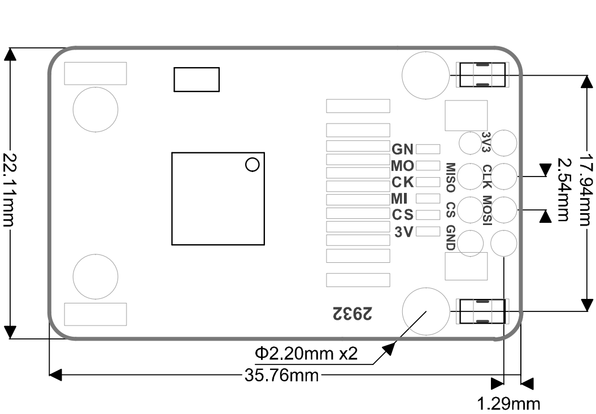

# SPMOD - Ethernet

## 概述

SPMOD_Ethernet(网络扩展模块)采用 W5500 以太网主控芯片。

## SPMOD - Ethernet 介绍

- 采用 **Sipeed-SPMOD** 接口(2.54mm * 8PIN 排针)，统一 MaixPy 开发板接口
- 通过SP-MOD SPI接口连接
- 主控芯片：W5500 是一款集成全硬件 TCP/IP 协议栈的嵌入式以太网控制器。
- SPI 速率理论上可达80MHz
-	集成以太网数据链路层（MAC）和10BaseT/100BaseTX 以太网物理层（PHY），支持自动协商（10/100-Based全双工/半双工）
- 模块尺寸：35.76\*19.74\*8.7mm

###  W5500 以太网主控芯片介绍

| 功能特点： | 参数 |
| --- | -- |
| 工作电压 | 2.97V~3.63V |
| 工作电流 | <132mA |
| 工作温度 | -40℃~85℃ |
| 休眠电流 | <15mA |
| SPI 时钟 | 最高80MHz |
| 全硬件TCP/IP协议栈 | 支持TCP、UDP、ICMP、IPv4、ARP、IGMP、PPPoE协议 |

> 支持8路独立硬件 Socket 同时通信
,通信效率互不影响
,内部32K字节收发缓存供TCP/IP包处理
,支持掉电模式、网络唤醒
,集成 10BaseT / 100Base-T 以太网 PHY
,支持自动协商（全/半双工，10M/100M)
,不支持自动极性变换MDIX

###  SPMOD_Ethernet 模块引脚定义：

| 引脚序号  | 引脚名称 | 类型  | 引脚说明    |
| -------- | -------- | ---- | ---------- |
| 1 | GND | G |  模块电源地 |
| 2 | CS | I | SPI片选引脚 |
| 3 | SO | I/0 | MISO数据引脚，主机输入从机输出 |
| 4 | NC | NC | 悬空引脚，无功能 |
| 5 | 3V3 | V | 模块电源输入正 |
| 6 | SCK | I | SPI串行时钟引脚 |
| 7 | SI | I/0 | MOSI数据引脚，主机输出从机输入 |
| 8 | NC | NC | 悬空引脚，无功能 |

## 使用例程

- 待更新

## 参考设计

- SPMOD_Ethernet 尺寸图：

-----

## 资源链接

| 资源 | --- |
| --- | --- |
| 官网 | www.sipeed.com |
| SIPEED 官方淘宝店 |[sipeed.taobao.com](sipeed.taobao.com) |
|Github | [https://github.com/sipeed](https://github.com/sipeed) |
|BBS | [http://bbs.sipeed.com](http://bbs.sipeed.com) |
|MaixPy 文档官网 | [http://maixpy.sipeed.com](http://wiki.sipeed.com/maixpy) |
|Sipeed 模型平台 | [https://maixhub.com](https://maixhub.com) |
|SDK 相关信息 | [https://dl.sipeed.com/MAIX/SDK](https://dl.sipeed.com/MAIX/SDK) |
|HDK 相关信息 | [https://dl.sipeed.com/MAIX/HDK](https://dl.sipeed.com/MAIX/HDK) |
|E-mail(技术支持和商业合作) | [Support@sipeed.com](mailto:support@sipeed.com) |
|telgram link | https://t.me/sipeed |
|MaixPy AI QQ 交流群 | 878189804 |
|MaixPy AI QQ 交流群(二群) | 1129095405 |
