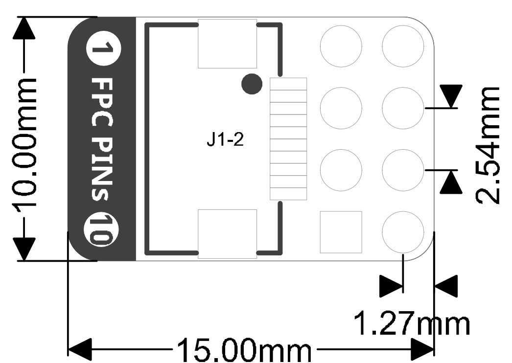

# SPMOD - FPC

## 概述

SPMOD_FPC(FPC 转接线模块)

## SPMOD - FPC 介绍

- 采用 **Sipeed-SPMOD** 接口(2.54mm * 8PIN 排针)，统一 MaixPy 开发板接口
- 作为延长套件，轻松的将SP-MOD接口用FPC延长至另一端。您将有更大的自由连接模块构建系统。
- 提供一对SP-MOD至FPC转换板（一公一母），一条FPC排线, 10P规格。
- 模块尺寸：15.0\*10.0\*3.3mm

## 概括

| 功能特点： | 参数 |
| --- | -- |
| SP-MOD至FPC10转换器器(公母一对)	| 用于将SP-MOD接口和FPC的双向转换 |
| FPC排线	| 用于连接两个转换器 |
| 外部供电电压 | 视连接的模块而定 |
| 外部供电电流 | 视模块工作情况而定，通常小于1000mA |
| 工作温度 | -30℃ ~ 85℃ |

## 参考设计

- SPMOD_FPC 尺寸图：

-----

## 资源链接

| 资源 | --- |
| --- | --- |
| 官网 | www.sipeed.com |
| SIPEED 官方淘宝店 |[sipeed.taobao.com](sipeed.taobao.com) |
|Github | [https://github.com/sipeed](https://github.com/sipeed) |
|BBS | [http://bbs.sipeed.com](http://bbs.sipeed.com) |
|MaixPy 文档官网 | [http://maixpy.sipeed.com](http://wiki.sipeed.com/maixpy) |
|Sipeed 模型平台 | [https://maixhub.com](https://maixhub.com) |
|SDK 相关信息 | [https://dl.sipeed.com/MAIX/SDK](https://dl.sipeed.com/MAIX/SDK) |
|HDK 相关信息 | [https://dl.sipeed.com/MAIX/HDK](https://dl.sipeed.com/MAIX/HDK) |
|E-mail(技术支持和商业合作) | [Support@sipeed.com](mailto:support@sipeed.com) |
|telgram link | https://t.me/sipeed |
|MaixPy AI QQ 交流群 | 878189804 |
|MaixPy AI QQ 交流群(二群) | 1129095405 |
